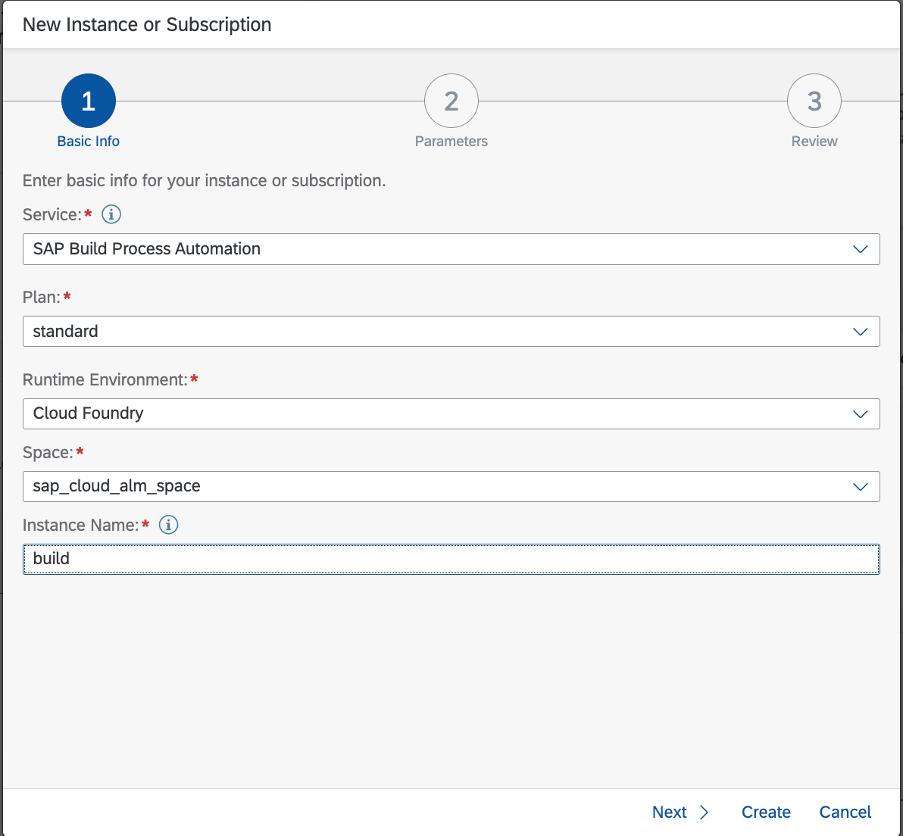
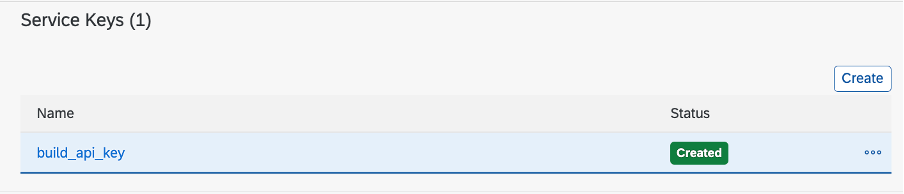
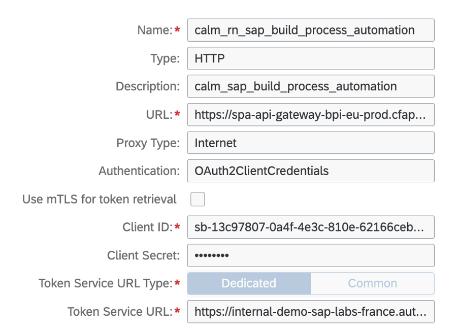
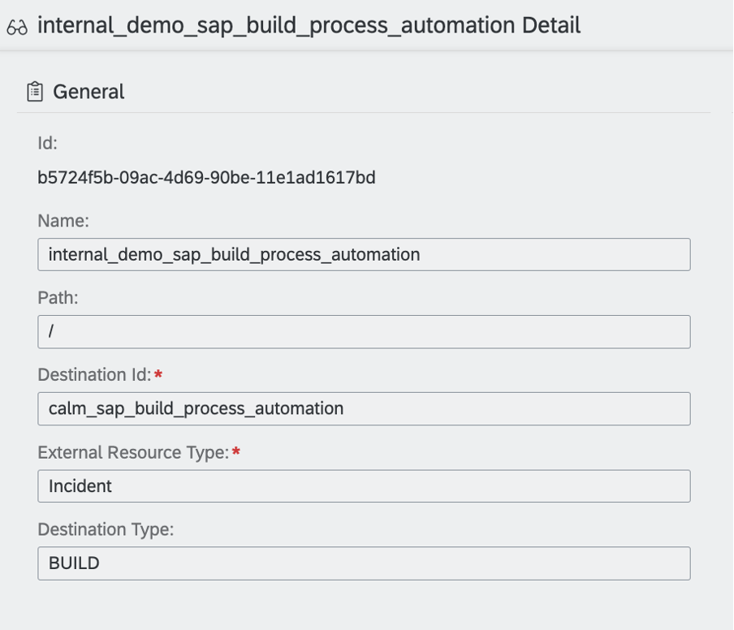

# SAP Cloud ALM: Create a SAP Cloud ALM subscription for SAP Build Process Automation
<!-- description --> In this tutorial, we will learn how to create a SAP Cloud ALM subscription for SAP Build Process Automation.


## You will learn
- How to setup a SAP Cloud ALM subscription used to `trigger` via REST API a workflow in the SAP Build Process Automation tenant.


## Prerequisites
- You need a user with the "Destination Administrator" authorizations in the SAP BTP sub-account in which SAP cloud ALM is subscribed.
- You need to obtain the SAP Build Process Automation Service Key to connect to your SAP Build Process Automation.
- You must have "Space Developer" access for the space in which the instance was created in your SAP Build Process Automation sub-account in the SAP Business Technology Platform.


## Introduction
**SAP Build Process Automation Workflow Trigger**
A business process is started by defining a trigger, an event that indicates to your SAP Build Process Automation tenant to start a process instance.

Process triggers can be either a form, such as a request form, or an API call, where an external system starts the process.

You can start an instance of your process using an API call, with the inputs for the call configured from the process builder. These inputs can then be used as input fields in your process.

Check the following [Tutorial](https://developers.sap.com/group.sap-bpa-api-trigger-start.html) to discover how to manage triggers.


**SAP Cloud ALM Subscription**

With subscriptions, external services can react for changes in SAP Cloud ALM resources.

To receive change messages, you need to register the external application or service as SAP Cloud ALM subscription.

Each subscription manages a specific resource type by sending change messages to a Webhooks (destinations to external systems), and applies optional transformation mappings(transformation rules for the message payload).

Check this [documentation](https://help.sap.com/docs/cloud-alm/apis/external-apis)


### Create a service key for your SAP Build Process Automation

Check the following [tutorial](https://developers.sap.com/tutorials/spa-create-service-instance-destination.html) for a full description of this step.


Once you have successfully subscribed to SAP Build Process Automation in SAP BTP Cockpit, you can find the Subscription in your sub-account, under **Instances and Subscriptions**.

1. Create an **Instance** for SAP Build Process Automation. 
2. Enter the values for other fields as shown below and give an instance name. 
    
3. Choose **Create**.
4. Once the instance is created successfully, you can find it in **Instances** section.
    
5. created the instance, select … > **Create Service Key**.
6. After the key is provisioned, open it and take note of the following fields: Once the service key is created, it contains the URL and the credentials to access to the API.

    -`clientid`

    -`clientsecret`

    -`url`

    These values are needed later in the `Destination Configuration` in the SAP Cloud ALM sub-account.


### Test SAP Build Process Automation End-point

1. The first step is to identify the end-point of your SAP Build Process Automation tenant. 
The end-point is the concatenation of the following elements:

   - SAP Build Process Automation tenant URL. 
     - ex: ` https://spa-api-gateway-bpi-eu-prod.cfapps.eu10.hana.ondemand.com`
   - name of the API from the SAP API Hub.
     - ex:  `workflow/rest/v1/workflow-instances`
   - Depending on the REST operations, you may have to find the the definition ID of your workflow. This information is accessible in the `Monitor` view of the SAP Build Process Automation application.
     - ex: `eu10.calm-tenant.workflow-id.gP`.

1. To trigger the creation of a workflow instances, you need to call the POST action on the REST `workflow/rest/v1/workflow-instances` end-point.

The request should contain the following information:
```js
{
    “definitionId“: “eu10.internal-demo-sap-labs-france.xdugp3.gP“,
    “context“: {
    “workflow_parameter” : “a parameter value“,
    “workflow_antother_parameter” : “another parameter value“,
    }
}
```
 

3. The response body will return the following information:

    ```js
    {
        “id“: “bebf7ba9-d649-11ed-b8ef-eeee0a806406“,
        “definitionId“: “eu10.calm-demo.id.gP“,
        “definitionVersion“: “5“,
        “subject“: “GP“,
        “status“: “RUNNING“,
        “businessKey“: “”,
        “parentInstanceId“: null,
        “rootInstanceId“: “bebf7ba9-d649-11ed-b8ef-eeee0a806406“,
        “applicationScope“: “own”,
        “projectId“: “eu10.calm-demo.id“,
        “projectVersion“: “1.0.5“,
        “startedAt“: “2023-04-08T20:12:53.953Z“,
        “startedBy“: “sb-clone“,
        “completedAt“: null
    }
    ```


### Create SAP BTP Destination in SAP Cloud ALM tenant

From your SAP Cloud ALM tenant, create a SAP BTP destination to the SAP Build Process Automation end-point.

1. Navigate to **Destinations > New Destination**. 
2. Enter the details as below.
     
3. Press the **Create** button.

You have successfully created a destination that will be used to build the SAP Cloud ALM web-hook.


### Create SAP Cloud ALM web-hook

A webhook is a server that listens for a specific URL for incoming HTTP change messages that are triggered when there are change events for SAP Cloud ALM resources.

To create a webhook in SAP Cloud ALM, you need to create an SAP BTP destination that enables the connectivity and the authentication between SAP Cloud ALM and the external system.

1. Connect to your SAP Cloud ALM subaccount
2. Start the **External API Management** application
3. Navigate to the **Webhooks Management** tab
4. Add a **webhook** by pressing the **+** button
5. Enter a name
6. Select the SAP BTP destination to your SAP Build Process Automation subaccount
7. **Save**

    

Check this [guide](https://help.sap.com/docs/cloud-alm/apis/webhook-management-guide) for more information.


### Create Mapping

With transformation, you can apply simple mapping rules to the event messages managed by SAP Cloud ALM. This allows you to transform the content of the incoming event payload and map the data to the format that is required by the target end-points. The mapping is also used to translate the response received from the external system into the format expected by SAP Cloud ALM.

Complex transformations cannot be supported by the built-in transformation mechanisms delivered by SAP Cloud ALM. In that case, you need to use an external API integration platform.

1. Connect to your SAP Cloud ALM subaccount
2. Start the **External API Management** application
3. Navigate to the **Mapping Management** tab
4. Add a **mapping** by pressing the `+` button
5. Enter a name with a source and a destination
   
6. Add a **Rule Based payload** mapping with the following content:

    ```json
    {
        "_information": {
            "_version": "1",
            "_source": "IEP",
            "_destination": "SAP Build",
            "_name": "IEP to SAP Build",
            "_comment": "SAP Build"
        },
        "switches": [{
            "name": "switchPriority",
            "cases": [{
                "when": "FATAL",
                "then": "Highest"
            },
                {
                    "when": "ERROR",
                    "then": "High"
                },
                {
                    "when": "WARNING",
                    "then": "Low"
                },
                {
                    "when": "INFO",
                    "then": "Lowest"
                }],
            "default": "Lowest"
        }],
        "structure": {
            "request": {
                "definitionId": "eu10.calm-demo.workflow",
                "context": {
                    "summary": "[Cloud ALM for Operations] #{subject}",
                    "text": "#{rating} - #{eventName}: ",
                    "type": "#{eventType}",
                    "subType": "#{eventSubType}",
                    "priority": "${SWITCH(switchPriority,rating)}",
                    "worknotes": "#{workNotes}",
                    "serviceid": "serviceId: #{serviceId}"
                }},
            "response": {
                "externalStatus": "#{status}",
                "displayUrl": "#{rootInstanceId}",
                "externalNumber": "#{key}",
                "externalId": "#{id}"
            }
        },
        "eventTypeMapping": {
            "_comment": "Specificeventtypemapping",
            "operationMappings": [{
                "eventType": "EVENT-SITUATION.CREATED",
                "operation": "POST",
                "responseRoot": ""
            },
                {
                    "eventType": "EVENT-SITUATION.UPDATED",
                    "operation": "PATCH",
                    "path": "/#{externalId}",
                    "responseRoot": ""
                },
                {
                    "eventType": "EVENT-SITUATION.CLOSED",
                    "operation": "POST",
                    "path": "/#{externalId}",
                    "responseRoot": ""
                },
                {
                    "eventType": "EVENT-SITUATION.PING",
                    "operation": "GET",
                    "responseRoot": "",
                    "path": "/#{externalId}",
                    "structure": {
                        "response": {
                            "displayUrl": "#{self}",
                            "externalNumber": "#{key}",
                            "externalId": "#{id}",
                            "externalStatus": "#{status}",
                            "lastUpdatedAt": "#{completedAt}",
                            "createdAt": "#{startedAt}",
                            "lastUpdatedBy": "",
                            "createdBy": "#{startedBy}",
                            "assignedTo": "#{startedBy}"
                        }
                    }
                }]
        }
    }
    ```


The mapping provides the payload content sent to trigger the workflow execution identified by the `definitionId` parameter.


Check this [guide](https://help.sap.com/docs/cloud-alm/apis/external-api-management-mapping-guide) for more information.


### Create the SAP Cloud ALM Subscription
From the SAP Cloud ALM external API management, navigate to the subscription tab, to create a new subscription using the webhook and the mapping created in the previous steps.

1. Connect to your SAP Cloud ALM subaccount
2. Start the **External API Management** application
3. Navigate to the **Subscriptions Management** tab
4. Add a **subscription** by pressing the **+** button
5. Enter a name
6. Select the **mapping** and the **webhook** created in the previous steps
    


### Check Result in SAP Build Process Automation
When a subscription to SAP Build Process Automation is called from SAP Cloud ALM, you can find the payload received in your SAP Build Process Automation tenant in the `Monitor` section of your SAP Build Process Automation tenant.


1. Go to **Process and Workflow instances**
2. Select your process.
3. Select your process instance.
4. Check the **Context** tab to look for the `startEvent` attributes
    ```json
    {
        "startEvent": {
            "summary": "[Cloud ALM for Operations] High Number of Short Dumps",
            "text": "ERROR - High Number of Short Dumps: ",
            "type": "CALM.HM",
            "subType": "",
            "priority": "High",
            "worknotes": "Timestamp: 2023-04-12T18:53:21.353922Z\n\nStart Time: 2023-04-12T18:53:21.353922Z\n\nUpdate Time: 2023-04-12T18:53:21.353922Z",
            "serviceid": "0ad78a26-2a82-4efc-9d49-556f87c3e742"
        },
    }
    ```

