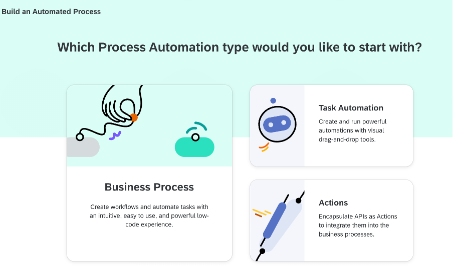
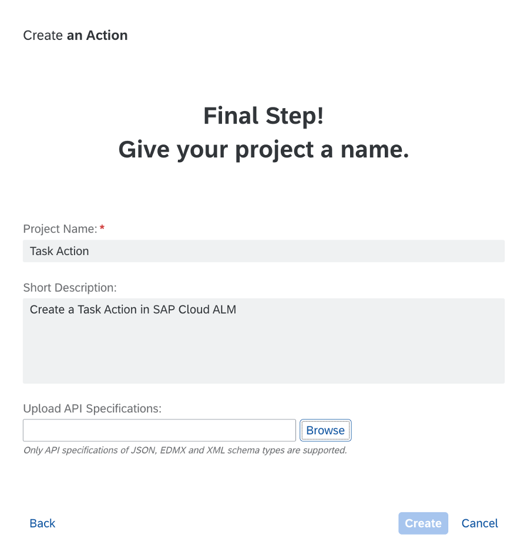
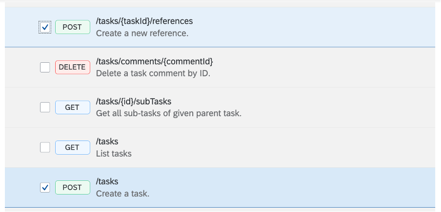
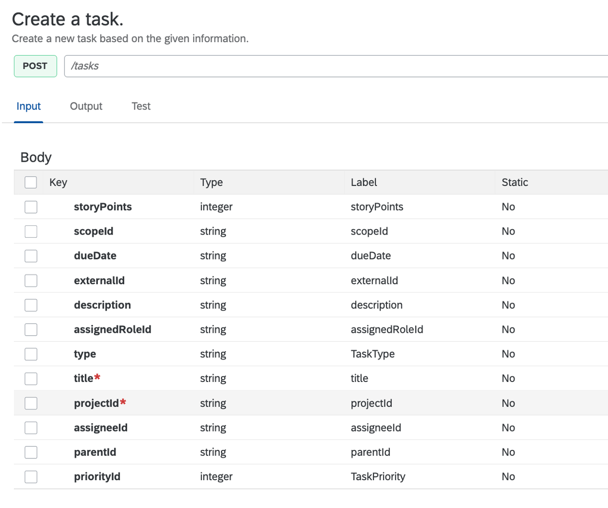
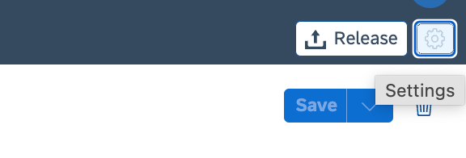
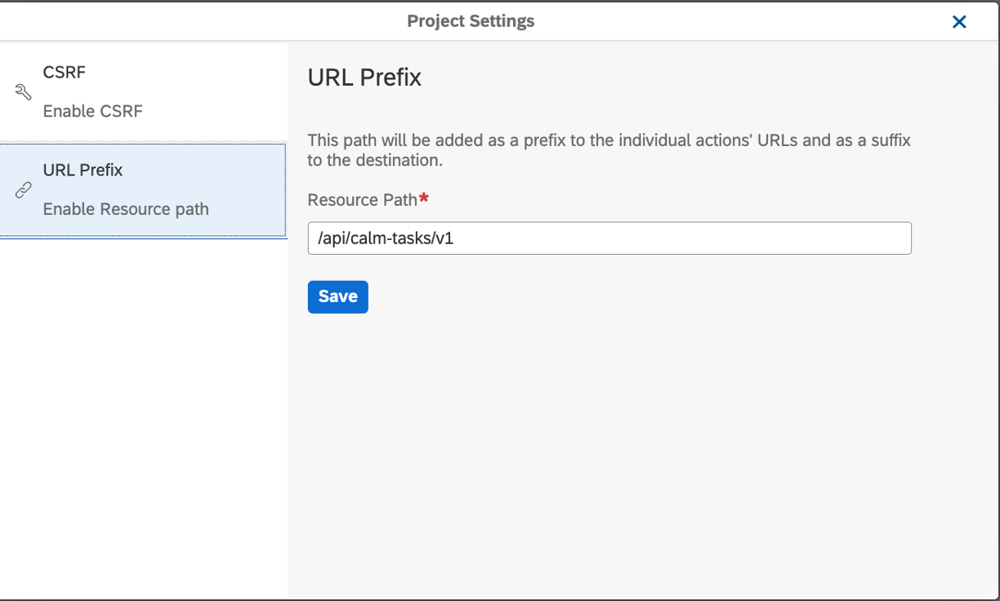
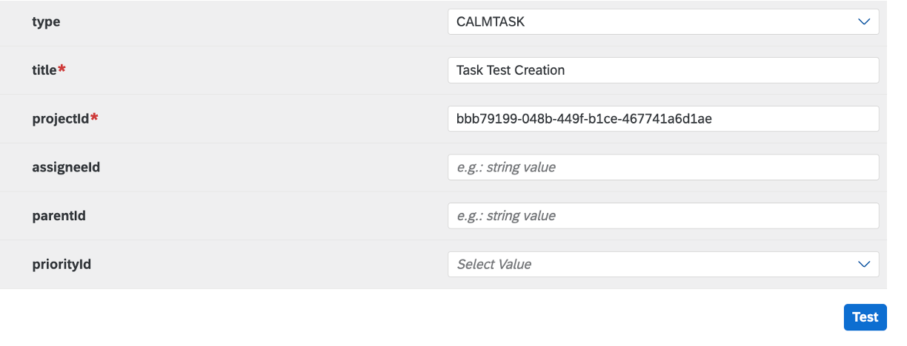
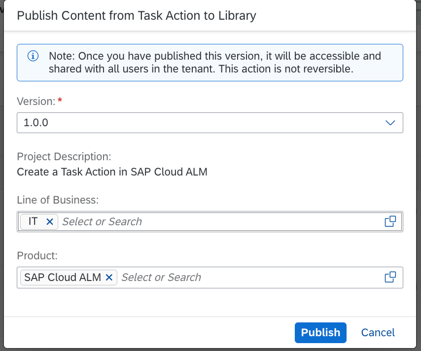
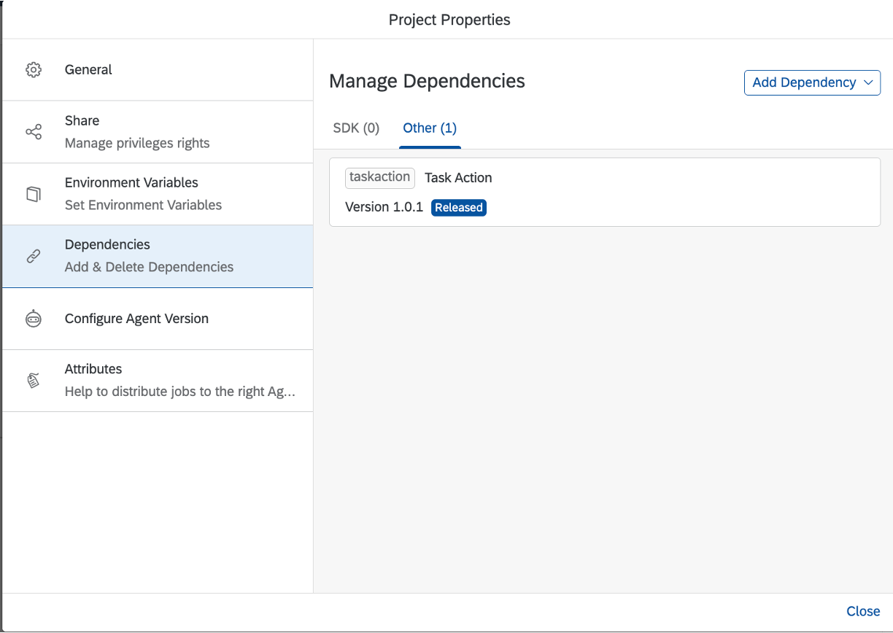
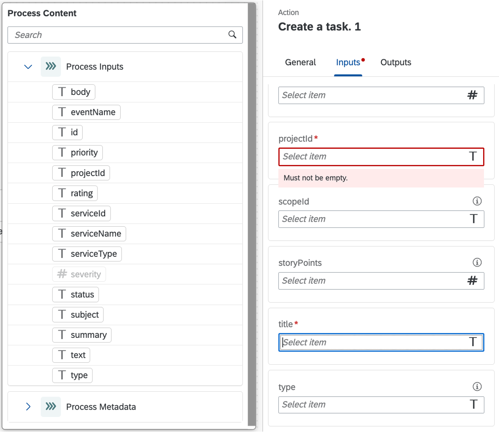

# SAP Cloud ALM: Create SAP Build Process Automation Action for a SAP Cloud ALM 
<!-- description --> In this tutorial, we will learn how to develop SAP Build Process Automation Action for SAP Cloud ALM.

## You will learn
- How to setup SAP Build Process Automation **Action** to trigger the creation of a `SAP Cloud ALM Task` in a remote SAP Cloud ALM tenant. 

## Prerequisites
- You need a user with the "Destination Administrator" authorizations in the SAP BTP sub-account in which SAP Build Process Automation is subscribed.
- You need to obtain the SAP Cloud ALM Service Key to connect to your SAP Cloud ALM account.
- You must have "Space Developer" access for the space in which the instance was created in your SAP Cloud ALM sub-account.

## Introduction
**SAP Build Process Automation Workflow Action**

Action is a feature in SAP Build Process Automation to connect processes with external systems (SAP or non-SAP systems).

In this tutorial, you will create an `action` project based on the `SAP Cloud ALM Tasks APIs`. The Tasks API is already available in API Business Hub.

Check the following [Tutorial](https://developers.sap.com/group.connect-process-external-sap-bpa.html) to discover how to manage actions.

**SAP Cloud ALM API**

Designed for the Intelligent Suite, SAP Cloud ALM is an application lifecycle management platform tailor-made for cloud-centric customers. It ensures accelerated implementation and smooth operations of your end-to-end business solution throughout the entire lifecycle. 

The `SAP Cloud ALM APIs` make it simple to extend SAP Cloud ALM functionalities to provide new features, services and applications for your SAP application lifecycle. 

Discover and experiment SAP Cloud ALM APIs in the [SAP API Hub](https://api.sap.com/package/SAPCloudALM).

### Create SAP BTP Destination
In the SAP BTP Cockpit, create a `destination` that will be used in the action editor to test the Action in the process execution.

The destination should contain the following additional property `sap.processautomation.action.enabled`. The destinations which have this property set as true can be discovered and added in SAP Build Process Automation.

The destination should also contain the following additional property `sap.applicationdevelopment.actions.enabled`. The destinations which have this property set as true can be used in the SAP Build Process Automation Action Editor.

1. Go to **Connectivity** >> **Destinations** in your BTP Cockpit.
2. Add a destination.
3. Enter the following details as below:
   
    |Name	|Value|
    |-------|-----|
    |Type	|HTTP|
    |Client ID	| |
    |Client Secret	| |
    |Service URL	| The service url to your SAP Cloud ALM tenant. This URL should contain the host of your SAP Cloud ALM and end with `/api` ex: `https://<your tenant>/api` |
    |Token Service URL  |The final URL should be something like this: `https://<your tenant>.authentication.<domain>.hana.ondemand.com/oauth/token` |
4. Add the following properties:
   
    |Name	|Value|
    |-------|-----|
    |sap.applicationdevelopment.actions.enabled	|true |
    |sap.processautomation.enabled	|true|

5. Save the destination

### Configure Destination for SAP Build Process Automation

To allow the usage of the SAP BTP Destination, you have to add the Destination in SAP Build Process Automation from the SAP Build Lobby settings panel.

1. Open SAP Build development workbench.
2. Click **Settings**.
3. Go to Destinations section, and click **New Destination**.
4. From **Add** Destination pop-up, select the destination created in the previous steps to your SAP Cloud ALM tenant. 
5. Click **Add** to add a new destination in SAP Build Process Automation.

A new destination will be added.

### Select an API
The first step is to select an API with an Open API specification file.

1. Download and extract Open API Specification
   For APIs that are available in SAP API Business Hub, you can directly download the specification from the API overview section. The API from SAP Cloud ALM are accessible [here](https://api.sap.com/package/SAPCloudALM/rest). 
2. Select the [Tasks API](https://api.sap.com/package/SAPCloudALM/rest) and press the **download** button in the `API Reference` section
   
3. Download the API specification file.

### Create a SAP Action
From the SAP Build lobby, you should create an Action that will be integrated in your automation process.

1. Open SAP Build Lobby with your username and password
   
2. then click **Create**.
3. In the popup, choose **Build an Automated Process** and then select `Actions`.
4. In the popup
   - Enter the Project Name.
   - Enter the Short Description as API to **create a Task Action in SAP Cloud ALM**
   - Click to Browse the open specification file downloaded in step below:
    
   - Click **Create**.

### Configure action project
Once the action project is created, select it to open the Action Editor. The Add Actions pop up will automatically open. 

1. In the popup, you have to select **POST** method of /`Tasks` API. 
   
    
    
2. Now, you can update the input/output fields of the action project to keep only the mandatory fields that are needed to create a Task. 
   
    

3. Change the API path settings. 
   Click on the `Settings` icon in the top-right corner to open the setting tabs 

    

4. Go the **URL Prefix** tab
   
5. Enter the URL prefix for the SAP Cloud ALM Task API: `/calm-tasks/v1`
   
    

6. Press **Save**

### Test your Action
1. Select the REST operations you want to test.
2. Navigate to the **Test** section.
3. Select your SAP Cloud ALM destination
   
    
4. Enter the input values for your API.
   
    
5. Press the `Test` button
6. Once the execution is successful, you see 201 Created response with the details
   
    

### Deploy and Release your Action to the library.

You will now release the action project to create version(s) and then publish a selected version in the action repository. 
Published actions can be used in different processes to connect to external systems.

1. Press the `Release` in the top-right corner.
2. Select your version
3. Press Release.

Once the action project is released, you can then publish any release version of the action.

1. Click `Publish to Library` from top-right corner.
2. Enter Line of Business information
3. Enter Product information
   
    

### Consumption in Process
 From the SAP Build Lobby, select your process. 

The first step is to create a Destination in SAP Build Process Automation:

1. In the Project Properties pop-up, select Environment Variables and choose Create to create an environment variable 

2. Enter the following to create an environment variable:
      - SAPCloudALM as **Identifier**.
      - Any **Description** of your choice
      -  **Destination** as variable type.for this business processes.

3. Click **Create**
add the newly created action from the library.

Add a process dependency to the Action

1. Navigate to the project **settings**.
2. Click to the **Add an Actions project dependency** from the **Add Dependency** button
   
    
3. Select your `Action` and Press **Save**.
   
    

Then, you can add your `action` into your Process:

1. In the Process Builder canvas, click the **+** in output connector.
2. In the list, choose **Actions > Browse library**.
3. In the action library pop up, search for the actions for SAP Cloud ALM products. 

    
4. Select the destination variable to use for the selected action   
5. Manage the Tasks API input by mapping the attributes from your processes. For the SAP Tasks API, we need to enter the mandatory parameters as projectID and Title.
   
    
6. Save, `Releases` and `Deploy` your work.

