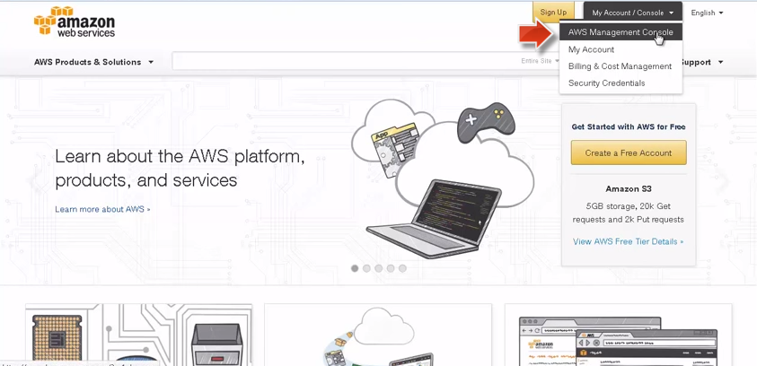
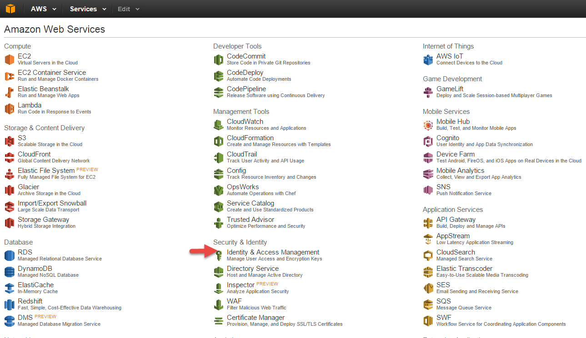
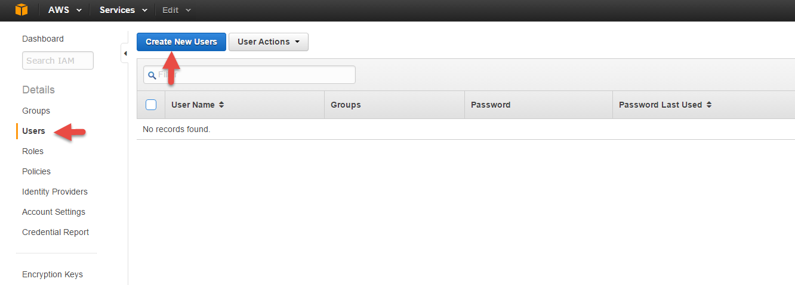
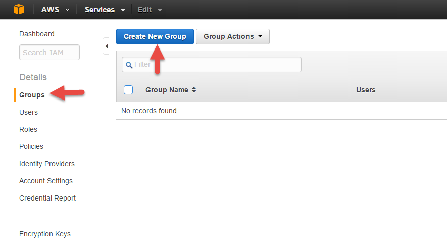
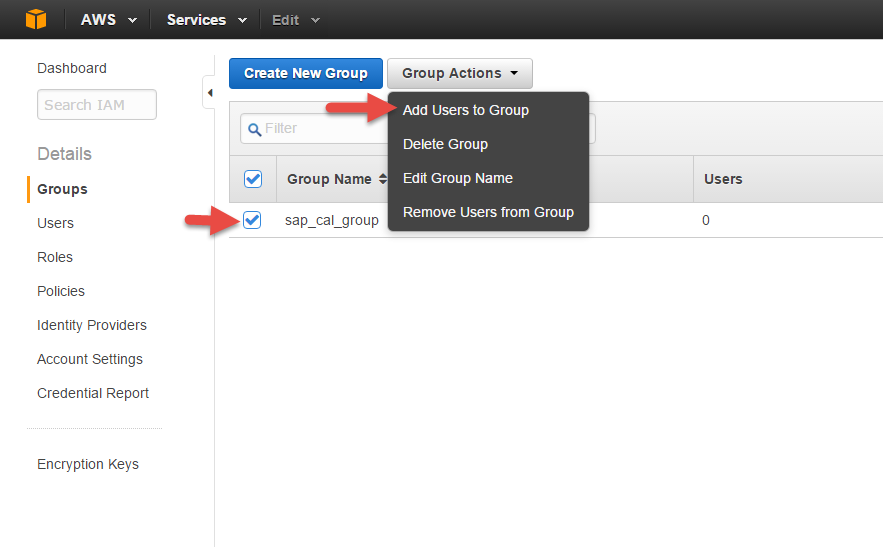
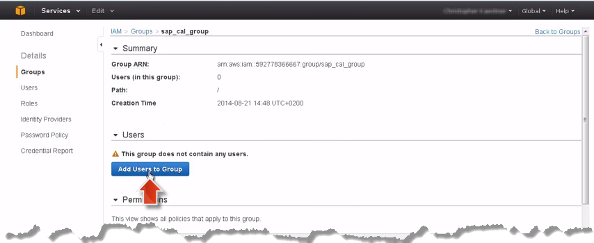
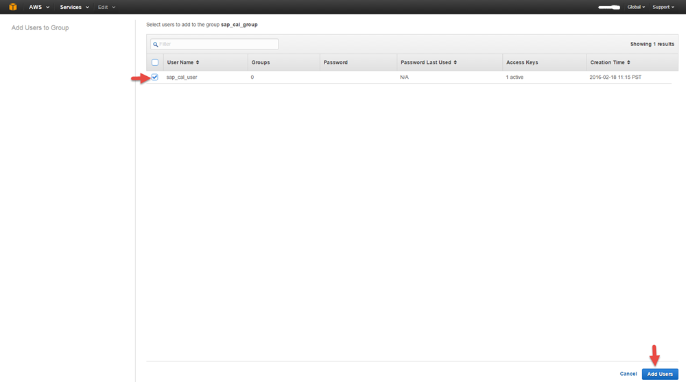

## Prerequisites  
 - **Proficiency:** Beginner
 - **Tutorials:** [Get your own free Developer Account for SAP HANA Cloud Platform](https://www.sap.com/developer/tutorials/hcp-create-trial-account.html)

## Next Steps
 - Select a tutorial from the [Tutorial Navigator](https://www.sap.com/developer/tutorial-navigator.html) or the [Tutorial Catalog](https://www.sap.com/developer/tutorials.html)

## Details
### You will learn  
How to prepare an Amazon Web Services account on which you will setup an ABAP on-premise system later on.

### Time to Complete
**10 Min**.

---

1. Navigate to <https://aws.amazon.com> and sign up for an AWS account if you don't have one already

2. Navigate into the **AWS management console**
    

3. In the AWS console, enter the **Identity and Access Management section (IAM section)**
    

4. Create an AWS user, e.g. called `sap_cal_user` and download the access key and secret key of this user. These credentials you need to provide later on in the SAP Cloud      Appliance Library in order to be able to access the AWS instance
    

5. Enter the user name
    

6. Download the credentials and click on 'Close'
    

7. Create a group, e.g. called `sap_cal_group`
    

8. Select **Administrator Access as Policy Template** for the newly created group. This will assign administrator permissions to the group.
    
    

9. Assign the newly created AWS user to this group.
    
    
    

## Next Steps
[Setup SAP Cloud Appliance Library account and install preconfigured SAP solution in cloud (coming soon)](/developer/tutorials/sapcp-prepare-cal-account.html)
