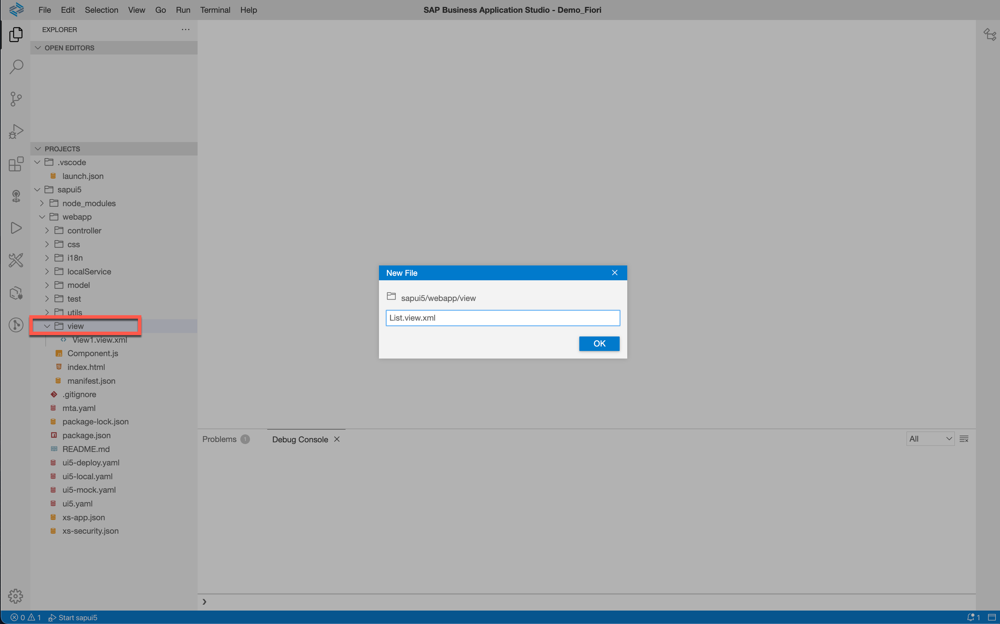
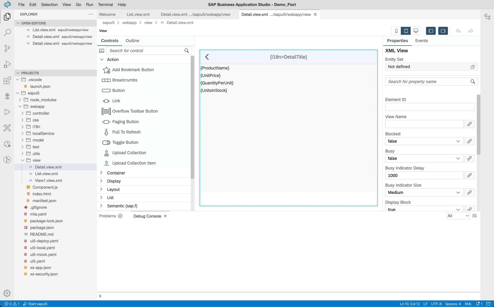
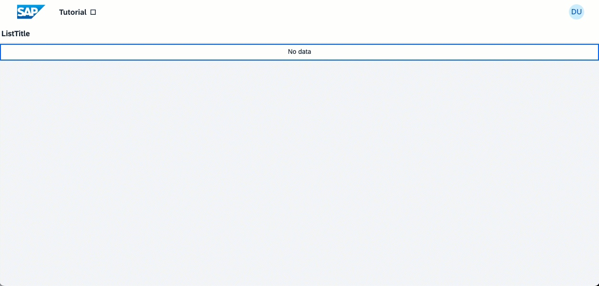

## Details
### You will learn  
- How to add additional views
- How to use data binding
- How to define routes and targets
- How to add additional controller

---

[ACCORDION-BEGIN [Step : ](Add two new views)]

In SAPUI5, each view is represented by a dedicated file in the `view` folder.

1. Add a new view with a right-click on the `view` folder and select **New File**. Name this file `List.view.xml`.

    !

2. The name already suggests that this view fill contain a [list](https://sapui5.hana.ondemand.com/#/topic/295e44b2d0144318bcb7bdd56bfa5189) of products. Add the following file content that defines the views and the list. Note the list already uses [data binding](https://sapui5.hana.ondemand.com/#/topic/68b9644a253741e8a4b9e4279a35c247) to show the product entities as list items.

    ```XML
    <mvc:View controllerName="sap.btp.sapui5.controller.List" xmlns:mvc="sap.ui.core.mvc" displayBlock="true" xmlns="sap.m">
    	<Page id="listPage" title="{i18n>ListTitle}" >
            <List id="list" items="{/Products}">
                <StandardListItem type="Navigation" press="handleListItemPress" title="{ProductName}"/>
            </List>
        </Page>
    </mvc:View>
    ```


3. Repeat step 1 to create another view with the name `Detail.view.xml`. We will use this view to display details of a given product.


4. Write the following content in this new file. In contrast to the list, it uses a relative binding, e.g. the binding path doesn't start with `/` like absolute paths do.


    ```XML
    <mvc:View controllerName="sap.btp.sapui5.controller.Detail" xmlns:mvc="sap.ui.core.mvc" displayBlock="true" xmlns="sap.m">
    	<Page id="detail" title="{i18n>DetailTitle}" showNavButton="true" navButtonPress="handleNavButtonPress" >
    		<VBox>
    			<Text text="{ProductName}" />
    			<Text text="{UnitPrice}" />
    			<Text text="{QuantityPerUnit}" />
    			<Text text="{UnitsInStock}" />
    		</VBox>
    	</Page>
    </mvc:View>
    ```

> Hint: You don't need to rely on the code editor to edit the views. Right-click on any view and select **Open with | Layout Editor** to access the [WYSIWYG](https://en.wikipedia.org/wiki/WYSIWYG) layout editor:

>!


[DONE]
[ACCORDION-END]
[ACCORDION-BEGIN [Step : ](Convert View1 to a pure container)]

The web app basically contains of the two views we created in the previous step. We want to switch from the list view to the detail view when the user clicks an item, and back to the list when the user clicks the "back" button. To implement this navigation, we need an `<App>` container that includes both view.

**Edit** the original `webapp/view/View1.view.xml` view to define only this container.

```XML[3,4]
<mvc:View controllerName="sap.btp.sapui5.controller.View1" xmlns:mvc="sap.ui.core.mvc" displayBlock="true" xmlns="sap.m">
	<Shell id="View1">
		<App id="app">
		</App>
	</Shell>
</mvc:View>
```


[DONE]
[ACCORDION-END]
[ACCORDION-BEGIN [Step : ](Add new targets and routes)]

In this step we'll define so-called [routes and targets](https://sapui5.hana.ondemand.com/#/topic/3d18f20bd2294228acb6910d8e8a5fb5), which are needed for the automated navigation we want to use. Each route defines a (URL) pattern and the target it points to, and each target specifies the view it refers to.

**Add** the new targets and routes to the existing `webapp/manifest.json` file.

```JSON[14-27,36-47]
{
    "_version": "1.12.0",
    "sap.app": {
        ...
    },
    "sap.ui": {
        ...
    },
    "sap.ui5": {
        ...
        "routing": {
            ...
            "routes": [
                {
                    "name": "home",
                    "pattern": "",
                    "target": [
                        "TargetList"
                    ]
                },
                {
                    "name": "detail",
                    "pattern": "product/{productId}",
                    "target": [
                        "TargetDetail"
                    ]
                }
            ],
            "targets": {
                "TargetView1": {
                    "viewType": "XML",
                    "transition": "slide",
                    "clearControlAggregation": false,
                    "viewId": "View1",
                    "viewName": "View1"
                },
                "TargetList": {
                    "viewType": "XML",
                    "transition": "slide",
                    "clearControlAggregation": false,
                    "viewName": "List"
                },
                "TargetDetail": {
                    "viewType": "XML",
                    "transition": "slide",
                    "clearControlAggregation": false,
                    "viewName": "Detail"
                }
            }
        }
    }
}
```

[DONE]
[ACCORDION-END]
[ACCORDION-BEGIN [Step : ](Add two new controllers)]

This is the crucial step of this tutorial that ties everything together. Each view specifies its controller with the `controllerName` property in the first line. Controllers contain the business logic of web apps, bind models to views, and use the router to navigate between views.

1. Right-click on the `controller` folder and select **New File** to create a new   `List.controller.js` controller for the list view. The controller defines one method that is the event listener for the press-item event of the product list. It will trigger the navigation to the second view and attached the product ID of the pressed item.

    ```JavaScript
    sap.ui.define([
        "sap/ui/core/mvc/Controller"
    ],
        function (Controller) {
            "use strict";

            return Controller.extend("sap.btp.sapui5.controller.List", {
                handleListItemPress: function (oEvent) {
                    var oRouter = sap.ui.core.UIComponent.getRouterFor(this);
                    var selectedProductId = oEvent.getSource().getBindingContext().getProperty("ProductID");
                    oRouter.navTo("detail", {
                        productId: selectedProductId
                    });
                }
            });
        });
    ```

2. Chose **New File** one more time to create a `Detail.controller.js` file, which corresponds to the detail view.  This control contains more methods as the needs to handle the inbound navigation, to bind the selected product to the view, and the outbound navigation to get back to the list. **Insert** the following code into the file.

    ```JavaScript
    sap.ui.define([
      "sap/ui/core/mvc/Controller"
  ],
      function (Controller) {
          "use strict";

          return Controller.extend("sap.btp.sapui5.controller.Detail", {
              onInit: function () {
                  var oRouter = sap.ui.core.UIComponent.getRouterFor(this);
                  oRouter.getRoute("detail").attachMatched(this._onRouteMatched, this);
              },
              _onRouteMatched: function (oEvent) {
                  var oArgs, oView;
                  oArgs = oEvent.getParameter("arguments");
                  oView = this.getView();
                  oView.bindElement({
                      path: "/Products(" + oArgs.productId + ")",
                      events: {
                          dataRequested: function () {
                              oView.setBusy(true);
                          },
                          dataReceived: function () {
                              oView.setBusy(false);
                          }
                      }
                  });
              },
              handleNavButtonPress: function (evt) {
                  var oRouter = sap.ui.core.UIComponent.getRouterFor(this);
                  oRouter.navTo("home");
              }
          });
      });
    ```


[DONE]
[ACCORDION-END]
[ACCORDION-BEGIN [Step : ](Test it)]

If you already stopped the web app, restart the saved configuration. **Open** the running web app to see the changes.

You should be able to see a list of products and navigate to the detail pages (and back to the list page).


!


[VALIDATE_1]
[ACCORDION-END]
---
