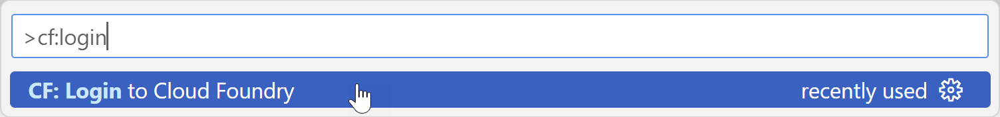
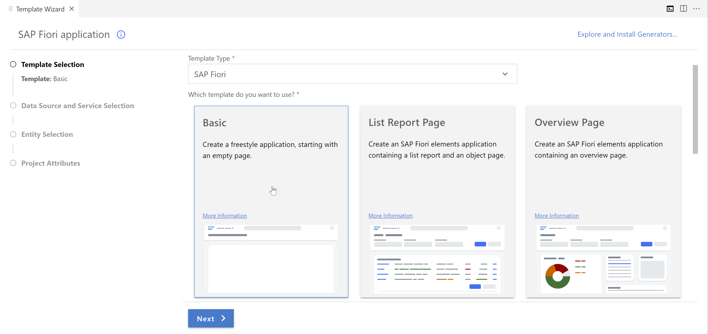
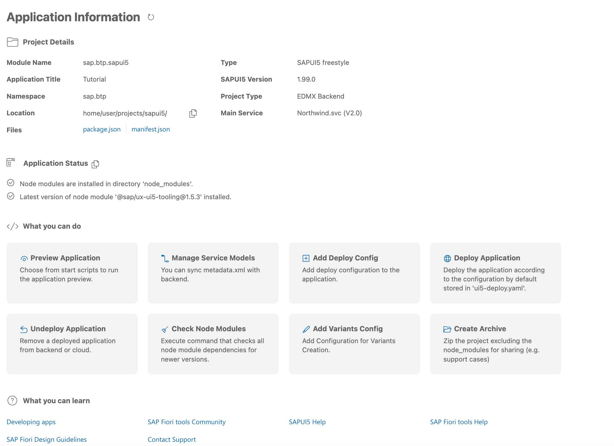
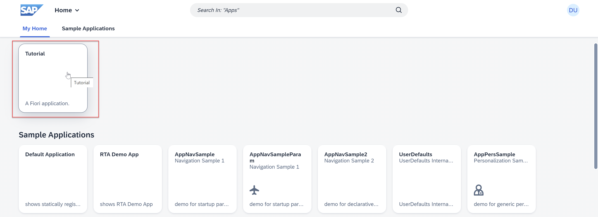

# Create an Empty SAPUI5 Project
<!-- description --> Start working with the SAP Business Application Studio, and create a new empty UI5 project connected to a data source.

## Prerequisites  
- **Tutorials:**  [Create a Dev Space for SAP Fiori Apps](appstudio-devspace-fiori-create), [Create a Destination in the SAP BTP Cockpit](cp-cf-create-destination)

## You will learn  
  - How to create a new SAPUI5 project that is connected to a data source
  - How to run the project in the SAP Business Application Studio

---
### Open the Fiori dev space

**Start** a dev space of kind *SAP Fiori* and **open** it by clicking its name.

<!-- border -->

> Have a look at [this tutorial](appstudio-devspace-fiori-create) if you are unsure how to get here or how to create a dev space.

### Connect to a Cloud Foundry endpoint

Make sure you are connected to a Cloud Foundry endpoint to which you will deploy the SAPUI5 application later.

1. First, you need to log on to Cloud Foundry. To do that, start the command palette from the menu **View > Command Palette...**, search for **cf:login**, and select the command **CF:Login to Cloud Foundry**.

    <!-- border -->

2. Enter the Cloud Foundry endpoint you want to use. Enter your email and your password to proceed.

    <!-- border -->

3. You might need to select the Cloud Foundry Organization and space you want use. If the **Select Cloud Foundry Organization** and **Select Cloud Foundry Space** dropdowns are empty, you can skip this and proceed to the next step. Otherwise, you will see messages in the lower right hand corner indicating that you are connected to the endpoint once these prompts have been answered.

### Create a new project

SAP Fiori tools includes an Application Generator that provides a wizard-style approach for creating applications.

1. First, you need to select the workspace for your project by choosing from menu **File** > **Open Folder** and select **projects** folder.

2. To launch the Application Generator, start the command palette from the menu item **View** > **Command Palette...**, search for **`fiori generator`**, and select the command **Fiori: Open Application Generator**

3. Specify the template type **SAP Fiori** and the **Basic** template and go to the **Next** screen.

    <!-- border -->

4. Now you have the option to connect your SAPUI5 application to a data source. Select **Connect to an OData Service** and enter the following service URL **`https://services.odata.org/V2/Northwind/Northwind.svc/`** before you click **Next**.

    <!-- border -->

5. Keep the default view name (i.e. `View1`) and click **Next** .

6. Name the module **`sapui5`**, use the application title **`Tutorial`**, and define the namespace as **`sap.btp`**. Choose the **Yes** option for **Add deployment configuration**. Keep the default values for the other parameters and select **Next** to go to the next step.

      <!-- border -->

7. Choose **Cloud Foundry** as the target runtime and type in the name of the destination you created before: **`Northwind`**. Press **Finish** to create the new project.

      <!-- border -->

      After the project is generated, the Application Information page will be shown for the project you created. The Application Information page gives you a quick overview of the most essential information for your project. You can find more information on the Application Information page here: <https://help.sap.com/viewer/17d50220bcd848aa854c9c182d65b699/Latest/en-US/c3e0989caf6743a88a52df603f62a52a.html>.

      <!-- border -->

>You can keep the Application Information page open as it will be needed later. In case you close it, you can open the Command Palette from menu **View** > **Find Commands**, type **`Application Info`**, and select **Fiori: Open Application Info**.

### Run the web app

Running your application has several advantages over deploying it. Among others, it's faster, doesn't require a "build" step and won't minify your JavaScript codebase.

1. To run the pre-generated run configuration, switch to the **Run Configuration** panel on the left-hand bar. Click the **Create configuration** button and then selection your project `sapui5`. Another window will open for further configuration. Select `test/flpSandbox.html` for the **File** for your configuration and then click **Save**. 

2. Click on the **▶** icon of the first run configuration to add start the SAPUI5 app.

    <!-- border -->

2. A new tab should open that displays a launchpad with sample apps, as well as your `Tutorial` app.

    <!-- border -->

Click the tile for your **Tutorial** app. You should see the following page:

   <!-- border -->

### Inspect the application network trace

1. Now you should see your (blank) SAPUI application. Right-click on the web page, and choose **Inspect**

3.  The inspector will appear.  Click on the **Network** tab to view the network traffic for the application.

4.  To view all the network traffic, reload the page.  The network traffic will appear as the page is loading.

5.  Scroll down until you find the *$metadata* item - or use the filter box to search for it.  

    > **NOTE** Typing in `metadata` to the filter box in the upper right corner will make it easy to find the correct row.

6.  Click on *$metadata*, then click the **Preview** tab.

    This will show you the data coming from the server to the browser.  If you see this, the OData request is working.  You are ready to move on to the next step of the tutorial.

    <!-- border -->

Expand the nodes **`<edmx:Edmx>`**, **`<edmx: DataServices>`** and the **`first <Schema> node`** in the Chrome Network trace.

---

[def]: cp-cf-create-destination