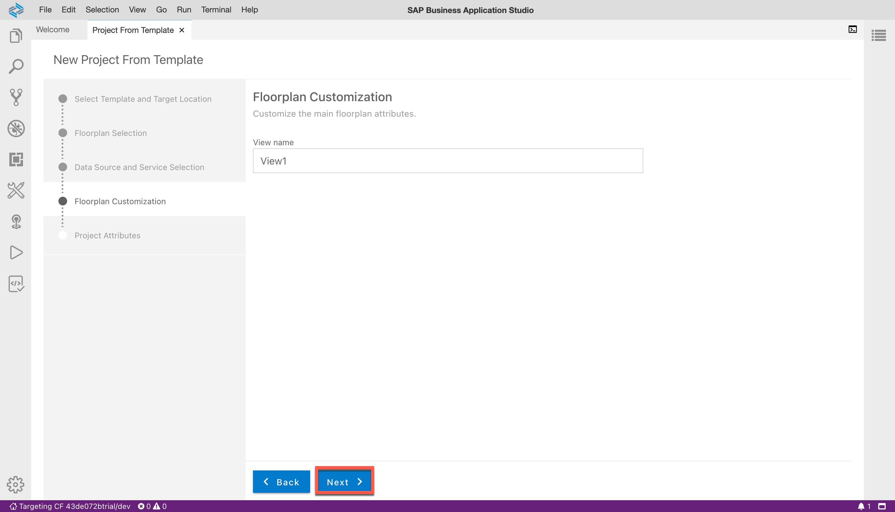
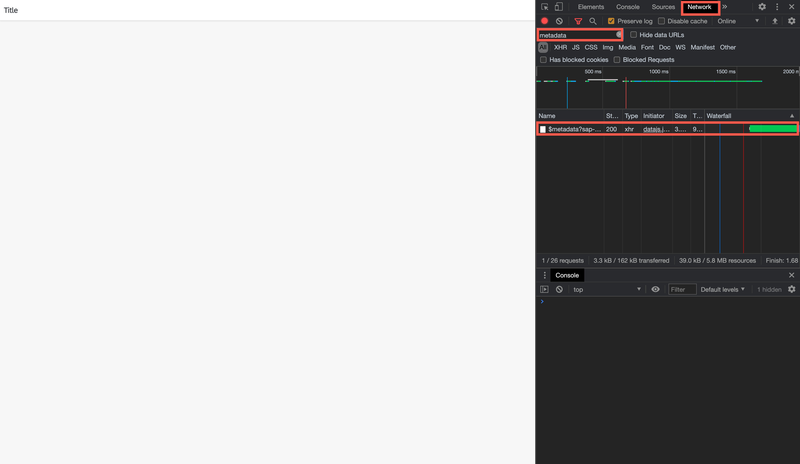

## Prerequisites  
- **Tutorials:**  [Create a Dev Space for SAP Fiori Apps](appstudio-devspace-fiori-create)

## Details
### You will learn  
  - How to create a new SAPUI5 project that is connected to a data source
  - How to run the project to in the SAP Business Application Studio

---
[ACCORDION-BEGIN [Step : ](Open the Fiori dev space)]

**Start** a dev space of kind *SAP Fiori* and **open** it by clicking its name.

!

> Have a look at [this tutorial](appstudio-devspace-fiori-create) if you are unsure how to get here or how to create a dev space.

[DONE]
[ACCORDION-END]
[ACCORDION-BEGIN [Step : ](Connect to a Cloud Foundry endpoint)]

Make sure you are connected to a Cloud Foundry endpoint to which you will deploy the SAPUI5 application later.

1. Click on the bottom-left corner of the screen to start the connection flow.

    !

2. Enter the Cloud Foundry endpoint you want to use. If your environment runs in the EU10-region, this is `https://api.cf.eu10.hana.ondemand.com`. Enter your email and your password to proceed.

    !

3. Next, you need to select the Cloud Foundry Organization and space you want use. You will see that you are connected to the endpoint once these prompts have been answered.

    !

[DONE]
[ACCORDION-END]
[ACCORDION-BEGIN [Step : ](Create a new project)]
1. Click on the link **Start from template** on the *Welcome* screen.

    !

2. Select **SAP Fiori freestyle SAPUI5 application** as the template category you want to use and click **Start**.

    !

3. Specify the application type **SAPUI5 freestyle** and the floor plan **SAPUI5 Application** and go to the **Next** screen.

    !

4. Now you have the option to connect your SAPUI5 application to a data source. Select **Connect to an OData Service** and enter the following service URL **`https://services.odata.org/V2/Northwind/Northwind.svc/`** before you click **Next**.

    !

4. Keep the default view name and click **Next** .

    !

  4.   Name of the module **`sapui5`**, use the application title  **`Tutorial`**, define the namespace **`sap.btp`**, and **Add deployment configuration**. Keep the default values for the other parameters and select **Next** to go to the next step.

      !

  4.  Choose **Cloud Foundry** as the target runtime and type in the name of the destination you created before: **`Northwind`**. Press **Finish** to create the new project.

      !

4. Once you see the success message, click **Files & Open** to find the new project.

    !

4. Select **user/projects/sapui5** and confirm with **Open**.

    !

[DONE]
[ACCORDION-END]
[ACCORDION-BEGIN [Step: ](Run the web app)]

Running your application has several advantages over deploying it. Among others, it's faster, doesn't require a "build" step and won't minify your JavaScript codebase.

1. To run the pre-generated run configuration, switch to the **Run Configuration** panel on the left-hand bar. Click on the **▶️** icon of the first run configuration to add start the SAPUI5 app.

    !

2. Now the SAP Business Application Studio will start the app. When promoted, selected **Open** to make the local port accessible for debugging.

    !

3. A new tab should open that displays the following page.

    !

[DONE]
[ACCORDION-END]

[ACCORDION-BEGIN [Step : ](Inspect the application network trace)]

1. Now you should see your (blank) SAPUI application. Right-click on the web page, and choose **Inspect**

3.  The inspector will appear.  Click on the **Network** tab to view the network traffic for the application.

4.  To view all the network traffic, reload the page.  The network traffic will appear as the page is loading.

5.  Scroll down until you find the *$metadata* item - or use the filter box to search for it.  

    > **NOTE** Typing in `metadata` to the filter box in the upper right corner will make it easy to find the correct row.

6.  Click on *$metadata*, then click the **Preview** tab.

    This will show you the data coming from the server to the browser.  If you see this, the OData request is working.  You are ready to move on to the next step of the tutorial.

    !

Expand the nodes **`<edmx:Edmc>`**, **`<edmx: DataServices>`** and the **`first <Schema> node`** in the Chrome Network trace.

[VALIDATE_1]
[ACCORDION-END]

---
