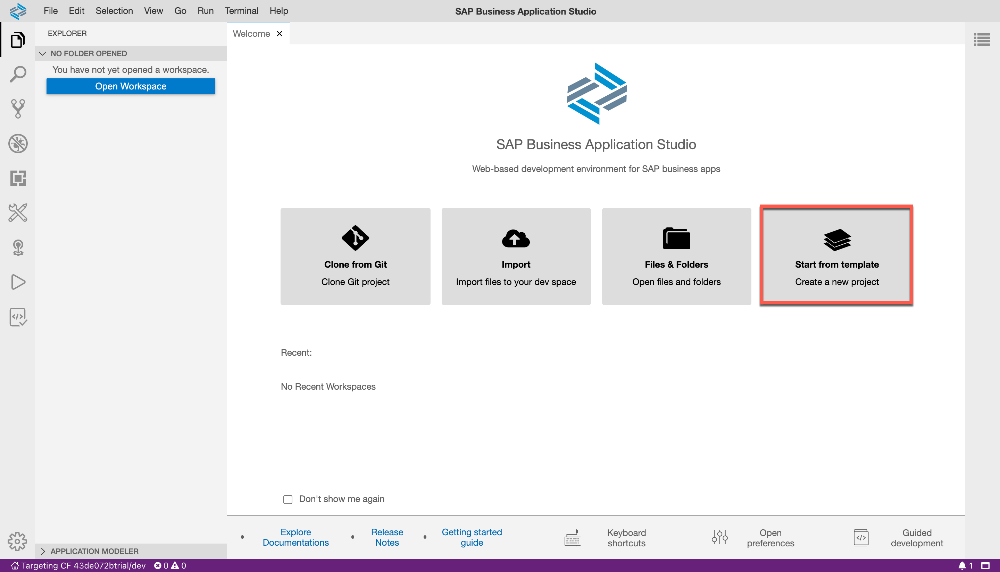
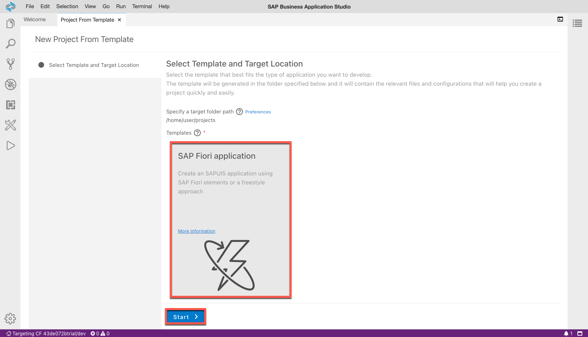
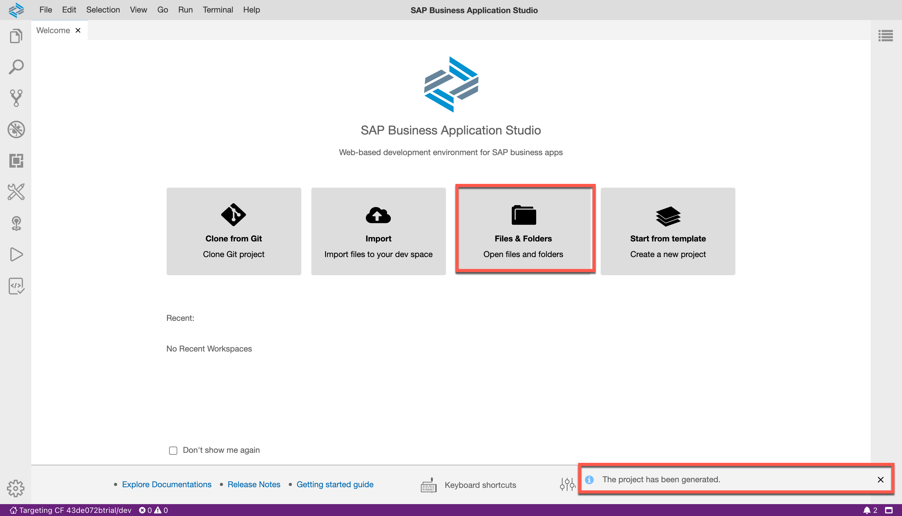

## Prerequisites  
- **Tutorials:**  [Create a Dev Space for SAP Fiori Apps](appstudio-devspace-fiori-create)

## Details
### You will learn  
  - How to create a new SAPUI5 project that is connected to a data source
  - How to create a run configuration for new projects

---
[ACCORDION-BEGIN [Step : ](Open the Fiori dev space)]


**Start** a dev space of kind *SAP Fiori* and **open** it by clicking its name.

!

> Have a look at [this tutorial](appstudio-devspace-fiori-create) if you are unsure how to get here or how to create a dev space.


[DONE]
[ACCORDION-END]
[ACCORDION-BEGIN [Step : ](Connect to a Cloud Foundry endpoint)]

Make sure you are connected to a Cloud Foundry endpoint to deploy the SAPUI5 application later.

1. Click on the bottom-left corner of the screen to start the connection flow.

    !

2. Enter the Cloud Foundry endpoint you want to use. If your environment runs in the EU10-region, this is `https://api.cf.eu10.hana.ondemand.com`. Enter your email and your password to proceed.

    !

3. Next, you need to select the Cloud Foundry Organization and space you want to use. You will see that you are connected to the endpoint once these prompts have been answered.

    !


[DONE]
[ACCORDION-END]

[ACCORDION-BEGIN [Step : ](Create a new project)]
1. Click on the link **New project From template** on the *Welcome* screen.

    !

2. Select **SAP Fiori Freestyle - Project Generator** as the template category you want to use and click **Next**.

    !

3. Specify the target environment ( **Cloud Foundry** ) and the template ( **SAPUI5 Application** ) and go to the **Next** screen.

    !

4. Name the project **`tutorial`** and proceed by clicking **Next**.

    !

4. Choose **Standalone Approuter** for the runtime and click **Next**.

    !

4.  Name of the module  **`webapp`** and the namespace **`sap.cp`** and turn authentication off. Go to the **Next** screen.

    !

4. Keep the default view name and select **Yes** to add a data service on this project.

    !

4. Select **My SAP Systems** and the source **Northwind**. Enter `/v2/northwind/northwind.svc/` for the path - don't forget the ending slash. Click **Next** to create the new project.

    !

4. Once the project has been created, the Business Application Studio will prompt you to open the project in a new workspace. Click **Open in New Workspace**.

    !


[DONE]
[ACCORDION-END]
[ACCORDION-BEGIN [Step: ](Create a new run configuration)]

Create a run configuration to be able to run the web app. This configuration needs to be created only once.

1. To run the UI module, switch to the **Run Configuration** panel on the left-hand bar. Click on the **+** icon to add a new run configuration.

    !

2. In the prompt, select the UI module **`webapp`** as the app you want to run.

    !

2.  Then, select **index.html** to add a new run configuration for your app.

    !

3. Choose the latest UI5 version.

    !

3. Choose **`Run Web App`** as the name of the configuration to create the configuration.

    !

3. You can see the configuration on the left side now. Expand it to view the *Data Source (Destination)* dependency and click on it to connect the run configuration to the data source.

    !

3. Select the **Northwind** data source from the list.

    !


[DONE]
[ACCORDION-END]
[ACCORDION-BEGIN [Step: ](Run the web app)]

Running your application has several advantages over deploying it. Among others, it's faster, doesn't require a "build" step and won't minify your JavaScript codebase.

1. Run the configuration you just created.

    !


2. Now the SAP Business Application Studio will start the app. When promoted, selected **Expose and open** to making the local port accessible for testing and debugging. Choose any description for this port.

    !


> In case you run into this error:

>!

>  You can fix this by running the following command in a **Terminal|New Terminal**:

```Terminal
cd tutorial-approuter/
npm install
```


[DONE]
[ACCORDION-END]

[ACCORDION-BEGIN [Step : ](Inspect the application network trace)]

1. Now you should see your (blank) SAPUI application. Right-click on the web page, and choose **Inspect**


3.  The inspector will appear.  Click on the **Network** tab to view the network traffic for the application.

4.  To view all the network traffic, reload the page.  The network traffic will appear as the page is loading.

5.  Scroll down until you find the *$metadata* item - or use the filter box to search for it.  

    > **NOTE** Typing in `metadata` to the filter box in the upper right corner will make it easy to find the correct row.

6.  Click on *$metadata*, then click the **Preview** tab.

    This will show you the data coming from the server to the browser.  If you see this, the OData request is working.  You are ready to move on to the next step of the tutorial.

    !

Expand the nodes **`<edmx:Edmc>`**, **`<edmx: DataServices>`** and the **`first <Schema> node`** in the Chrome Network trace.

[VALIDATE_1]
[ACCORDION-END]

---
