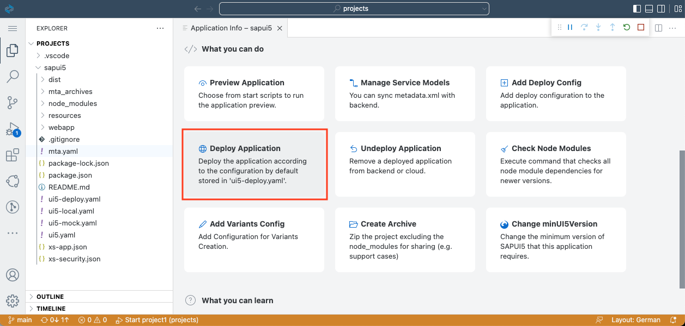

# Deploy Your SAPUI5 App
<!-- description --> Create, build, and deploy an MTA project with an integrated SAPUI5 module to SAP BTP, Cloud Foundry environment

## Prerequisites
- You have previously [created a SAPUI5 based project in the SAP Business Application Studio](sapui5-101-create-project).

## You will learn
  - How to build a multi-target application (MTA).
  - How to deploy a multi-target application to Cloud Foundry.

### Build the application

Build (aka package) the project to an `.mtar` archive to deploy it to Cloud Foundry.

1. Right-click on the `mta.yaml` file and select **Build MTA Project** to trigger this process.

    

2. Once the build is finished, you can see a message in the log. You can now find the generated `.mtar` archive in the project tree in the `mta_archives` directory.

    

### Deploy the application

1. If you don't have the **Application Info** page open, you can open the Command Palette from menu **View > Command Palette**, type **Application Info**, and select **Fiori: Open Application Info**. Click on the **Deploy Application** tile to start deployment process.

    <!-- border -->
    

2. Once the process is finished, you can get the URL of the deployed app by running `cf html5-list -u -di sapbtpsapui5-destination-service -u --runtime launchpad` in a new terminal session.

    <!-- border -->
    

    > Use the following command in case you use the Portal service
    >
    > `cf html5-list -di sapbtpsapui5-destination-service -u  --runtime cpp`

3. Follow the link in the console to open the application in your browser. You might need to log in with your SAP ID (the same credentials you use for the SAP BTP Cockpit).

