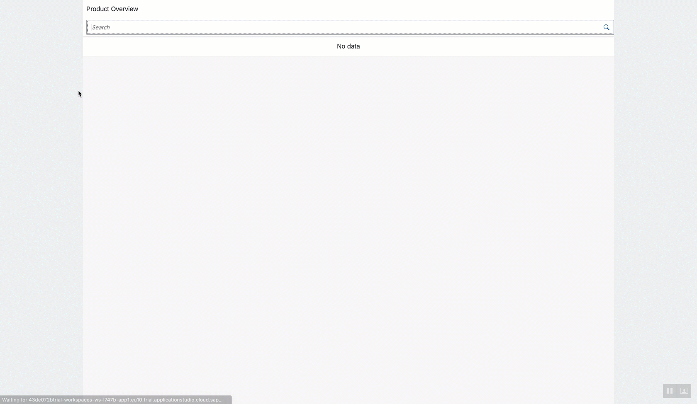

## Details
### You will learn  
- About localized strings in SAPUI5
- How to import new modules in a controller
- How to improve the user experience of the list with a search field
- Many new controls that come with SAPUI5

So far, the web app is working, but it doesn't show much information yet. In order to improve our web app, you can display more detailed information for each list item and on the detail page.

---

[ACCORDION-BEGIN [Step : ](Localize strings)]

[Localized strings](https://sapui5.netweaver.ondemand.com/sdk/#/topic/91f217c46f4d1014b6dd926db0e91070) are necessary to translate the application in various languages. You need to bind all exposed strings to the i18n model and avoid hard-coded strings so that the web app can be translated easily. This tutorial's views already come with bound strings, so you only need to add the properties file.

**Replace** the content of the `webapp/i18n/i18n.properties` file with the following lines.

```i18n
appTitle=Products
appDescription=Displays products


Currency=EUR
Discontinued=Discontinued
Available=Available

# List View
ListTitle=Product Overview

# Detail View
DetailTitle=Product Details
Ordered=Ordered
NotOrdered=Not Ordered
OrderButtonText=Order
OrderDialogTitle=Order Product
OrderDialogMsg=Do you want to order this product now?
OrderDialogSuccessMsg=The product has been ordered
```

> You can use [language codes](https://sapui5.netweaver.ondemand.com/sdk/#/topic/91f21f176f4d1014b6dd926db0e91070.html) to add more i18n files.


[DONE]
[ACCORDION-END]
[ACCORDION-BEGIN [Step : ](Improve the list view)]
In this step, we will add a search field on the top of the list to make it searchable and more appealing by using [custom list items](https://sapui5.hana.ondemand.com/#/api/sap.m.ObjectListItem). You will add a `<SearchField>` control to the initial page of the application. We'll add it as a child within the pages `subHeader` aggregation, which expects a `<Bar>` control.

1.	Open the `webapp/view/List.view.xml` file, and **change** the highlighted lines.

	```XML[5-11,13-20]
	<mvc:View controllerName="sap.btp.sapui5.controller.List" xmlns:mvc="sap.ui.core.mvc" displayBlock="true" xmlns="sap.m">
		<Page id="listPage" title="{i18n>ListTitle}" >
	        <subHeader>
				<Bar>
					<contentLeft>
						<SearchField search="handleSearch"/>
					</contentLeft>
				</Bar>
			</subHeader>
			<List id="list" items="{/Products}">
				<ObjectListItem type="Navigation" press="handleListItemPress" title="{ProductName}" number="{= ((${UnitPrice} * 100) / 100).toFixed(2) }" numberUnit="{i18n>Currency}">
					<attributes>
						<ObjectAttribute text="{QuantityPerUnit}"/>
					</attributes>
					<firstStatus>
						<ObjectStatus  text="{= ${Discontinued} ? ${i18n>Discontinued} : ${i18n>Available} }"  state="{= ${Discontinued}? 'Error' : 'Success' }"/>
					</firstStatus>
				</ObjectListItem>
	        </List>
	    </Page>
	</mvc:View>
	```


2.	To handle the search, we'll specify a handler for the search field's 'search' event. This handler, `handleSearch`, is defined in the view's controller, and the search effect is achieved by adding a 'contains string' filter to the binding of the List control's items aggregation. **Add** a listener for the search event in the  `webapp/controller/List.controller.js`.

	```JavaScript[2-4,6,10-26]
	sap.ui.define([
    "sap/ui/core/mvc/Controller",
    "sap/ui/model/Filter",
    "sap/ui/model/FilterOperator"
],
    function (Controller, Filter, FilterOperator) {
        "use strict";

        return Controller.extend("sap.btp.sapui5.controller.List", {
            handleSearch: function (evt) {
                // create model filter
                var filters = [];
                var query = evt.getParameter("query");
                if (query && query.length > 0) {
                    filters.push(new Filter({
                        path: "ProductName",
                        operator: FilterOperator.Contains,
                        value1: query
                    }));
                }

                // update list binding
                var list = this.getView().byId("list");
                var binding = list.getBinding("items");
                binding.filter(filters);
            },

            handleListItemPress: function (oEvent) {
                var oRouter = sap.ui.core.UIComponent.getRouterFor(this);
                var selectedProductId = oEvent.getSource().getBindingContext().getProperty("ProductID");
                oRouter.navTo("detail", {
                    productId: selectedProductId
                });
            }
        });
    });
	```

[DONE]
[ACCORDION-END]
[ACCORDION-BEGIN [Step : ](Improve the detail view)]
Similarly to the previous step, this step will add additional controls to the existing page. Add an [`ObjectHeader`](https://sapui5.hana.ondemand.com/#/api/sap.m.ObjectHeader) and a footer to use the full width of the page for the content.

1.	Open the `webapp/view/Detail.view.xml` file, and **replace** the highlighted lines.

	```XML[5-22]
	<mvc:View controllerName="sap.btp.sapui5.controller.Detail" xmlns:mvc="sap.ui.core.mvc" displayBlock="true" xmlns="sap.m">
		<Page id="detail" title="{i18n>DetailTitle}" showNavButton="true" navButtonPress="handleNavButtonPress" >
			<ObjectHeader title="{ProductName}" number="{= ((${UnitPrice} * 100) / 100).toFixed(2) }" numberUnit="{i18n>Currency}">
				<statuses>
					<ObjectStatus text="{= ${Discontinued} ? ${i18n>Discontinued} : ${i18n>Available} }" state="{= ${Discontinued} ? 'Error' : 'Success' }"/>
					<ObjectStatus text="{= (${UnitsOnOrder} > 0) ?  ${i18n>Ordered} : ${i18n>NotOrdered} }" state="Success"/>
				</statuses>
				<attributes>
					<ObjectAttribute text="Product #{ProductID}"/>
					<ObjectAttribute text="Category #{CategoryID}"/>
					<ObjectAttribute text="Supplier #{SupplierID}"/>
				</attributes>
			</ObjectHeader>
			<footer>
				<Bar>
					<contentRight>
						<Button text="{i18n>OrderButtonText}" type="Accept" icon="sap-icon://accept" press="handleOrder"/>
					</contentRight>
				</Bar>
			</footer>
		</Page>
	</mvc:View>
	```

	2.	The previous snippet contains a button. Let's implement the logic to display a [MessageBox](https://sapui5.hana.ondemand.com/#/api/sap.m.MessageBox) once this button has been pressed. **Add** a missing imports and the listener for the press event in the `webapp/controller/Detail.controller.js`.

		```JavaScript[2,3,4,6,33-50]
		sap.ui.define([
	    "sap/ui/core/mvc/Controller",
	    "sap/m/MessageBox",
	    "sap/m/MessageToast"
	],
	    function (Controller, MessageBox, MessageToast) {
	        "use strict";

	        return Controller.extend("sap.btp.sapui5.controller.Detail", {
	            onInit: function () {
	                var oRouter = sap.ui.core.UIComponent.getRouterFor(this);
	                oRouter.getRoute("detail").attachMatched(this._onRouteMatched, this);
	            },
	            _onRouteMatched: function (oEvent) {
	                var oArgs, oView;
	                oArgs = oEvent.getParameter("arguments");
	                oView = this.getView();
	                oView.bindElement({
	                    path: "/Products(" + oArgs.productId + ")",
	                    events: {
	                        dataRequested: function () {
	                            oView.setBusy(true);
	                        },
	                        dataReceived: function () {
	                            oView.setBusy(false);
	                        }
	                    }
	                });
	            },

	            handleNavButtonPress: function (evt) {
	                var oRouter = sap.ui.core.UIComponent.getRouterFor(this);
	                oRouter.navTo("home");
	            },

	            handleOrder: function (evt) {
	                // show confirmation dialog
	                var bundle = this.getView().getModel("i18n").getResourceBundle();
	                MessageBox.confirm(
	                    bundle.getText("OrderDialogMsg"),
	                    function (oAction) {
	                        if (MessageBox.Action.OK === oAction) {
	                            // notify user
	                            var successMsg = bundle.getText("OrderDialogSuccessMsg");
	                            MessageToast.show(successMsg);
	                            // TODO call proper service method and update model (not part of this tutorial)
	                        }
	                    },
	                    bundle.getText("OrderDialogTitle")
	                );
	            }
	        });
	    });
		```

[DONE]
[ACCORDION-END]
[ACCORDION-BEGIN [Step : ](Test the search)]
Re-run your application.  You should see the search box at the top of the list, right below the words `Product Overview`.

Try to search for a word.



> With this, you completed the tutorial group. Congratulations!

> You can follow steps 4 and 5 of [this tutorial](appstudio-sapui5-create) to deploy the application to SAP BTP, Cloud Foundry environment.


[VALIDATE_1]
[ACCORDION-END]

----
