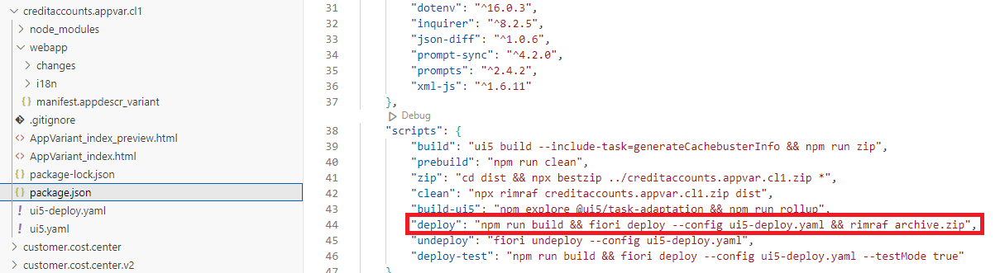

# Make Your Application Variant (created in an SAPUI5 Adaptation Project) Available to Business Users in SAP S/4HANA Cloud Public Edition (3 of 3)
<!-- description --> Learn how to make your application variant (created in an SAPUI5 Adaptation Project) available to business users in SAP S/4HANA Cloud Public Edition.

## You will learn
- How to build and deploy your new application variant (created in Tutorial 1 / 2) 
- How to configure SAP Fiori launchpad in ABAP Development Tools (ADT) as a developer 
- How to configure SAP Fiori launchpad in your SAP S/4HANA Cloud Public Edition system as an administrator 
- How to access the new application variant as a business user 

## Prerequisites

You must first have completed all the steps in:
- Tutorial 1: [Work with SAPUI5 Adaptation Projects to Change a Standard Fiori Application](sapui5-adaptation-change-variant) 
- Tutorial 2: [Work with SAPUI5 Adaptation Projects to Extend a Standard Fiori Application](sapui5-adaptation-extend-variant)

## Intro
SAP S/4HANA Cloud Public Edition delivers the latest industry best practices, innovations, and business applications to you as a service. If a standard SAP Fiori application doesn’t fully support your business process or the specific needs of some of your business users, you can extend SAP S/4HANA Cloud Public Edition by creating and adapting an application variant, while the original SAP Fiori application remains available and unchanged.  In an application variant, you can extend the original code to define changes that fulfill the specific business requirements of different business roles, user groups, organizational units, and countries. For example, you might want to create an application variant to simplify and streamline a specific process by hiding fields not required by casual users, visualizing data as a chart, or changing a responsive table to a grid table to make information easier to process.  

**New for SAP S/4HANA Cloud Public Edition 2402**

As of SAP S/4HANA Cloud Public Edition 2402, developers can work with SAPUI5 Adaptation Projects in [SAP Business Application Studio (BAS)](https://help.sap.com/docs/bas/developing-sap-fiori-app-in-sap-business-application-studio/extending-sap-fiori-application) to create application variants. Developers efficiently reuse the original SAP Fiori application together with its OData service and application logic to define changes that are specific to the application variant only.  

After deployment, both the source application and the newly created application variant exist with distinct titles and can be made available to the relevant business users through uniquely named application tiles in SAP Fiori launchpad: My Home. After a Cloud upgrade, developers can test the application variant in SAP Business Application Studio and, if there are no issues, they can deploy it again to benefit from the latest SAP enhancements to the original application (see [Check Whether the Base App of an Adaptation Project Is Up-To-Date](https://help.sap.com/docs/bas/584e0bcbfd4a4aff91c815cefa0bce2d/582d31d007be4c3bbda75f796ff1cebd.html?locale=en-US&state=PRODUCTION&version=Cloud)).

The following figure shows the relationship between the source application (blue) and an application variant (green):

### As a developer, build and deploy your new application variant

To build and deploy your application variant in SAP Business Application Studio, you can: 

- Run the script **npm run deploy** in the Terminal, or
 
- Double-click the package.json to open the file. Under *"scripts"*, hover your cursor over *"deploy”* and select `Run Script`.

You can track the progress of the build process in the Terminal. After the application variant has been built, you are prompted to provide confirmation that the application is to be deployed. In response to *Start deployment (Y/n)?* confirm yes by typing `Y`. 

After successful deployment of your application variant, a confirmation message is displayed. 

For more details about what is deployed, see the *abap-deploy-task* information log in the Terminal. 

For more information, see [Deploy or Update the Adaptation Project to the ABAP Repository](https://help.sap.com/docs/bas/584e0bcbfd4a4aff91c815cefa0bce2d/b8feaf8e337d4ef7ad9069bbf6016689.html?locale=en-US&state=PRODUCTION&version=Cloud)

### As a developer, create IAM artifacts required for SAP Fiori launchpad configuration in ABAP Development Tools

1. Open and log onto ABAP Development Tools (ADT). 

2. In the Project Explorer, open your package and expand the *BSP Library* folder and then the *BSP Applications* folder to view the application variant you deployed in SAP Business Application Studio.  

3. In the same package, you will find the folder *Fiori User Interface* containing the *FLP App Descriptor Items* folder. The FLP App Descriptor item with the name `<BSP application name>_UI5R` was generated automatically when you deployed the application variant in SAP Business Application Studio. 

4. Right-click on your package and choose *New* --> *Other ABAP Repository Object*  

5. In the *ABAP Repository Object* dialog box, open the *Cloud Identity and Access Management* folder and select *IAM App*.  

6. Choose `Next`. 

7. In the New *IAM App* dialog box, enter a unique name and description for your IAM app, for example, `ZIAM<BSP app name ><your initials>`, and a unique description. 

8. In the *Application Type* field, select *UI5A – UI Adaptation App*. The application ID suffix `_UI5A` is set automatically. 

9. Choose `Next`. 

10. In the *Select Transport Request* dialog box, choose the transport request you want to use and choose `Finish`. 

11. In your package, expand the folder *Cloud Identity and Access Management --> IAM Apps* and you will see your newly created IAM app with the application name you specified in step 7 and the suffix UI5A.  

12. Open your newly created IAM App in the *IAM Apps* folder. Enter on the *Overview* tab the *Fiori Launchpad App Description Item ID* that was generated automatically in your *Fiori User Interface folder --> FLP Descriptor Items* with the name `<BSP application name>_UI5R`. 

13. Open the *Services* tab, which will now list the services used by your application variant. Choose `Synchronize`. 

14. Open the *Authorizations* tab and maintain authorizations for your application variant and choose `Save`.  

15. You need to publish your IAM app locally, to do this choose the `Publish Locally` button on the top right of the screen. 

### As a developer, create a new Business Catalog and assign the app to it

1. In the *IAM App Overview* see *What’s next?* and select the link *Create a new Business Catalog and assign the App to it*, which opens the *New Business Catalog* dialog box. 

2. The Project name and Package name fields are automatically filled. 

3. Enter a unique name for the new Business Catalog, for example, `ZCAT<BSP app name><your initials>` and a unique description. 

4. Choose `Next`. 

5. Select your transport request and choose `Finish`. 

6. The *New Business Catalog App Assignment* dialog box is displayed. Check the assignment name and description `<Business Catalog to IAM App Assignment>` and choose `Next`. 

7. Select your transport request and choose `Finish` to create the Business Catalog App Assignment. 

8. You can see your newly created Business Catalog in the folder *IAM Business Catalogs*. Open the Business Catalog you created and select the Apps tab to confirm your app assignment ID and app ID. 

9. Choose the `Publish Locally` button at top right of your screen to publish the newly created Business Catalog.

### As a developer, create a Business Role Template and add the business catalog to it

1. Right-click on your package and choose `New --> Other ABAP Repository Object`.  

2. In the *ABAP Repository Object* dialog box, open the *Cloud Identity and Access Management* folder and select `Business Role Template`. 

3. Choose `Next`. 

4. In the *Business Role Template* dialog box, enter a unique name e.g. `ZBR<BSP app name><your initials>` and a unique description. 

5. Choose the `Next` button and select your transport request. 

6. Choose `Finish`. 

7. In the *Business Role Template* overview, choose `Add` to add your newly created Business Catalog. 

8. In the *IAM Business Role Template Catalog Assignment* dialog box, enter the name of your Business Catalog in the *Business Catalog* field. The name of the Business Role Template has been filled automatically.   

9. Choose `Next` and select your transport request. 

10. Choose `Finish`.  

11. The *IAM Business Role Template Catalog Assignment* is displayed with the *Assignment ID*, *Business Role Template ID*, and *Business Catalog ID*. 

12. In the *Cloud Identity and Access Management* folder, expand the *IAM Business Role Templates* folder and open your Business Role Template. Choose `Publish Locally`.

The following screenshot shows the folder structure in ADT with the different object types created in the steps 1, 2, 3 and 4:

For more information, see 

- [Assign the SAP Fiori Application to the IAM App (Developer)](https://help.sap.com/docs/SAP_S4HANA_CLOUD/6aa39f1ac05441e5a23f484f31e477e7/04330b95ea524c9bb89a3d1777c616e6.html)
- [Creating an IAM App and Adding It to a Business Catalog](https://help.sap.com/docs/SAP_S4HANA_CLOUD/6aa39f1ac05441e5a23f484f31e477e7/3daa8eaf93d943809d8d2c9794cf9ab0.html)
- [Providing Access to the SAP Fiori Application](https://help.sap.com/docs/SAP_S4HANA_CLOUD/6aa39f1ac05441e5a23f484f31e477e7/b569abb158934306a65f3eb38f86ffba.html)
	- [Assign the SAP Fiori Application to the IAM App (Developer)](https://help.sap.com/docs/SAP_S4HANA_CLOUD/6aa39f1ac05441e5a23f484f31e477e7/04330b95ea524c9bb89a3d1777c616e6.html)
	- [Integrating the SAP Fiori Application into the SAP Fiori Launchpad (Administrator)](https://help.sap.com/docs/SAP_S4HANA_CLOUD/6aa39f1ac05441e5a23f484f31e477e7/e9c4108610d14b8e9c08353458ed7f8c.html)
- [Creating an IAM App for the Business Service](https://help.sap.com/docs/btp/sap-business-technology-platform/creating-iam-app-for-business-service)
- [Creating an IAM App and Adding It to a Business Catalog](https://help.sap.com/docs/SAP_S4HANA_CLOUD/6aa39f1ac05441e5a23f484f31e477e7/3daa8eaf93d943809d8d2c9794cf9ab0.html)

### As an administrator, configure SAP Fiori launchpad

To ensure the new application variant can be made available on SAP Fiori launchpad/My Home, you must perform the following steps as an administrator of SAP S/4HANA Cloud Public Edition: 

1. Open as administrator SAP Fiori launchpad in your SAP S/4HANA Cloud Public Edition system.

2. Open the Maintain Business Roles app **as administrator** (in incognito window)

3. Create a **business role** using your newly created role template.

4. Choose`Create from Template` and enter the name of your business role template (choose the business role template `ZBR<BSP app name><your initials>`). 

5. Keep the prefilled name and description and choose `OK`. 

6. Your business role template is displayed. Open the *Business Catalogs* tab and check the business catalog you created earlier is listed.

7. Open the *Business Users* tab and choose `Add`. 

8. Enter your `First Name` and `Last Name` and select your business user. Choose `OK`. Save your changes. 

9.  Open the *Business Users* tab to check your name is listed as an assigned business user.  

For more information, see:  

- [Creating a Business Role and Assign It to Business Users](https://help.sap.com/docs/SAP_S4HANA_CLOUD/6aa39f1ac05441e5a23f484f31e477e7/e3ddaa0ea8c94f62beff59431faec572.html)

- [Integrating the SAP Fiori Application into the SAP Fiori Launchpad (Administrator)](https://help.sap.com/docs/SAP_S4HANA_CLOUD/6aa39f1ac05441e5a23f484f31e477e7/e9c4108610d14b8e9c08353458ed7f8c.html)

### As a business user, access your new application variant

1. Open as business user SAP Fiori launchpad in your SAP S/4HANA Cloud Public Edition system.

2. Open *My Home* SAP Fiori Launchpad. 

3. Choose `Add Apps` to launch *SAP App Finder --> Personalize “My Home”*

4. Enter the name of the app, for example, `<Manage Credit Accounts Simplified><your initials>` you want to add in the *Search in catalog* search field. 

5. On the app tile, choose `Add to Page “My Home”`. 

6. A confirmation message is displayed *“Manage Credit Accounts added to “My Home””* 

7. To launch the newly added application variant, simply press the app tile. 

8. In the *Apps* section of My Home, you can press the ellipsis dots to change the color of the app, create a group, or remove it from My Home.

### Summary

In this developer tutorial, you have learned how to: 

- Build and deploy your new application variant (created in Tutorial 1 & 2). 

- Configure SAP Fiori launchpad in ABAP Development Tools (ADT) as a developer. 

- Configure SAP Fiori launchpad in your SAP S/4HANA Cloud Public Edition system as an administrator. 

- Access the new application variant as a business user. 

**Test your knowledge**
 
>In ABAP Development Tools, where can you find the *Fiori Launchpad App Description Item ID* `<BSP application name>_UI5R` that was generated when you deployed the application variant in SAP Business Application Studio?

>Here are the options:

- **A**. In the *BSP Library* folder under *BSP Applications*
- **B**. In the *Fiori User Interface* folder under *FLP App Descriptor Items*
- **C**. In the *Cloud Identity and Access Management* folder under *IAM Apps* folder
- **D**. In the *Cloud Identity and Access Management* folder under *IAM Business Catalogs*
