# Work with SAPUI5 Adaptation Projects to generate and make simple changes to an application variant of an SAP Fiori application in SAP S/4HANA Cloud Public Edition (1 of 3)
<!-- description --> You will learn how to work with SAPUI5 Adaptation Projects to extend a standard SAP Fiori application by generating and making simple changes to an application variant in SAP S/4HANA Cloud Public Edition

## You will learn
- About SAPUI5 Adaptation Projects. 
- How to create an SAPUI5 Adaptation Project in SAP Business Application Studio to generate a variant of an SAP Fiori application.  
- Use the Adaptation Editor to define simple and effective changes to your application variant. 
- Add simple source code to the Manifest file to change the table properties.

## Prerequisites
Before you can start working with SAPUI5 Adaptation Projects in SAP Business Application Studio, you must first perform the following steps in SAP S/4HANA Cloud, ABAP environment using ABAP Development Tools (ADT):
    <ol type="1"><li>[Download the Eclipse IDE and add the ABAP Development Tools (ADT) Plugin](https://developers.sap.com/tutorials/abap-install-adt.html)
    </li><li>[Create an ABAP Package](https://help.sap.com/docs/abap-cloud/abap-development-tools-user-guide/creating-abap-packages)
    </li><li>[Create a transport request](https://help.sap.com/docs/SAP_S4HANA_CLOUD/25cf71e63940453397a32dc2b7676947/4ec223686e391014adc9fffe4e204223.html)
    </li><li>[Get an Account on SAP BTP Trial](https://developers.sap.com/tutorials/hcp-create-trial-account.html)
    </li></ol>

For more information about how to set up and work with SAP Business Application Studio, see:

  - [SAP Fiori Applications in the ABAP Environment](https://help.sap.com/docs/SAP_S4HANA_CLOUD/6aa39f1ac05441e5a23f484f31e477e7/c79fa657501546fa8d9a4eee07409b7b.html)
  - [Integration SAP Business Application Studio](https://help.sap.com/docs/SAP_S4HANA_CLOUD/0f69f8fb28ac4bf48d2b57b9637e81fa/22bc724fd51a4aa4a4d1c5854db7e026.html)
  - [Develop an SAP Fiori Application UI and Deploy it to SAP S/4HANA Cloud Using SAP Business Application Studio](https://help.sap.com/docs/SAP_S4HANA_CLOUD/6aa39f1ac05441e5a23f484f31e477e7/2a4ae231df8843379df7a36fa3462d4c.html)

## Intro
**Important information**

This group of three tutorials focuses on SAPUI5 Adaptation Projects in SAP S/4HANA Cloud Public Edition. The same basic principles and features of SAPUI5 Adaptation Projects similarly apply to SAP S/4HANA and SAP S/4HANA Cloud Private Edition. While the first and second tutorials also largely apply to SAP S/4HANA and SAP S/4HANA Cloud Private Edition, the third tutorial applies specifically to SAP S/4HANA Cloud Public Edition.

To learn more about SAPUI5 Adaptation Projects in SAP S/4HANA, please see the SAP Help Portal:

 - [Extending an SAP Fiori Application for an On-Premise System](https://help.sap.com/docs/bas/developing-sap-fiori-app-in-sap-business-application-studio/adaptation-project-for-on-premise-system)
 - [Working with an Adaptation Project](https://help.sap.com/docs/bas/developing-sap-fiori-app-in-sap-business-application-studio/working-with-adaptation-project)

Please note: the documentation is also valid for SAP S/4HANA Cloud Private Edition.

**When to extend**

SAP S/4HANA Cloud Public Edition delivers the latest industry best practices, innovations, and business applications to you as a service. If a standard SAP Fiori application doesn’t fully support your business process or the specific needs of some of your business users, you can extend SAP S/4HANA Cloud Public Edition by creating and adapting an application variant, while the original SAP Fiori application remains available and unchanged.  In an application variant, you can extend the original code to define changes that fulfill the specific business requirements of different business roles, user groups, organizational units, and countries. For example, you might want to create an application variant to simplify and streamline a specific process by hiding fields not required by casual users, visualizing data as a chart, or changing a responsive table to a grid table to make information easier to process.  

**New for SAP S/4HANA Cloud Public Edition 2402**

As of SAP S/4HANA Cloud Public Edition 2402, developers can work with SAPUI5 Adaptation Projects in [SAP Business Application Studio (BAS)](https://help.sap.com/docs/bas/developing-sap-fiori-app-in-sap-business-application-studio/extending-sap-fiori-application) to create application variants. Developers efficiently reuse the original SAP Fiori application together with its OData service and application logic to define changes that are specific to the application variant only.  

After deployment, both the source application and the newly created application variant exist with distinct titles and can be made available to the relevant business users through uniquely named application tiles in SAP Fiori launchpad: My Home. After a Cloud upgrade, developers can test the application variant in SAP Business Application Studio and, if there are no issues, they can deploy it again to benefit from the latest SAP enhancements to the original application (see [Check Whether the Base App of an Adaptation Project Is Up-To-Date](https://help.sap.com/docs/bas/584e0bcbfd4a4aff91c815cefa0bce2d/582d31d007be4c3bbda75f796ff1cebd.html?locale=en-US&state=PRODUCTION&version=Cloud)).

The following figure shows the relationship between the source application (blue) and an application variant (green):

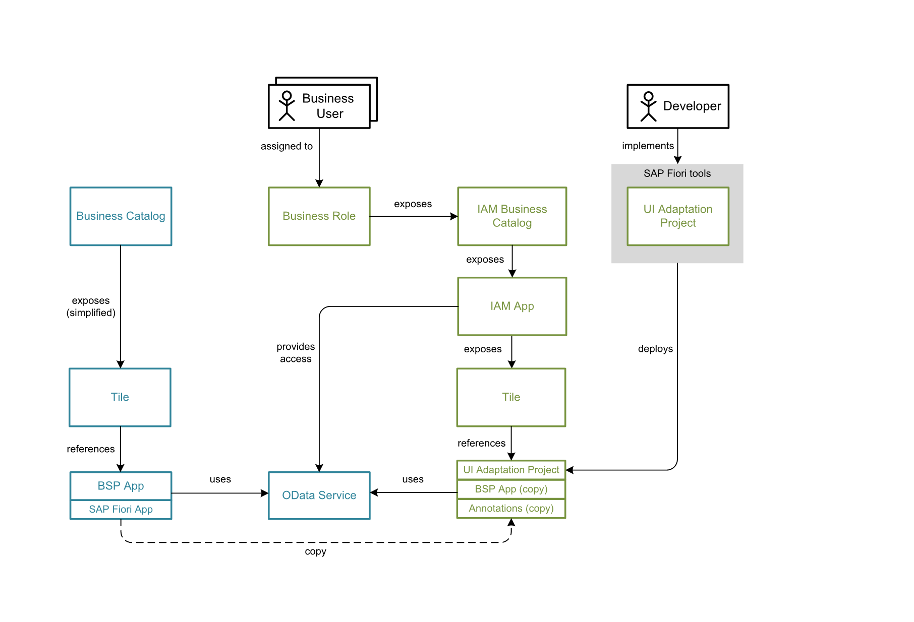

**Use case**

Let’s imagine you’ve received feedback from a group of Credit Controllers at your company who occasionally work with the SAP Fiori application **Manage Credit Accounts**: (https://fioriappslibrary.hana.ondemand.com/sap/fix/externalViewer/#/detail/Apps('F4596')/S31). You’ve been informed that the standard application does not fully support their needs. By creating an application variant, as opposed to developing a new custom application from scratch, you can efficiently make the changes for this group of Credit Controllers, while other Credit Controllers at your company can continue to use the original application.  

The Manage Credit Accounts application is based on the [List Report Object Page](https://help.sap.com/docs/SAP_FIORI_tools/17d50220bcd848aa854c9c182d65b699/2b2b12e708944d85a40d087194cc1edd.html) floorplan. You will simplify the user experience for this specific group of *Credit Controllers* by: 

List Report: 

- Providing them with a Clear button in the filter bar 
- Enabling them to use variant management in the table 
- Changing the table type from a Responsive Table to a Grid Table using the condensed table layout

    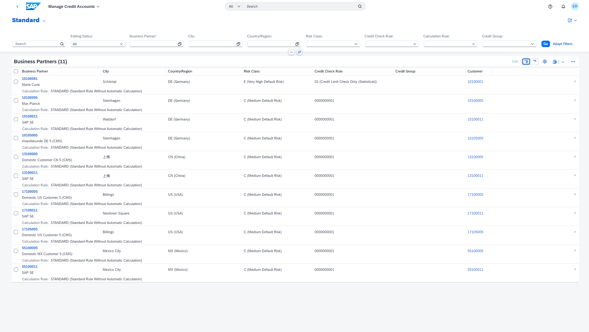  

Object Page:

- Removing the header facets they don’t need
- Removing the sections they don’t need

    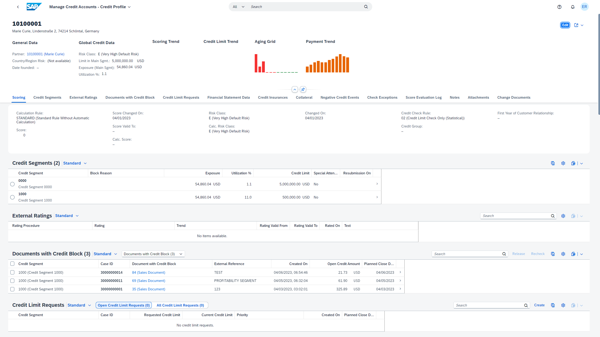  

If you want to view the original Manage Credit Accounts application in My Home in SAP S/4HANA Cloud Public Edition, you must first log onto your ABAP system as an Administrator, open the *Maintain Business Roles* application, create a business role from the role template *SAP_BR_CREDIT_CONTROLLER* and assign the business role to your user (for more information, see [How to Create a Business Role from a Template](https://help.sap.com/docs/SAP_S4HANA_CLOUD/a630d57fc5004c6383e7a81efee7a8bb/ec310a8b669a45ca898dc4dd91d97de2.html?state=DRAFT&profile=20086626)).  

Watch this short video to see what changes you’ll make once you complete the three developer tutorials:

<iframe width="560" height="315" src="https://sapvideo.cfapps.eu10-004.hana.ondemand.com/?entry_id=1_5r7r5h0n" frameborder="0" allowfullscreen></iframe>

### Create an application variant by SAPUI5 Adaptation Project in SAP Business Application Studio

1. Log onto SAP Business Application Studio (BAS) and access your SAP Fiori development space.
2. Choose *New Project from Template* (which can be selected from either the *File* menu, or which is available directly on the *Get Started* screen), select the *SAPUI5 Adaptation Project* template, and choose the *Start* button. 

    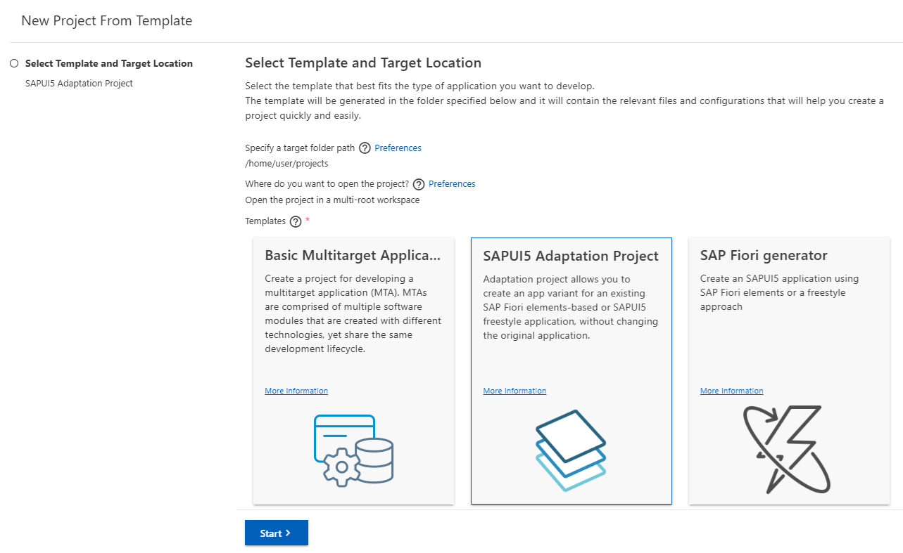

3. On the *System and Application Selection* screen, select from the `System` dropdown list the SAP S/4HANA Cloud system you want to use.
    - Ensure that *Project Type: cloudReady* is shown. (Select for this tutorial another system / a cloud system if *Project Type: onPremise* should be shown.)
4. From the dropdown list in the *Application* field, choose the SAP Fiori application that you wish to use as the basis for your application variant. Choose `F4596 Manage Credit Accounts`.
5. Press the `Next` button.
6. On the *Project Attributes* screen, enter the basic information required for your adaptation project:
    - Project Name: uniquely identifiable name `creditaccounts.appvar.<your initials>`, e.g. creditaccounts.appvar.cl1.  
    - Application Title: uniquely identifiable name `<Manage Credit Accounts Simplified><your initials>`.
    - Add Deployment Configuration: Yes
    - Add SAP Fiori Launchpad Configuration: Yes
7. Press the `Next` button.
8. Configure the *Deployment Configuration* settings.

    - Enter a unique *SAPUI5 ABAP Repository* name, for example, `ZMCA<your initials>`, e.g. `ZMCACL1`
    - Enter an optional deployment description.
    - Choose `Enter Manually` for the field *Select How You Want to Enter the Package*.
    - Enter the name of the package in the *Package* field (created under prerequisites [Create ABAP Package](https://help.sap.com/viewer/5371047f1273405bb46725a417f95433/Cloud/en-US/d33ab697df394140874519c8c066ea82.html)).
    - Choose `Enter Manually` for the field *Select How You Want to Enter the Transport Request*.
    - Enter the name of your transport request in the *Transport Request* field (created under prerequisites [Create a transport request](https://help.sap.com/docs/SAP_S4HANA_CLOUD/25cf71e63940453397a32dc2b7676947/4ec223686e391014adc9fffe4e204223.html)).

9. Press the `Next` button.
10. Configure the *SAP Fiori Launchpad Configuration – Tile Settings* settings.
    - Choose `Add a New Tile` for the field *Choose a Tile Handling Action*.
    - Choose `Yes` for the field *Copy Configuration from an Existing Inbound*.
11. Press the `Next` button.
12. Configure the *SAP Fiori Launchpad* Configuration settings.
    - In the *Inbound ID* field, select the inbound ID from the dropdown list `BusinessPartner-manageCreditAccounts`.
    - In the *Semantic Object* field, enter the name of the semantic object of the original application `BusinessPartner`.
    - In the *Action* field, enter a unique new action `manageCreditAccountsAppVariant1`.
    - In the *Title* field, enter the title of your application variant of Manage Credit Accounts that is to be displayed on the new tile `<Manage Credit Accounts Simplified>`
    - In the *Subtitle* field (optional), you can enter the subtitle to be displayed on the new tile `Simplified`.
13. To create your new SAPUI5 Adaptation Project, press the *Finish* button.
14. As soon as your SAPUI5 Adaptation Project has been created, the *Application Information* page is displayed. You can view the adaptation project in your Projects folder and expand the nodes in your workspace.

**Context Infos for Next Steps: Define changes to your newly created application variant**

To make the changes requested for the specific group of *Credit Controllers*, you need to extend the source code of your application variant in SAP Business Application Studio.

In your workspace, navigate to the newly created SAPUI5 Adaptation Project under projects, right-click on the *manifest.appdescr_variant* file in your adaptation project and choose *Open Adaptation Editor*.

### Add a Clear button to the smart filter bar

>The *List Report Quick Actions* are available for common changes in an adaptation project, while more sophisticated changes might require control property changes. For the sake of completeness, we show in the **Control Property Change** tab how the Clear button could alternatively be enabled via a control property change.

[OPTION BEGIN [Quick Actions]]

1. In *UI Adaptation* mode, choose from the *List Report Page Quick Actions* the action *Enable “Clear” Button in Filter Bar*.  

    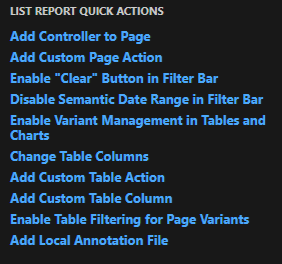

2. Press *Save*.

[OPTION END]

[OPTION BEGIN [Control Property Change]]

1. In *UI Adaptation* mode, select the *SmartFilterBar* area (displayed below the header area of the screen).
2. In the *SmartFilterBar* pane displayed on the right of the screen, scroll down to the *Show Clear On FB* field and change the setting from false to true.
3. Press *Save*.
4. In your project workspace, the *propertyChange* you have just made is listed in the webapp folder under changes.  

    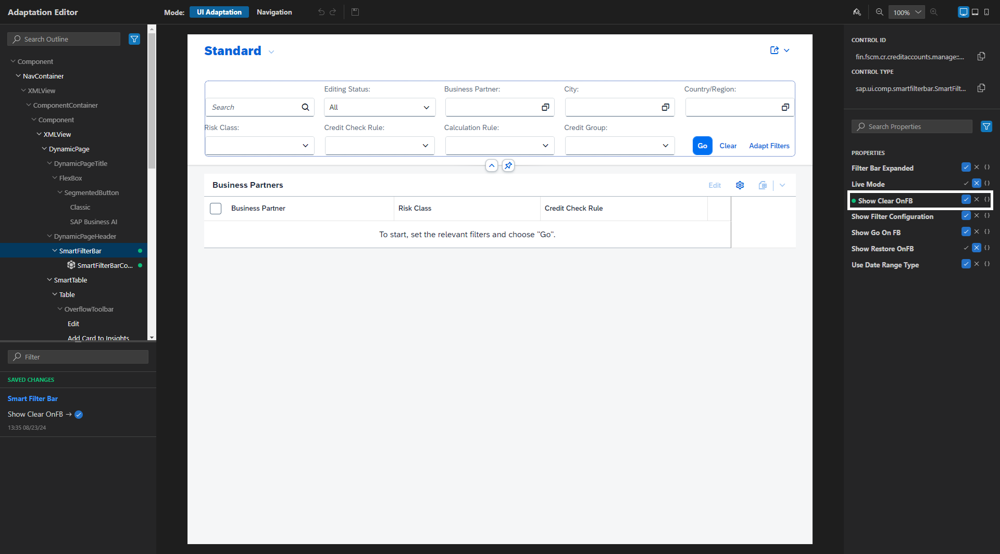

[OPTION END]

### Enable variant management for the table

>The *List Report Quick Actions* are available for common changes in an adaptation project, while more sophisticated changes might require manifest changes. For the sake of completeness, we show in the **Manifest Change** tab how the variant management could alternatively be enabled via a manifest change.

[OPTION BEGIN [Quick Actions]]

1. In *UI Adaptation* mode, choose from the *List Report Page Quick Actions* the action *Enable Variant Management in Tables and Charts*.  

    

2. Press *Save*.  

[OPTION END]

[OPTION BEGIN [Manifest Change]]

1. In *UI Adaptation* mode, select the complete List Report Page and choose *Configuration* from the context menu.  

    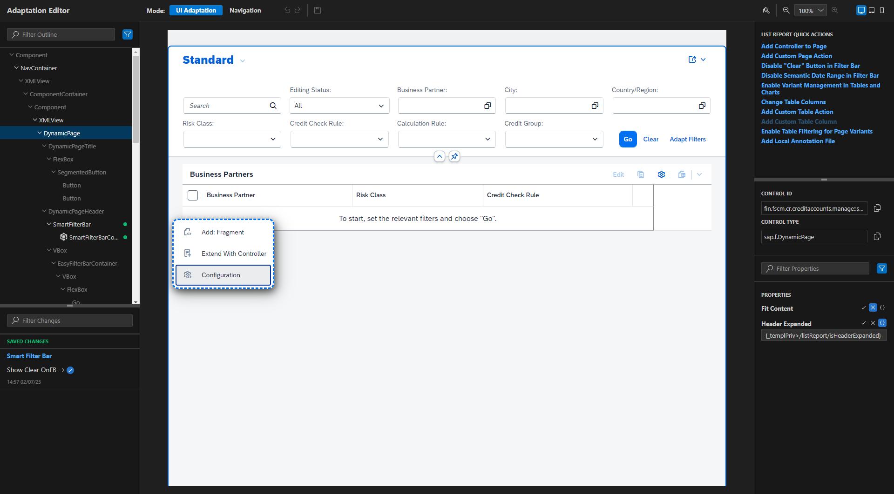
  
2. In the *Configure List Report* popup, select for *Variant Management* the value *Per Control* and choose *Apply*.  

    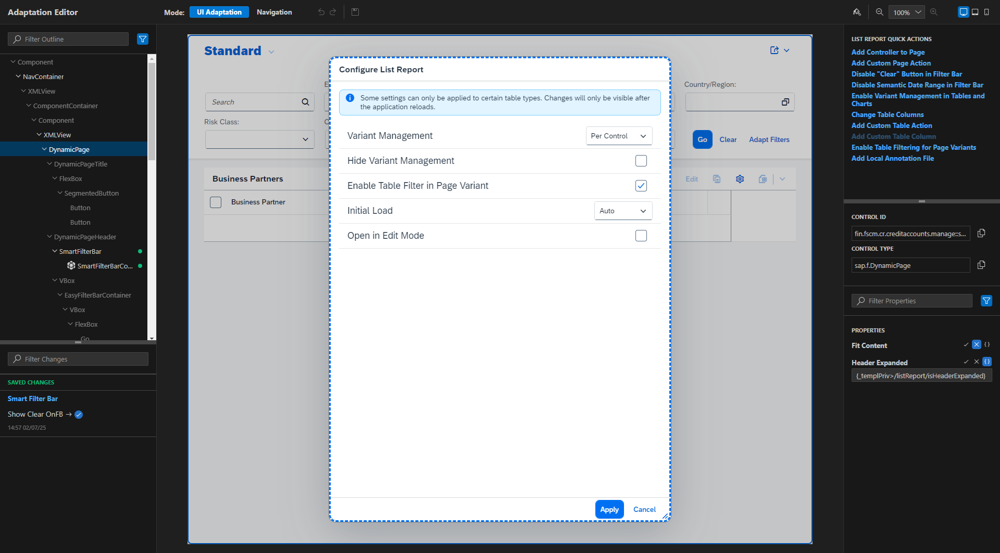

3. Press *Save*.

[OPTION END]

### Change table type from Responsive Table to Grid Table with condensed table layout

1. In *UI Adaptation* mode, select the Table and choose *Configuration* from the context menu.  

    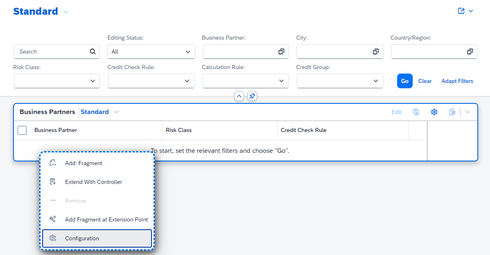

2. In the *Configure Table* popup, select for *Table Type* the value *Grid Table* and select the checkbox for *Condensed Table Layout*. Choose *Apply*.  

    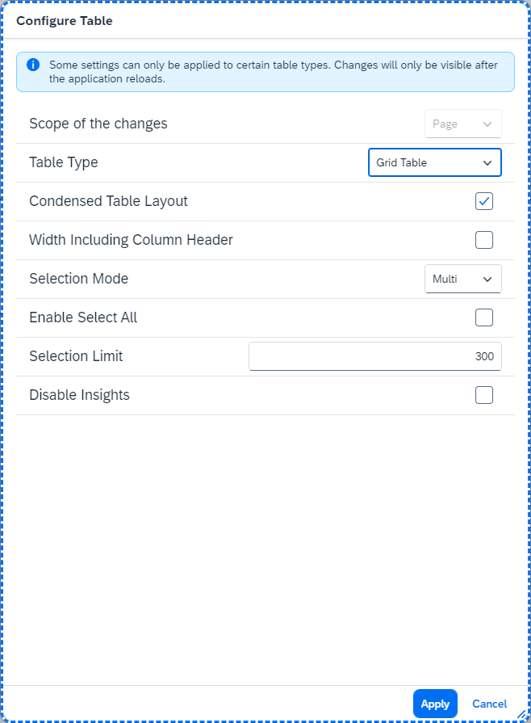

3. Press *Save*.

For more information, see [Extending Delivered Apps Manifest Using an Adaptation Project](https://ui5.sap.com/#/topic/a2b24a69baef4b91af2293ccc6b5871f)

### Remove header facets

1. Right-click the *webapp* folder and choose *Open Adaptation Editor* from the context menu to display the List Report in *UI Adaptation* mode.  Switch to the *Navigation* mode and press the Go button to display Business Partner data in the table.
2. Select a Business Partner in the table by pressing the chevron icon at the end of the row. By selecting a Business Partner, you can navigate from the List Report to the Object Page.
3. On the Object Page, switch to *UI Adaptation* mode. Select the header facet you want to remove, for example *Scoring Trend*.
4. To remove a header facet from the Object Page, select the entire facet (not just its title), open the context menu and select *Remove*.  

    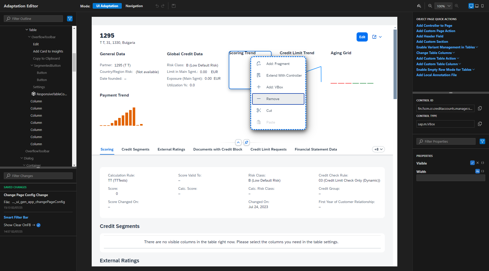

5. To remove further header facets from the Object Page, repeat this action for the following facets: *Credit Limit Trend*, *Aging Grid*, *Payment Trend*. The facets are removed immediately.
6. Press *Save*

### Remove sections

Working with the open Adaptation Editor in which you deleted the facets not required, you can now remove the tabulated sections by:

1. In *UI Adaptation* mode, select the entire tab you want to remove from your application variant (for example *External Ratings*). Afterwards open the context menu and select *Remove*.  

    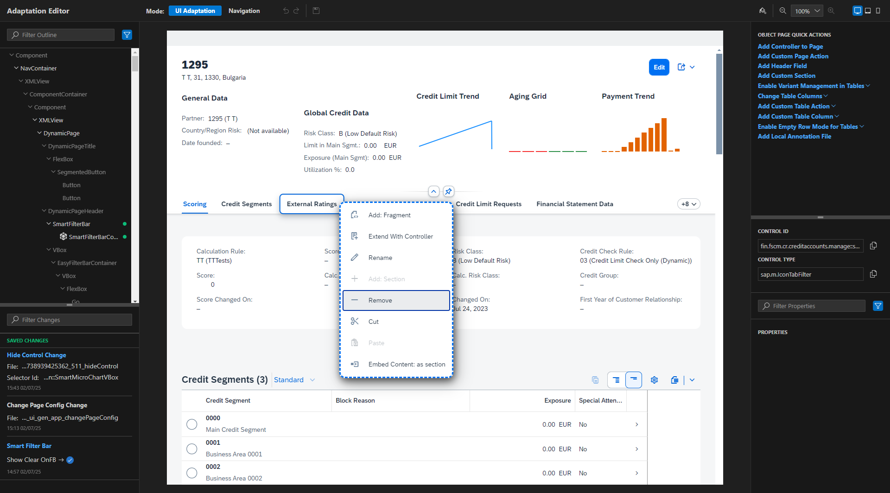

2. Remove the following additional sections: 
	- *Financial Statement Data*
	- *Collateral*
	- *Negative Credit Events*
	- *Check Exceptions*
	- *Score Evaluation Log*
	- *Notes*
	- *Attachments*
	- *Change Documents*
3. Change to *Navigation* mode and verify the changes you’ve made. The sections displayed are now limited to *Scoring*, *Credit Segments*, *Documents with Credit Block*, *Credit Limit Requests*, and *Credit Insurances*.
4. Press *Save*.

For more information, see 
	- [Adapt the UI](https://help.sap.com/docs/bas/584e0bcbfd4a4aff91c815cefa0bce2d/b2b3c68c7ee04a8a9efc147ae4cb3a5f.html?locale=en-US&state=PRODUCTION&version=Cloud)

To track all the changes you’ve made, see the *changes* folder in the project folder structure.  

After you’ve finished making the requested changes to your application variant, you can preview the changes made. To do this, expand the webapp folder in your SAP Business Application workspace and right-click on the *manifest.appdescr_variant* file. In the context menu, choose *Preview Application*.

[Preview the Adaptation Project](https://help.sap.com/docs/bas/584e0bcbfd4a4aff91c815cefa0bce2d/a8038817f4ee43508f8c5fab254783b8.html?locale=en-US&state=PRODUCTION&version=Cloud)

The List Report of our newly created application variant:

   - Provides a Clear button in the filter bar 
   - Enables use of variant management in the table 
   - Uses Grid Table with condensed table layout

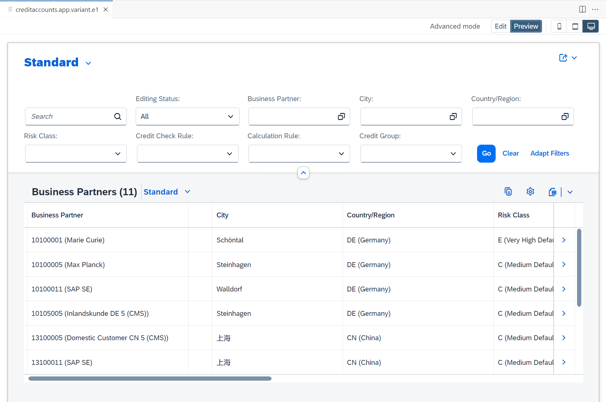

The Object Page of our newly created application variant: 

   - No longer displays unnecessary facets in the header 
   - No longer displays the superfluous sections

### Summary

In this developer tutorial, you have learned what SAPUI5 adaptation projects are and how to work with them.  

You have:

1. Created an SAPUI5 Adaptation Project in SAP Business Application Studio to generate a variant of an SAP Fiori application.  
2. Used the Adaptation Editor to define simple and effective changes to your application variant. 
3. Added simple source code to the Manifest file to change the table properties.

**Test your knowledge**

### Follow-up actions

After completing this tutorial, you can continue the end-to-end process with: 

- Tutorial 2: [Work with SAPUI5 Adaptation Projects to extend the source code of an application variant to be deployed to SAP S/4HANA Cloud Public Edition](sapui5-adaptation-extend-variant)

- Tutorial 3: [Make Your Application Variant (created in an SAPUI5 Adaptation Project) Available to Business Users in SAP S/4HANA Cloud Public Edition](sapui5-adaptation-application-publish)

