# Work with SAPUI5 Adaptation Projects to extend the source code of an application variant to be deployed to SAP S/4HANA Cloud Public Edition (2 of 3)
<!-- description --> You will learn how to work with SAPUI5 Adaptation Projects to extend a standard SAP Fiori application by adding custom UI elements and controller logic to an application variant in SAP S/4HANA Cloud Public Edition.


## You will learn
- How to extend the source code of your application variant.
- How to add a new section.  
- How to visualize Payment Trends as a simple chart.   


## Prerequisites
You must first have completed all the steps in [Work with SAPUI5 Adaptation Projects to Generate and Make Simple Changes to an Application Variant](sapui5-adaptation-change-variant).

## Intro
**Important information**

This group of three tutorials focuses on SAPUI5 Adaptation Projects in SAP S/4HANA Cloud Public Edition. The same basic principles and features of SAPUI5 Adaptation Projects similarly apply to SAP S/4HANA and SAP S/4HANA Cloud Private Edition. While the first and second tutorials also largely apply to SAP S/4HANA and SAP S/4HANA Cloud Private Edition, the third tutorial applies specifically to SAP S/4HANA Cloud Public Edition.

To learn more about SAPUI5 Adaptation Projects in SAP S/4HANA, please see the SAP Help Portal:

 - [Extending an SAP Fiori Application for an On-Premise System](https://help.sap.com/docs/bas/developing-sap-fiori-app-in-sap-business-application-studio/adaptation-project-for-on-premise-system)
 - [Working with an Adaptation Project](https://help.sap.com/docs/bas/developing-sap-fiori-app-in-sap-business-application-studio/working-with-adaptation-project)

Please note: the documentation is also valid for SAP S/4HANA Cloud Private Edition.

**When to extend**

SAP S/4HANA Cloud Public Edition delivers the latest industry best practices, innovations, and business applications to you as a service. If a standard SAP Fiori application doesn’t fully support your business process or the specific needs of some of your business users, you can extend SAP S/4HANA Cloud Public Edition by creating and adapting an application variant, while the original SAP Fiori application remains available and unchanged.  In an application variant, you can extend the original code to define changes that fulfill the specific business requirements of different business roles, user groups, organizational units, and countries. For example, you might want to create an application variant to simplify and streamline a specific process by hiding fields not required by casual users, visualizing data as a chart, or changing a responsive table to a grid table to make information easier to process.  

**New for SAP S/4HANA Cloud Public Edition 2402**

As of SAP S/4HANA Cloud Public Edition 2402, developers can work with SAPUI5 Adaptation Projects in [SAP Business Application Studio (BAS)](https://help.sap.com/docs/bas/developing-sap-fiori-app-in-sap-business-application-studio/extending-sap-fiori-application) to create application variants. Developers efficiently reuse the original SAP Fiori application together with its OData service and application logic to define changes that are specific to the application variant only.  

After deployment, both the source application and the newly created application variant exist with distinct titles and can be made available to the relevant business users through uniquely named application tiles in SAP Fiori launchpad: My Home. After a Cloud upgrade, developers can test the application variant in SAP Business Application Studio and, if there are no issues, they can deploy it again to benefit from the latest SAP enhancements to the original application (see [Check Whether the Base App of an Adaptation Project Is Up-To-Date](https://help.sap.com/docs/bas/584e0bcbfd4a4aff91c815cefa0bce2d/582d31d007be4c3bbda75f796ff1cebd.html?locale=en-US&state=PRODUCTION&version=Cloud)).

**Use case**

Let’s imagine you’ve received feedback from a group of Credit Controllers at your company who occasionally work with the SAP Fiori application **Manage Credit Accounts**: (https://fioriappslibrary.hana.ondemand.com/sap/fix/externalViewer/#/detail/Apps('F4596')/S31). You’ve been informed that the standard application does not fully support their needs. By creating an application variant, as opposed to developing a new custom application from scratch, you can efficiently make the changes for this group of Credit Controllers, while other Credit Controllers at your company can continue to use the original application.  

The Manage Credit Accounts application is based on the [List Report Object Page](https://help.sap.com/docs/SAP_FIORI_tools/17d50220bcd848aa854c9c182d65b699/2b2b12e708944d85a40d087194cc1edd.html) floorplan. You will simplify the user experience for this specific group of *Credit Controllers* by: 

Object Page:

- Adding a new section for Payment Trends 
- Displaying payment trends in a chart 

### Access your SAPUI5 Adaptation Project

1. Log onto SAP Business Application Studio (BAS) and access your SAP Fiori development space. 
2. Expand the *Projects* folder and right-click on the adaptation project you created in Tutorial 1 and select *Open Adaptation Editor* from the context menu. 
3. The List Report of the Manage Credit Accounts application is displayed in *UI Adaptation* mode.  Switch to *Navigation* mode.
4. Choose the `Go` button to populate the table with data. 
5. Select a business partner by choosing the chevron button to navigate to the Object Page.

	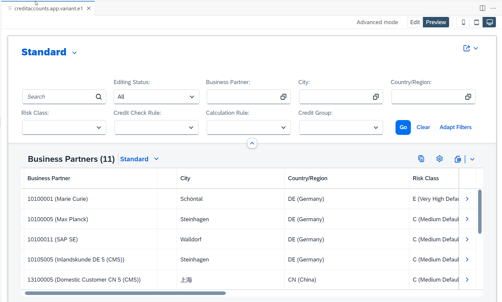

### Extend Object Page with Controller

Working with Adaptation Editor:

1. On the Object Page, switch from *Navigation* to *UI Adaptation* mode and select the entire Object Page. After you’ve selected the Object Page in its entirety, choose the `Extend With Controller` button from the visual context menu.

	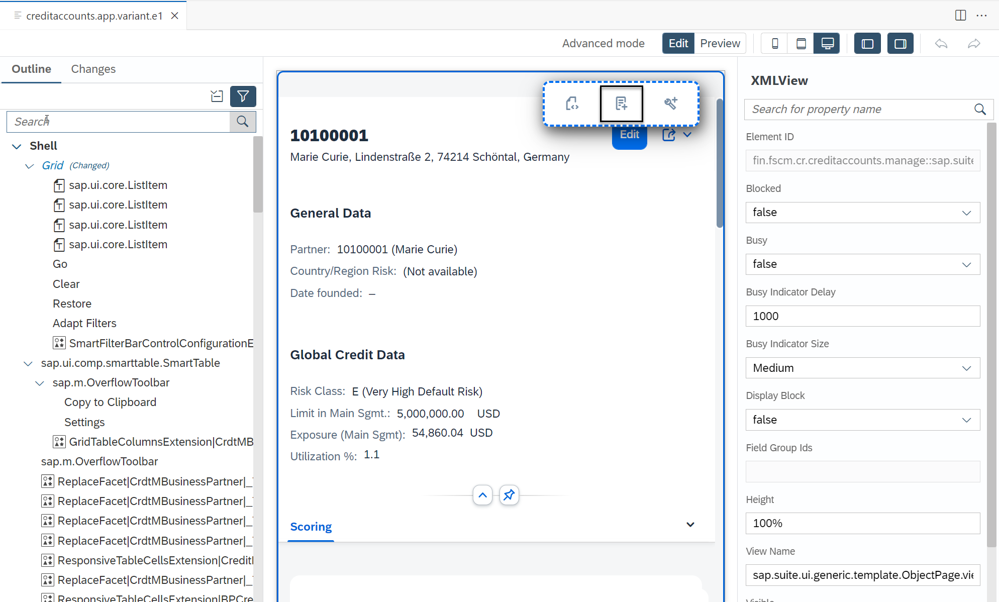


2. In the *Extend Controller* popup, enter a name in the *Controller Name* field (e.g. OPExtensionController) and choose *Extend*. 

	- A corresponding .js file is generated in your workspace in the webapp folder under changes --> coding --> *OPExtensionController.js*. This file opens automatically in the main window of SAP Business Application Studio.  

3. Before you edit the .js file generated in step 2, add a coding fragment to the Object Page layout. Select the *ObjectPageLayout* area (outlined in blue) and choose the `Add: Fragment` button from the visual context menu. (Tip: Click the left-hand border to select the Object Page.) 

	- You want to add a new section to the Object Page in which you can include a chart visualization of the Payment Trends. New sections are defined in the sections Aggregation of the ObjectPageLayout control, so you’re going to add a new XML coding fragment to this aggregation. 

	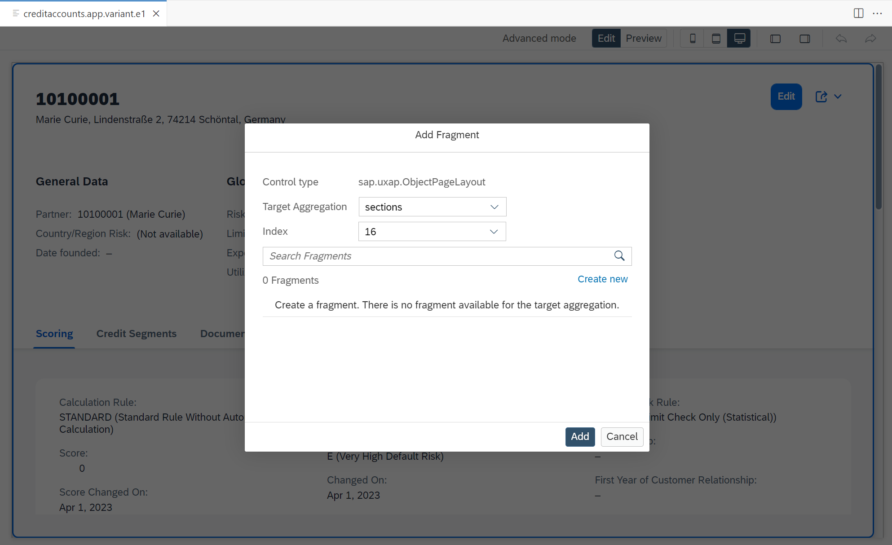

4. In the *Add Fragment* popup, you will see *Control type: sap.uxap.ObjectPageLayout, Target Aggregation: sections.* (This is only visible provided you’ve correctly selected the *ObjectPageLayout* area in which to add the fragment.)  

5. Select `Create New`.

6. In the *Add Fragment* popup, enter a name (e.g. extension_chart) and choose `Create`.  

	- A corresponding .xml file is generated in your workspace in the *webapp* folder under *changes --> fragments --> extension_chart.fragment.xml*. This file opens automatically in the main window of SAP Business Application Studio. 

7.  Press *Save*.

8. In the *extension_chart.fragment.xml* file generated in step 6, enter the following code: 

	```XML
	<core:FragmentDefinition xmlns:core="sap.ui.core" xmlns="sap.m" xmlns:objectPage="sap.uxap" 
		xmlns:viz="sap.viz.ui5.controls"
		xmlns:viz.feeds="sap.viz.ui5.controls.common.feeds"
		xmlns:viz.data="sap.viz.ui5.data">
		<objectPage:ObjectPageSection id="mysection" title="{i18n>EXTENSION_SECTION1_TITLE}" titleUppercase="false">
			<objectPage:ObjectPageSubSection id="mysubsection" title="{i18n>EXTENSION_SECTION1_TITLE}">
				<viz:VizFrame id="AdlChartID" uiConfig="{applicationSet:'fiori'}" vizType='column' vizProperties="{ title: {visible: false}, 
									valueAxis: {title: {visible: 'true'}, 
									label: {}}, 
									categoryAxis: {title: {visible: true}}, 
									plotArea: {dataLabel: {visible: true}}, 
									legend: {visible: true}, general:{groupData: false} }" width="100%">
					<viz:dataset>
						<viz.data:FlattenedDataset id="flattened1" data="{json>/AdlAdpItems}">
							<viz.data:dimensions>
								<viz.data:DimensionDefinition id="Date" name="Rolling12Months" value="{json>AgingPeriod}"/>
							</viz.data:dimensions>
							<viz.data:measures>
								<viz.data:MeasureDefinition id="ADL" name="AverageDaysLate" value="{json>AverageDaysLate}"  />
								<viz.data:MeasureDefinition id="ADP" name="AverageDaysToPayment" value="{json>AverageDaysToPayment}"  />
							</viz.data:measures>
						</viz.data:FlattenedDataset>
					</viz:dataset>
					<viz:feeds>
						<viz.feeds:FeedItem id="ADLMeasure" uid="valueAxis" type="Measure" values="AverageDaysLate,AverageDaysToPayment" />
						<viz.feeds:FeedItem id="DateDimension" uid="categoryAxis" type="Dimension" values="Rolling12Months" />
					</viz:feeds>
				</viz:VizFrame>
			</objectPage:ObjectPageSubSection> 
		</objectPage:ObjectPageSection>
	</core:FragmentDefinition>
	```

	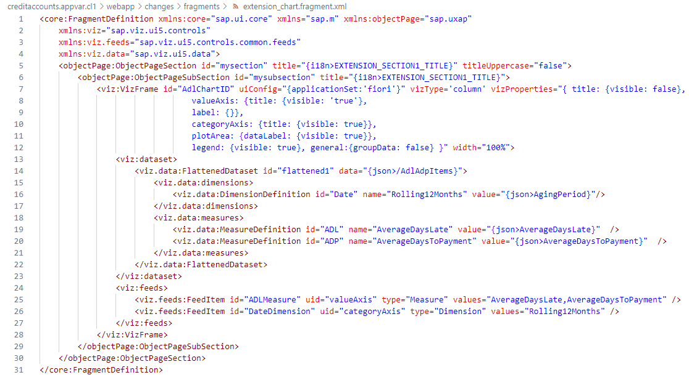

9. In the *OPExtensionController.js* file generated in step 2, enter the following code: 
	- Hint: `<your initials>` needs to be replaced by the initials chosen for your project name. E.g., if the project name is creditaccounts.appvar.cl1 then you need to replace `<your initials>` with *cl1*.

	```JavaScript
	/***
	@controller Name:sap.suite.ui.generic.template.ObjectPage.view.Details,
	*@viewId:fin.fscm.cr.creditaccounts.manage::sap.suite.ui.generic.template.ObjectPage.view.Details::CrdtMBusinessPartner
	*/
	/*!
	* OpenUI5
	* (c) Copyright 2009-2023 SAP SE or an SAP affiliate company.
	* Licensed under the Apache License, Version 2.0 - see LICENSE.txt.
	*/

	sap.ui.define([
			'sap/ui/core/mvc/ControllerExtension',
			'sap/ui/model/json/JSONModel',
			'customer/creditaccounts/appvar/<your initials>/changes/coding/utils/FunctionCallExecutor',
			'customer/creditaccounts/appvar/<your initials>/changes/coding/utils/ModelGenerator'
		],
		function (
			ControllerExtension,
			JSONModel,
			FunctionCallExecutor,
			ModelGenerator
		) {
			"use strict";
			return ControllerExtension.extend("customer.creditaccounts.appvar.<your initials>.OPExtensionController", {
				_pageDataLoaded: function() {
					const _sUrl = this.getView().getBindingContext().getPath() + "/to_CrdtMAcctPaytBehaviorTrend";
					FunctionCallExecutor.getChartData(this, _sUrl)
					.then(
						function (oRes) {
							const oChartModel = ModelGenerator.generateDataModelForAdlChart(
								oRes
							);		
							const oModel = new JSONModel(oChartModel);
							const oExtension_chart = this.getView().byId(
								"customer.creditaccounts.appvar.<your initials>.mysection"
							);
							oExtension_chart.setModel(oModel, "json");
							const maxADPADL = FunctionCallExecutor.getMax(
								oModel.getData().AdlAdpItems
							);
							const oChart = this.getView().byId(
								"customer.creditaccounts.appvar.<your initials>.AdlChartID"
							);
							oChart.setVizProperties({
								valueAxis: { title: { text: this.getView().getModel("i18n").getResourceBundle().getText("AVERAGE_DAYS") } },
								categoryAxis: { title: { text: this.getView().getModel("i18n").getResourceBundle().getText("ROLLING_12_MONTHS") } },
								plotArea: {
									primaryScale: {
										fixedRange: true,
										maxValue: maxADPADL,
									},
									dataLabel: {
										renderer: function (oLabel) {
											if (oLabel.val === 9999) {
												oLabel.text = "";
											}
										},
										visible: true,
									},
									dataPointStyle: {
										rules: [
											{
												dataContext: {
													"AverageDaysLate": "*",
												},
												properties: {
													color: "sapUiChartPaletteQualitativeHue2",
												},
												displayName: this.getView().getModel("i18n").getResourceBundle().getText("MEASURE1"),
											},
											{
												dataContext: {
													"AverageDaysToPayment": "*",
												},
												properties: {
													color: "sapUiChartPaletteQualitativeHue1",
												},
												displayName: this.getView().getModel("i18n").getResourceBundle().getText("MEASURE2"),
											},
											{
												dataContext: [
													{
														"AverageDaysLate": { min: 9999, max: 9999 },
													},
													{
														"AverageDaysToPayment": {
															min: 9999,
															max: 9999,
														},
													},
												],
												properties: {
													color: "sapUiChartPaletteSemanticNeutralLight3",
												},
												displayName: this.getView().getModel("i18n").getResourceBundle().getText("NO_DATA"),
											},
										],
									},
								},
							});												
						}.bind(this)
					);
				},
				override: {
					onInit: function() {
						const oExtensionAPI = this.base.templateBaseExtension.getExtensionAPI();
						oExtensionAPI.attachPageDataLoaded(
							this._pageDataLoaded.bind(this)
						);
					}
				}
			});
		});
	```

	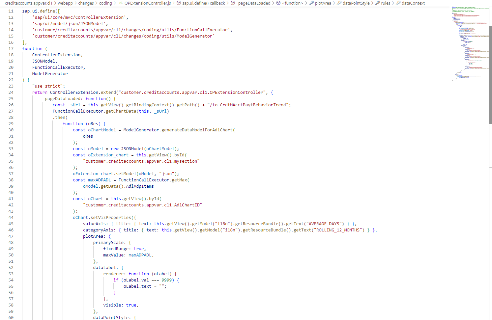

### Maintain i18n properties for the payment trend chart

To ensure that the texts for the payment trend chart are displayed properly, you must provide the following texts in your workspace, under *webapp --> i18n --> ObjectPage --> CrdtMBusinessPartner --> i18n.properties*:

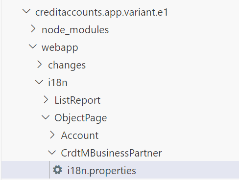

I18n:

```
#Make sure you provide a unique prefix to the newly added keys in this file, to avoid overriding of SAP Fiori application keys.

#XTIT
EXTENSION_SECTION1_TITLE=Payment Trend

#XTIT
FEED_ITEM1=Average Days Late,Average Days To Payment

#XTIT
FEED_ITEM2=Rolling 12 Months

#XTIT
DIMENSION1=Rolling 12 Months

#XTIT
MEASURE1=Average Days Late

#XTIT
MEASURE2=Average Days To Payment

#XTIT
AVERAGE_DAYS=Average Days 

#XTIT
ROLLING_12_MONTHS=Rolling 12 Months

#XTIT
NO_DATA=No Data
```

### Create utils folder for function call and model generator

1. In your workspace, under *webapp --> changes --> coding*, you need to create a *utils* subfolder with a *FunctionCallExecutor.js* file and a *ModelGenerator.js* file. To create the new folder, right-click the *coding* folder and select `New Folder` and enter the name *utils*.  

2. In your newly created *utils* folder, you need to create two new .js files *FunctionCallExecutor.js* and *ModelGenerator.js*. To do this, right-click the *utils* folder and select `New File` and type in the name *FunctionCallExecutor.js* and repeat the same for *ModelGenerator.js*.

	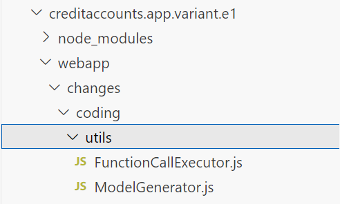

3. In the FunctionCallExecutor.js file, insert the following code:

	```JavaScript
	sap.ui.define([], function () {
			return {

				getChartData: function (oController, sURL) {
					const _oModel = oController.getView().getModel();
					return new Promise(function (resolve, reject) {
						_oModel.read(sURL, {
							urlParameters: {
								$top: 100,
								$skip: 0,
							},
							success: function (oResponse) {
								resolve(oResponse);
							},
						});
					});
				},
		
				getMax: function (aData) {
					const aRelevant = [];
					let iMaxrounded;

					aData.forEach(data => {
						if (data.AverageDaysToPayment != 9999) {
							aRelevant.push(data.AverageDaysToPayment);
						}
						if (data.AverageDaysLate != 9999) {
							aRelevant.push(data.AverageDaysLate);
						}
					});
					const iMax = Math.max(...aRelevant);
					if (!(iMax > 0)) {
						iMaxrounded = 0;
					} else if (iMax > 100) {
						iMaxrounded = Math.ceil(iMax / 100) * 100;
					} else if (iMax < 100) {
						iMaxrounded = Math.ceil(iMax / 10) * 10;
					}
					return iMaxrounded;
				}
			};
		});
	```

	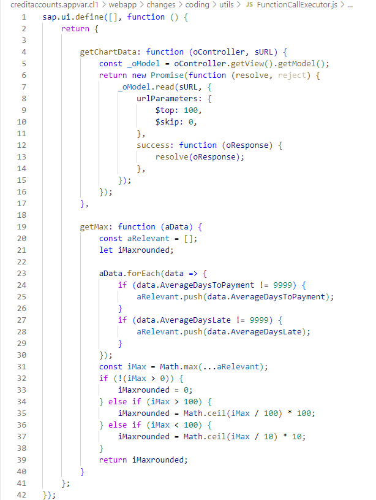

4. In the ModelGenerator.js file, insert the following code:

	```JavaScript
	sap.ui.define([], function () {
		return {

			generateDataModelForAdlChart: function (oResponse) {
				const _oData = oResponse.results;
				let oResult = {},
					aResult = [],
					sADL = "",
					sADP = "",
					sPeriod = "",
					sPeriodConcatenated = "",
					sYear = "",
					sMonth = "";

				_oData.forEach(data => {
					sADL = data.AverageDaysLate;
					sADP = data.AverageDaysToPayment;
					sPeriod = data.AgingPeriod;
					sYear = sPeriod.substring(0, 4);
					sMonth = sPeriod.substring(4, 6);
					if (sPeriod !== "") {
						sPeriodConcatenated = [sYear, sMonth].join("/");
					}
					if (data.AverageDaysLateIsNotAvailable === true) {
						sADL = 9999;
					}
					if (data.AvgDaysToPaymentIsNotAvailable === true) {
						sADP = 9999;
					}
					oResult = data;
					oResult.AverageDaysLate = sADL;
					oResult.AverageDaysToPayment = sADP;
					oResult.AgingPeriod = sPeriodConcatenated;
					aResult.push(oResult);
				});
				return {
					AdlAdpItems: aResult,
				};
			}
			
		};
	});
	```

	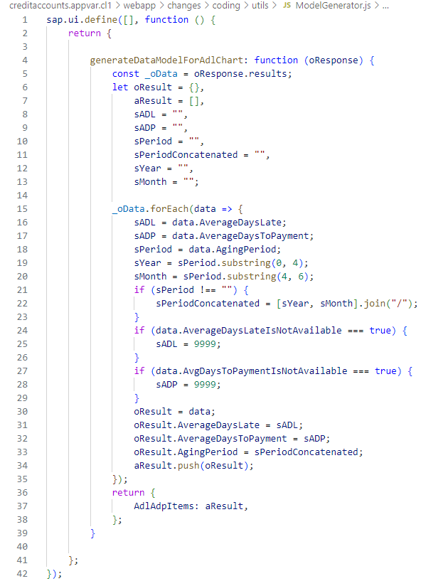

### Access overview of changes made

For an overview of all the coding changes you’ve made, see the *project folder* structure for your application variant, under *changes --> coding*.

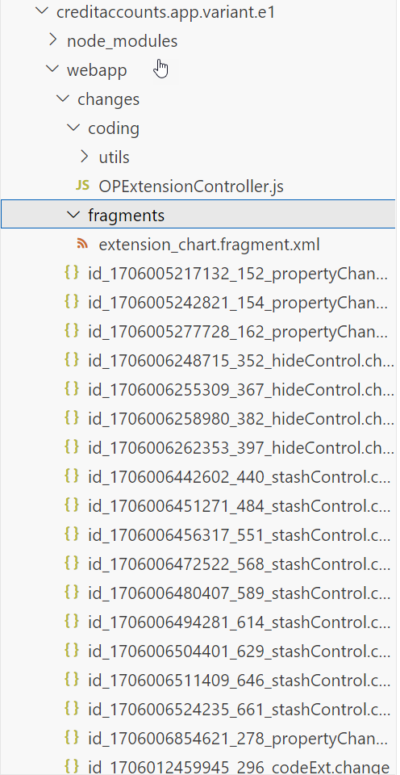

For more information, see 

- [Add Fragments to an Aggregation or Extension Point](https://help.sap.com/docs/bas/584e0bcbfd4a4aff91c815cefa0bce2d/df38deff69b9463db5a38b194991d5ee.html?locale=en-US&state=PRODUCTION&version=Cloud)
- [Controller Extensions](https://help.sap.com/docs/bas/584e0bcbfd4a4aff91c815cefa0bce2d/00befed00a4a485786175dec2e1f37bf.html?locale=en-US&state=PRODUCTION&version=Cloud)
- [Upgrade Safe Compatibility Rules](https://help.sap.com/docs/bas/584e0bcbfd4a4aff91c815cefa0bce2d/112713546f6d44ceac7339baae4c58b1.html?locale=en-US&state=PRODUCTION&version=Cloud)
- [Internationalization](https://help.sap.com/docs/bas/584e0bcbfd4a4aff91c815cefa0bce2d/45e17b0290f846c1aec2be737cddaa3f.html?locale=en-US&state=PRODUCTION&version=Cloud)

 
After you’ve finished making the requested changes to your application variant, you can preview the changes made. To do this, expand the *webapp* folder in your SAP Business Application workspace and right-click on the *manifest.appdescr_variant* file. In the context menu, choose *Preview Application*. 

[Preview the Adaptation Project](https://help.sap.com/docs/bas/584e0bcbfd4a4aff91c815cefa0bce2d/a8038817f4ee43508f8c5fab254783b8.html?locale=en-US&state=PRODUCTION&version=Cloud)

The Object Page of our newly created application variant: 

- Includes new section

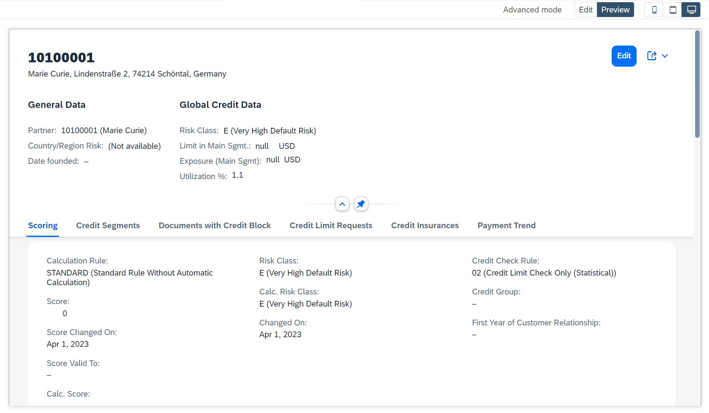

- Displays payment trends in a chart

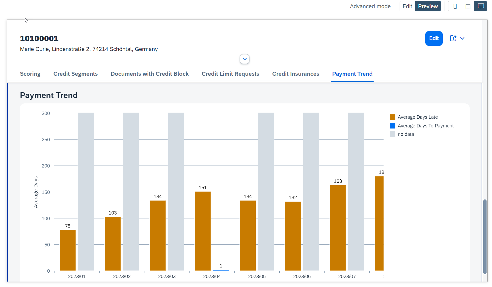

### Summary

In this developer tutorial, you have learned: 

1. How to extend the source code of your application variant. 
2. How to add a new section. 
3. How to visualize Payment Trends as a simple chart. 

**Test your knowledge**

### Follow-up actions

After completing this tutorial, you can learn more about the end-to-end process with:

- Tutorial 3: [Make Your Application Variant (created in an SAPUI5 Adaptation Project) Available to Business Users in SAP S/4HANA Cloud Public Edition](sapui5-adaptation-application-publish)

**Additional information**

You can define additional changes in application variants (not covered in this blog):

- Add local annotation files to overwrite annotations of the original SAP Fiori application. 

See [Adding local annotation files](https://help.sap.com/docs/bas/584e0bcbfd4a4aff91c815cefa0bce2d/3de3fb139d7a4550ac37b5cd220de414.html?locale=en-US&state=PRODUCTION&version=Cloud).

- Extend the RAP-based OData service of the original SAP Fiori application. By extending the original OData service additional changes are possible (for example, define new actions, visualize additional data, change input help, change check logic).

See [Extend](https://help.sap.com/docs/abap-cloud/abap-rap/extend?state=DRAFT%3Fversion%3Dsap_btp).

**Supported applications**

To determine if a specific application can be extended by UI Adaptation Project, see [SAP Fiori Apps Reference Library (ondemand.com)](https://fioriappslibrary.hana.ondemand.com/sap/fix/externalViewer/#/homePage) and check the application’s implementation information under Extensibility (extensibility of the UI5 application in the front-end server).

If the SAP-delivered application you want to extend with an application variant is not yet supported, please submit a request here: [Influence Opportunity Homepage - Customer Influence (sap.com)](https://influence.sap.com/sap/ino/#/campaign/1177)

If you are a partner and want to ensure that customers can extend your partner-developed application by UI Adaptation Project, you must follow the steps as outlined in SAP Help Portal:

- [Releasing an SAP Fiori Application to Be Extensible in Adaptation Projects on SAP S/4HANA Cloud](https://help.sap.com/docs/bas/developing-sap-fiori-app-in-sap-business-application-studio/releasing-sap-fiori-application-to-be-extensible-in-adaptation-projects-on-sap-s-4hana-cloud)
  
- [Check Consistency of Release State](https://help.sap.com/docs/bas/584e0bcbfd4a4aff91c815cefa0bce2d/b1c6ca0cd0a045b6a87044993573ce60.html?locale=en-US&state=PRODUCTION&version=Cloud) 
