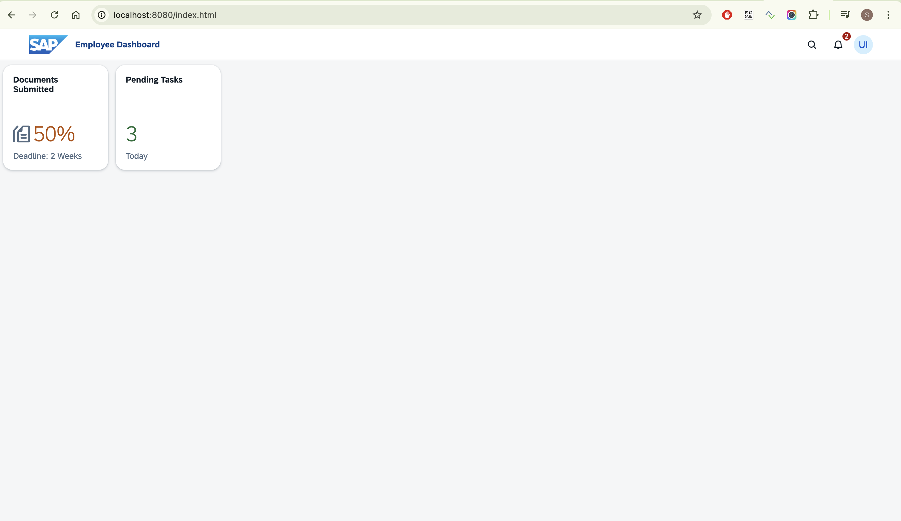

# Create a basic SAPUI5 Application with ui5/cli

<!-- description --> Start building a SAPUI5 App and use the new Application FrontEnd service to deploy changes to the UI5 Application

## Prerequisites

-   Install **Node.js (version ≥ 22.6.0)** on your machine

## You will learn

-   How to create a new SAPUI5 application with ui5 cli

---

### Initialize a nodejs project

1. Create a project folder with the name `sapui5-sample`
2. Add a `package.json` to the project folder
```json
{
    "name": "sapui5-sample",
    "version": "1.0.0",
    "description": "Sample SAPUI5 app",
    "private": true,
    "engines": {
        "node": ">=22.6.0",
        "npm": ">=10.8.2"
    },
    "scripts": {
        "start": "ui5 serve",
        "build": "ui5 build -a --clean-dest"
    }
}
```
3. Create a `webapp` folder inside your project folder.

### Install and use ui5 cli

1. Install the `ui5/cli` by executing the command from the project root folder and it will be added to the devDependencies of the package.json
```bash
    npm install --save-dev @ui5/cli
```
2. Initialize UI5 template with the following command which generates a `ui5.yaml` file
```bash
    ui5 init
```
3. Update `ui5.yaml` with the following code:
```yaml
specVersion: '4.0'
metadata:
    name: sapui5-sample
type: application
framework:
    name: SAPUI5
    version: '1.141.1'
```
> We created a minimal `ui5.yaml` file describing our UI5 project. The UI5 Tooling uses this file to configure the web server that the application will be hosted on.

### Create the view and index.html

1. Add a view `App.view.xml` inside `webapp/view` folder and paste the following code
```xml
<mvc:View controllerName="sap.ui.demo.tiles.controller.App"
xmlns:f="sap.f" xmlns:m="sap.m" xmlns:mvc="sap.ui.core.mvc">
    <f:ShellBar
        title="Employee Dashboard"
        homeIcon="https://ui5.sap.com/resources/sap/ui/documentation/sdk/images/logo_sap.png"
        showCopilot="false"
        showSearch="true"
        showNotifications="true"
        notificationsNumber="2">
        <f:profile>
            <m:Avatar initials="UI"/>
        </f:profile>
    </f:ShellBar>
    <m:GenericTile class="sapUiTinyMarginBegin sapUiTinyMarginTop tileLayout" header="Documents Submitted"
                    subheader="" press="onPress" >
        <m:TileContent footer="Deadline: 2 Weeks">
            <m:NumericContent value="50%" valueColor="Critical"  withMargin="false" icon="sap-icon://documents"/>
        </m:TileContent>
    </m:GenericTile>
    <m:GenericTile class="sapUiTinyMarginBegin sapUiTinyMarginTop tileLayout" header="Pending Tasks" press="press">
        <m:TileContent footer="Today">
            <m:NumericContent value="3" valueColor="Good" withMargin="false" />
        </m:TileContent>
    </m:GenericTile>
</mvc:View>
```
2. Add an `index.html` to the `webapp` folder amd paste the following code.
```html
<!DOCTYPE html>
<html>
    <head>
        <meta charset="utf-8" />
        <meta name="viewport" content="width=device-width, initial-scale=1.0" />
        <title>Employee DashBoard</title>
        <script
            id="sap-ui-bootstrap"
            src="/resources/sap-ui-core.js"
            data-sap-ui-libs="sap.m,sap.ui.core,sap.f"
            data-sap-ui-xx-waitForTheme="true"
            data-sap-ui-theme="sap_horizon"
            data-sap-ui-resourceRoots='{ "sap.ui.demo.tiles": "./" }'
            data-sap-ui-onInit="module:sap/ui/core/ComponentSupport"
            data-sap-ui-compatVersion="edge"
            data-sap-ui-async="true"
        ></script>
    </head>
    <body class="sapUiBody" id="content">
        <div
            data-sap-ui-component
            data-name="sap.ui.demo.tiles"
            data-id="container"
        ></div>
    </body>
</html>
```
> `index.html` serves as the entry point to the UI5 Application. The component will be started from the `index.html`. We used the `data-sap-ui-oninit` attribute in our bootstrapping in the `index.html` to specify that we want to initialize a UI5 Component. We also added a new HTML element (div) to our <body /> that holds the component.

### Implement the Component and Controller

1. Create a new component `Component.js` in the `webapp` folder and paste the following code.
```js
sap.ui.define(
    ['sap/ui/core/UIComponent', 'sap/ui/core/ComponentSupport'],
    UIComponent => {
        'use strict';
        return UIComponent.extend('sap.ui.demo.tiles.Component', {
            metadata: {
                manifest: 'json'
            }
        });
    }
);
```
> Our `index.html` is actively looking for a `Component.js` file in our UI5 app. This is an important naming convention, so don't change the name of this file. We have set up our component by initializing the UIComponent from the UI5 library. We extended it with some metadata, referencing the `manifest.json`, which we will create next.
2. Add a controller `App.controller.js` in the path `webapp/controller` and paste the following code into it:
```js
sap.ui.define(
    ['sap/ui/core/mvc/Controller', 'sap/m/MessageToast'],
    function (Controller, MessageToast) {
        'use strict';
        var PageController = Controller.extend(
            'sap.ui.demo.tiles.controller.App',
            {
                press: function (evt) {
                    MessageToast.show('The GenericTile is pressed.' + evt);
                }
            }
        );
        return PageController;
    }
);
```
> We imported the core Controller from the library, passed it to a function and extended it. To make the browser execute the JavaScript code in our controller file we have to reference it in our `webapp/view/App.view.xml` by specifying the name of the controller within the **controllerName** which we already did when we added the view. We defined a new press method to show a **Message Toast** when a user clicks on a tile.

### Add configurations to the Project

1. Create a `manifest.json` in the `webapp` folder and paste the following code.
```json
{
    "_version": "1.12.0",
    "sap.app": {
        "id": "sap.ui.demo.tiles",
        "type": "application"
    },
    "sap.ui5": {
        "rootView": {
            "viewName": "sap.ui.demo.tiles.view.App",
            "type": "XML",
            "async": true
        },
        "dependencies": {
            "minUI5Version": "1.75.0",
            "libs": {
                "sap.m": {},
                "sap.ui.core": {},
                "sap.f": {}
            }
        }
    }
}
```
> The `manifest.json` is our application descriptor file and holds **metadata** about our app.
2. Install additional libraries to the `ui5.yaml` by running the following command from the project root folder.
```bash
    ui5 add sap.ui.core sap.m sap.f themelib_sap_horizon
```
3. Upgrade to the latest SAPUI5 version by running the following command
```bash
    ui5 use sapui5@latest
```

### Run the Sample App locally

1. Install the dependencies from the project root folder.
```bash
    npm install
```
2. Start the server locally!
```bash
    ui5 serve -o index.html
```
3. A new SAPUI5 App with 2 tiles would be shown in a new window that opens and would like the the application shown in the image below.


