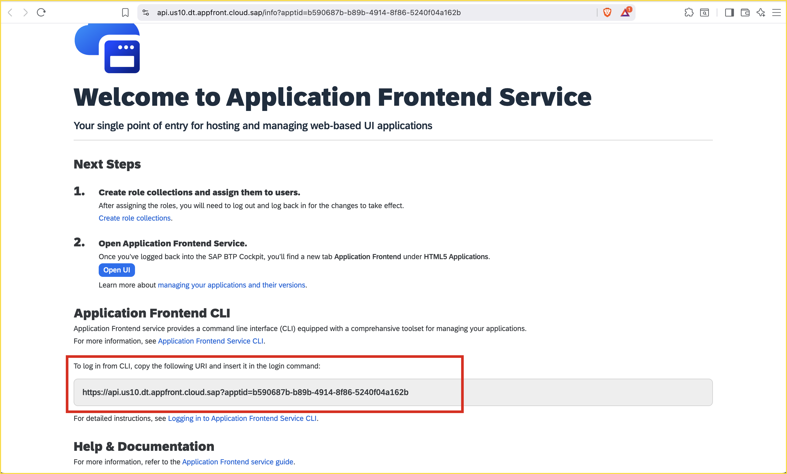

# Deploy the SAPUI5 App with Application FrontEnd Service

<!-- description --> Deploy an already created SAPUI5 App using the new application frontend service cli tool "afctl".

## Prerequisites

- Make sure the node version is atleast **22.6.0** and upgrade if necessary
- Install **afctl** globally, run `npm install -g @sap/appfront-cli`
- Install **cf cli** as per the instructions [here] (https://docs.cloudfoundry.org/cf-cli/install-go-cli.html)
- Install **Cloud MTA Build Tool** as per the instructions [here] (https://help.sap.com/docs/hana-cloud-database/sap-hana-cloud-sap-hana-database-developer-guide-for-cloud-foundry-multitarget-applications-sap-web-ide-full-stack/cloud-mta-build-tool-mbt#download-and-install-the-mta-build-tool)
- Completed the steps for Application FrontEnd service setup in BTP using the [Application frontend trial setup](application-frontend-trial-setup) guide.  
- Complete the [tutorial](sapui5-appfrontend-create) to have a SAPUI5 project to deploy

## You will learn

- How to deploy an UI5 application to the Application Frontend with terminal or VS Code Integrated Terminal.
- How to use **afctl** commands to deploy changes to an UI5 application

## Introduction

Application Frontend service lets you host and serve frontend applications. It serves as a single entry point for hosting web-based UI applications to extend SAP's business solutions. The service provides tools for deploying and managing applications, serving static resources, routing backend calls to defined targets, and observability tools.

---

### Prepare the UI5 Project for Application Frontend

1. Update the `manifest.json` in the `webapp` folder with the following code. 
```json
{
    "_version": "1.12.0",
    "sap.app": {
        "id": "sap.ui.demo.tiles",
        "applicationVersion": {
            "version": "1.0.0"
        }
    },
    "sap.ui5": {
        "rootView": {
            "viewName": "sap.ui.demo.tiles.view.App",
            "type": "XML",
            "async": true
        },
        "dependencies": {
            "minUI5Version": "1.75.0",
            "libs": {
                "sap.m": {},
                "sap.ui.core": {},
                "sap.f": {}
            }
        }
    }
}
```
> The version within **applicationVersion** will be reflected as the version of the deployed App.
2. Create an `xs-app.json` file in the project root folder and add the following code
```json
{
    "welcomeFile": "/index.html",
    "authenticationMethod": "route",
    "routes": [
        {
            "source": "^/resources/(.*)$",
            "target": "/resources/$1",
            "authenticationType": "none",
            "destination": "ui5"
        },
        {
            "source": "^/test-resources/(.*)$",
            "target": "/test-resources/$1",
            "authenticationType": "none",
            "destination": "ui5"
        },
        {
            "source": "^/logout-page.html$",
            "service": "app-front",
            "authenticationType": "none"
        },
        {
            "source": "^/index.html$",
            "service": "app-front",
            "cacheControl": "no-cache, no-store, must-revalidate"
        },
        {
            "source": "^(.*)$",
            "target": "$1",
            "service": "app-front"
        }
    ]
}
```
> This code is a routing configuration for a SAP UI5 application that sets /index.html as the welcome file and uses route-based authentication. It forwards requests for resources and test-resources to the ui5 destination without requiring authentication, serves /logout-page.html and /index.html from the app-front service, and routes all other requests to the app-front service.

### Prepare the UI5 Project for Deployment

Create a `mta.yaml` in the project root folder and add the following code.

```yaml
_schema-version: '3.2'
ID: sap.ui.demo.tiles
description: App FrontEnd Service Application
version: 1.0.0
modules:
    - name: sap.ui.demo.tiles-app-content
      type: com.sap.application.content
      path: .
      requires:
          - name: sap.ui.demo.tiles-app-front
            parameters:
                content-target: true
      parameters:
          config:
              destinations:
                  - name: ui5
                    url: https://ui5.sap.com
      build-parameters:
          build-result: resources
          requires:
              - artifacts:
                    - sap.ui.demo.tiles.zip
                name: sap.ui.demo.tiles
                target-path: resources/
    - name: sap.ui.demo.tiles
      type: html5
      path: .
      build-parameters:
          build-result: dist
          builder: custom
          commands:
              - npm install
              - npm run build:cf
          supported-platforms: []
resources:
    - name: sap.ui.demo.tiles-app-front
      type: org.cloudfoundry.managed-service
      parameters:
          service: app-front
          service-name: sap.ui.demo.tiles-app-front-service
          service-plan: developer
parameters:
    deploy_mode: html5-repo
    enable-parallel-deployments: true
```
> This YAML file defines the deployment configuration for a SAP UI5 application called sap.ui.demo.tiles. It specifies two modules: one for application content and one for the HTML5 app itself, including build commands and dependencies. It also defines a managed service resource for the app front-end, sets up a destination to the public UI5 library, and enables parallel deployments in HTML5 repository mode.

Update the `package.json` file in the project root folder with the following code.

```json
{
    "name": "sap.ui.demo.tiles",
    "version": "1.0.0",
    "description": "An SAP Fiori application.",
    "keywords": ["ui5", "openui5", "sapui5"],
    "main": "webapp/index.html",
    "dependencies": {},
    "devDependencies": {
        "@ui5/cli": "^4.0.16",
        "@sap/ux-ui5-tooling": "1",
        "@sap-ux/ui5-middleware-fe-mockserver": "2",
        "ui5-task-zipper": "^3.4.x",
        "rimraf": "^5.0.5",
        "mbt": "^1.2.29"
    },
    "scripts": {
        "start": "fiori run --open \"test/flp.html#app-preview\"",
        "start-local": "ui5 serve -o index.html",
        "build": "ui5 build --config=ui5.yaml --clean-dest --dest dist",
        "deploy": "fiori cfDeploy",
        "deploy-config": "fiori add deploy-config",
        "build:cf": "ui5 build preload --clean-dest --config ui5-deploy.yaml --include-task=generateCachebusterInfo",
        "build:mta": "rimraf resources mta_archives && mbt build",
        "undeploy": "cf undeploy sap.ui.demo.tiles --delete-services --delete-service-keys --delete-service-brokers"
    }
}
```

Create a `ui5-deploy.yaml` in the project root folder and update with the following code.

```yaml
specVersion: '4.0'
metadata:
    name: sap.ui.demo.tiles
type: application
resources:
    configuration:
        propertiesFileSourceEncoding: UTF-8
builder:
    resources:
        excludes:
            - /test/**
            - /localService/**
    customTasks:
        - name: ui5-task-zipper
          afterTask: generateCachebusterInfo
          configuration:
            archiveName: sap.ui.demo.tiles
            relativePaths: true
            additionalFiles:
                - xs-app.json

```
>This YAML file configures the UI5 build for the sap.ui.demo.tiles application. It sets metadata, specifies UTF-8 encoding for properties files, excludes test and localService folders from build resources, and defines a custom build task to create a ZIP archive (including xs-app.json) after generating cachebuster info.

Update the `ui5.yaml` in the project root folder and add the following code.

```yaml
specVersion: '4.0'
metadata:
    name: sap.ui.demo.tiles
type: application
framework:
    name: SAPUI5
    version: "1.141.3"
    libraries:
      - name: sap.f
      - name: sap.m
      - name: sap.ui.core
      - name: themelib_sap_horizon
server:
    customMiddleware:
        - name: fiori-tools-proxy
          afterMiddleware: compression
          configuration:
              ignoreCertErrors: false
              ui5:
                  path:
                      - /resources
                      - /test-resources
                  url: https://ui5.sap.com
              backend:
                  - path: /northwind
                    url: https://services.odata.org
        - name: fiori-tools-appreload
          afterMiddleware: compression
          configuration:
              port: 35729
              path: webapp
              delay: 300
        - name: fiori-tools-preview
          afterMiddleware: fiori-tools-appreload
          configuration:
              flp:
                  theme: sap_horizon
```
>This YAML file configures a SAPUI5 application named sap.ui.demo.tiles, specifying the SAPUI5 framework version and required libraries. It sets up custom server middleware for proxying UI5 and backend requests, enables app reload for development, and configures a Fiori Launchpad preview with the sap_horizon theme.

### Deploy the project using cf cli

Deployment of an app with application front end can be done with the `cf deploy` command. 

1. Login to cloud foundry and run the following commands one by one to deploy the initial App version. The **URL** can be obtained from the **BTP Cockpit > Sub Account > Overview** page under Cloud Foundry Environment section as API Endpoint URL.

```bash
cf login -a <URL>

mbt build

cf deploy mta_archives/<mtarfilename.war>
```

> The deployed application will be available in the **BTP Cockpit -> HTML5 -> Application Frontend** with the version `1.0.0`.

### Get the Application Frontend Service URL

You need the Application Frontend API server URI to log on and work with the Application Frontend service cli. 

1. Click on the Application Frontend service under Subscriptions to see the Welcome page. 
2. Copy the Application Frontend API server URI that is displayed on the welcome page.



### Deploy webapp folder changes using afctl

1. Make an update to the text within the title tag in the `index.html` within the webapp folder 
2. Login to your API endpoint using the following command
```bash
afctl login --sso -a <api_endpoint>
```
> For **api_endpoint**, enter your Application Frontend API server URI, which is displayed on the welcome page of Application Frontend service and obtained from the Step 3 above.
3. Update the **applicationVersion** to `1.0.1` in the **manifest.json**
4. Deploy the app by running the following commands
```bash
npm run build
afctl push dist
```
> The deployed application is available in the **BTP Cockpit -> HTML5 -> Application Frontend** with the version `1.0.1`. To deploy any further changes made to the files in the webapp folder, repeat the above `npm run build` command to re-create the dist folder and deploy the folder using `afctl push` command.
