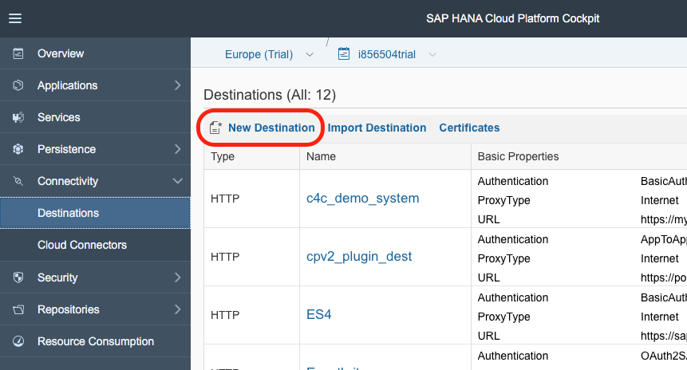
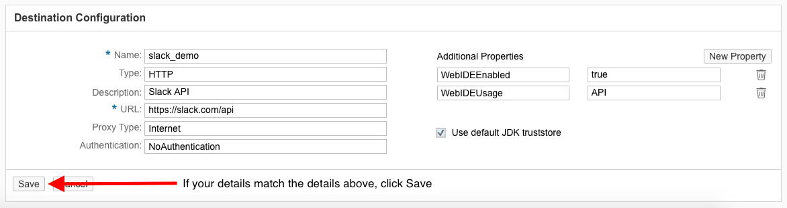
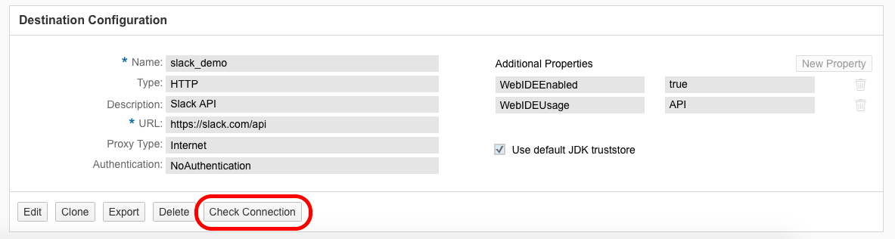
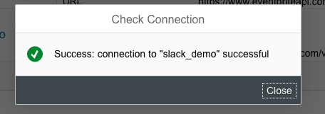

## Prerequisites  
 - **Proficiency:** Beginner
 - **Tutorials:** This is the first tutorial in this series.  

## Next Steps
 - Register your App with an External API

## Details
### You will learn  
Please note that while this is a beginner level tutorial, it is recommended that you start with another tutorial series for SAPUI5 for your first application. If you have built a UI5 application before, it will be beneficial in completing this tutorial series.

You will create a destination in your SAP Cloud Platform that will connect you to the external API for Slack. This will be used in a later tutorial to complete a REST call. If you do not have a Slack or do not wish to connect to the Slack API, you can modify this tutorial to adapt it for the external API you are attempting to connect to. See the Optional steps to learn how to modify your destination for other APIs and other API destination examples.

### Time to Complete
**10 Min**.

---

[ACCORDION-BEGIN [Step 1: ](Open SAP Cloud Platform)]
Go to your [SAP Cloud Platform Cockpit trial](https://account.hanatrial.ondemand.com/cockpit) instance and login.

[DONE]
[ACCORDION-END]

[ACCORDION-BEGIN [Step 2: ](Open the Destinations page)]
Open the **Destinations** page found under the Connectivity section on the left-side navigation.

[DONE]
[ACCORDION-END]

[ACCORDION-BEGIN [Step 3: ](Create a new destination)]
Select **New Destination**.

[DONE]
[ACCORDION-END]

[ACCORDION-BEGIN [Step 4: ](Enter new destination details)]
Enter the field values AND the **Additional Properties** below then click Save. Leave the **Use default JDK truststore** checked.

|Field Name|Value|
|----|----|
|Name | `slack_demo` |
|Type | `HTTP` |
|Description | `Slack API` |
|URL | `https://slack.com/api/` |
|Proxy Type | `Internet` |
|Authentication | `NoAuthentication` |

Add _two_ Additional Properties fields by clicking on the **New Property** button once for each property.

|Field Name|Value|
|----|----|
|`WebIDEEnabled` | `true` |
|`WebIDEUsage` | `API` |

**Save** your changes once all the details have been entered.

[DONE]
[ACCORDION-END]

[ACCORDION-BEGIN [Step 5: ](Verify your destination works)]

Check the connection to verify you set up the destination properly and that SAP Cloud Platform can reach the API. If your API is correctly configured, you should see a success message.

[DONE]
[ACCORDION-END]

### Optional
[ACCORDION-BEGIN [Step 6: ](Modify your destination for another API)]
You will always need to add at least 2 additional properties to your destination to enable the usage of the destination in Web IDE, which is the recommended development environment for SAPUI5 and available for free in HCP. Always add these properties under the **Additional Properties** section:

|Field Name|Value|
|----|----|
|`WebIDEEnabled` | `true` |
|`WebIDEUsage` | `API` |

To call a different API, you should change the Name field to reflect the API you are calling. Additionally, you _must_ update the URL field to reflect the URL of the API. If the API uses basic authentication, you can update the Authentication field to be Basic Authentication and provide your username and password. If the API uses OAuth, you must add the token as part of the request. You can see how this is done if you follow along with the rest of this tutorial series.

See some other examples below of destination details for other APIs.

**Other API Examples:**

`GoogleMaps`

|Field Name|Value|
|----|----|
|Name | `Facebook` |
|Type | `HTTP` |
|Description | `Facebook API` |
|URL | `https://graph.facebook.com/v2.8` |
|Proxy Type | `Internet` |
|Authentication | `NoAuthentication` |

> Note: When you check connection for the Facebook API, you should see a failure with a message of peer not authenticated. When used in Web IDE, an authorization header will be added which will allow you to successfully connect. In HCP, **ignore the failure for _this_ API**.

`Eventbrite`

|Field Name|Value|
|----|----|
|Name | `Eventbrite` |
|Type | `HTTP` |
|Description | `Eventbrite API` |
|URL | `https://www.eventbriteapi.com/v3` |
|Proxy Type | `Internet` |
|Authentication | `NoAuthentication` |

`OpenWeather`

|Field Name|Value|
|----|----|
|Name | `OpenWeather` |
|Type | `HTTP` |
|Description | `OpenWeather API` |
|URL | `http://api.openweathermap.org` |
|Proxy Type | `Internet` |
|Authentication | `NoAuthentication` |

[DONE]
[ACCORDION-END]

## Next Steps
 - Register your App with an External API
