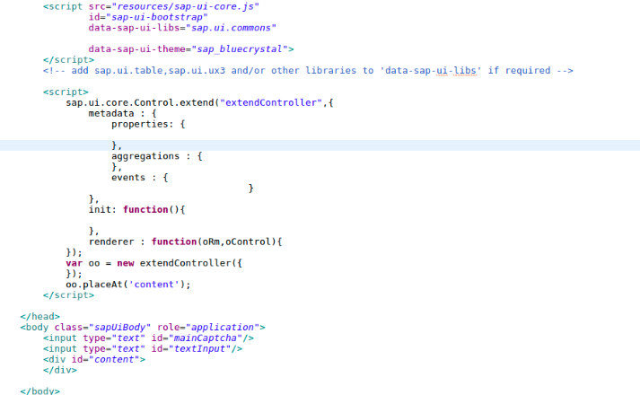
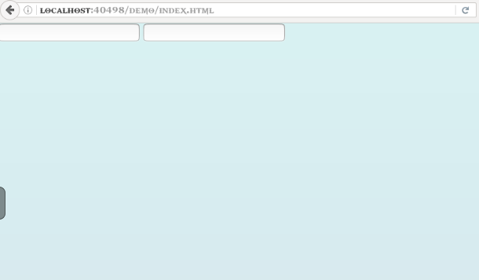

## Prerequisites
 - **Proficiency:** Beginner
 - Should have basic understanding of HTML,CSS and JavaScript.

## Next Steps
  - [SAPUI5 Define Control Logic](coming soon)

## Details
### You will learn
  You will learn how to extend controls in your application. In the below tutorial you will create a controller to generate and validate text-based captcha.

### Time to Complete
  **10 Min**.

---

1. Create a new **SAP Project in Eclipse** as follows:

     

2. In your `index.html` file between the scripts tag add the following

    ```javascript
    sap.ui.core.Control.extend()
    ```

    This line will allow you to extend the Control from the `ui.core` library.

3. You must define the extended Control by adding metadata to it. Control metadata consist of properties, events, as well as aggregations and associations. Also included in the metadata are the `init` and `renderer` functions for initializing and rendering elements.

4.  In this step you will just declare what you are going to use. In the same `index.html` inside the `sap.ui.core.Control.extend()`.

    ```javascript
        sap.ui.core.Control.extend("extendController",{
        metadata: {
            properties:{},
            aggregations : {},
            events: {}
          },
        init : function()
        {},
        renderer: function(oRm,oControl){}
        });
    ```

    `properties` are used to give the control `title`, `height`, `width` and is defined by a name and type. `aggregations` are defined by name and their configuration object. `events` consist of the name of your event which you are going to call. the `init` function is used to declare the initial elements to be loaded.

    The `renderer` defines the HTML structure that will be added to the DOM tree of your application whenever the control is instantiates in a view. It is usually called initially by the core of SAPUI5 and whenever a property of the control is changed. But in this step you will leave it empty.

5.  Now you will create an object of the extended control and place the object created in your content.

    ```javascript
      var oo = new extendController({});
    oo.placeAt("content");
    ```

6. Add the following fields just above your `div` content in the body tag.

    ```html
    <input type="text" id="mainCaptcha"/>
    <input type="text" id="textInput"/>
    ```

7.   Your final code will look like this

     

8.   Now to run the code, right-click on the project file and select run as **Web App Preview**.

     

9.   In the next Tutorial you will define all the functions to extend and add logic to your program.

## Next Steps
  - [SAPUI5 Define Control Logic](coming soon)
