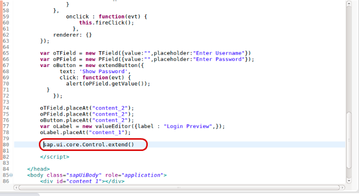
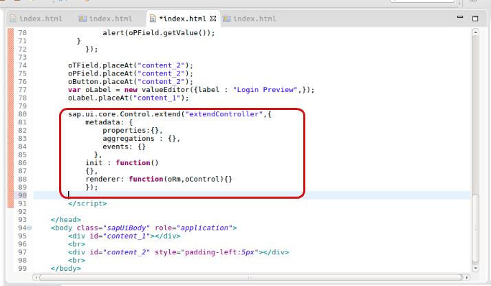
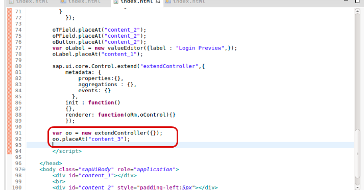
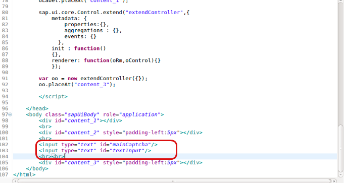
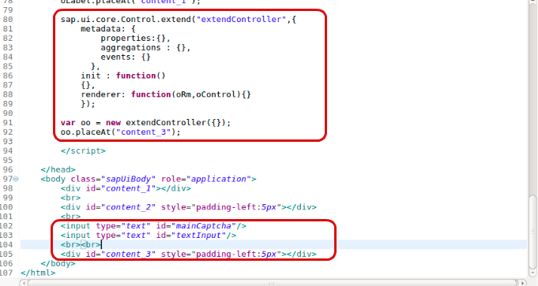
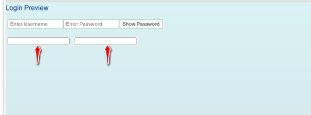

## Prerequisites
 - **Proficiency:** Beginner
 - **Tutorials:** [SAPUI5 extending `TextField`, `PasswordField` and `Button` Controls with events](https://www.sap.com/developer/tutorials/sapui5-extending-button-control.html)
 - Should have basic understanding of HTML, CSS and JavaScript.

## Next Steps
  - [Finalize your new UI5 Control by specifying the control logic](https://www.sap.com/developer/tutorials/sapui5-define-control-logic.html)

## Details
### You will learn
  You will learn how to extend controls in your application. In the below tutorial you will create a controller to generate and validate text-based captcha for your Login Preview App.

### Time to Complete
  **10 Min**.

---

1. You have to add a new control for the text-based captcha. This controller will help you create a new control and extend it in your application, in your `index.html` file between the scripts tag below your previously extended controls add the following

    ```javascript
      sap.ui.core.Control.extend()
    ```
    

    This line will allow you to extend the Control from the `ui.core` library.

2.    You must define the extended Control by adding metadata to it. Control metadata consist of properties, events, as well as aggregations and associations. Also under the metadata are the `init` and `renderer` functions for initializing and rendering elements. In this step you will just declare what you are going to use. In the same `index.html` inside the `sap.ui.core.Control.extend()`.

    ```javascript
        sap.ui.core.Control.extend("extendController",{
        metadata: {
            properties:{},
            aggregations : {},
            events: {}
          },
        init : function()
        {},
        renderer: function(oRm,oControl){}
        });
    ```
    

    `properties` are used to give the control `title`, `height`, `width` and is defined by a name and type. `aggregations` are defined by name and their configuration object. `events` consist of the name of your event which you are going to call.  The `init` function is used to declare the initial elements to be loaded.

    The `renderer` defines the HTML structure that will be added to the DOM tree of your application whenever the control is instantiates in a view. It is usually called initially by the core of SAPUI5 and whenever a property of the control is changed. But in this step you will leave it empty.

3.   Now you will create an object of the extended control and place the object created in your content. Do this below the defined control. Remember you are going to place this in a new `div` so after you add the object also add the new `div with id="content_3"` in the **body tag**.

    ```javascript
      var oo = new extendController({});
    oo.placeAt("content_3");
    ```
    

    ```html
      <div id="content_3" style="padding-left:5px"></div>
    ```
    

4. Add the following fields just above your `div content_3` in the **body tag**.

    ```html
    <input type="text" id="mainCaptcha"/>
    <input type="text" id="textInput"/>
  <br><br>
    ```
    

    These are the `InputFields` which you are going to use along with your controllers.

5.   Your final code will look like this

     

6.   Now to run the code, right-click on the project file and select run as **Web App Preview**.

     

  In the next Tutorial you will define all the functions to extend and add logic to your program.

