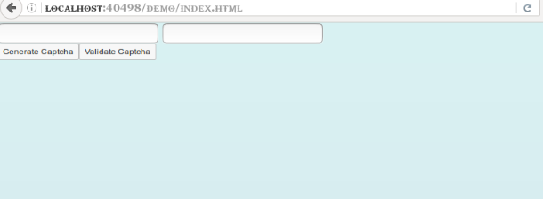
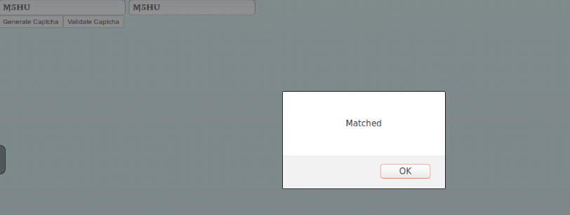
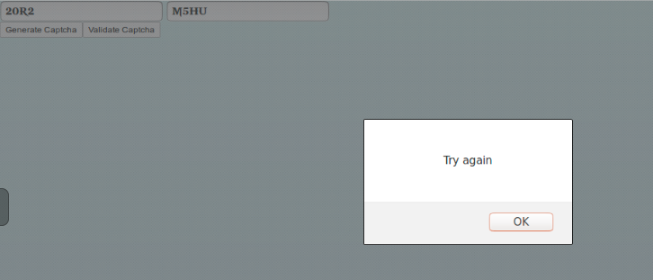

## Prerequisites
 - **Proficiency:** Beginner
 - [SAPUI5 Creating Control](http://go.sap.com/developer/tutorials/sapui5-creating-control.html)
 - Should have basic understanding of HTML, CSS and JavaScript

## Next Steps
 - Select a tutorial from the [Tutorial Navigator](http://go.sap.com/developer/tutorial-navigator.html) or the [Tutorial Catalog](http://go.sap.com/developer/tutorials.html)

## Details
### You will learn
  You will learn how to extend controls in your application. In the below tutorial you will define controllers and it's logic to use it for generating and validating text-based captcha.

### Time to Complete
  **15 Min**.

---

1.   Now you will define the metadata and it's content.

    ```javascript
    metadata : {
      properties: {
        title: {type: "string"},
      },

      aggregations : {
        _gButton : {type: "sap.ui.commons.Button", multiple:false,visibility:"hidden"},
        _vButton : {type: "sap.ui.commons.Button", multiple:false,visibility:"hidden"}
      },

      events : {
        generateCaptcha : {},
        validateCaptcha : {}
      }
    },
    ```

    Here properties has just one attribute which is title and it's type is string, aggregations are two buttons with type as button, mutiple tells whether it is a 0...1 aggregation or 0...n aggregation and set visibility as hidden. You will require two events, one for generating captcha and other for validating the generated captcha and your input.

2. Now the `init` function. As described in the previous tutorial, this is where your initial control is born.
   You will do the initialization here.

    ```javascript
    init: function(){
     var oControl = this, gButton,vButton;

     gButton = new sap.ui.commons.Button({
       text : "Generate Captcha",
       press : function (evt){
         oControl.fireGenerateCaptcha();
       }
     });

     vButton = new sap.ui.commons.Button({
       text : "Validate Captcha",
       press : function (evt){
         oControl.fireValidateCaptcha();
       }
     });

     this.setAggregation("_gButton",gButton);
     this.setAggregation("_vButton",vButton);
   },
    ```

    Here you declare the control object and initialize the buttons the actions to perform whenever and event is triggered. Then you set Aggregations and associate it with the button variables.

3. Then you have to define the renderer which will add the elements to your application.

    ```javascript
    renderer : function(oRm,oControl){

              oRm.write("<div");
              oRm.writeControlData(oControl);
              oRm.write(">");

              oRm.renderControl(oControl.getAggregation("_gButton"));
              oRm.renderControl(oControl.getAggregation("_vButton"));
              oRm.write("</div>");

    }
    ```

4. In this step you will define the logic for your functions(events).

    ```javascript
      var oo = new extendController({
  		title : "Title",
  		generateCaptcha : function (evt){
  			var alpha = new Array('A','B','C','D','E','F','G',
  			'H','I','J','K','L','M','N','O','P','Q','R','S','T','U','V','W','X','Y','Z',
  			'1','2','3','4','5','6','7','8','9','0','!','@','#','$','%','^','&','*');
		 for(var i=0;i<9;i++)
				 {
				    var a = alpha[Math.floor(Math.random() * alpha.length)];
				    var b = alpha[Math.floor(Math.random() * alpha.length)];
				    var c = alpha[Math.floor(Math.random() * alpha.length)];
				    var d = alpha[Math.floor(Math.random() * alpha.length)];
				 }
		console.log("Captcha Generated");
		var captcha = a + b + c + d;
		document.getElementById("mainCaptcha").value = captcha;
  			},

	      validateCaptcha : function(evt){
  			var string1 = document.getElementById('mainCaptcha').value;
  			var string2 = document.getElementById('textInput').value;
  			if (string1.length != 0 && string1 == string2)
  				{
  				    alert("Matched");
  				}
  			else
  				{        
  				    alert("Try again");
  				}
  			}
  		});

    ```
5. You should get such output when you run your application.
    

6. Now try out the application you created

    

    

---

## Next Steps
 - Select a tutorial from the [Tutorial Navigator](http://go.sap.com/developer/tutorial-navigator.html) or the [Tutorial Catalog](http://go.sap.com/developer/tutorials.html)
