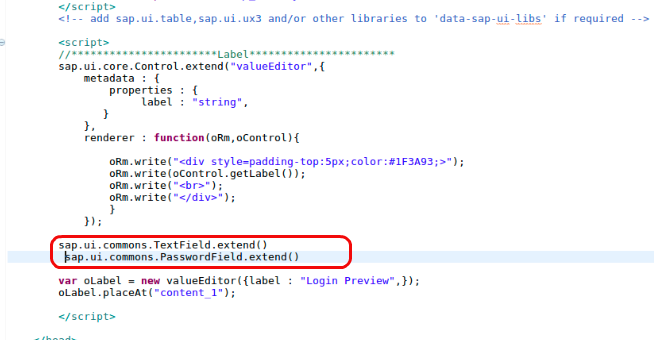
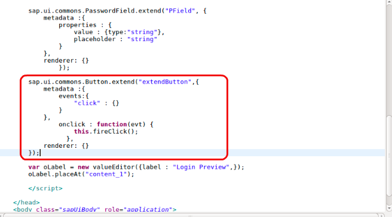
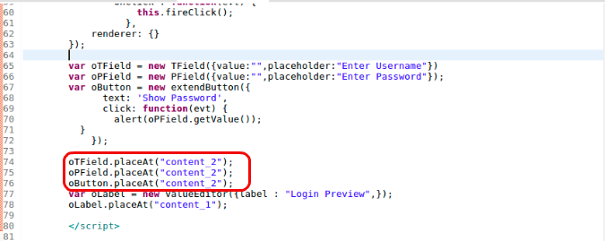
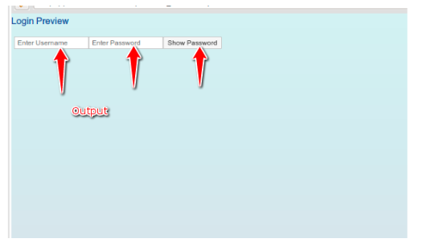

## Prerequisites  
 - **Proficiency:** Beginner
 - **Tutorials:** [SAPUI5 Extending Simple Control](https://developers.sap.com/tutorials/sapui5-extending-simple-control.html)
 - Should have basic understanding of HTML, CSS and JavaScript.

## Next Steps
  - [SAPUI5 creating a new UI5 control](https://www.sap.com/developer/tutorials/sapui5-creating-control.html)

## Details
### You will learn  
You will learn how to extend an existing control i.e Button in your application, and how to assign it events to call it as button is one of the most widely used element in a web page, along with `TextField` and `PasswordField` for your Login Preview app.

### Time to Complete
  **10 Min**.

---

1. From your previous tutorial in your `index.html` file between the `scripts tag` below the extend controller add the following

    ```javascript
    sap.ui.commons.TextField.extend()
    sap.ui.commons.PasswordField.extend()
    ```

    

     These lines will allow you to extend the `TextField` and `PasswordField` from `ui.commons` library.

2. Then you have to define the extended controls by adding **Metadata** to it. Control metadata consist of properties, events, as well as aggregations and associations.

    ```javascript
    sap.ui.commons.TextField.extend("TField", {
			metadata :{
				properties : {
					value : {type:"string"},
					placeholder : "string"

				}
			},
			renderer: {}
				});
    ```

    ```javascript
    sap.ui.commons.PasswordField.extend("PField", {
				metadata :{
					properties : {
						value : {type:"string"},
						placeholder : "string"
					}
				},
				renderer: {}
					});

    ```

      

3. After adding your Input Fields, now you have to extend a Button and define it's event by including the following code below your input fields:

    ```javascript
    sap.ui.commons.Button.extend("extendButton",{
  			metadata :{
  				events:{
  					"click" : {}
  				}
  			},
  				onclick : function(evt) {   
  				    this.fireClick();
  				  },
  			renderer: {}
  		});
    ```

    

    Events consist of the name of your event and below that is the method to be called when that event is occurred.

    The renderer defines the HTML structure that will be added to the DOM tree of your application whenever the control is instantiates in a view.  It is usually called initially by the core of SAPUI5 and whenever a property of the control is changed. But in this case you will leave it empty.

4. Now you will create an object of the extended controls and define the method to be called. This is below the extended control between **scripts tag.**

    ```javascript
     var oTField = new TField({value:"",placeholder:"Enter Username"})
	var oPField = new PField({value:"",placeholder:"Enter Password"});
	var oButton = new extendButton({
			  text: 'Show Password',
			  click: function(evt) {
			    alert(oPField.getValue());
		  }
			});
    ```

    

    You add the placeholders as default text into Inputboxs and for the button, basically when you click the button, it shows you the content in the Password field as by default it is hidden.

5. Place the objects created in your content. This is after the object `oTField` , `oPField` , `oButton` are defined, below it's definition in the **scripts tag** itself.

    ```javascript
    oTField.placeAt("content_2");
    oPField.placeAt("content_2");
    oButton.placeAt("content_2");
    ```

    

    As you are placing these objects in a different `div`, you need to create them as well so now  in your `body` tag add a new **div** as `content_2` with some style, add `<br>` for space.

    ```html
    <br>
    <div id="content_2" style="padding-left:5px"></div>
    <br>
    ```

    

6. Now to run the code, right-click on the project file and select run as **Web App Preview**.

    

    

---
## Next Steps
 - [SAPUI5 creating a new UI5 control](https://www.sap.com/developer/tutorials/sapui5-creating-control.html)
