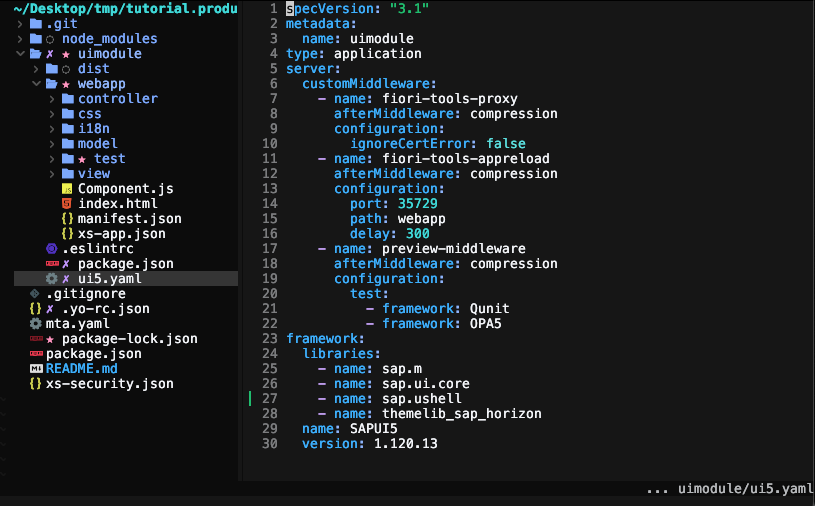

# Create an App for SAP Build Work Zone, standard edition
<!-- description --> Use a generator to create a new SAPUI5 project. Learn about the main components of this basic project and the required tooling.

## Prerequisites
 - You have previously installed the [easy-ui5 generator](cp-cf-sapui5-local-setup) (at least version 3.1.4).

## You will learn
  - How to create a new SAPUI5 project on your local machine.
  - How the UI5 Tooling helps you develop efficiently.


---


### Scaffold a SAPUI5 project

Run the following command to trigger the creation of a new project:

```Terminal
yo easy-ui5 project
```

Choose the following responses when prompted:

| Parameter     | Value
| :------------- | :-------------
| What do you want to do? | **`project [project]`**
| Which namespace do you want to use? | **`tutorial`**
| How do you want to name this project? | **`products`**
| How do you want to name your first uimodule? | **`uimodule`**
| Do you want to enable the SAP Fiori elements flexible programming model? | **`No`**
| On which platform would you like to host the application | **`SAP Build Work Zone, standard edition`**
| What name should be displayed on the Fiori Launchpad tile? | **`Products`**
| Where should your UI5 libs be served from? | **`Local resources (SAPUI5)`**
| Would you like to create a new directory for the project? | **`Yes`**
| Would you like to initialize a local git repository for the project? | **`Yes`**


The following installation of the project's dependencies might take a while.

### Inspect the generated code

Let's have a look at the generated code. Go to the newly created directory and open the code with your favorite editor (here Neovim):

```Bash
cd tutorial.products/
code .
```

You can see that the wizard created a bunch of folders and files.



The generated project follows a monorepo approach, which results in a root `package.json` file describing the overall project as well as a `package.json` for the generated uimodule. The `uimodule/` directory contains the application source code (`uimodule/webapp/`) as well as the `ui5.yaml`, which is the configuration file for the UI5 Tooling. The UI5 Tooling will provide a web server to serve our application.

### Test the web app locally

The generated project leverages the [UI5 Tooling](https://github.com/SAP/ui5-tooling), which provides an ideal web server for UI5 development as well as a great set of extensions ("middlewares"). The genereated project is already configured to use the [fiori-tools-proxy](https://www.npmjs.com/package/@sap/ux-ui5-tooling#2-proxy) and the [fiori-tools-appreload](https://www.npmjs.com/package/@sap/ux-ui5-tooling#1-application-reload).

Start the web server locally via the command line:

```Bash
npm run start:uimodule
```


> Hint: Put windows next to each other to benefit from the live-reload feature. This way, you will be able to see the changes in the browser right when you do file modifications - without having to switch to another window.

### Modify the title

**Open** the i18n ("internationalization") file `uimodule/webapp/i18n/i18n_en.properties`. **Replace** the content of this file with the following content.
```TEXT [6,9,11]
# This is the resource bundle for tutorial.products

#Texts for manifest.json

#XTIT: Application name
appTitle=Product List

#YDES: Application description
appDescription=App Description
#XTIT: Main view title
title=Coming soon!
```

You should see the result of your action immediately in the browser:


> Optional: Depending on your region, you can also add a new i18n file and maintain the corresponding properties in there. Possible file names could be `i18n_en_US.properties`, `i18n_en_GB.properties`, `i18n_de_DE.properties`, and so on.

---
