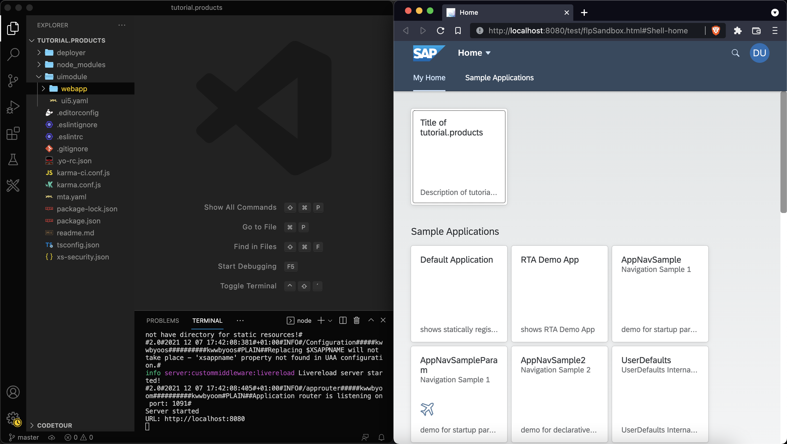

## Prerequisites
 - Install at least version 3.0.0 of the [easy-ui5 generator](cp-cf-sapui5-local-setup)

## Details
### You will learn
  - How to create a new SAPUI5 project on your local machine
  - How the UI5 tooling helps you to develop more efficient


---


[ACCORDION-BEGIN [Step : ](Scaffold a SAPUI5 project)]

Run the following command to trigger the creation of a new project.
```Terminal
yo easy-ui5 project
```


Choose the following responses for the prompted parameters.


|  Parameter     | Value
|  :------------- | :-------------
|  What do you want to do?          | **`Create a new OpenUI5/SAPUI5 project [app]`**
|  How do you want to name this project?          | **`products`**
|  Which namespace do you want to use?    | **`tutorial`**
|  On which platform would you like to host the application | **`SAP Launchpad service`**
|  Which view type do you want to use? | **`XML`**
|  Where should your UI5 libs be served from?            | **`Content delivery network (SAPUI5)`**
|  Would you like to create a new directory for the project?    | **`Yes`**
|  What name should be displayed on the Fiori Launchpad tile| **`Products`**


  !

The following installation of the project's dependencies might take a while.


[DONE]
[ACCORDION-END]
[ACCORDION-BEGIN [Step: ](Inspect the generated code)]


Let's have a look at the generated code. Go to the newly created directory and open the code with your favorite editor (here Visual Studio Code).

```Bash
code tutorial.products/
```

You can see that the wizard created a bunch of folders and files.

!

The main code for the SAPUI5 app can be found in the directory `webapp`. You can also find the following directories:

- `deployer`: A Cloud Foundry tasks which uploads the static web resources to the HTML5 application repository service during deploy-time.
- `uimodule`: The source file of your SAP Fiori app.

You might miss the folders `dist` and `mta_archieves` as they will be created later during the build step.


The `package.json` file contains much useful information about the project. The `npm scripts` are especially interesting since they wrap the command we'll use later.

[DONE]
[ACCORDION-END]
[ACCORDION-BEGIN [Step 3: ](Test the web app locally)]

This project leverages the [UI5 tooling framework](https://github.com/SAP/ui5-tooling) for development. This tool belt can help you to start a local web server and is extendable so you can integrate [mocked destinations](https://github.com/petermuessig/ui5-ecosystem-showcase/tree/master/packages/ui5-middleware-cfdestination) and a [live-reload feature](https://github.com/petermuessig/ui5-ecosystem-showcase/tree/master/packages/ui5-middleware-livereload) when files are updated. The great thing is, you don't have to worry about this for now. The easy-ui5 generator already installed these two tasks for you. Additional UI5 tooling tasks can be found on [npm.com](https://www.npmjs.com/search?q=ui5-task).

Start the web server locally via the command line.

```Bash
npm start
```

**Click** on the only tile you see in the SAP Fiori Launchpad to start the SAPUI5 application.

!


> Hint: Put windows next to each other to benefit from the live-reload feature. This way, you will be able to see the changes in the website right when you do file modifications without having to switch to another window.

[DONE]
[ACCORDION-END]
[ACCORDION-BEGIN [Step : ](Modify the title)]

**Open** the i18n file [`uimodule/webapp/i18n/i18n_en.properties`](https://sapui5.hana.ondemand.com/#/topic/91f217c46f4d1014b6dd926db0e91070). **Replace** the content of this file with the following content.
```TEXT
title=Coming soon!
appTitle=Product List
appDescription=App Description
```

You should see the result of your action immediately in the browser.

!

> Optional: Depending on your region, you can also add a new i18n file and maintain the corresponding properties in there. Possible file names could be `i18n_en_US.properties`, `i18n_en_GB.properties`, or `i18n_de_DE.properties`,


[VALIDATE_6]
[ACCORDION-END]

---
