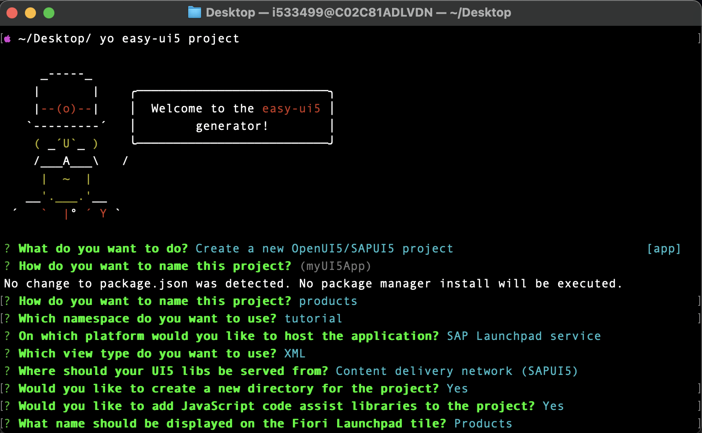
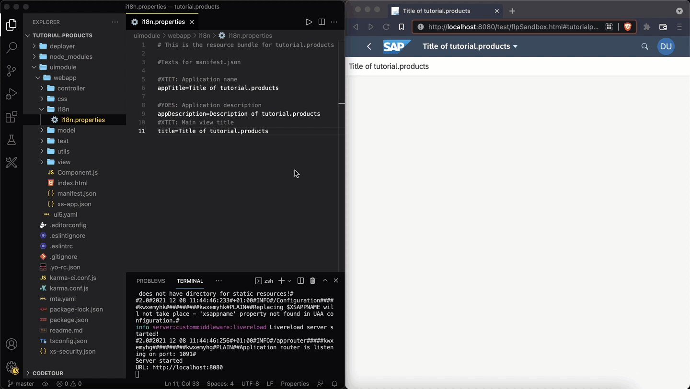

# Create an App for SAP Build Work Zone, standard edition
<!-- description --> Use a generator to create a new SAPUI5 project. Learn about the main components of this basic project and the required tooling.

## Prerequisites
 - You have previously installed the [easy-ui5 generator](cp-cf-sapui5-local-setup) (at least version 3.1.4).

## You will learn
  - How to create a new SAPUI5 project on your local machine.
  - How the UI5 Tooling helps you develop efficiently.


---


### Scaffold a SAPUI5 project

Run the following command to trigger the creation of a new project:

```Terminal
yo easy-ui5 project
```

Choose the following responses when prompted:

|  Parameter     | Value
|  :------------- | :-------------
|  What do you want to do?          | **`Create a new OpenUI5/SAPUI5 project [app]`**
|  How do you want to name this project?          | **`products`**
|  Which namespace do you want to use?    | **`tutorial`**
|  Do you want to enable the SAP Fiori elements flexible programming model?    | **`No`**
|  On which platform would you like to host the application | **`SAP Launchpad service`**
|  Which view type do you want to use? | **`XML`**
|  Where should your UI5 libs be served from?            | **`Content delivery network (SAPUI5)`**
|  Would you like to create a new directory for the project?    | **`Yes`**
|  Would you like to initialize a local git repository for the project?    | **`Yes`**
|  What name should be displayed on the Fiori Launchpad tile| **`Products`**

  <!-- border -->

The following installation of the project's dependencies might take a while. If asked to overwrite files, answer with `y` (for "yes") and hit "enter".

### Inspect the generated code

Let's have a look at the generated code. Go to the newly created directory and open the code with your favorite editor:

```Bash
code tutorial.products/
```

You can see that the wizard created a bunch of folders and files.

<!-- border -->

The main code for the SAPUI5 app can be found in the `webapp/` directory. You can also find the following directories:

- `deployer/`: Once the project gets built, the application content will be moved here. From here, a deployment tasks will upload the static web resources to Cloud Foundry, more specifically the SAP HTML5 Application Repository Service.
- `uimodule/`: This directory contains the application source code (`webapp/`) as well as the `ui5.yaml`, which is the configuration file for the UI5 Tooling. The UI5 Tooling will provide a web server to serve our application.

You might miss the folders `dist/` and `mta_archives/` - these be created later during the build step.

The `package.json` file contains a lot of useful information about the project. It is also the file that essentially turns our project into a Node.js based application. The `npm scripts` are especially interesting since they wrap the commands you will use later.

### Test the web app locally

This project leverages the [UI5 Tooling](https://github.com/SAP/ui5-tooling). The UI5 Tooling provides a web server, which is the perfect fit for SAPUI5 development. It is easily extendable, for example with [mocked destinations](https://www.npmjs.com/package/ui5-middleware-cfdestination) and a [live-reload feature](https://www.npmjs.com/package/ui5-middleware-livereload). The great thing is, you don't have to worry about this for now. The easy-ui5 generator already installed these two middlewares for you. Additional UI5 Tooling middlewares can be found on [npmjs.com](https://www.npmjs.com/search?q=ui5-middleware).

Start the web server locally via the command line:

```Bash
npm start
```

**Click** on the only tile in the launchpad to start the SAPUI5 application:

<!-- border -->


> Hint: Put windows next to each other to benefit from the live-reload feature. This way, you will be able to see the changes in the browser right when you do file modifications - without having to switch to another window.

### Modify the title

**Open** the i18n ("internationalization") file [`uimodule/webapp/i18n/i18n_en.properties`](https://sapui5.hana.ondemand.com/#/topic/91f217c46f4d1014b6dd926db0e91070). **Replace** the content of this file with the following content.
```TEXT [6,9,11]
# This is the resource bundle for tutorial.products

#Texts for manifest.json

#XTIT: Application name
appTitle=Product List

#YDES: Application description
appDescription=App Description
#XTIT: Main view title
title=Coming soon!
```

You should see the result of your action immediately in the browser:

<!-- border -->

> Optional: Depending on your region, you can also add a new i18n file and maintain the corresponding properties in there. Possible file names could be `i18n_en_US.properties`, `i18n_en_GB.properties`, `i18n_de_DE.properties`, and so on.

---
