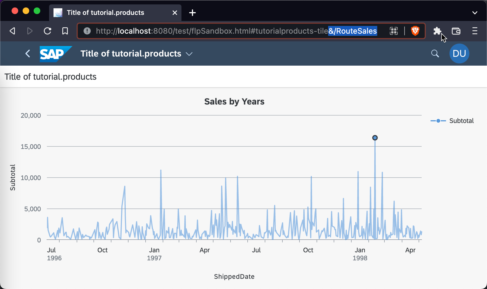
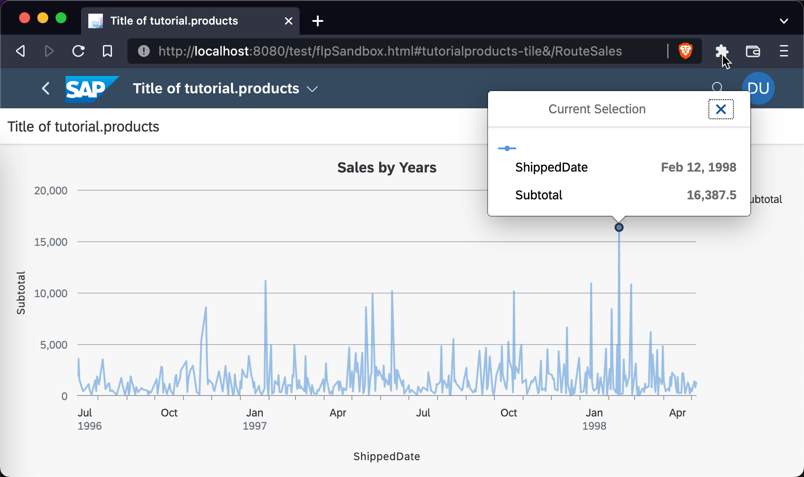

## Prerequisites
- You have previously created a SAPUI5 based project, e.g. with the [easy-ui5 generator](sapui5-fiori-cf-create-project).
- You have [added the Northwind Service as a data source and default model](sapui5-fiori-cf-display-data) to your application.
- You have version 3.1.4 or higher of the [easy-ui5 generator](cp-cf-sapui5-local-setup) installed.

## Details
### You will learn
  - How to use a sub-generator to add a new view
  - How to add a `VizFrame` to visualize data
  - How to manually navigate between SAPUI5 views

---

[ACCORDION-BEGIN [Step : ](Add a new view)]

Add a new view to your SAPUI5 application by using an `easy-ui5` sub-generator.

**Open** a new terminal session on root level of your project and execute:

```Terminal
yo easy-ui5 project newview
```

|  Parameter     | Value
|  :------------- | :-------------
|  What is the name of the new view?         | **`Sales`**
|  Would you like to create a corresponding controller as well?     | **`Yes`**
|  Do you want to add an OPA5 page object?  | **`No`**
|  Would you like to create a route in the manifest?  | **`Yes`**

The routes are added to the `uimodule/webapp/manifest.json` file. The generator asks you whether you want to overwrite the `manifest.json` file, which is necessary in this case, so type `yes` when prompted.

[DONE]
[ACCORDION-END]
[ACCORDION-BEGIN [Step : ](Inspect the modifications)]

As you can see in the log, the generator created a new view with its corresponding controller. It also modified the `uimodule/webapp/manifest.json` by adding a new route as well as a new target. You can see the pattern for the new `Sales` route is `RouteSales`. This is the piece that we will later attach to the URL of our application to reach this view.


[DONE]
[ACCORDION-END]
[ACCORDION-BEGIN [Step : ](Add the VizFrame)]

The `webapp/view/Sales.view.xml` will hold the `VizFrame` that visualizes the data from the Northwind Service. **Remove** the entire content view and replace it with the below code.

```XML
 <mvc:View
  controllerName="tutorial.products.controller.Sales"
  displayBlock="true"
  xmlns="sap.m"
  xmlns:mvc="sap.ui.core.mvc"

  xmlns:layout="sap.ui.layout"
  xmlns:viz="sap.viz.ui5.controls"
  xmlns:viz.data="sap.viz.ui5.data"
  xmlns:viz.feeds="sap.viz.ui5.controls.common.feeds">

  <Page title="{i18n>title}" id="Sales" >
    <content>
      <layout:FixFlex id="chartFixFlex" minFlexSize="250">
        <layout:flexContent>
            <viz:Popover id="idPopOver" connect="idVizFrame"></viz:Popover>
            <viz:VizFrame
              id="idVizFrame"
              uiConfig="{applicationSet:'fiori'}"
              height="100%"
              width="100%"
              vizType="timeseries_line"
              vizProperties="{
                                title: {
                                    text: 'Sales by Years'
                                },
                                plotArea: {
                                  dataLabel: {
                                      visible: false
                                  },
                                  window: {
                                      start: 'firstDataPoint',
                                      end: 'lastDataPoint'
                                  }
                                }                                 
                              }" >
                <viz:dataset>
                    <viz.data:FlattenedDataset data="{/Summary_of_Sales_by_Years}">
                        <viz.data:dimensions>
                            <viz.data:DimensionDefinition
                              name="ShippedDate"
                              value="{ShippedDate}"
                              dataType="date"/>
                        </viz.data:dimensions>
                        <viz.data:measures>
                            <viz.data:MeasureDefinition
                              name="Subtotal"
                              value="{Subtotal}"/>
                        </viz.data:measures>
                    </viz.data:FlattenedDataset>
                </viz:dataset>
                <viz:feeds>
                    <viz.feeds:FeedItem
                      id="valueAxisFeed"
                      uid="valueAxis"
                      type="Measure"
                      values="Subtotal" />
                    <viz.feeds:FeedItem
                      id="timeAxisFeed"
                      uid="timeAxis"
                      type="Dimension"
                      values="ShippedDate" />
                </viz:feeds>
            </viz:VizFrame>
        </layout:flexContent>
      </layout:FixFlex>
    </content>
  </Page>
</mvc:View>
```

This new code uses additional SAPUI5 libraries that are referenced at the top of the file. These are necessary in order to use the layout and `VizFrame` related controls. If you look at the code closely, you will notice that it defines a new `VizFrame` of type `timeseries_line`. The dataset (`FlattenedDataSet`) is bound to the `/Summary_of_Sales_by_Years` entity of the Northwind OData Service. The dimension (`DimensionDefinition`) is `ShippedDate`, which represents time and is therefore of type `date`. The measure (`MeasureDefinition`) is the `Subtotal` of sales.

You can read more about `VizFrame`s in the [SAPUI5 API Reference](https://sapui5.hana.ondemand.com/#/api/sap.viz.ui5.controls.VizFrame%23overview) and check out some samples in the [SAPUI5 Samples](https://sapui5.hana.ondemand.com/#/entity/sap.viz.ui5.controls.VizFrame). `VizFrame`s even have their own [documentation](https://sapui5.hana.ondemand.com/docs/vizdocs/index.html) that lists all available properties, events, bindings, and scales.

[DONE]
[ACCORDION-END]
[ACCORDION-BEGIN [Step : ](Navigate to the new view)]

In order to see the new view in your application in the browser, you have to navigate there manually using the pattern you already inspected in step 2. If your application is running in a Fiori Launchpad, attach `&/RouteSales` to the URL. If your application runs standalone, attach `#/RouteSales` to the URL. There is a difference between these two scenarios, because your application in the Fiori Launchpad already requires a hash (`#`) to navigate to it and there is only one hash allowed in a URL.



[DONE]
[ACCORDION-END]
[ACCORDION-BEGIN [Step : ](Implement a popover)]

You might have noticed that you can hover over the single data points of the line chart and click them, but nothing happens yet. Insert the below `onAfterRendering` method into the `Sales.controller.js` to connect the `VizFrame` with the popover, which is already defined in the `uimodule/webapp/view/Sales.view.xml` (step 3).

```javascript [7-11]

sap.ui.define([
    "tutorial/products/controller/BaseController"
], function (Controller) {
    "use strict";

    return Controller.extend("tutorial.products.controller.Sales", {
        onAfterRendering: function () {
            const oVizFrame = this.oVizFrame = this.getView().byId("idVizFrame");
            const oPopOver = this.getView().byId("idPopOver");
            oPopOver.connect(oVizFrame.getVizUid());
        }
    });
});
```

After saving the file, your browser should automatically refresh the page. You can now click on any data point to get the popover with its exact data.



[VALIDATE_1]
[ACCORDION-END]


---
