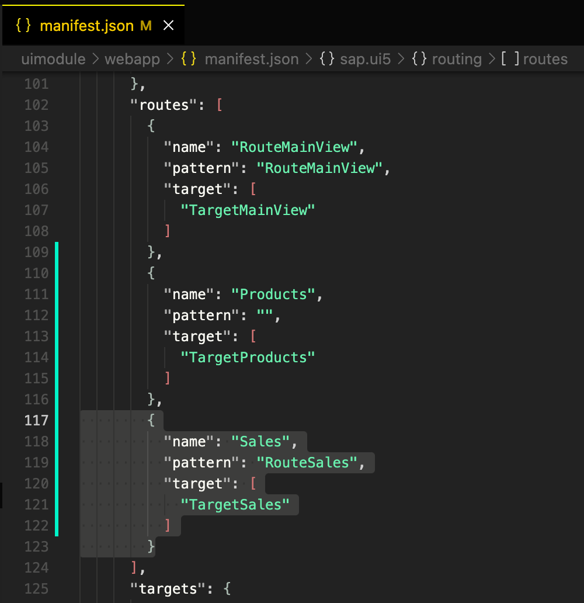

# Visualize Data from the Northwind Service
<!-- description --> Learn how to visualize data with a VizFrame.

## Prerequisites
  - You have previously [created an SAPUI5 application](cp-cf-sapui5-local) and selected `SAP Build Work Zone, standard edition` as the deployment target.
  - You have also completed all other tutorial as part of the mission [Develop an App for SAP Build Work Zone, standard edition with Your Own Dev Tools](mission.sapui5-cf-launchpad).

## You will learn
  - How to use a sub-generator to add a new view.
  - How to add a `VizFrame` to visualize data.
  - How to manually navigate between SAPUI5 views.

---

### Add a new view

Add a new view to your SAPUI5 application by using an `easy-ui5` subgenerator.

**Open** a new terminal session on root level of your project and execute:

```Terminal
yo easy-ui5 project newview
```

| Parameter | Value
| :------------- | :-------------
| How do you want to name your new view? | **`Sales`**
| Do you want to set up a JavaScript controller for your new view? | **`Yes`**
| Do you want to set up a route and target for your new view? | **`Yes`**

The routes are added to the `myui5app/webapp/manifest.json` file. The generator asks you whether you want to overwrite the `manifest.json` file, which is necessary in this case, so type `yes` when prompted.

### Inspect the modifications

As you can see in the log, the generator created a new view with its corresponding controller. It also modified the `myui5app/webapp/manifest.json` by adding a new route as well as a new target. You can see the pattern for the new `RouteSales` route is `sales`. This is the piece that we will later attach to the URL of our application to reach this view.



### Add the VizFrame

The `myui5app/webapp/view/Sales.view.xml` will hold the `VizFrame` that visualizes the data from the Northwind Service. **Remove** the entire content view and replace it with the below code.

```XML
 <mvc:View
  controllerName="myui5app.controller.Sales"
  displayBlock="true"
  xmlns="sap.m"
  xmlns:mvc="sap.ui.core.mvc"

  xmlns:layout="sap.ui.layout"
  xmlns:viz="sap.viz.ui5.controls"
  xmlns:viz.data="sap.viz.ui5.data"
  xmlns:viz.feeds="sap.viz.ui5.controls.common.feeds">

  <Page title="{i18n>title}" id="Sales" >
    <content>
      <layout:FixFlex id="chartFixFlex" minFlexSize="250">
        <layout:flexContent>
            <viz:Popover id="idPopOver" connect="idVizFrame"></viz:Popover>
            <viz:VizFrame
              id="idVizFrame"
              uiConfig="{applicationSet:'fiori'}"
              height="100%"
              width="100%"
              vizType="timeseries_line"
              vizProperties="{
                                title: {
                                    text: 'Sales by Years'
                                },
                                plotArea: {
                                  dataLabel: {
                                      visible: false
                                  },
                                  window: {
                                      start: 'firstDataPoint',
                                      end: 'lastDataPoint'
                                  }
                                }                                 
                              }" >
                <viz:dataset>
                    <viz.data:FlattenedDataset data="{/Summary_of_Sales_by_Years}">
                        <viz.data:dimensions>
                            <viz.data:DimensionDefinition
                              name="ShippedDate"
                              value="{ShippedDate}"
                              dataType="date"/>
                        </viz.data:dimensions>
                        <viz.data:measures>
                            <viz.data:MeasureDefinition
                              name="Subtotal"
                              value="{Subtotal}"/>
                        </viz.data:measures>
                    </viz.data:FlattenedDataset>
                </viz:dataset>
                <viz:feeds>
                    <viz.feeds:FeedItem
                      id="valueAxisFeed"
                      uid="valueAxis"
                      type="Measure"
                      values="Subtotal" />
                    <viz.feeds:FeedItem
                      id="timeAxisFeed"
                      uid="timeAxis"
                      type="Dimension"
                      values="ShippedDate" />
                </viz:feeds>
            </viz:VizFrame>
        </layout:flexContent>
      </layout:FixFlex>
    </content>
  </Page>
</mvc:View>
```

This new code uses additional SAPUI5 libraries that are referenced at the top of the file. These are necessary in order to use the layout and `VizFrame` related controls. If you look at the code closely, you will notice that it defines a new `VizFrame` of type `timeseries_line`. The dataset (`FlattenedDataSet`) is bound to the `/Summary_of_Sales_by_Years` entity of the Northwind OData Service. The dimension (`DimensionDefinition`) is `ShippedDate`, which represents time and is therefore of type `date`. The measure (`MeasureDefinition`) is the `Subtotal` of sales.

You can read more about `VizFrame`s in the [SAPUI5 API Reference](https://sapui5.hana.ondemand.com/#/api/sap.viz.ui5.controls.VizFrame%23overview) and check out some samples in the [SAPUI5 Samples](https://sapui5.hana.ondemand.com/#/entity/sap.viz.ui5.controls.VizFrame). `VizFrame`s even have their own [documentation](https://sapui5.hana.ondemand.com/docs/vizdocs/index.html) that lists all available properties, events, bindings, and scales.

### Navigate to the new view

In order to see the new view in your application in the browser, you have to navigate there manually using the pattern you already inspected in step 2. If your application is running in a Fiori launchpad, attach `&/sales` to the URL. If your application runs standalone, attach `#/sales` to the URL. There is a difference between these two scenarios, because your application in a Fiori launchpad requires a hash (`#`) to navigate to it and there is only one hash allowed in a URL.


### Implement a popover

You might have noticed that you can click on single data points of the line chart, but nothing happens (yet). Insert the below `onAfterRendering` method into the `myui5app/webapp/controller/Sales.controller.js` file to connect the `VizFrame` with the popover, which is already defined in the `myui5app/webapp/view/Sales.view.xml` (step 3).

```javascript [14-18]
sap.ui.define([
	"sap/ui/core/mvc/Controller"
],
	/**
	 * @param {typeof sap.ui.core.mvc.Controller} Controller
	 */
	function(Controller) {
		"use strict";

		return Controller.extend("myui5app.controller.Sales", {
			onInit: function() {

			},
			onAfterRendering: function() {
				const oVizFrame = this.oVizFrame = this.getView().byId("idVizFrame");
				const oPopOver = this.getView().byId("idPopOver");
				oPopOver.connect(oVizFrame.getVizUid());
			}
		});
	});
```

After saving the file, your browser should automatically refresh the page. You can now click on any data point to get the popover with its exact data.


---
