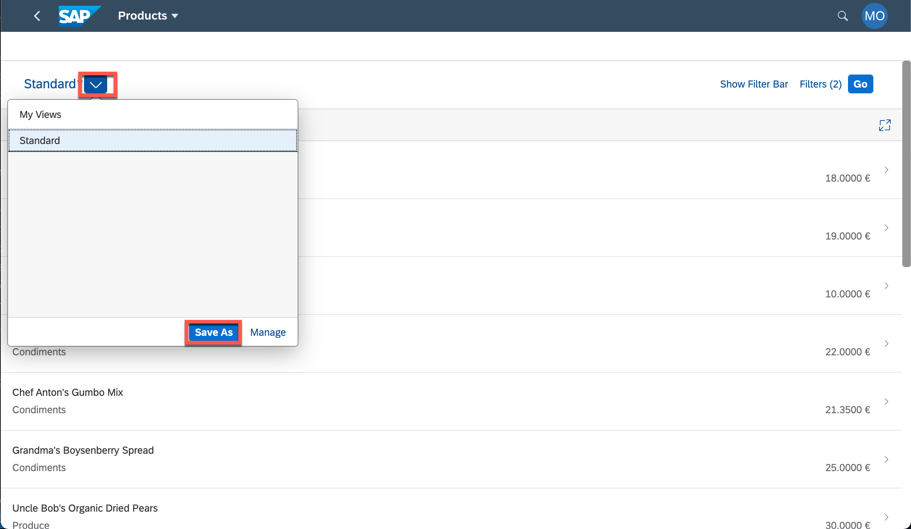
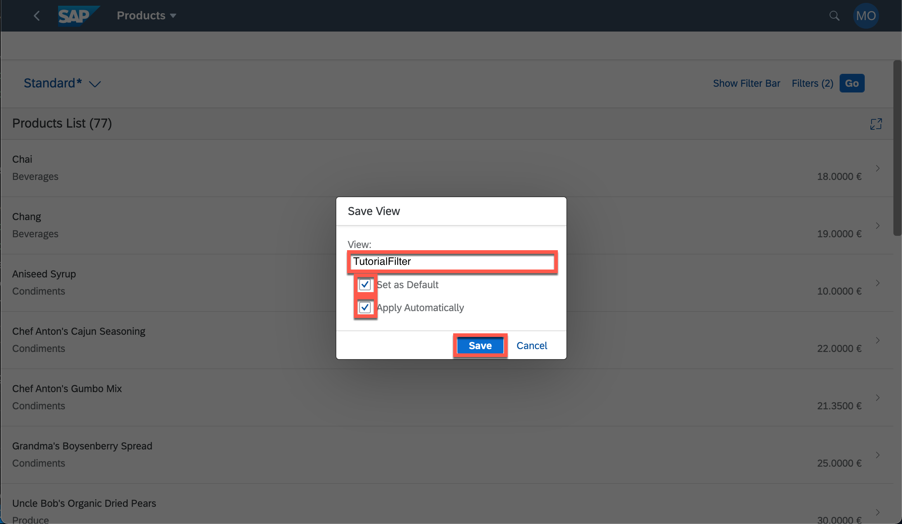

## Prerequisites
 - Make sure you have the [proper entitlements set](https://developers.sap.com/tutorials/cp-cf-entitlements-add.html). If you are unsure which services you need, please refer to the table of step 2.

## Details
### You will learn
  - How to build and deploy the application to the cloud
  - How to interact with the SAPUI5 flex services to adapt the application to end-users

---

[ACCORDION-BEGIN [Step: ](Build the project)]

Run the following command to package the project into one single archive. This archive contains the full source files (for debugging), as well as the bundled resources (for faster loading times).

```Terminal
npm run build:mta
```

[DONE]
[ACCORDION-END]

[ACCORDION-BEGIN [Step: ](Deploy the built archive)]

Next, deploy the generated archive and track the deployment progress in the terminal with the following command.

```Terminal
cf deploy mta_archives/products_0.0.1.mtar
```

The great thing about deploying a single `.mtar` file is that the Cloud Foundry environment will provision all required services for you. Here is a list of all services that are required for this project (you can see them enumerated in the `mta.yaml` file).


|  Service instance name     | service | service plan
|  :------------- | :-------------| :-------------
|  `products_destination` |  `destination` |  `lite`
|  `products_uaa` |  `xsuaa` |  `application`
|  `products_html5_repo_runtime` |  `html5-apps-repo` |  `app-runtime`
|  `products_html5_repo_host` | `html5-apps-repo`  |  `app-host`
|  `products_portal` |  `portal` |  `standard`


[DONE]
[ACCORDION-END]
[ACCORDION-BEGIN [Step: ](Access the running web app)]

At the end of the deployment process log, you should see a line that looks similar to this one:
```
Application "products" started and available at "<prefix>-products.cfapps.eu10.hana.ondemand.com"
```

Copy this URL to your browser to access the app.

> If you can't find the respective line in the log, run `cf apps` and look for the line that says "products" to retrieve the URL again.


[DONE]
[ACCORDION-END]
[ACCORDION-BEGIN [Step: ](Save a custom filter variant)]

1. When opening the URL of the application (the approuter to be more precise), you are prompted for credentials. Use the same credentials you used to log in to SAP Cloud Platform.

2. You are automatically redirected to the path `/cp.portal`, which is from where the SAP Fiori Launchpad resources of the "portal service instance" are served. This configuration can be different from the configuration of the `flpSandbox.html`, which explains why the Launchpad might look slightly different.

    > Optional: You access still access the app in the `flpSandbox.html` if you want to. For this, replace the URL path with `tutorialproducts/flpSandbox.html`.

3. Apply another filter with the following criteria:
    * The `ProductID` shall be less than 18
    * The `CategoryID` shall be less than 60

4. **Open** the views dialog and save the current filter variant by clicking **Save as**.

      !

5. Name the view **`TutorialFilter`**, **check both checkboxes**, and hit **Save**. This user-specific variant is now stored in the backend.

      !


[VALIDATE_1]
[ACCORDION-END]
[ACCORDION-BEGIN [Step: ](Personalize the detail page)]

This step will test another feature of the UI5 flexibility service, the "Personalize App" functionality.

1. Click on any product to switch to the detail view.
2. Click on the user icon on the top right corner and select **Personalize App** from the dropdown.

      !

3. You'll noticed that the UI shows additional buttons and there is a hover effect on  sections.
4. **Remove** the info section of this detail page. No worries, you'll be able to add it back again.

      !

5. Exit the personalization view by clicking the **Done** button on the bottom right.

      !


[DONE]
[ACCORDION-END]
[ACCORDION-BEGIN [Step: ](Check )]

In the previous two tutorial, you made changes to both views of the Fiori app. These changes are only be visible to you. Open another browser or an incognito window and **reopen the web app** there. You notice the filter variant is still there and the info section of the detail view is hidden. This is proof that the variant is persisted in the backend -- by the portal service, to be more precise -- and not cached in the browser.

!

[DONE]
[ACCORDION-END]
[ACCORDION-BEGIN [Step: ](Further references)]

With this, you have completed this tutorial mission, congrats!

From here on, it's also possible to add the web app to a portal page. If you want to do so, please refer to the following tutorial:

1. [Getting started with the Cloud Foundry portal service](https://developers.sap.com/tutorials/cp-portal-cloud-foundry-getting-started.html)
2. [Create a new portal page](https://developers.sap.com/tutorials/cp-portal-cloud-foundry-create-site.html)
3. [Integrate the app in a portal page](https://developers.sap.com/tutorials/cp-portal-cloud-foundry-sapui5-app.html) - Skip the first step of this tutorial and use the URL of the application you developed in this mission instead (see step 3).


[DONE]
[ACCORDION-END]


---
