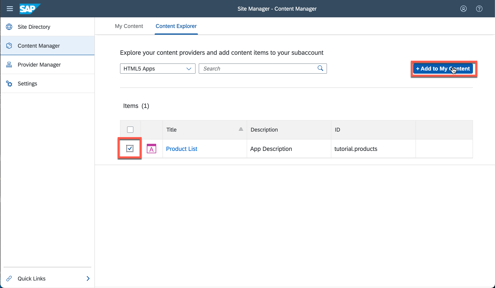
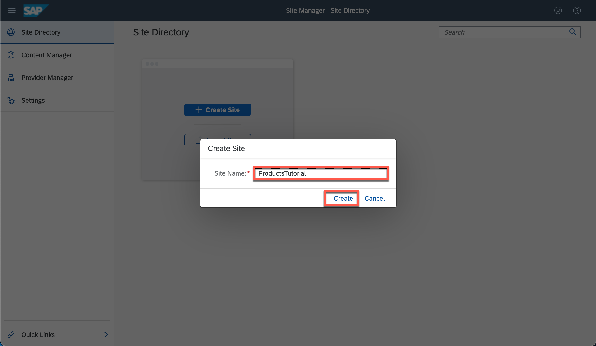

# Deploy the Fiori App to Cloud Foundry
<!-- description --> Deploy the application to the SAP BTP, Cloud Foundry environment to be able to share it with your coworkers.

## Prerequisites
- You have previously [created an SAPUI5 application](cp-cf-sapui5-local) and select `SAP Build Work Zone, standard edition` as the deployment target.
- You have also completed all other tutorial as part of the mission [Develop an App for SAP Build Work Zone, standard edition with Your Own Dev Tools](mission.sapui5-cf-launchpad).
- You have [set up an SAP BTP account for tutorials](group.btp-setup). Follow the instructions to get an account, and then to set up entitlements and service instances for the following BTP services:
    - **SAP Build Work Zone, standard edition**
    - **Destination Service**
    - **Authorization and Trust Management Service (xsuaa)**
    - **HTML5 Application Repository Service**

## You will learn
  - How to build and deploy the application to the cloud.
  - How to interact with the SAPUI5 flex services to adapt the application to end-users.

---

### Build the project

Run the following command to package the project into one single archive. This archive contains the full source files (for debugging), as well as the bundled resources (for faster loading times):

```Terminal
npm run build
```

> You can find the definition of this script in the `scripts` section of the `package.json` file.

### Deploy the built archive

Next, deploy the generated archive and track the deployment progress in the terminal with the following command:

```Terminal
npm run deploy
```

> Use `cf login` to establish a connection to the Cloud Foundry endpoint if you haven't done so yet. [This tutorial](cp-cf-download-cli) might help you if you are not sure how to do so.

The great thing about deploying a single `.mtar` file is that the Cloud Foundry environment will provision all required services for you. Here is a list of all services that are required for this project (you can see them enumerated in the `mta.yaml` file).


| Service instance name | service | service plan
| :------------- | :-------------| :-------------
| `tutorial.myui5project-destination-service` | `destination` | `lite`
| `tutorial.myui5project-uaa` |  `xsuaa` | `application`
| `tutorial.myui5project-html-repo-host` | `html5-apps-repo` | `app-host`


### Access the running web app

At the end of the deployment process log, you should see a line that looks similar to this one:
```[4]
Uploading content module "tutorial.myui5project-ui-deployer" in target service "tutorial.myui5project-html-repo-host"...
Deploying content module "tutorial.myui5project-ui-deployer" in target service "tutorial.myui5project-html-repo-host"...
Skipping deletion of services, because the command line option "--delete-services" is not specified.
Process finished.
Use "cf dmol -i 6002f603-45d2-11ef-91d3-eeee0a906a68" to download the logs of the process.
```

This means you uploaded the app successfully. The URL of your app will now follow this pattern: `https://<subdomain>.launchpad.cfapps.<region>.hana.ondemand.com/<some-id>.basicservice.myui5app-0.0.1`.

> You can also install [this plugin](cp-cf-install-cliplugin-html5) and run `cf html5-list -di tutorial.myui5project-destination-service -u --runtime launchpad` to print the full URL of your web app. With this URL you can access your application, but it will probably not load correctly. That is because we specified `Local resources (SAPUI5)` as the location to load SAPUI5 from upon [project generation](cp-cf-sapui5-local). But we didn't ship our application with any SAPUI5 libraries. Once we embed our application into a Fiori launchpad, the SAPUI5 libraries will be loaded from there.


### Embed the application in SAP Build Work Zone, standard edition


Now it's time to embed the app in SAP Build Work Zone, standard edition:

1. Open the admin UI of the [SAP Build Work Zone, standard edition](cp-portal-cloud-foundry-getting-started). You can find the link to the UI under "Instances and Subscriptions" in the SAP BTP Cockpit.
2. Access the **Channel Manager** menu. You should now see the following screen and **click the refresh button** to synchronize with the HTML5 Application Repository Service.


3. Open the **Content Manager** menu and click on the button **Content Explorer**.


4. Click on the tile that says **HTML5 Apps**.


5. You should now see the following screen from where you can select the web app you just deployed. **Select the checkbox** next to `My UI5 Application` and hit the **Add** button.



6. Go back to the **Content Manager** and click on the group **default**. In case you don't see this group, use the **+ New** button to create a new one.


7. Select the **Edit** button. You should be able to assign the app to the group via the **Assignment Status** switch. Don't forget to **Save** the group before navigating back.


8. Now you need to make this application visible to your users. To keep it simple, make the app visible to everyone. For this, select the **Everyone** role.


9. You are already familiar with the steps needed here. Select the **Edit** button to edit the role. Assign the app to the role via the **Assignment Status** switch and click **Save** before navigating back.


10. Go to the menu **Site Directory** and use the **Create Site** button to create a new site if you don't have an existing one.


11. You can choose any name for the new site, e.g. **`Tutorial`**.



12. There's no need to edit this site, all you need comes with the default configuration. Click the button on the top right corner to open your new site.


### Save a custom filter variant

1. Click on **My UI5 Application** to open your web application. Also note that you see your initials in the top-right user menu. This shows that you are signed in (perhaps automatically via Single-Sign-On).


3. Apply another filter with the following criteria:
    * The `ProductID` shall be less than 18.
    * The `CategoryID` shall be less than 60.


4. **Open** the views dialog and save the current filter variant by clicking **Save as**.


5. Name the view **`TutorialFilter`**, **check both checkboxes**, and hit **Save**. This user-specific variant is now stored in the backend and is therefore persistent.


---
