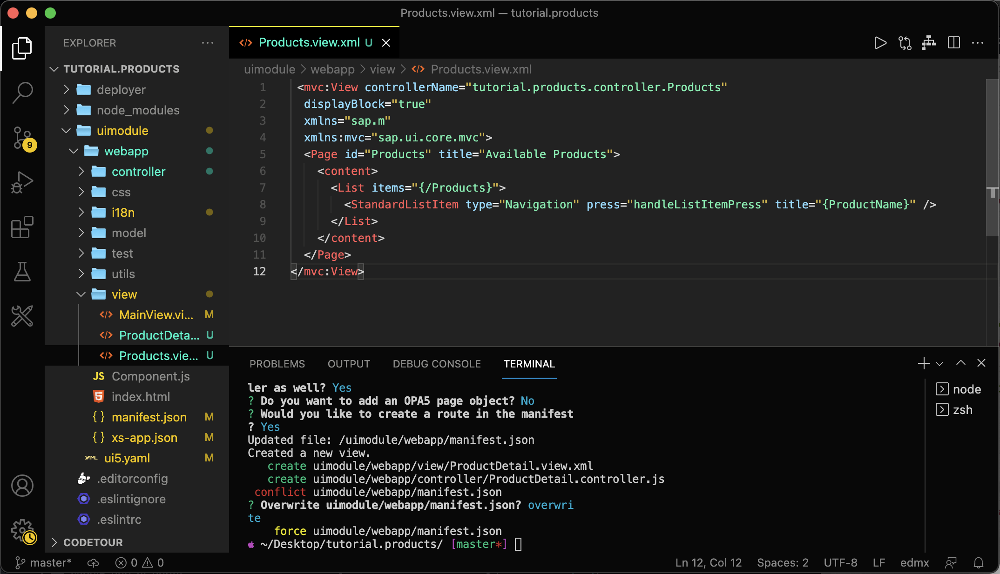

# Display Data from the Northwind Service
<!-- description --> Learn how to display data in your SAPUI5 application and how to navigate between views.

## Prerequisites
- You have previously created a SAPUI5 based project, for instance with the [easy-ui5 generator](sapui5-fiori-cf-create-project).

## You will learn
  - How to use a sub-generator to add an OData model to the SAPUI5 application.
  - How to navigate between SAPUI5 views.
  - How to configure UI5 Tooling middlewares.

---

### Rename "MainView" to "Products"

Newer versions of the easy-ui5 generator create projects that contain two views out of the box: The `App.view.xml`, which is the outer container of the application, and the `MainView.view.xml`, where you can start developing your application content right away. At this point, it makes sense to rename the `MainView.view.xml` to something more meaningful.

1. **Rename** the file `MainView.view.xml` to `Products.view.xml`.
1. In the `Products.view.xml` file, **replace** all references to `MainView` with `Products`.
1. **Rename** the file `MainView.controller.js` to `Products.controller.js`.
1. In the `Products.controller.js` file, **replace** all references to `MainView` with `Products`.
1. In the `manifest.json` file, **replace** all references to `MainView` with `Products`.

### Add a list to the products view

**Replace** the current content of the `Products.view.xml` with the following content: A page that contains a list and uses [aggregation binding](https://sapui5.hana.ondemand.com/#/topic/91f057786f4d1014b6dd926db0e91070.html) (also called "list binding"):

```XML [6-12]
<mvc:View
  controllerName="tutorial.products.controller.Products"
  displayBlock="true"
  xmlns="sap.m"
  xmlns:mvc="sap.ui.core.mvc">
  <Page id="Products" title="Available Products">
    <content>
      <List items="{/Products}">
        <StandardListItem type="Active" title="{ProductName}" />
      </List>
    </content>
  </Page>
</mvc:View>
```

If you check your app in the browser, you'll immediately be able to see that the `App.view.xml` embeds the `Products.view.xml` and displays an empty list. The list is still empty, because there is no data source bound to the application yet.

### Add a data source

To populate the list with items, bind a data source to the application. For this, you can use another sub-generator:

> You can find a list of all available sub-generators on [GitHub](https://github.com/ui5-community/generator-ui5-project#sub-generators-to-avoid-recurring-tasks).

```Terminal
yo easy-ui5 project newmodel
```

|  Parameter     | Value
|  :------------- | :-------------
|  What is the name of your model, press enter if it is the default model?        | **keep blank**
|  Which type of model do you want to add?     | **`OData v2`**
|  Which binding mode do you want to use?    | **`TwoWay`**
|  What is the data source URL?   | **`V2/Northwind/Northwind.svc/`**
|  Which count mode do you want to use?   | **`Inline`**

Again, please accept the modifications to the manifest file.

> The generator will name the data source based on the URL you specified. You can replace the name in the `manifest.json` if you don't like it.

### Redirect traffic to the data source

1. All requests to the data source will be sent to `<webapp URL>/V2/Northwind/Northwind.svc/`.

    **Modify** the `uimodule/webapp/xs-app.json` file, which is the routing configuration file for the application router ([documentation](https://help.sap.com/docs/btp/sap-business-technology-platform/managed-application-router)), to redirect the traffic to a destination. Replace the entire file with the following content:

    ```JSON [4-9]
    {
      "welcomeFile": "/index.html",
      "routes": [
        {
          "source": "^/V2/(.*)$",
          "authenticationType": "none",
          "destination": "Northwind",
          "csrfProtection": false
        },
        {
          "source": "^(.*)",
          "target": "$1",
          "authenticationType": "xsuaa",
          "service": "html5-apps-repo-rt"
        }
      ]
    }

    ```

2. You already created this destination named "Northwind" in SAP BTP, Cloud Foundry environment in a [previous tutorial](cp-cf-create-destination). Now it's time to add a mocked destination to your local setup as well.

    **Replace** the empty array of the property `destinations` in the `uimodule/ui5.yaml` file to declare the local destination:

    ```YAML
            destinations:
              - name: "Northwind"
                url: "https://services.odata.org/"
    ```

    > YAML is quite nice to read, but writing it can be cumbersome as the indentation of the lines is crucial. Please make sure your file looks exactly as shown in the next screenshot. If you edit these files often, I recommend using IDE plugins to make your life easier like [this one](https://marketplace.visualstudio.com/items?itemName=redhat.vscode-yaml) to [validate the format](https://sap.github.io/ui5-tooling/pages/Configuration/#validation-ide-support).

3. Switch to your first terminal session, stop the process and restart it. Restarting is necessary because the live-reload feature doesn't notice changes in the `ui5.yaml` file.

    ```Terminal
    <ctrl + c>
    npm start
    ```

    > Alternatively, you can directly invoke `npx ui5 serve -o test/flpSandbox.html`, which is equivalent to `npm start`  - or run `npx ui5 serve`, which won't open a new page in the browser.

    Now you should see the Northwind products in the SAPUI5 list control:

    <!-- border -->

### Display more product information on a detail page

In this step, you will add a detail page that shows some additional information. You will use another easy-ui5 sub-generator to create a new view.

1. Switch back to the second terminal session and run another sub-generator:
    ```Terminal
    yo easy-ui5 project newview
    ```

    |  Parameter     | Value
    |  :------------- | :-------------
    |  What is the name of the new view?         | **`ProductDetail`**
    |  Would you like to create a corresponding controller as well?     | **`Yes`**
    |  Do you want to add an OPA5 page object?  | **`No`**
    |  Would you like to create a route in the manifest?  | **`Yes`**

    Once again, accept that the generator can overwrite the `manifest.json` file.

2. **Open** the `uimodule/webapp/manifest.json` file and add the `productID` to the pattern of the newly created route `ProductDetail`:
    ```JSON [3]
    {
      "name": "ProductDetail",
      "pattern": "Product/{productId}",
      "target": [
        "TargetProductDetail"
      ]
    }
    ```

3. Change the type of the list items and add an event listener in the `uimodule/webapp/view/Products.view.xml` file:
    ```XML
    <StandardListItem type="Navigation" press=".handleListItemPress" title="{ProductName}" />
    ```

    <!-- border -->

4. Add navigation logic to the `uimodule/webapp/controller/Products.controller.js` to handle the press event. This press event gets the UI5 router, gets the selected `ProductID`, and then passes this id to the navigation method of the router ([documentation](https://sapui5.hana.ondemand.com/sdk/#/topic/2366345a94f64ec1a80f9d9ce50a59ef)):

    ```JavaScript [8-14]
    sap.ui.define([
      "tutorial/products/controller/BaseController"
    ], function (Controller) {
      "use strict";

      return Controller.extend("tutorial.products.controller.Products", {

        handleListItemPress: function (oEvent) {
          var oRouter = sap.ui.core.UIComponent.getRouterFor(this);
          var selectedProductId = oEvent.getSource().getBindingContext().getProperty("ProductID");
          oRouter.navTo("ProductDetail", {
            productId: selectedProductId
          });
        }

      });
    });
    ```

    <!-- border -->

5. **Click** on any list item. This should trigger the navigation to a new page.

### Add UI elements to the detail page

1. Add controller logic to `uimodule/webapp/controller/ProductDetail.controller.js` to parse the selected product from the routing arguments and to bind the product to the view ([documentation](https://sapui5.hana.ondemand.com/sdk/#/topic/2366345a94f64ec1a80f9d9ce50a59ef)).

    ```JavaScript [8-27]
    sap.ui.define([
      "tutorial/products/controller/BaseController"
    ], function(Controller) {
      "use strict";

      return Controller.extend("tutorial.products.controller.ProductDetail", {

        onInit: function () {
          const oRouter = sap.ui.core.UIComponent.getRouterFor(this);
          oRouter.getRoute("ProductDetail").attachMatched(this._onRouteMatched, this);
        },

        _onRouteMatched: function (oEvent) {
          const iProductId = oEvent.getParameter("arguments").productId;
          const oView = this.getView();
          oView.bindElement({
            path: "/Products(" + iProductId + ")",
            events: {
              dataRequested: function () {
                oView.setBusy(true);
              },
              dataReceived: function () {
                oView.setBusy(false);
              }
            }
          });
        },

      });
    });
    ```

2. Add the required declarations to the `uimodule/webapp/view/ProductDetail.view.xml` view to to consume the newly bound model and display some properties.

```XML [4-11]
<mvc:View controllerName="tutorial.products.controller.ProductDetail" displayBlock="true"
xmlns="sap.m"
xmlns:mvc="sap.ui.core.mvc">
  <Page id="ProductDetail" title="Detail Page">
    <VBox>
      <Text text="{ProductName}" />
      <Text text="{UnitPrice}" />
      <Text text="{QuantityPerUnit}" />
      <Text text="{UnitsInStock}" />
    </VBox>
  </Page>
</mvc:View>
```

3. Once you save the view, the web app should update automatically and display a view similar to this one. We will enrich this UI with more controls in the [next tutorial](sapui5-fiori-cf-fiorify).

<!-- border -->

---
