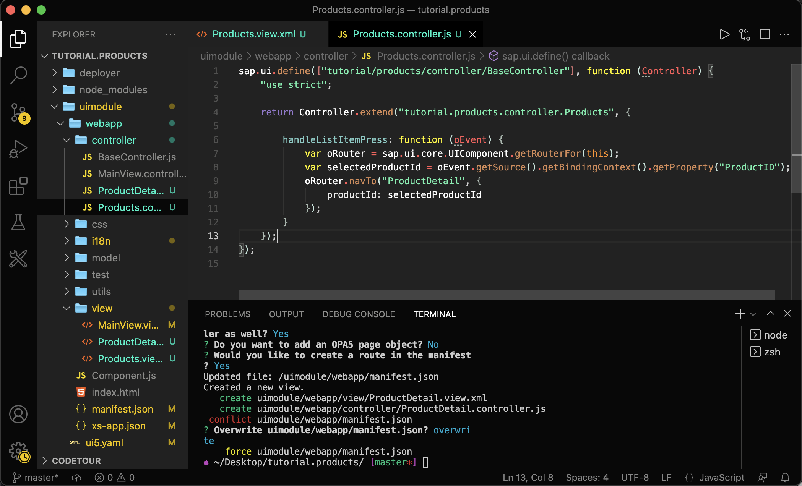

## Details
### You will learn
  - How to use a sub-generator to add an OData model to the SAPUI5 application
  - How to navigate between SAPUI5 views
  - How to configure UI5 tooling tasks

---

[ACCORDION-BEGIN [Step : ](Add a new view)]


Add a new view to display a list of products. For this, you can use another `easy-ui5` sub-generator.

**Open** a new terminal session, to keep local web server running, and execute:

```Terminal
yo easy-ui5 project newview
```

|  Parameter     | Value
|  :------------- | :-------------
|  What is the name of the new view?         | **`Products`**
|  Would you like to create a corresponding controller as well?     | **`Yes`**
|  Do you want to add an OPA5 page object?  | **`No`**
|  Would you like to create a route in the manifest?  | **`Yes`**

The routes are added to the `uimodule/webapp/manifest.json` file. The generator asks you whether you want to override the `manifest.json` file. If prompted, accept this.

[DONE]
[ACCORDION-END]
[ACCORDION-BEGIN [Step : ](Inspect the modifications)]

As you can see in the log, there are two new files and one modified file. As the generator is only able to create boilerplate code, we have to make some modifications to the `uimodule/webapp/manifest.json` application descriptor.

**Open** the file and replace the routing pattern of the new view with an empty string.
```JSON [3]
{
  "name": "Products",
  "pattern": "",
  "target": [
    "TargetProducts"
  ]
},
```
!

[DONE]
[ACCORDION-END]
[ACCORDION-BEGIN [Step : ](Enable routing)]

1. The `webapp/view/Mainview.view.xml` will be the outer container of the application. Therefore, **remove** the entire content (nested tags) of the `<App>` tag.

    ```XML [5]
    <mvc:View controllerName="tutorial.products.controller.MainView"
      displayBlock="true"
      xmlns="sap.m"
      xmlns:mvc="sap.ui.core.mvc">
        <App id="idAppControl" />
    </mvc:View>
    ```

    !

2. The newly generated view `webapp/view/Products.view.xml` defines one page of the whole application. **Replace** the current content of the view, the `<App>` tag, with a page that contains one list that uses an [aggregation binding](https://sapui5.hana.ondemand.com/#/topic/91f057786f4d1014b6dd926db0e91070.html).

    ```XML [4-10]
    <mvc:View controllerName="tutorial.products.controller.Products" displayBlock="true"
      xmlns="sap.m"
      xmlns:mvc="sap.ui.core.mvc">
      <Page id="Products" title="Available Products">
        <content>
          <List items="{/Products}">
            <StandardListItem type="Active" title="{ProductName}" />
          </List>
        </content>
      </Page>
    </mvc:View>
    ```


You'll immediately be able to see that the `MainView` embeds the `Products` view and displays an empty list. The list is still empty, because there is not data source bound to the application yet.


[DONE]
[ACCORDION-END]
[ACCORDION-BEGIN [Step : ](Add a data source)]

To populate the list with items, bind a data source to the application. For this, there exists another sub-generator:

> You can find a list of all available sub-generator on [GitHub](https://github.com/SAP/generator-easy-ui5/#sub-generators-to-avoid-recurring-tasks)

```Terminal
yo easy-ui5 project newmodel
```


|  Parameter     | Value
|  :------------- | :-------------
|  What is the name of your model, press enter if it is the default model?        | **keep blank**
|  Which type of model do you want to add?     | **`OData v2`**
|  Which binding mode do you want to use?    | **`TwoWay`**
|  What is the data source URL?   | **`V2/Northwind/Northwind.svc/`**
|  Which count mode do you want to use?   | **`Inline`**

Again, please accept the modification of the manifest file.

> The generator will name the data source based on the URL you specified. You can replace the name in the `manifest.json` if you don't like it.


[DONE]
[ACCORDION-END]
[ACCORDION-BEGIN [Step : ](Redirect traffic to the data source)]

1. All requests to the data source will be sent to `<webapp URL>/V2/Northwind/Northwind.svc/`.

    **Modify** the `uimodule/webapp/xsapp.json` file to redirect the traffic to a destination. Also, turn off the authentication and replace the entire file with the following content.

    ```JSON [4-9]
    {
      "welcomeFile": "/flpSandbox.html",
      "routes": [
        {
          "source": "^/V2/(.*)$",
          "authenticationType": "none",
          "destination": "Northwind",
          "csrfProtection": false
        },
        {
          "source": "^(.*)",
          "target": "$1",
          "authenticationType": "xsuaa",
          "service": "html5-apps-repo-rt"
        }
      ]
    }

    ```

2. You already created a destination named Northwind in Cloud Foundry environment of SAP BTP. Now it's time to add a mocked destination to your local setup as well.

    **Replace** the empty array of the property `destinations` in the `uimodule/ui5.yaml` file to declare the local destination.

    ```YAML
    destinations:
      - name: "Northwind"
        url: "https://services.odata.org/"
    ```

    > YAML is quite nice to read but writing can be cumbersome. If you do edit this file often, I recommend using IDE plugins to make your life easier like [this one](https://marketplace.visualstudio.com/items?itemName=redhat.vscode-yaml) to [validate the format](https://sap.github.io/ui5-tooling/pages/Configuration/#validation-ide-support)

3. Switch to the first terminal session, stop the process and restart it. Restarting is necessary because the live-reload feature doesn't notice changes in the `ui5.yaml` file.

```Terminal
<ctrl + c>
npm start
```

> Alternatively, you can directly invoke `npx ui5 serve -o flpSandbox.html`, which is equivalent to `npm start` or run `npx ui5 serve`, the later one won't open a new page in the browser.

Now you should see the Northwind products in the SAPUI5 list control:

!


[DONE]
[ACCORDION-END]
[ACCORDION-BEGIN [Step : ](Display more product information on a detail page)]

In this step, you will add a detail page that shows some additional information. Same as for the overview page, you'll use the sub-generator to create a new view.

1. Switch back to the second terminal session and run the same sub-generator as before.
    ```Terminal
    yo easy-ui5 project newview
    ```

    |  Parameter     | Value
    |  :------------- | :-------------
    |  What is the name of the new view?         | **`ProductDetail`**
    |  Would you like to create a corresponding controller as well?     | **`Yes`**
    |  Do you want to add an OPA5 page object?  | **`No`**
    |  Would you like to create a route in the manifest?  | **`Yes`**

    Once again, accept that the generator can overwrite the `manifest.json` file.

2. **Open** the `uimodule/webapp/manifest.json` file and add the product ID to the pattern of the newly created route `ProductDetail`.
    ```JSON [3]
    {
      "name": "ProductDetail",
      "pattern": "Product/{productId}",
      "target": [
        "TargetProductDetail"
      ]
    }
    ```

3. Change the type of the list items and an event listener in the `uimodule/webapp/view/Products.view.xml` file.
    ```XML
    <StandardListItem type="Navigation" press="handleListItemPress" title="{ProductName}" />
    ```

    !

4. Add navigation logic to the `uimodule/webapp/controller/Products.controller.js` to handle the press event.

    ```JavaScript [8-14]
    sap.ui.define([
      "tutorial/products/controller/BaseController"
    ], function (Controller) {
      "use strict";

      return Controller.extend("tutorial.products.controller.Products", {

        handleListItemPress: function (oEvent) {
          var oRouter = sap.ui.core.UIComponent.getRouterFor(this);
          var selectedProductId = oEvent.getSource().getBindingContext().getProperty("ProductID");
          oRouter.navTo("ProductDetail", {
            productId: selectedProductId
          });
        }
      });
    });
    ```

    !

5. **Click** on any list item. This should trigger a navigation to a new page.


[VALIDATE_1]
[ACCORDION-END]
[ACCORDION-BEGIN [Step 6: ](Add UI elements to the empty detail page)]


1. Add controller logic to `uimodule/webapp/controller/ProductDetail.controller.js` to parse selected product from the routing arguments and to bind the product to the view.

    ```JavaScript [8-27]
    sap.ui.define([
      "tutorial/products/controller/BaseController"
    ], function(Controller) {
      "use strict";

      return Controller.extend("tutorial.products.controller.ProductDetail", {

        onInit: function () {
          const oRouter = sap.ui.core.UIComponent.getRouterFor(this);
          oRouter.getRoute("ProductDetail").attachMatched(this._onRouteMatched, this);
        },

        _onRouteMatched: function (oEvent) {
          const iProductId = oEvent.getParameter("arguments").productId;
          const oView = this.getView();
          oView.bindElement({
            path: "/Products(" + iProductId + ")",
            events: {
              dataRequested: function () {
                oView.setBusy(true);
              },
              dataReceived: function () {
                oView.setBusy(false);
              }
            }
          });
        },

      });
    });
    ```

2. Add the required declarations to the `uimodule/webapp/view/ProductDetail.view.xml` view to display some properties.

    ```XML [4-11]
    <mvc:View controllerName="tutorial.products.controller.ProductDetail" displayBlock="true"
    xmlns="sap.m"
    xmlns:mvc="sap.ui.core.mvc">
      <Page id="ProductDetail" title="Detail Page">
        <VBox>
          <Text text="{ProductName}" />
          <Text text="{UnitPrice}" />
          <Text text="{QuantityPerUnit}" />
          <Text text="{UnitsInStock}" />
        </VBox>
      </Page>
    </mvc:View>
    ```

3. Once you saved the view, the web app should update automatically and display a view similar to this this one.

!

[DONE]
[ACCORDION-END]


---
