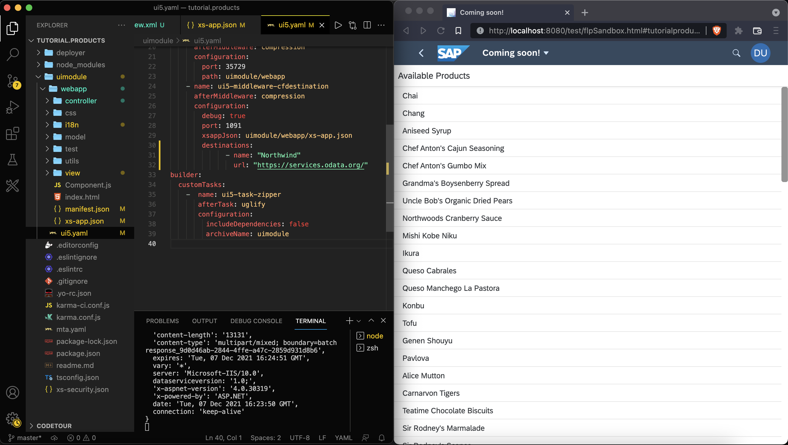
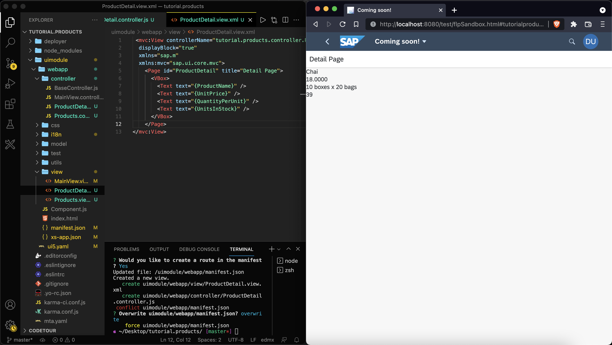

# Display Data from the Northwind Service
<!-- description --> Learn how to display data in your SAPUI5 application and how to navigate between views.

## Prerequisites
- You have previously created a SAPUI5 based project, for instance with the [easy-ui5 generator](sapui5-fiori-cf-create-project).

## You will learn
  - How to use a subgenerator to add an OData model to the SAPUI5 application.
  - How to navigate between SAPUI5 views.
  - How to configure UI5 Tooling middlewares.

---

### Rename "MainView" to "Products"

The easy-ui5 generator creates projects with myui5apps that contain two views out of the box: The `App.view.xml`, which is the outer container of the application, and the `MainView.view.xml`, where you can start developing your application content right away. At this point, it makes sense to rename the `MainView.view.xml` to something more meaningful.

1. Rename the file `MainView.view.xml` to `Products.view.xml`.
1. In the `Products.view.xml` file, **replace** all references to `MainView` with `Products`.
1. Rename the file `MainView.controller.js` to `Products.controller.js`.
1. In the `Products.controller.js` file, replace all references to `MainView` with `Products`.
1. In the `manifest.json` file, replace all references to `MainView` with `Products`.

### Add a list to the products view

**Replace** the current content of the `Products.view.xml` with the following content: A page that contains a list and uses [aggregation binding](https://sapui5.hana.ondemand.com/#/topic/91f057786f4d1014b6dd926db0e91070.html) (also called "list binding"):

```XML [6-12]
<mvc:View
  controllerName="myui5app.controller.Products"
  displayBlock="true"
  xmlns="sap.m"
  xmlns:mvc="sap.ui.core.mvc">
  <Page id="Products" title="Available Products">
    <content>
      <List items="{/Products}">
        <StandardListItem type="Active" title="{ProductName}" />
      </List>
    </content>
  </Page>
</mvc:View>
```

If you check your app in the browser, you'll immediately be able to see that the `App.view.xml` embeds the `Products.view.xml` and displays an empty list. The list is still empty, because there is no data source bound to the application yet.

> In case you still have the breakpoint set up from the [previous tutorial](cp-cf-sapui5-local-debug) (in the `myui5app/webapp/controller/Products.controller.js`), feel free to delete it now.

### Add a data source

To populate the list with items, you have to bind a data source to the application. For this, you can use an easy-ui5 subgenerator:

> You can find a list of all available subgenerators on [GitHub](https://github.com/ui5-community/generator-ui5-project?tab=readme-ov-file#subgenerators).

```Terminal
yo easy-ui5 project model
```

| Parameter     | Value
| :------------- | :-------------
| How do you want to name your new model? (Press enter for default model.) | **keep blank**
| Which type of model do you want to add? | **`OData v2`**
| Which binding mode do you want to use? | **`TwoWay`**
| What is the data source url of your service? | **`https://services.odata.org/V2/Northwind/Northwind.svc/`**
| Do you want to set up a proxy for the new model? | **`Yes`**

Please accept the modifications to existing files.

After restarting the server (`ctrl+C`, then `npm run start:myui5app`), you should see the list of products in your SAPUI5 application.



### Redirect traffic to the data source

The subgenerator already added a proxy (to redirect traffic to the data source) to the `ui5.yaml` of the application. This proxy however only works during development. Once the application runs productively, the `xs-app.json` configuration file (as part of the [SAP Application Router](https://help.sap.com/docs/btp/sap-business-technology-platform/managed-application-router)) takes effect.

Replace the content of the `myui5app/webapp/xs-app.json` file with the following code:

```JSON [10-15]
{
	"welcomeFile": "/index.html",
	"authenticationMethod": "route",
	"routes": [
		{
			"source": "/user-api/currentUser$",
			"target": "/currentUser",
			"service": "sap-approuter-userapi"
		},
		{
			"source": "^/V2/(.*)$",
			"authenticationType": "none",
			"destination": "Northwind",
			"csrfProtection": false
		},
		{
			"source": "^(.*)$",
			"target": "$1",
			"service": "html5-apps-repo-rt",
			"authenticationType": "xsuaa"
		}
	]
}
```

> Caution: The order of routes in the `xs-app.json` file does matter, as they will be checked for from top to bottom, so make sure you keep the same order as in the code above.

With this code you added a new route to the SAP Application Router, which redirects traffic to the `Northwind` destination, which was configured in a [previous tutorial](cp-cf-create-destination).

### Display more product information on a detail page

In this step, you will add a detail page that shows some additional information. You will use another easy-ui5 subgenerator to create a new view.

1. Run another subgenerator using the following command:

```Terminal
yo easy-ui5 project view
```

| Parameter     | Value
| :------------- | :-------------
| How do you want to name your new view? | **`ProductDetail`**
| Do you want to set up a JavaScript controller for your new view? | **`Yes`**
| Do you want to set up a route and target for your new view? | **`Yes`**

Again, accept that the generator can overwrite existing files.

2. Open the `myui5app/webapp/manifest.json` file and add the `productID` to the pattern of the newly created route `RouteProductDetail`:

```JSON [3]
{
  "name": "RouteProductDetail",
  "pattern": "productdetail/{productId}",
  "target": [
    "TargetProductDetail"
  ]
}
```

3. Change the type of the list items and add an event listener in the `myui5app/webapp/view/Products.view.xml` file:

```XML
<StandardListItem type="Navigation" press=".handleListItemPress" title="{ProductName}" />
```


4. Add navigation logic to the `myui5app/webapp/controller/Products.controller.js` to handle the press event. This press event gets the UI5 router, gets the selected `ProductID`, and then passes this id to the navigation method of the router ([documentation](https://sapui5.hana.ondemand.com/sdk/#/topic/2366345a94f64ec1a80f9d9ce50a59ef)):

```JavaScript [11-17]
sap.ui.define([
	"sap/ui/core/mvc/Controller"
],
	/**
	 * @param {typeof sap.ui.core.mvc.Controller} Controller
	 */
	function(Controller) {
		"use strict";

		return Controller.extend("myui5app.controller.Products", {
			handleListItemPress: function(oEvent) {
				const oRouter = sap.ui.core.UIComponent.getRouterFor(this);
				const selectedProductId = oEvent.getSource().getBindingContext().getProperty("ProductID");
				oRouter.navTo("RouteProductDetail", {
					productId: selectedProductId
				});
			}
		});
	});
```


5. Back in the app in the browser, click on any list item. This should trigger the navigation to the new page.

### Add UI elements to the detail page

1. Add controller logic to `myui5app/webapp/controller/ProductDetail.controller.js` to parse the selected product from the routing arguments and to bind the product to the view ([documentation](https://sapui5.hana.ondemand.com/sdk/#/topic/2366345a94f64ec1a80f9d9ce50a59ef)).

```JavaScript [12-31]
sap.ui.define([
    "sap/ui/core/mvc/Controller"
],
    /**
     * @param {typeof sap.ui.core.mvc.Controller} Controller
     */
    function(Controller) {
        "use strict";

        return Controller.extend("myui5app.controller.ProductDetail", {

            onInit: function() {
                const oRouter = sap.ui.core.UIComponent.getRouterFor(this);
                oRouter.getRoute("RouteProductDetail").attachMatched(this._onRouteMatched, this);
            },

            _onRouteMatched: function(oEvent) {
                const iProductId = oEvent.getParameter("arguments").productId;
                const oView = this.getView();
                oView.bindElement({
                    path: "/Products(" + iProductId + ")",
                    events: {
                        dataRequested: function() {
                            oView.setBusy(true);
                        },
                        dataReceived: function() {
                            oView.setBusy(false);
                        }
                    }
                });
            },
        });
    });
```

2. Add the required declarations to the `myui5app/webapp/view/ProductDetail.view.xml` view to to consume the newly bound model and display some properties.

```XML [6-13]
<mvc:View
    controllerName="myui5app.controller.ProductDetail"
    xmlns:mvc="sap.ui.core.mvc"
    xmlns="sap.m"
    displayBlock="true">
	<Page id="ProductDetail" title="Detail Page">
		<VBox>
			<Text text="{ProductName}"/>
			<Text text="{UnitPrice}"/>
			<Text text="{QuantityPerUnit}"/>
			<Text text="{UnitsInStock}"/>
		</VBox>
	</Page>
</mvc:View>
```

3. Once you save the view, the web app should update automatically and display a view similar to this one. We will enrich this UI with more controls in the [next tutorial](sapui5-fiori-cf-fiorify).



---
