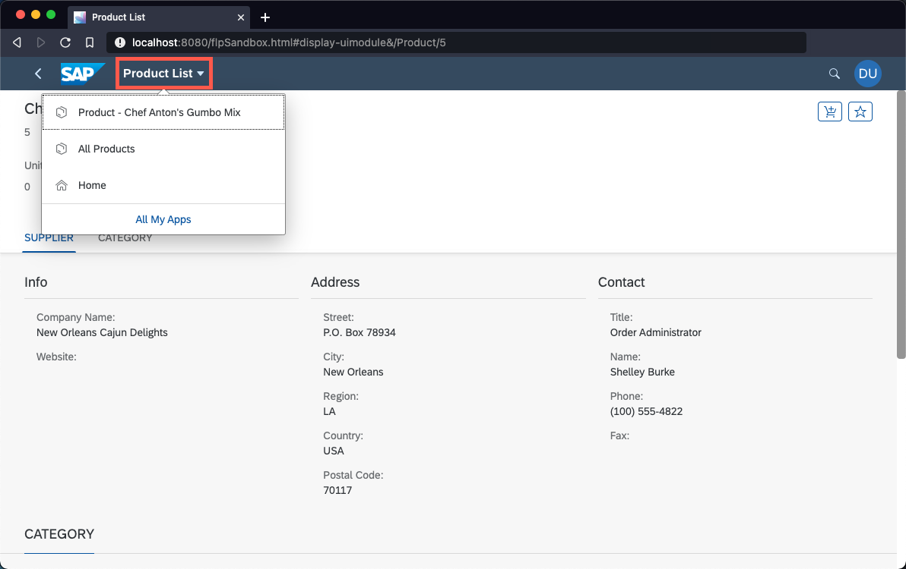

# Add Smart Controls to the User Interface
<!-- description --> Replace the current UI controls with more complex (smart) controls that fully leverage the OData protocol.

## You will learn
  - How to use smart controls like the SmartFilterBar, SmartList, or the ObjectPage.
  - Why smart controls can save you much boilerplate code.


---

### Enrich the products page with smart controls

Smart controls are a specific category of SAPUI5 controls that have some special super powers - the most prominent being the tight integration with the OData protocol version 2. Smart controls read the metadata of bound OData services, which allows them to easily provide features such as filtering, value help, and many more. Read more about smart controls in the [documentation](https://sapui5.hana.ondemand.com/sdk/#/topic/64bde9a8879d4f418e2849f7285dd757).

> Smart controls only work with OData V2. For OData V4, the [SAP Fiori Elements Flexible Programming Model](https://ui5.sap.com/test-resources/sap/fe/core/fpmExplorer/index.html#/overview/introduction) provides "buiding blocks" with similar functionality.

Replace the content of the `uimodule/webapp/view/Products.view.xml` file with the following code, which imports various smart control libraries and makes use of the `smartFilterBar` and `smartList`:

```XML [2-4,6-12]
<mvc:View controllerName="tutorial.products.controller.Products" displayBlock="true"
    xmlns="sap.m"
    xmlns:smartFilterBar="sap.ui.comp.smartfilterbar"
    xmlns:smartList="sap.ui.comp.smartlist"
    xmlns:smartTable="sap.ui.comp.smarttable"
    xmlns:mvc="sap.ui.core.mvc">
    <Page id="Products">
        <smartFilterBar:SmartFilterBar id="smartFilterBar" persistencyKey="UniqueAndStablePersistencyKey" entitySet="Products" considerSelectionVariants="true" />
        <smartList:SmartList id="smartProductList" smartFilter="smartFilterBar" entitySet="Products" expandFields="Category" header="Products List" showRowCount="true" showFullScreenButton="true" enableAutoBinding="true">
            <smartList:listItemTemplate>
                <StandardListItem id="listTemplate" type="Navigation" press="handleListItemPress" title="{ProductName}" info="{= ${UnitPrice} + ' €' }" description="{Category/CategoryName}" />
            </smartList:listItemTemplate>
        </smartList:SmartList>
    </Page>
</mvc:View>
```

Your page should now display product names and contain a smart header with fully functional filter capabilities (give it a first test run if you like).

<!-- border -->

> Did you notice that the list items display the category names, even though the selected entity set [Products](https://services.odata.org/V2/Northwind/Northwind.svc/Products?$format=json) doesn't contain these values. You can still see it because the property `expandFields="Category"` was defined, which expands the `CategoryID` to a full, nested entity. There is nothing you need to do apart from defining the field names to expand. All magic happens behind the scenes in the OData protocol. Feel free to remove this property from the view to see how the displayed data changes.


### Use the smart filter bar

You've already learned about the cool expand-feature of OData in the previous step. In this step, you'll learn about the complex filter operations OData supports out-of-the-box. For this, click on the **Filters** button. A dialog pops up, and you'll be able to define filters on all properties of the displayed entities. Select the grouped view and define a filter for the following criteria:

* The `ProductID` shall be larger than 3.
* The `ProductID` shall also be less than 8.
* The name of the category should be `Beverages`.

Close the dialog by clicking **OK** and apply the filter by clicking **Go**.

<!-- border -->


### Navigate to the detail view

Click on item `Rhönbräu Klosterbier` to navigate to the detail view. You'll upgrade this simple view to a full [ObjectPage control](https://sapui5.hana.ondemand.com/#/api/sap.uxap.ObjectPageSubSection) in the next steps.

<!-- border -->

### Use an ObjectPage in the detail view

Replace the content of the current `uimodule/webapp/view/ProductDetail.view.xml` file with the following code:

```XML
<mvc:View controllerName="tutorial.products.controller.ProductDetail" displayBlock="true"
    xmlns="sap.m"
    xmlns:uxap="sap.uxap"
    xmlns:layout="sap.ui.layout"
    xmlns:form="sap.ui.layout.form"
    xmlns:mvc="sap.ui.core.mvc">
    <uxap:ObjectPageLayout id="ProductDetail">
        <uxap:headerTitle>
            <uxap:ObjectPageHeader id="headerForTest" objectTitle="{ProductName}" objectSubtitle="{ProductID}">
                <uxap:actions>
                    <uxap:ObjectPageHeaderActionButton id="addToCart" icon="sap-icon://cart-4" press="addToCart" tooltip="Add to cart" />
                    <uxap:ObjectPageHeaderActionButton id="markAsFav" icon="sap-icon://unfavorite" press="markAsFav" tooltip="Mark as favorite" />
                </uxap:actions>
            </uxap:ObjectPageHeader>
        </uxap:headerTitle>
        <uxap:headerContent>
            <layout:VerticalLayout id="_IDGenVerticalLayout1">
                <Label id="labelUnits" text="Units in Stock" />
                <ObjectAttribute id="attrUnits" text="{UnitsInStock}" />
            </layout:VerticalLayout>
            <layout:VerticalLayout id="_IDGenVerticalLayout2">
                <Label id="labelOrder" text="Units on Order" />
                <ObjectAttribute id="attrOrder" text="{UnitsOnOrder}" />
            </layout:VerticalLayout>
            <layout:VerticalLayout id="_IDGenVerticalLayout3">
                <Label id="labelState" text="Discontinued" />
                <ObjectAttribute id="attrState" text="{= ${discontinued} ? 'Yes' : 'No' }" />
            </layout:VerticalLayout>
        </uxap:headerContent>
    </uxap:ObjectPageLayout>
</mvc:View>
```

> As of now, this page only consists of a header that leverages data binding to display data. Note that the control `attrState` uses a special type of binding - so-called [expression binding](https://sapui5.hana.ondemand.com/#/topic/daf6852a04b44d118963968a1239d2c0.html) to display "Yes" or "No" depending on the state of the boolean variable `discontinued`.

### Enrich the detail view controller

The header of the view also contains two buttons (`addToCart` and `markAsFav`). In the next sub-steps, you'll implement the event listeners for these buttons.

1. Replace the existing file header of `uimodule/webapp/controller/ProductDetail.controller.js` with the following code, which imports the `MessageToast` control:

    ```JavaScript
    sap.ui.define([
        "tutorial/products/controller/BaseController",
        "sap/m/MessageToast"
      ], function (Controller, MessageToast) {
        "use strict";
    ```

2. Add the following methods to the body of the controller file (after the `_onRouteMatched` method):

    ```JavaScript
    addToCart: function (oEvent) {
        MessageToast.show("Added to cart");
    },

    markAsFav: function (oEvent) {
        const oButton = oEvent.getSource();
        if (oButton.getIcon() === "sap-icon://unfavorite") {
            oButton.setIcon("sap-icon://favorite");
            MessageToast.show("Added to favorites");
            return;
        }

        oButton.setIcon("sap-icon://unfavorite");
        MessageToast.show("Removed from favorites");
    },
    ```

    <!-- border -->

3. **Mark the page as a favorite** via the button in the header of the page to make sure the event handlers work as expected.

> Note that the icon is not supposed to do anything apart from being a toggle button. There is no (useful) controller logic associated with it and it won't store the state in the data model.

### Add more content to the ObjectPage

The following snippet defines the content of the `ObjectPage`. It's mostly basic and repetitive code. Interesting sections are the usage of expression binding for the link control `linkWebsite`, property bindings to the navigation entities "Supplier" and "Category", and the  usage of a custom formatter for the image control `imageCategory`.

1. Replace the content of the current `uimodule/webapp/view/ProductDetail.view.xml` file with the following code: 

    ```XML
    <mvc:View controllerName="tutorial.products.controller.ProductDetail" displayBlock="true"
        xmlns="sap.m"
        xmlns:uxap="sap.uxap"
        xmlns:layout="sap.ui.layout"
        xmlns:form="sap.ui.layout.form"
        xmlns:mvc="sap.ui.core.mvc">
        <uxap:ObjectPageLayout id="ProductDetail">
            <uxap:headerTitle>
                <uxap:ObjectPageHeader id="headerForTest" objectTitle="{ProductName}" objectSubtitle="{ProductID}">
                    <uxap:actions>
                        <uxap:ObjectPageHeaderActionButton id="addToCart" icon="sap-icon://cart-4" press="addToCart" tooltip="Add to cart" />
                        <uxap:ObjectPageHeaderActionButton id="markAsFav" icon="sap-icon://unfavorite" press="markAsFav" tooltip="Mark as favorite" />
                    </uxap:actions>
                </uxap:ObjectPageHeader>
            </uxap:headerTitle>
            <uxap:headerContent>
                <layout:VerticalLayout id="_IDGenVerticalLayout1">
                    <Label id="labelUnits" text="Units in Stock" />
                    <ObjectAttribute id="attrUnits" text="{UnitsInStock}" />
                </layout:VerticalLayout>
                <layout:VerticalLayout id="_IDGenVerticalLayout2">
                    <Label id="labelOrder" text="Units on Order" />
                    <ObjectAttribute id="attrOrder" text="{UnitsOnOrder}" />
                </layout:VerticalLayout>
                <layout:VerticalLayout id="_IDGenVerticalLayout3">
                    <Label id="labelState" text="Discontinued" />
                    <ObjectAttribute id="attrState" text="{= ${discontinued} ? 'Yes' : 'No' }" />
                </layout:VerticalLayout>
            </uxap:headerContent>
            <uxap:sections>
                <uxap:ObjectPageSection id="pageSectionSupplier" title="Supplier">
                    <uxap:subSections>
                        <uxap:ObjectPageSubSection id="subSectionInfo" title="">
                            <uxap:blocks>
                                <form:SimpleForm id="formInfo" title="Info" editable="false" layout="ResponsiveGridLayout">
                                    <form:content>
                                        <Label id="labelCName" text="Company Name" />
                                        <Text id="textCName" text="{Supplier/CompanyName}" />
                                        <Label id="labelWebsite" text="Website" />
                                        <Link id="linkWebsite" text="{= ${Supplier/HomePage}.split('#')[0] }" href="{= ${Supplier/HomePage}.split('#')[1] }" target="_blank" />
                                    </form:content>
                                </form:SimpleForm>
                                <form:SimpleForm id="formAddress" title="Address" editable="false" layout="ResponsiveGridLayout">
                                    <form:content>
                                        <Label id="labelStreet" text="Street" />
                                        <Text id="textStreet" text="{Supplier/Address}" />
                                        <Label id="labelCity" text="City" />
                                        <Text id="textCity" text="{Supplier/City}" />
                                        <Label id="labelRegion" text="Region" />
                                        <Text id="textRegion" text="{Supplier/Region}" />
                                        <Label id="labelCountry" text="Country" />
                                        <Text id="textCountry" text="{Supplier/Country}" />
                                        <Label id="labelCode" text="Postal Code" />
                                        <Text id="textCode" text="{Supplier/PostalCode}" />
                                    </form:content>
                                </form:SimpleForm>
                                <form:SimpleForm id="formContact" title="Contact" editable="false" layout="ResponsiveGridLayout">
                                    <form:content>
                                        <Label id="labelTitle" text="Title" />
                                        <Text id="textTitle" text="{Supplier/ContactTitle}" />
                                        <Label id="labelContactName" text="Name" />
                                        <Text id="textContactName" text="{Supplier/ContactName}" />
                                        <Label id="labelPhone" text="Phone" />
                                        <Text id="textPhone" text="{Supplier/Phone}" />
                                        <Label id="labelFax" text="Fax" />
                                        <Text id="textFax" text="{Supplier/Fax}" />
                                    </form:content>
                                </form:SimpleForm>
                            </uxap:blocks>
                        </uxap:ObjectPageSubSection>
                    </uxap:subSections>
                </uxap:ObjectPageSection>
                <uxap:ObjectPageSection id="pageSesctionCategory" title="Category">
                    <uxap:subSections>
                        <uxap:ObjectPageSubSection id="subSectionCategory" title="">
                            <uxap:blocks>
                                <form:SimpleForm id="formCategory" editable="false" layout="ResponsiveGridLayout">
                                    <form:content>
                                        <Label id="labelCategoryName" text="Name" />
                                        <Text id="textCategoryName" text="{Category/CategoryName}" />
                                        <Label id="labelCategoryDescription" text="Description" />
                                        <Text id="textCategoryDescription" text="{Category/Description}" />
                                        <Label id="labelPicture" text="Picture" />
                                        <Image id="imageCategory" src="{ path : 'Category/Picture', formatter : '.trimSuperfluousBytes' }" width="150px" height="150px" />
                                    </form:content>
                                </form:SimpleForm>
                            </uxap:blocks>
                        </uxap:ObjectPageSubSection>
                    </uxap:subSections>
                </uxap:ObjectPageSection>
            </uxap:sections>
        </uxap:ObjectPageLayout>
    </mvc:View>
    ```

### Populate the empty fields

You probably noticed empty fields that do not show any data yet. Most of the fields are empty because they are bound to properties of navigation entities like "Supplier". The data is missing because you didn't specify that these entities should be expanded during the programmatic binding of the view.

1. Update the binding definition, to expand the suppliers and categories, in the `_onRouteMatched` method of the controller `uimodule/webapp/controller/ProductDetail.controller.js` with the following code:

    ```JavaScript [6-8]
    _onRouteMatched: function (oEvent) {
        const iProductId = oEvent.getParameter("arguments").productId;
        const oView = this.getView();
        oView.bindElement({
            path: "/Products(" + iProductId + ")",
            parameters: {
                expand: "Supplier,Category"
            },
            events: {
                dataRequested: function () {
                    oView.setBusy(true);
                },
                dataReceived: function () {
                    oView.setBusy(false);
                }
            }
        });
    },
    ```

2. Now the "picture" field should be the only empty one. The field is still empty, as you need to add a custom formatter to deal with a [quirk of the Northwind image encoding](https://blogs.sap.com/2017/02/08/displaying-images-in-sapui5-received-from-the-northwind-odata-service/). Add this formatter after the `markAsFav` method to complete the controller.

    ```JavaScript
    trimSuperfluousBytes: function (sVal) { // background info https://blogs.sap.com/2017/02/08/displaying-images-in-sapui5-received-from-the-northwind-odata-service/
        if (typeof sVal === "string") {
            const sTrimmed = sVal.substring(104);
            return "data:image/bmp;base64," + sTrimmed;
        }
        return sVal;
    }
    ```

3. The view should now look like this:

    <!-- border -->

### Add hierarchy information (optional)

In this step, you add hierarchy information to the `Shellbar` at the top of the page to enable fast navigation shortcuts.

1. Add a method to the `uimodule/webapp/controller/BaseController.js` which you will use to interface the hierarchy feature of the `Shellbar`. Note that a [JavaScript closure](https://www.w3schools.com/js/js_function_closures.asp) is being used to store the history. Add this method after the `onNavBack` method:

    ```JavaScript
    addHistoryEntry: (function () {
        let aHistoryEntries = [];

        return function (oEntry, bReset) {
            if (bReset) {
                aHistoryEntries = [];
            }

            var bInHistory = aHistoryEntries.some(function (oHistoryEntry) {
                return oHistoryEntry.intent === oEntry.intent;
            });

            if (!bInHistory) {
                aHistoryEntries.unshift(oEntry);
                this.getOwnerComponent().getService("ShellUIService").then(function (oService) {
                    oService.setHierarchy(aHistoryEntries);
                });
            }
        };
    })()
    ```

    > Note that this implementation is used to display the history instead of the hierarchy of pages.

2. In the previous sub-step you used the `ShellUIService` which is not loaded by default. Change this in the `uimodule/webapp/manifest.json` and add a new configuration in the `sap.ui5` property after the `models` section:

    ```JSON
    "services": {
            "ShellUIService": {
                "factoryName": "sap.ushell.ui5service.ShellUIService",
                "lazy": false,
                "settings": {
                    "setTitle": "auto"
                }
            }
        }
    ```

3. Add a new history item when the controller of the list view (`uimodule/webapp/controller/Products.controller.js`) is initialized;

    ```JavaScript
    onInit: function () {
        this.addHistoryEntry({
            title: "All Products",
            icon: "sap-icon://product",
            intent: "#display-uimodule"
        }, true);
    },
    ```

4. Add a new history item when the product detail page has been loaded. Replace the `dataReceived` hook inside the `_onRouteMatched` method with the following code (inside the `uimodule/webapp/controller/ProductDetail.controller.js`):

    ```JavaScript
    dataReceived: function () {
        oView.setBusy(false);
        this.addHistoryEntry({
            title: "Product - " + oView.getBindingContext().getProperty("ProductName"),
            icon: "sap-icon://product",
            intent: "#display-uimodule&/Product/" + iProductId
        });
    }.bind(this)
    ```

5. Click on the name of the Fiori App to see the hierarchy menu in action:

<!-- border -->

---
