## Details
### You will learn
  - How to prepare the interface between the web app and the Fiori Launchpad
  - How to bundle the web app in a zip for an [MTA deployment](https://help.sap.com/viewer/4505d0bdaf4948449b7f7379d24d0f0d/2.0.03/en-US/4050fee4c469498ebc31b10f2ae15ff2.html)
  - How to access the UI5 flexibility services


---

[ACCORDION-BEGIN [Step : ](Connect to a Cloud Foundry endpoint)]

Make sure you are connected to a Cloud Foundry endpoint to which you will deploy the SAPUI5 application later.

1. Click on the bottom-left corner of the screen to start the connection flow.

    !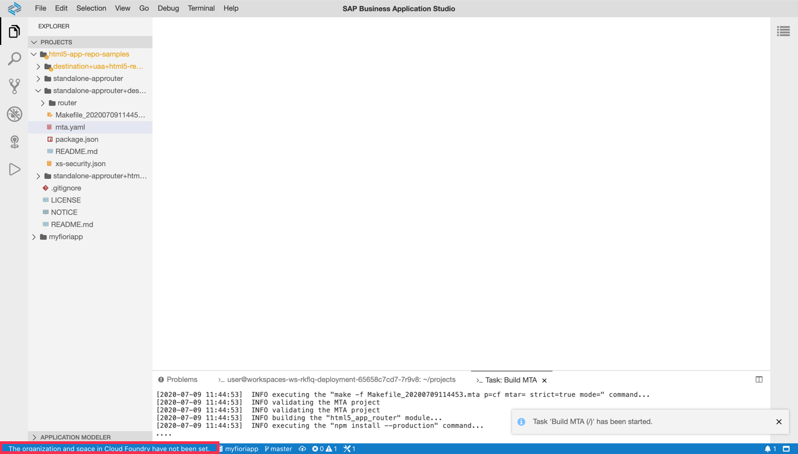

2. Enter the Cloud Foundry endpoint you want to use. If your environment runs in the EU10-region, this is `https://api.cf.eu10.hana.ondemand.com`. Enter your email and your password to proceed.

    !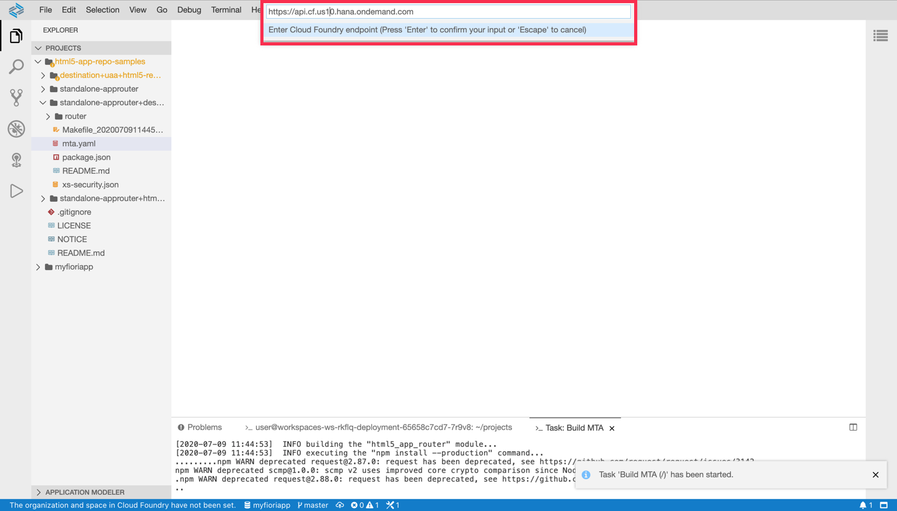

3. Next, you need to select the Cloud Foundry **organization and space** you want to use. You will see that you are connected to the endpoint once these prompts have been answered.


[DONE]
[ACCORDION-END]
[ACCORDION-BEGIN [Step : ](Adapt the web app manifest)]
1. Use the command palette (F1) to **open** the `webapp/manifest.json` file.

    !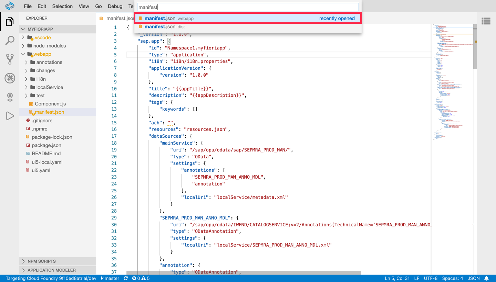

2.  **Add** a new intent to open the application and **replace** the hard coded URIs of the main service to use relative, instead of absolute, URLs.

    ```JavaScript [17-30,33,44]
    {
        "_version": "1.8.0",
        "sap.app": {
            "id": "Namespace1.myfioriapp",
            "type": "application",
            "i18n": "i18n/i18n.properties",
            "applicationVersion": {
                "version": "1.0.0"
            },
            "title": "{{appTitle}}",
            "description": "{{appDescription}}",
            "tags": {
                "keywords": []
            },
            "ach": "",
            "resources": "resources.json",
            "crossNavigation": {
                "inbounds": {
                    "intent1": {
                        "signature": {
                            "parameters": {},
                            "additionalParameters": "allowed"
                        },
                        "semanticObject": "uimodule",
                        "action": "display",
                        "title": "FioriApp",
                        "icon": "sap-icon://add"
                    }
                }
            },
            "dataSources": {
                "mainService": {
                    "uri": "sap/opu/odata/sap/SEPMRA_PROD_MAN/",
                    "type": "OData",
                    "settings": {
                        "annotations": [
                            "SEPMRA_PROD_MAN_ANNO_MDL",
                            "annotation"
                        ],
                        "localUri": "localService/metadata.xml"
                    }
                },
                "SEPMRA_PROD_MAN_ANNO_MDL": {
                    "uri": "sap/opu/odata/IWFND/CATALOGSERVICE;v=2/Annotations(TechnicalName='SEPMRA_PROD_MAN_ANNO_MDL',Version='0001')/$value/",
                    "type": "ODataAnnotation",
                    "settings": {
                        "localUri": "localService/SEPMRA_PROD_MAN_ANNO_MDL.xml"
                    }
                },
            }
        }
    }
    ```


[DONE]
[ACCORDION-END]
[ACCORDION-BEGIN [Step : ](Define routes)]

The web app needs to be connected to a destination from which the data will be requested. For this, **create** a `webapp/xs-app.json` file to forward  traffic that begins with "sap" to the respective description. All other traffic should be sent to the HTML5 Application Repository, in which the web app will reside.

```JSON
{
    "routes": [
        {
            "source": "^/sap/opu/odata/",
            "destination": "ES5",
            "csrfProtection": false
        },
        {
            "source": "^(.*)",
            "target": "$1",
            "authenticationType": "xsuaa",
            "service": "html5-apps-repo-rt"
        }
    ]
}
```

[DONE]
[ACCORDION-END]
[ACCORDION-BEGIN [Step : ](Bundle the web app)]

As with all SAPUI5-based projects, you can use `ui5 build` (from the project root) to minify all resources.

For easier deployment, we want to bundle the web application into a zip archive. This enables us to use the [Generic Application Content Deployer (GACD)](https://help.sap.com/viewer/29badeeee3684338b2e870139bdc4d86/Cloud/en-US/439431592b8e465c834e64741746e013.html) module to upload the application to the HTML5 Application Repository. Such modules have [various requirements](https://help.sap.com/viewer/956efb6db08c450bb303a0d316b72f10/Cloud/en-US/366ccd965fb8477a9b802ceefd5d40d4.html), two of which are not yet fulfilled:

* `manifest-bundle.zip`: must exist in the root of the HTML5 app and must contain `manifest.json` and i18n files packaged as a zip.
* All files need to be packaged in a zip file.

The first items can be done with a standard task; for the second item, we need to add a [custom task](https://sap.github.io/ui5-tooling/pages/extensibility/CustomTasks/) to the UI5 tooling.

1. **Install** the custom task by running `npm add ui5-task-zipper` in the project root.
2. Once the installation is done, you can see the new dependency in the `package.json` file. **Add** this dependency also to the `ui.dependencies`.

    ```JSON[7]
    {
    	"name": "myfioriapp",
    	...,
    	"ui5": {
    		"dependencies": [
    			"@sap/ux-ui5-tooling",
                "ui5-task-zipper"
    		]
    	},
    	"dependencies": {
    		"@sap/ux-specification": "1.78.2",
    		"@sap/ux-ui5-tooling": "1.0.8",
    		"ui5-task-zipper": "0.3.1"
    	}
    }
    ```

3. **Open** the `ui5.yaml` descriptor and add the custom task to the build process.

    ```YAML[6-11]
    specVersion: '1.0'
    metadata:
      name: 'myfioriapp'
    type: application
    ui5Theme: sap_fiori_3
    builder:
      customTasks:
        - name: "ui5-task-zipper"
          afterTask: "uglify"
          configuration:
            archiveName: "uimodule"
    server:
      customMiddleware:
        - name: fiori-tools-proxy
          afterMiddleware: compression
          configuration:
            ignoreCertError: false # If set to true, certificate errors will be ignored. E.g. self-signed certificates will be accepted
            backend:
              - path: /sap
                destination: ES5
                url: https://sapes5.sapdevcenter.com
            ui5:
              path:
                - /resources
                - /test-resources
              url: https://ui5.sap.com
              version:  # The UI5 version, for instance, 1.78.1. Empty means latest version
        - name: fiori-tools-appreload
          afterMiddleware: compression
          configuration:
            port: 35729
            path: webapp
    ```

4. Run the build command that includes the standard task and the custom task.

    ```Terminal
    ui5 build  --clean-dest --include-task=generateManifestBundle
    ```

5. You should see hat the build completed successfully and that there is a new `dist` folder in your project tree. In this folder, you can find the bundles app `uimodule.zip`.

    !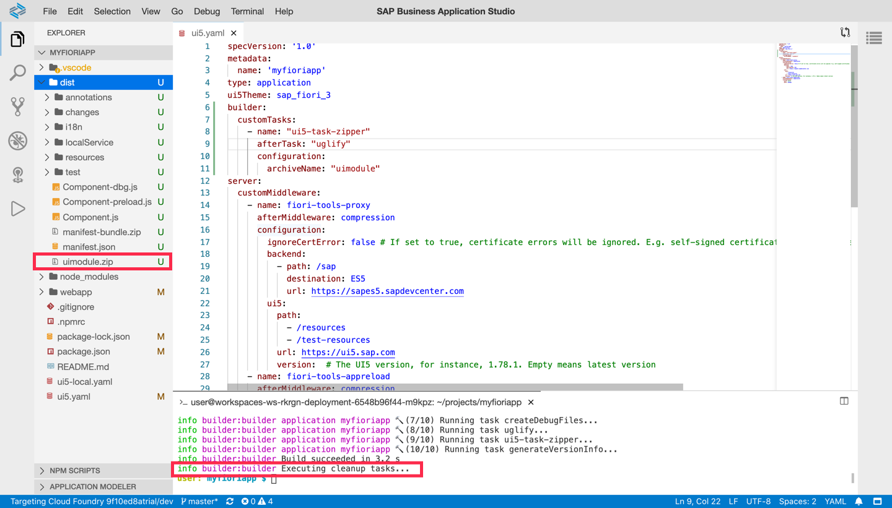


[VALIDATE_1]
[ACCORDION-END]
[ACCORDION-BEGIN [Step : ](Clone the sample app)]

To accelerate things a little bit, we will clone an existing demo app that also deploys a Fiori app to the Fiori Launchpad on Cloud Foundry.

1. Navigate to the directory that contains the current project and clone the sample app in this folder.

    ```Terminal
    cd /home/user/projects/
    git clone https://github.com/SAP-samples/multi-cloud-html5-apps-samples/
    ```

2. Select **`File | Open Workspace`** and select **multi-cloud-html5-apps-samples/standalone-portal-keyuser-mta** as the new workspace directory.

    !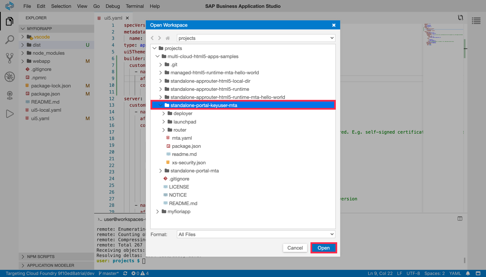

3. You should now see the following files in the *Explorer* panel.

    !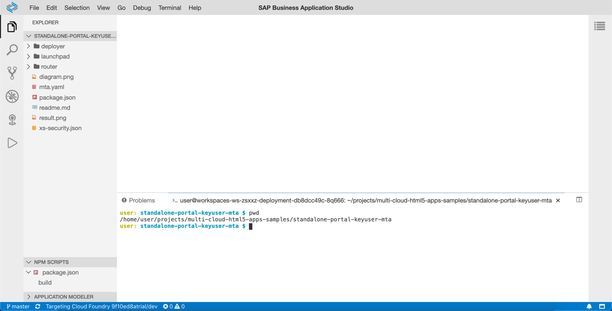

[DONE]
[ACCORDION-END]
[ACCORDION-BEGIN [Step : ](Replace the web app)]

Remove the existing web app bundle (`.zip` file) with the archive from the previous step.

1. In the sample repo, another application will be deployed to the Fiori Launchpad. **Open** the `launchpad/portal-site/CommonDataModel.json` and **replace** the old app id with the one from the new web application.

    ```JSON [20,39,40]
    {
      "_version": "3.0.0",
      "identification": {
        "id": "c9aae627-9601-4a11-83c3-41b94a3c8026-1576776549699",
        "entityType": "bundle"
      },
      "payload": {
        "catalogs": [
          {
            "_version": "3.0.0",
            "identification": {
              "id": "defaultCatalogId",
              "title": "{{catalogs.title}}",
              "entityType": "catalog",
              "i18n": "i18n/i18n.properties"
            },
            "payload": {
              "viz": [
                {
                  "id": "Namespace1.myfioriapp",
                  "vizId": "uimodule-display"
                }
              ]
            }
          }
        ],
        "groups": [
          {
            "_version": "3.0.0",
            "identification": {
              "id": "defaultGroupId",
              "title": "{{groups.title}}",
              "entityType": "group",
              "i18n": "i18n/i18n.properties"
            },
            "payload": {
              "viz": [
                {
                  "id": "Namespace1.myfioriapp",
                  "appId": "Namespace1.myfioriapp",
                  "vizId": "uimodule-display"
                }
              ]
            }
          }
        ],
        "sites": [...]
      }
    }
    ```

2. **Replace** the old web app bundle with the new bundle.

    ```Terminal
    rm deployer/resources/uimodule.zip
    cp ../../myfioriapp/dist/uimodule.zip deployer/resources/uimodule.zip
    ```

[DONE]
[ACCORDION-END]
[ACCORDION-BEGIN [Step : ](Deploy the project)]


1. **Right-click** on the `mta.yaml` descriptor and select **Build MTA**.

    !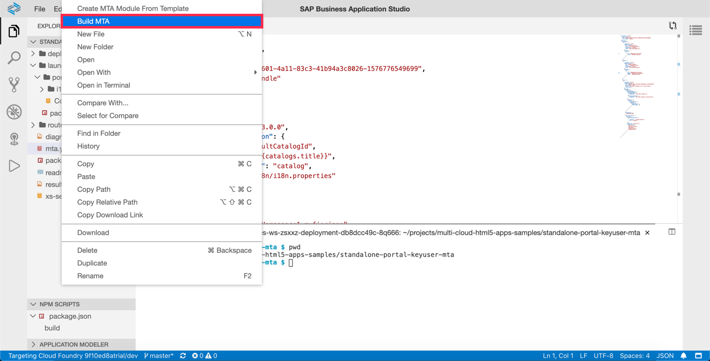

2. Once the build has completed, you will see a new file `mta_archives/standalone-portal-mta_0.0.1.mtar`. **Right-click**  on this file and **Deploy MTA Archive** to SAP Cloud Platform.

    !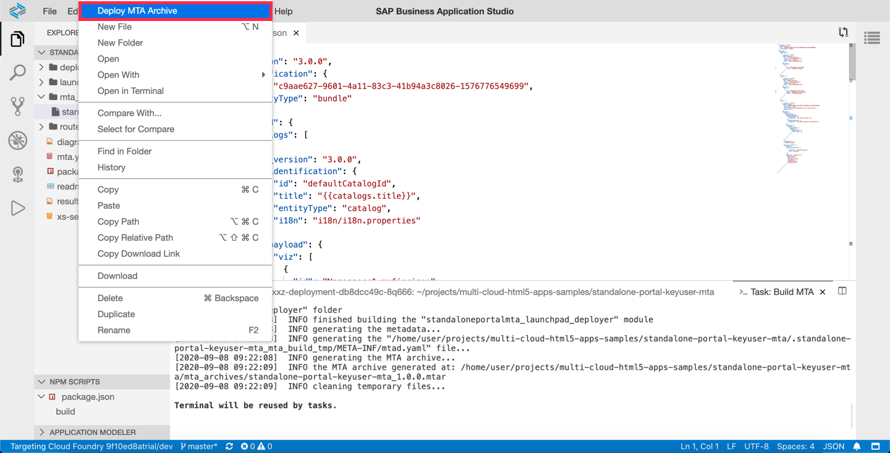


5. You can find the URL of the deployed application in the output that is written to the *Task: Deploy MTA Archive* panel.


    !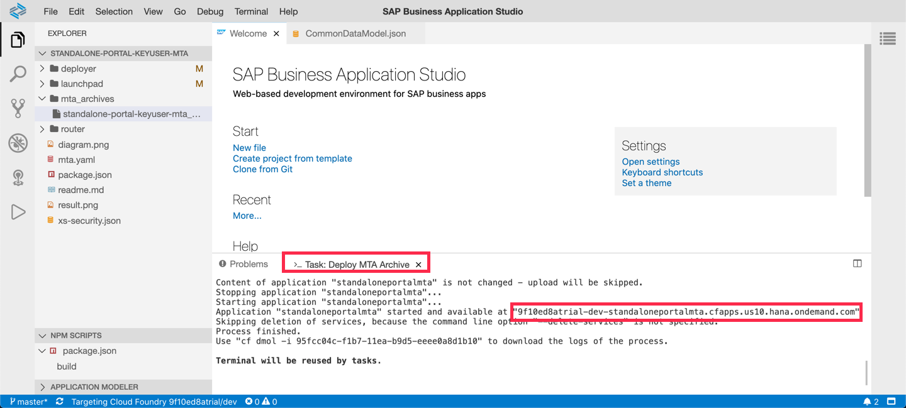


[DONE]
[ACCORDION-END]
[ACCORDION-BEGIN [Step : ](Test the flexibility services)]

1. **Open** the URL from the previous step and **click** on the tile *Fiori App*.

    !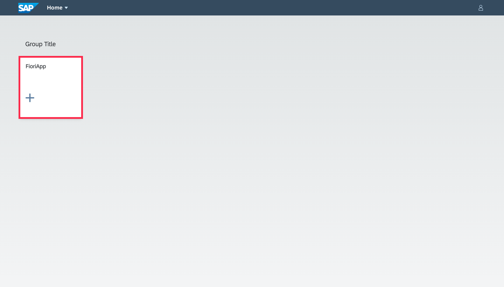

2. On the list report page, you can use the [Variant Management](https://experience.sap.com/fiori-design-web/variant-management/) to see only the records you are interested in. Users have the option to save the variant settings in their user-space. **Click** on any item to proceed to the next object page.

    !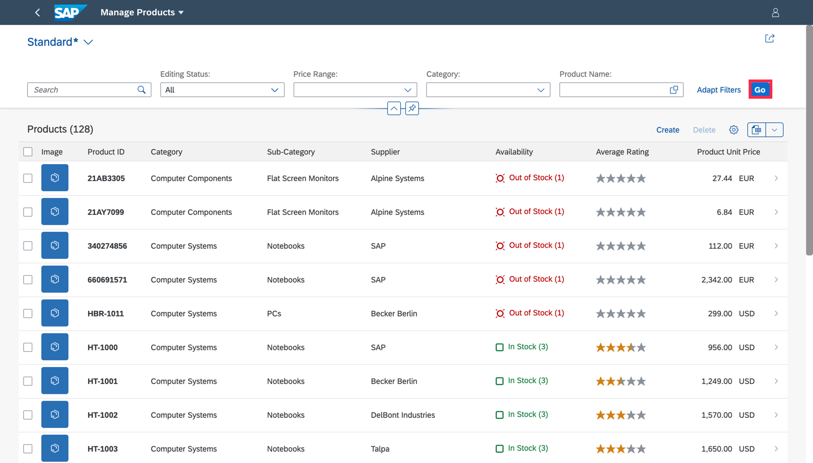

3. You can use both UI5 flexibility services, the personalization service, and the key-user service on the object page. **Open** the [user actions menu](https://help.sap.com/viewer/0292066056f642f1a0f6d9135e39abaf/2005/en-US/27834b1aacf344f38910686d8fb0eb0a.html) in the top right corner to see both options.

    !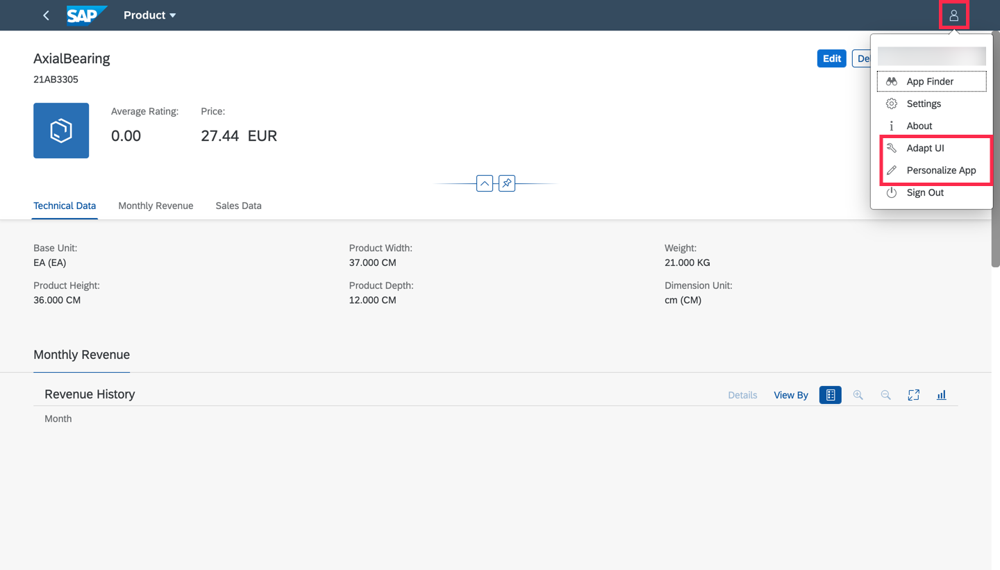


> Note that the role **`FlexKeyUser`** needs to be [assigned to your user](https://help.sap.com/viewer/65de2977205c403bbc107264b8eccf4b/Cloud/en-US/eaa6a26291914b348e875a00b6beb729.html) to be able to adapt the UI. After assigning the role, you need to sign off and back on.


[DONE]
[ACCORDION-END]
---
