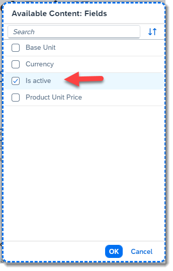
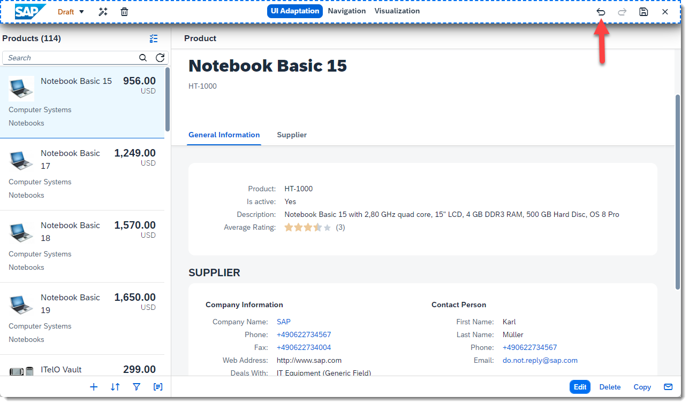
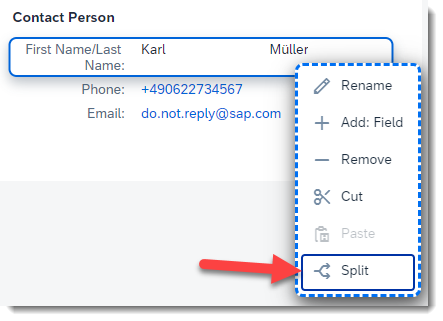
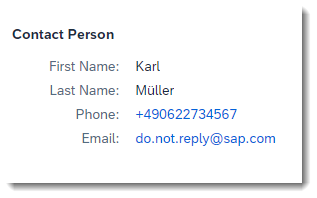
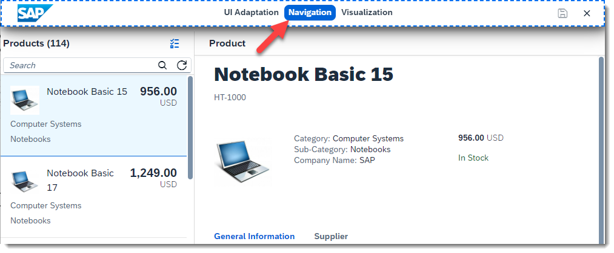
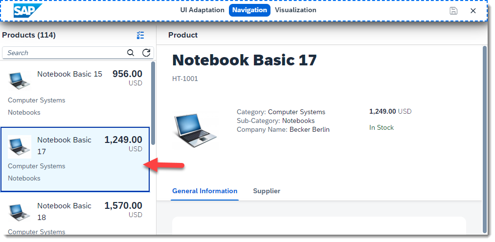
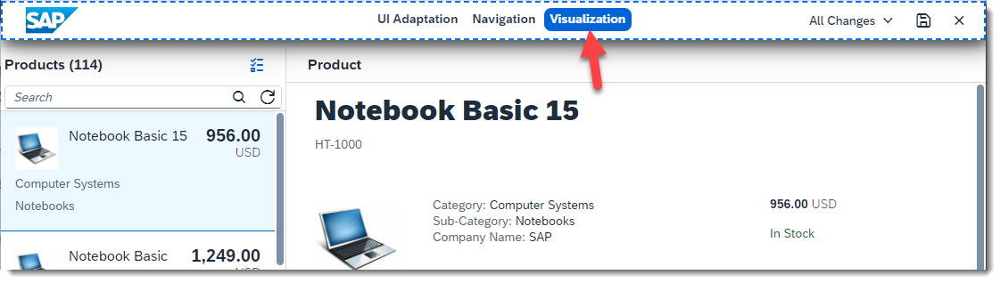
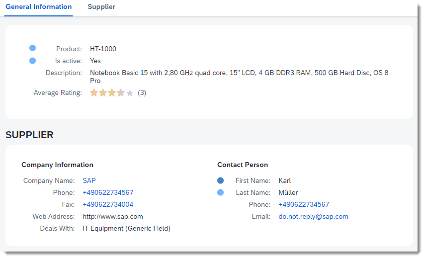
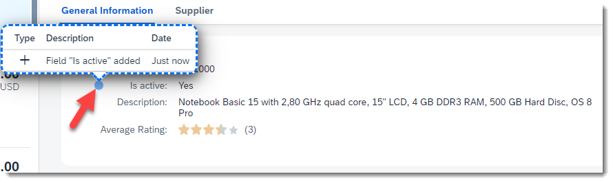
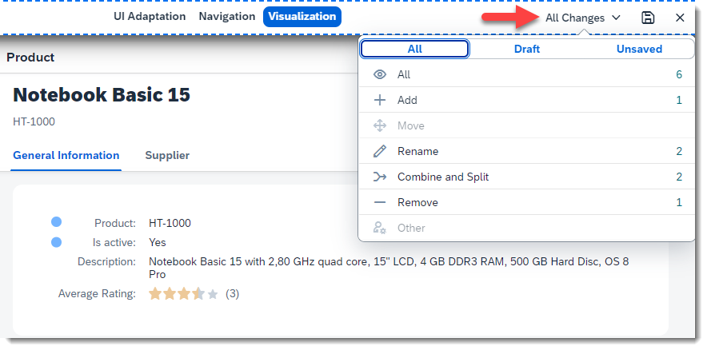

# Key User Adaptation for SAPUI5 Applications - UI Changes and Modes
<!-- description --> Learn more about the key user adaptation feature of SAPUI5 flexibility while trying different actions.

## You will learn
  - What are UI changes and where to create them.
  - The processes of adding, removing, combining, and splitting elements.
  - The different modes: adaptation, navigation and visualization.

## Intro
Everything that you adapt in the application is saved as a **UI change**. These changes are applied on top of the original application, meaning that you can't break anything and all changes can be easily reverted. If the application is updated, your UI changes are still valid. UI changes should be made in an environment where they can be properly tested before reaching productive users - this is typically a quality system. Once the changes are validated, they can be transported to a productive environment.

> As changes can be interdependent, **never** make changes for the same application in different systems to avoid conflicts!

In the next steps you will learn how to create other UI changes and see more features of key user adaptation.

---

### Adding and removing elements

1. Go again to the [SAPUI5 Demo Kit](https://ui5.sap.com/#/demoapps), and open the **Key User Adaptation** demo app under *SAPUI5 Flexibility Demo Apps*.

2. Start key user adaptation by clicking on the upper right **DU** icon and selecting **Adapt UI**. Make sure to select *Original App* on the Version drop down (left side of the toolbar). This will load the app without any previous UI changes so you can start a new draft. The draft is only visible to key users and only while in adaptation mode - end users will not see any UI changes until the draft is activated as a version.

3. Go to the **General Information** section and right-click on the first field, **Product**. Then select **Add: Field**.

    

4. On the dialog, select **Is active** and press **OK**.
   
    

5. The new field is added to the form.
   
    >The fields you see in the dialog are coming from the underlying data model, typically an OData service in your backend.

    >If a field is added as *custom field* to the data model, *Add Field* is the right way to bring it to the application.

6. Now right-click on field **Supplier** and select **Remove**.

    

7. The field is removed from the form.

8. You can press **Undo** on the toolbar to revert your last action.

    

    >You can also add the removed field back using the same **Add Field** action from steps 3 and 4.

9. By pressing **Redo** on the same toolbar, you can execute the action again.

### Combining and splitting elements

1. Without leaving the adaptation mode, find the **Supplier** section and the **Contact Person** group. Now select field **First Name** by left-clicking on it.

2. Hold *shift* or *ctrl* (or *command* on a Mac) on your keyboard and select field **Last Name**. Both fields should now be selected.

3. Right-click on any of the selected fields and click **Combine**.
   
    

4. Both fields are now combined into one. This feature is useful to save space on the UI, especially in applications with many fields.
    
    >The order of the entries in the combined field depends on the order in which the original fields were selected. The combined field will appear in the same position as the field where you triggered the *Combine* action.

5. Right-click on this field again and press **Split**. The fields are now separated again.

    

 6. Both fields retain the name from the combined field. This is because the field might have been renamed, and you don't want to lose the new name. Rename them back to *First Name* and *Last Name*.

    

    > By now you probably noticed that not all actions are available for every control. The available actions depend on many factors such as the control type, where it is located in the application and whether the action makes sense in the application context.

### Navigation mode

1. Key user adaptation always starts in **Adaptation** mode, where you can execute actions on controls to create UI changes. On the middle of the toolbar, press **Navigation**. This will bring you to *navigation* mode, where you are able to interact normally with the application controls without leaving key user adaptation.

    

2. Select the second product from the list on the left. Notice that this was not possible in *adaptation* mode, where the normal control functionality is replaced with the tools to enable UI changes.

     

3. Now press **UI Adaptation** in the toolbar to go back to adaptation mode. You can now continue making UI changes while on the detail page of the second product.
   
>In more complex applications, the navigation mode is useful for cases like navigating between pages or opening and adapting content inside dialogs.

### Visualization mode

1. On the middle of the toolbar, press **Visualization**. This will bring you to *visualization* mode, where you can see the UI changes which were created in the application so far.

    

2. In this mode you can see markers on the elements where UI changes were made.

     

3. Click on a marker to see a detailed list of changes created for that element.

    
    
    >Darker marker colours mean that more changes were created for a particular element.

4. On the toolbar, you can also select particular UI change types to be displayed or filter them by whether they were already part of the *Draft* or just created - *Unsaved*.
   
    

Well done! You now know how to add new fields and combine and split them. You also learned how to navigate your application in key user adaptation and see details about the UI changes which were created.
In the next tutorial you will look at more advanced features of key user adaptation using an SAP Fiori elements app.