# Key User Adaptation for SAPUI5 Applications - Custom Actions, Views and Embedded Content
<!-- description --> Learn advanced SAPUI5 flexibility key user adaptation features using an SAP Fiori elements application: custom actions, views and embedding external content.

## You will learn
  - How to use custom actions - like changing the filters in an SAP Fiori elements application.
  - Creating and configuring tailored views.
  - How to embed external content on an Object Page.

## Intro
So far you have learned how easy it is to adapt applications using intuitive "what you see is what you get" actions like move, rename and add controls. You have also learned about *UI changes* and how to use the different modes available in key user adaptation. In this tutorial, you will learn how to use *custom actions*, which enable you to, for example, change filters and layouts in SAP Fiori elements applications. With this feature, you will create a *view* that displays only products in stock. Finally, you will look at how to *embed external content* to Object Pages by adding a section containing search results for the product.

---

### Custom actions and views

1. Go again to the [SAPUI5 Demo Kit](https://ui5.sap.com/#/demoapps), and this time open the **Key User Adaptation for SAP Fiori Elements** demo app under *SAPUI5 Flexibility Demo Apps*.

2. Start key user adaptation by clicking on the upper right **DU** icon and selecting **Adapt UI**. Make sure to select *Original App* on the Version drop down (left side of the toolbar). This will load the app without any previous UI changes so you can start a new draft.
   
    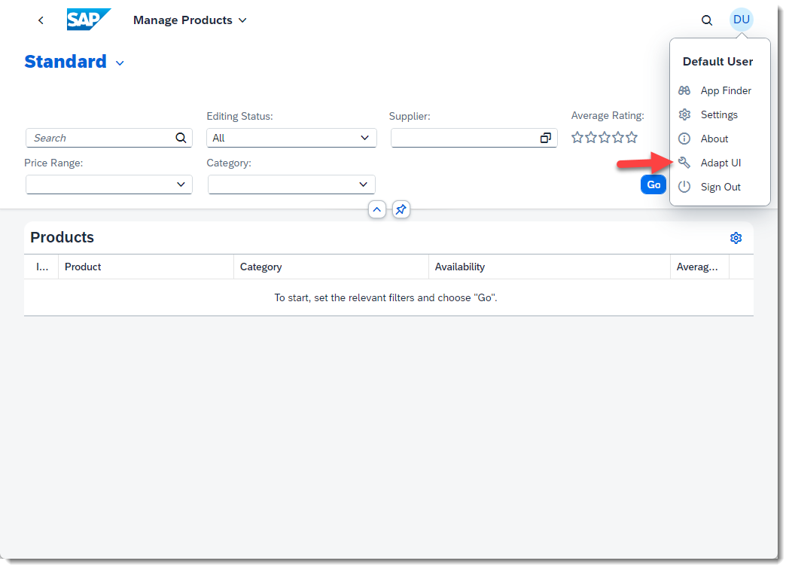

3. In SAPUI5 Fiori elements apps, UI changes are usually saved in **views**. The default is a *Standard* view, which is delivered with the application.

    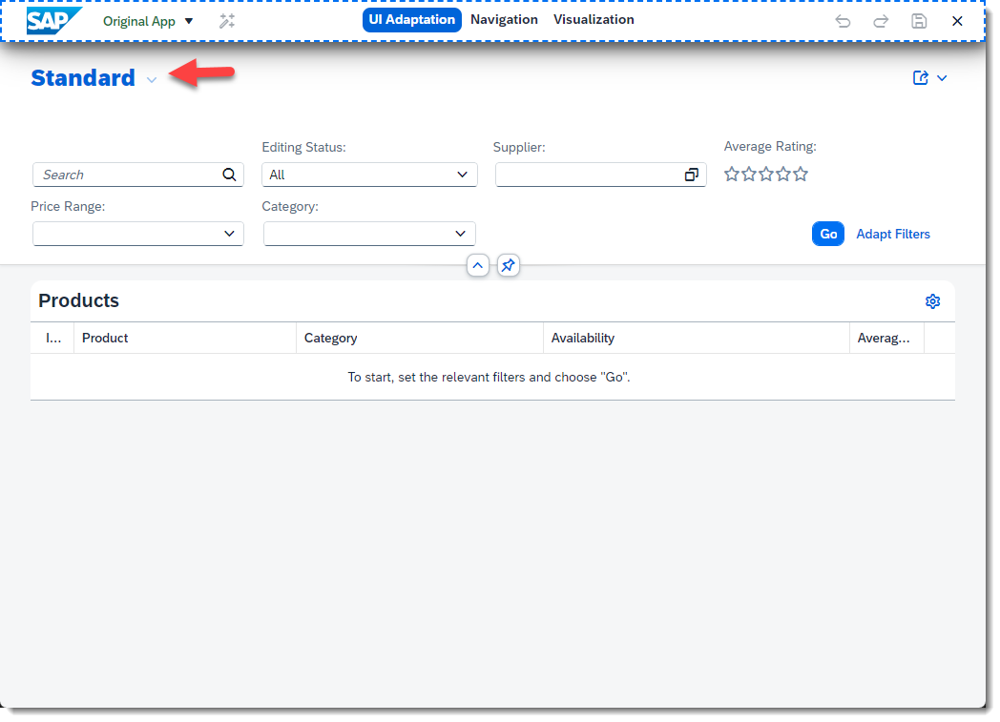
   
4.  Now let's say you are interested in seeing only products that are in stock. You can create a view tailored for this purpose. Right-click on the filter area and choose **Adapt Filters**.

    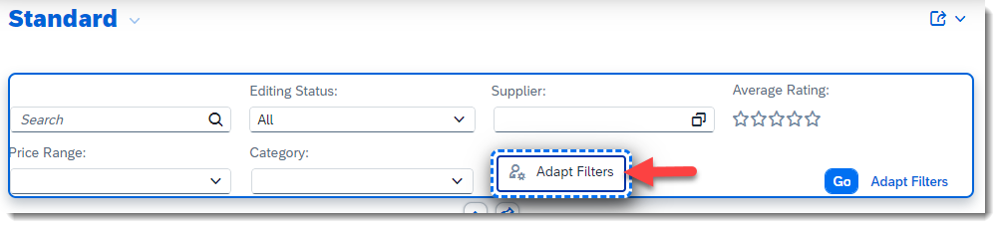

    > Notice that you can't select single filter fields to execute actions directly on them like you did with form fields in the previous tutorials. Every change on the filters is created using the *Adapt Filters* custom action in this application.

5. On the dialog, first press **Show Values** so you can define pre-selected values for the filters.
   
    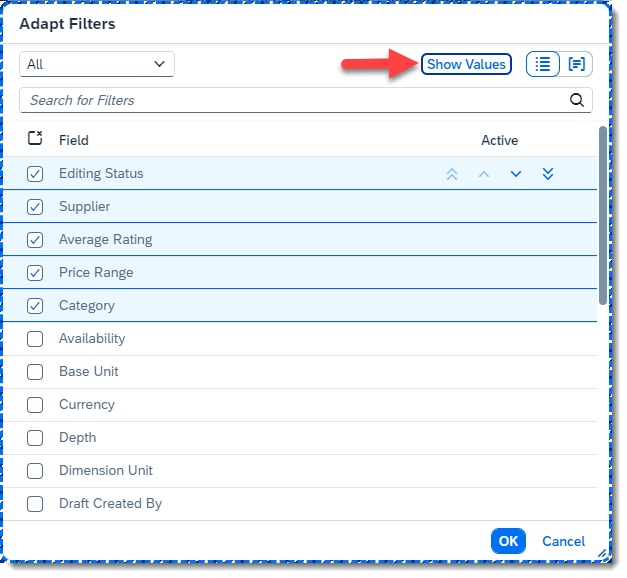

6. Now, select **Availability** and de-select all other fields. Then choose only the value *In Stock* from the available values.
   
    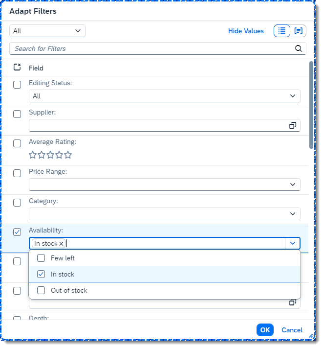

7. Now press **OK**. You will receive a warning saying that the view is protected: when you make a change on a filter, it becomes part of the view. However, the *Standard* view cannot be modified in some applications, meaning you need to create a new view for your changes. Simply press **Save as New View** and call it *In Stock*. Here you can also decide if the view should be the *default* view (displayed when the application starts) and if it should be applied automatically (meaning that the search will be executed when the view is selected). For our example, let's select **Apply Automatically**. Finally, press **Save**.

    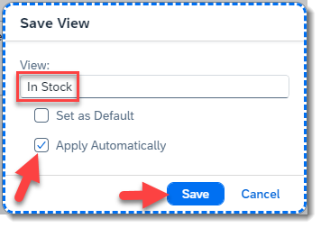

8. Your new view will be selected, and the results will be displayed on the table.

    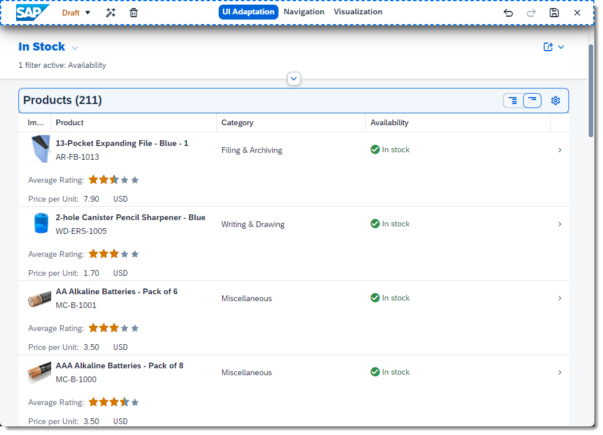

    > At this point you might be asking: as an end user I can also adapt filters and create views - why would I do it in key user adaptation mode? The difference is that the views you create as key user will be available to all end users - while the views created by each end user will only be visible to that end user. The views you create as key user have no influence over existing end user views.

9.  By right-clicking on the view name, you can see the available actions for views. Let's modify this view by selecting **Manage Views**.

    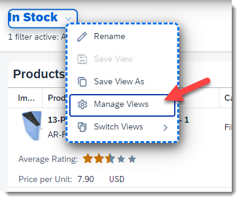

10. In this dialog you can rename the views you created, as well as decide whether they should be a *favorite* (visible in the list of selectable views) by clicking on the star on the left side of the view name (by default every new view is marked as a favorite). You can also choose which view will be displayed when the application starts - the *default* view. Furthermore, you can change whether the view should be applied automatically and see who created the view. Finally, by clicking on the *X* you can delete a view. For now, let's simply make our new *In Stock* view the default view.
    
    > Notice that, when you mark a view as *default*, it automatically becomes a favorite. The *Standard* view is always a favorite and cannot be deleted. A view not marked as favorite is still accessible via the *Manage Views* dialog.
    
    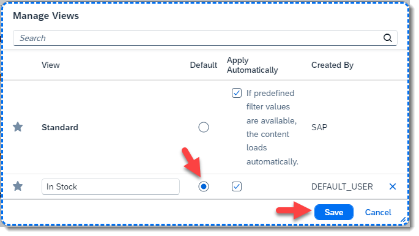

11. Before you proceed, save your changes in a new version. Version names can help you keep track of what was done in different versions. Press the **Activate New Version** button on the left of the top toolbar and name it *Added In Stock View*. Only key users can see version names - they are not visible nor relevant to end users. Press **Confirm** to activate the new version.
    
    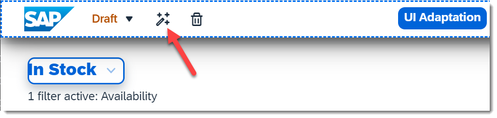

    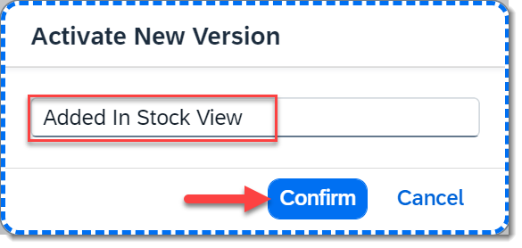

    > In this app, you can also make changes to the table, giving you many options for creating optimized views for your use cases. Views are not exclusive to SAP Fiori elements apps, but they are very commonly used in them.

Congratulations! You created a new view that displays all products in stock and made it the default view.

### Embedding external content

1. Go to **Navigation** mode and select the first item from the table (Product *AR-FB-1013*). This will navigate you to the Object Page displaying details about this product.

    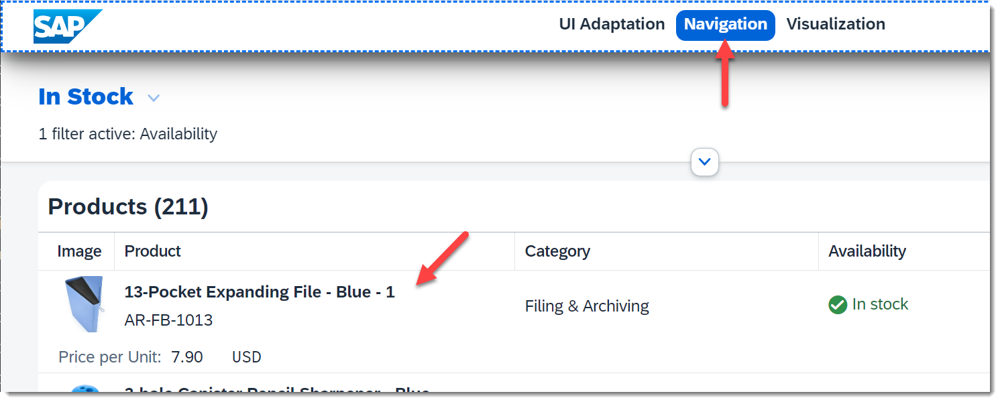

2. Now go back to **UI Adaptation** mode, right-click on the section name *Technical Data* and select **Embed Content: as section**.

    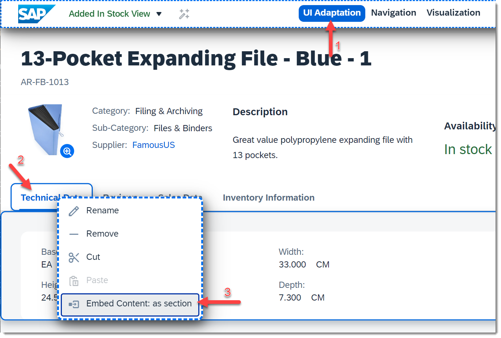

3. This will open the *Define Embedded Content* dialog, where you can configure what will be displayed in the new section. Our goal is to add search results for the product name in Bing. Write *Search Results* as title. Then go to the *URL* field and type in: `https://www.bing.com/search?form=&q=`. This is the base URL for searches in Bing, to which you will add a product specific value.
   
    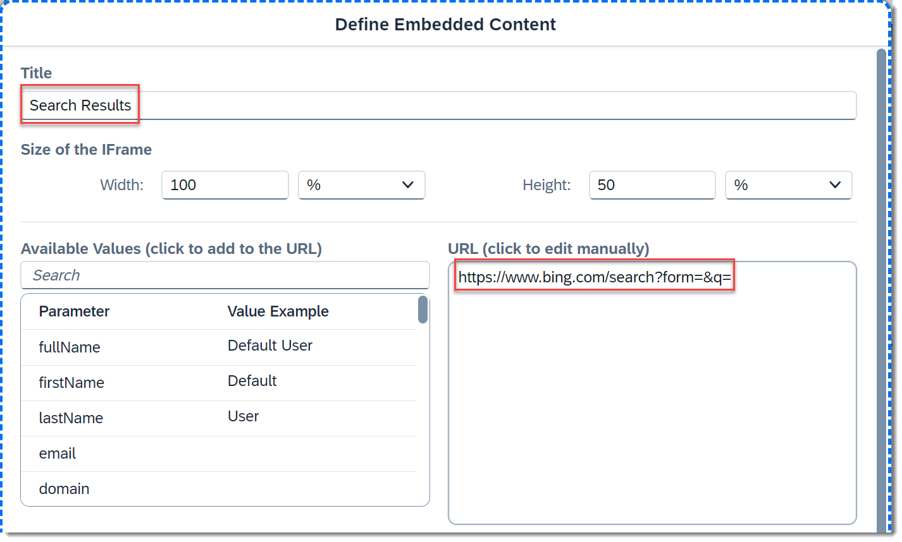

4. Notice that, on the left side of the *URL* field, there is a table called *Available Values*. These values are retrieved from the underlying data model for this Object Page. By selecting one of these parameters to be part of the URL, you can use a dynamic value retrieved from the currently displayed product. In this case, you want to search with the product name, so scroll down the table and find the parameter *Name*. When you click on it, the parameter will be added to the URL in the position of the cursor (or at the end, if nothing is selected) between curly braces. The final URL should be `https://www.bing.com/search?form=&q={Name}`.

    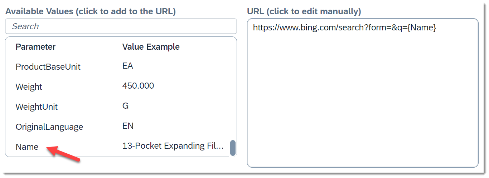

5. You can easily check if your URL is correct by pressing **Show Preview**.

    

    Which shows you what the section will look like:

    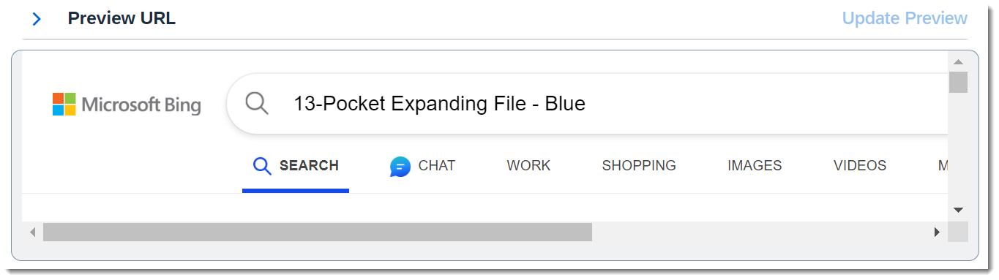
 
 6. If everything looks good, press **Save**. This will close the dialog and you will see the new section with the search results for the product name.

    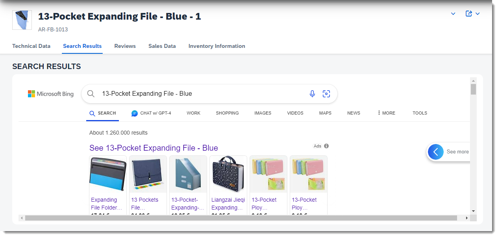

 7. Finally, let's activate a new version with this new section. Go to **Activate New Version**, name it *Added Search Results* and press **Confirm**. You can now leave key user adaptation by pressing the **Exit** button on the toolbar and try out the application with your adaptations.

    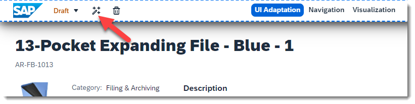

    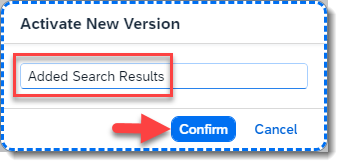

    

    > If you navigate to different products from the product table (where you created the new view), you will see that the current product name is passed as parameter to the embedded content.

Good job! You now know how to create tailored views in SAP Fiori elements applications and use embedded content to easily add more features to existing applications.

### Summary

We hope you enjoyed this series of tutorials and feel confident to adapt SAPUI5 applications. Here are some key points to take away:

- As a key user you tailored this app to end user's requirements, without the need to involve IT or developers.
- Each end user can work efficiently without the need to personalize the app themselves.
- Customers or partners can offer such a 'standard' solution with flexibility for key users.

In general, [SAPUI5 flexibility](https://help.sap.com/viewer/UI5_Flex) is a consistent technology for adaptations

- not only for key users, but also for developers and end users,
- custom changes are handled with a stable lifecycle,
- it works with SAP Fiori elements as well as freestyle SAPUI5 apps, and
- apps do not need any predefined extension points.
