## Prerequisites  
 - **Proficiency:** Beginner
 - **Tutorials:** [Register your App with an External API](https://www.sap.com/developer/tutorials/sapui5-register-app-api.html)

## Next Steps
 - [Add paging to your API call](https://www.sap.com/developer/tutorials/sapui5-paging-api.html)

## Details
### You will learn  
In this tutorial, you will either create a new app or modify an existing app you have to add a table with the message history from one of your Slack channels. If you are using a different API, feel free to follow along and swap out the Slack specific data for the equivalent entry for your API.

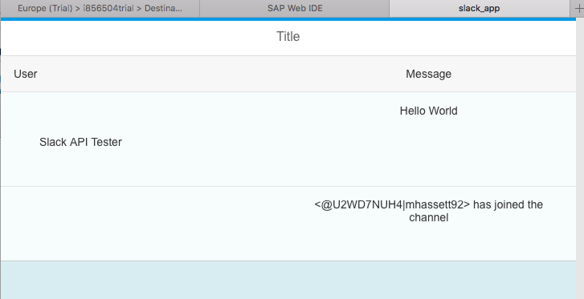

### Time to Complete
**20 Min**.

---

[ACCORDION-BEGIN [Step 1: ](Create or open an application in WebIDE)]
If you already have an app created that you want to add external API data to, feel free to use that app. Go to your Web IDE, and open that application's folder. **If you already have an application you want to use, go on to Step 2 in this tutorial**.

If you need to create a new application for your external API, use the Project from Template feature in Web IDE. In your Web IDE, click `File > New > Project from Template`.

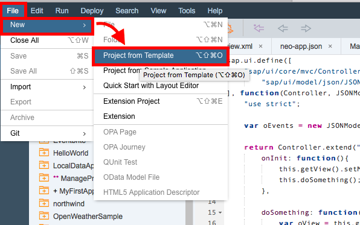

Select **SAPUI5 Application** as the template. Click **Next**.

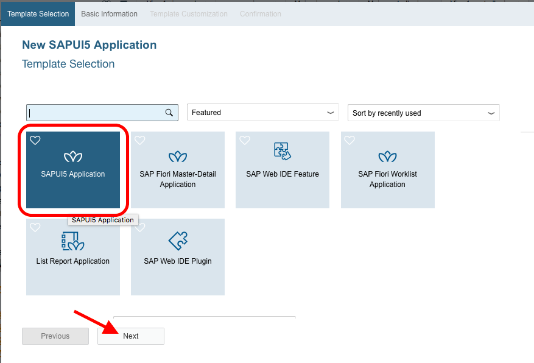

Name the application `slack_app`. Click **Finish**.

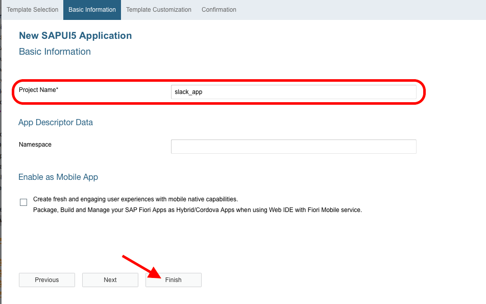

[DONE]
[ACCORDION-END]

[ACCORDION-BEGIN [Step 2: ](Open the neo-app.json file)]
In your application's folder system, select the `neo-app.json` file and open it.


You need to enable your application to reach the destination for Slack your created in Tutorial #1 of this series. Add the following code to your `neo-app.json` file in the **routes** array.

```json
, {
		"path": "/slack",
		"target": {
			"type": "destination",
			"name": "slack_demo",
			"entryPath": "/"
		},
		"description": "Slack"
	}
```

If you created a new application, your `neo-app.json` should match the image below.

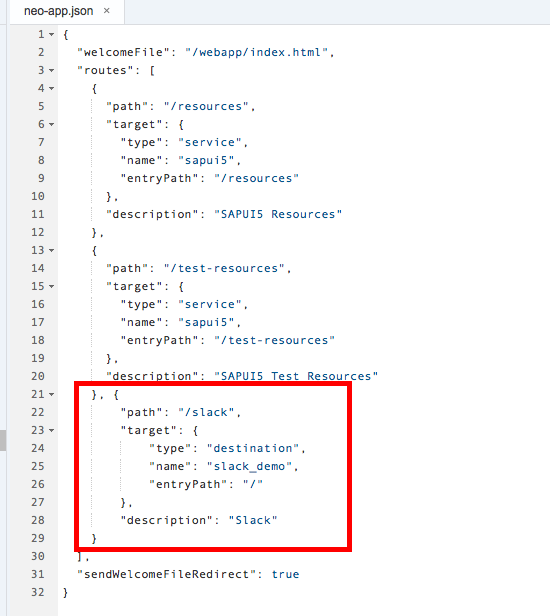

**SAVE** your changes.

> If you have not refreshed your Web IDE since you added the new Slack destination to your SAP Cloud Platform trial account, please do so now. Web IDE needs to be refreshed before being able to run your application with a new destination.

[DONE]
[ACCORDION-END]

[ACCORDION-BEGIN [Step 3: ](Add a table to display data in the XML View)]
In the `webapp > view` folder, open the`View1.view.xml` file. If you are working in your own application, open your main view file.


Add a table to your view in between the `<content>` tags. You will bind a model with the results from the API to the items for this table.

```xml
<Table id="table" items="{messages>/data}">
	<columns>
		<Column id="userColumn">
			<Text text="User"/>
		</Column>
		<Column id="messageColumn" hAlign="Center">
			<Text text="Message"/>
		</Column>
	</columns>
	<items>
		<ColumnListItem>
			<cells>
				<ObjectHeader title="{messages>username}"/>
				<Text text="{messages>text}"/>
			</cells>
		</ColumnListItem>
	</items>
</Table>

```

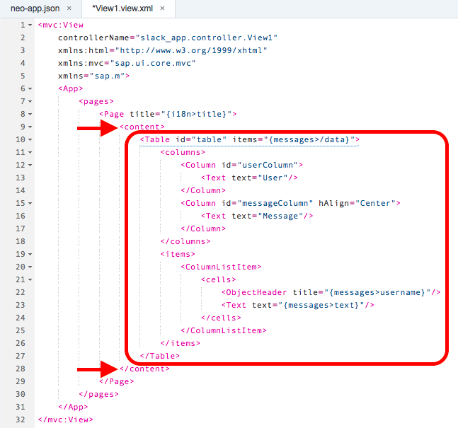

**SAVE** your changes.

[DONE]
[ACCORDION-END]

[ACCORDION-BEGIN [Step 4: ](Update the controller to set model)]
Open `View1.controller.js` or the controller corresponding to your main view.

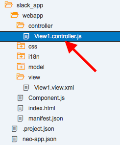

You will need access to the `JSONModel` library, so you will need to add `JSONModel` to your define dependencies array.

```javascript
  , "sap/ui/model/json/JSONModel"
```

You will also need to add it as a parameter to your controller function.

```javascript
  , JSONModel
```

The declaration of your controller should look similar to the code below.

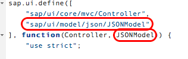

You will now create an `onInit` function for your controller. In this function, you will initialize your `JSONModel` and set it as a model available in your view. If your application's controller for the main view already has an `onInit` function, simply add the 2 lines in the function to your `onInit` function.

```javascript
    onInit: function(){
			var oMessages = new JSONModel();
			this.getView().setModel(oMessages, "messages");
		}
```

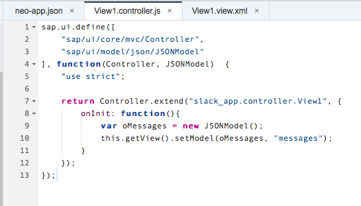

**SAVE** your changes.

[DONE]
[ACCORDION-END]

[ACCORDION-BEGIN [Step 5: ](Setup a function for the API call)]
You need to set up an AJAX call to Slack.

Define a new function called `_loadChannelMessages` after the `onInit` function.

```javascript
, _loadChannelMessages: function() {
  var oView = this.getView();
  oView.setBusy(true);

  var self = this;

  var channel = "YOUR_CHANNEL_ID";
  var token = "YOUR_TOKEN";
}
```

Set your view to busy and set the current context of `this` to a variable so it can be used in your AJAX call. Before the call, `this` is in context of your controller. Once you make the AJAX call, `this` will refer to the AJAX functions and you will not be able to access your view or methods. By setting `this` to a variable, which is named `self` in this example, you will have access to your view and methods inside the AJAX call.

Replace `YOUR_CHANNEL_ID` and `YOUR_TOKEN` with the values from your Slack API. Visit the Slack API pages to get your [Slack Team test token value](https://api.slack.com/docs/oauth-test-tokens) and your [Slack channel value](https://api.slack.com/methods/channels.history/test). To get the channel value, select the channel you want to use on the test page, and copy the value that is populated into the channel box.


> On the Slack Tester page, feel free to test the method with your credentials to see what the results look like from the API call. This will help in the next step of the tutorial.


**SAVE** your changes.

[DONE]
[ACCORDION-END]

[ACCORDION-BEGIN [Step 6: ](Add Slack API call)]
Add the AJAX call to your `_loadChannelMessages` function after the definition of your channel and token variables.

```javascript
$.ajax({
    type: 'GET',
    url: "/slack/channels.history?channel=" + channel + "&token=" + token,
    async: false
  }).done(function(results) {
    console.log(results);
    self.getView().getModel("messages").setProperty("/data", results.messages);
    oView.setBusy(false);
  })
  .fail(function(err) {
    oView.setBusy(false);
    if (err !== undefined) {
      var oErrorResponse = $.parseJSON(err.responseText);
      sap.m.MessageToast.show(oErrorResponse.message, {
        duration: 6000
      });
    } else {
      sap.m.MessageToast.show("Unknown error!");
    }
  });
```

As part of the URL for the call, you will add in your channel and token values using the preset variables. If you are working with another API, you may find that it does not accept a `token` parameter for OAuth. If this is the case, go to the Optional steps to see how to add an OAuth token in the header of an AJAX request.

You have `done` and `failure` functions defined as part of the AJAX call. If the AJAX call gets a positive response (a 200 status), the `done` function will be executed. Your `done` function sets a property to your **messages** model to bind the results from Slack to your `JSONModel`. The `failure` function toasts the error to help with debugging.

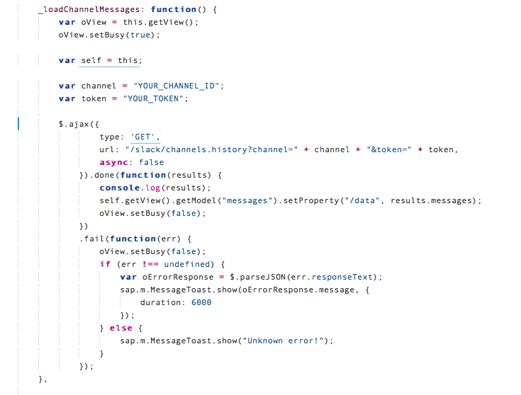

**SAVE** your changes.

[DONE]
[ACCORDION-END]

[ACCORDION-BEGIN [Step 7: ](Call your load function)]
Now that your have defined your API call and setup the processing for the data, you need to actually call the method.

Back in your `onInit` function, add the following call at the end of the function.

```javascript
    this._loadChannelMessages();
```


**SAVE** your changes.

[DONE]
[ACCORDION-END]

[ACCORDION-BEGIN [Step 8: ](Run your application)]
Right click on your application, and go to `Run > Run index.html`.

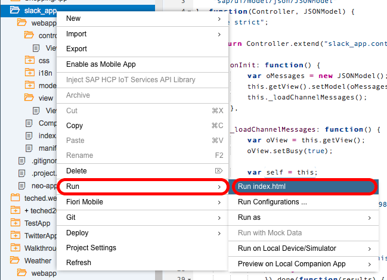

If your Slack team or channel used for the API call is new, there won't be a whole lot of data in the channel history. Add some more messages to your Slack channel to see more data being pulled through to your SAPUI5 app!


[DONE]
[ACCORDION-END]

### Optional

[ACCORDION-BEGIN [Step 9: ](Use headers for API Authentication)]
Different APIs have different ways of using OAuth tokens for Authentication. In the above tutorial for Slack, the token as added directly into the REST call using a `token` parameter. Not all APIs allow for this. For example, if you are using the Facebook API, they require the OAuth token to be part of the header for the request.

To add a header to your AJAX, remove the `token` parameter from the URL, and add a header parameter to the AJAX request. The header parameter for OAuth should look like the code below.

```javascript
  headers: {"Authorization": "Bearer YOUR_TOKEN"}
```

An example of the AJAX call construction for the Facebook API with an Authorization header would look like the code below.

```javascript
$.ajax({
  type: 'GET',
  url: "/facebook/me/feed",
  headers: {
    "Authorization": "Bearer YOUR_TOKEN"
  },
  async: false
})
```

> Some networks block the header parameter in an AJAX. If you are seeing authentication or authorizations errors in your failure response, try testing the API with a service such as Postman. If Postman is able to successfully authenticate, it is most likely an issue with your network. Try again when you are able to access a less restrictive network or use the token parameter method of Authorization.

[DONE]
[ACCORDION-END]

## Next Steps
 - [Add paging to your API call](https://www.sap.com/developer/tutorials/sapui5-paging-api.html)
