## Details
### You will learn
- How to set up your local development environment based on Eclipse

---

[ACCORDION-BEGIN [Step : ](Download Eclipse)]

To make use of the UI Development ToolKit for HTML5 you first need to have a supported version of Eclipse installed on your computer. The Eclipse Mars or Luna version is recommended.

[Open the Download site for Eclipse](https://www.eclipse.org/downloads/packages/) and click on the **Eclipse IDE for Enterprise Java Developer** link

Choose the operating system that you will use to run Eclipse and choose the download site:

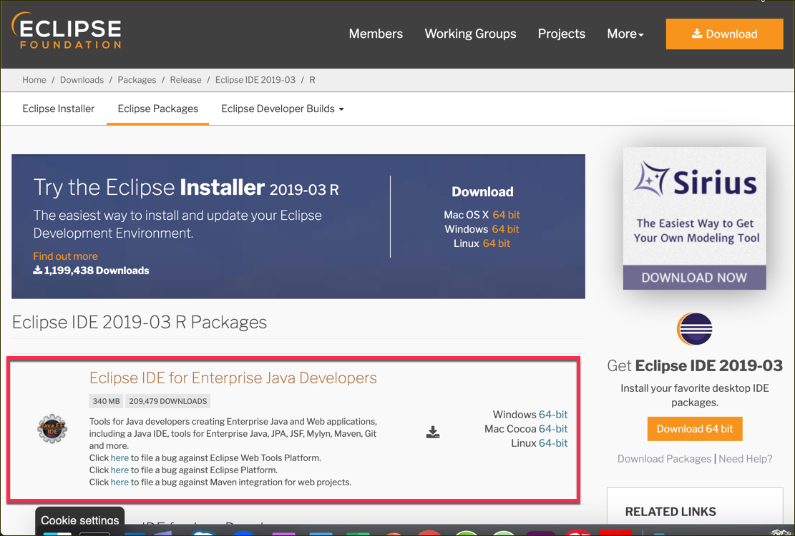

Choose the preferred download site and start the download.

[DONE]
[ACCORDION-END]
[ACCORDION-BEGIN [Step : ](Unpack the archive)]

Once the download has finished extract the archive to a local folder of your choice (e.g. `c:\dev\eclipse` for Windows users).

[DONE]
[ACCORDION-END]
[ACCORDION-BEGIN [Step : ](Start the Eclipse IDE)]

Click on the **eclipse** executable file to start the Eclipse IDE.

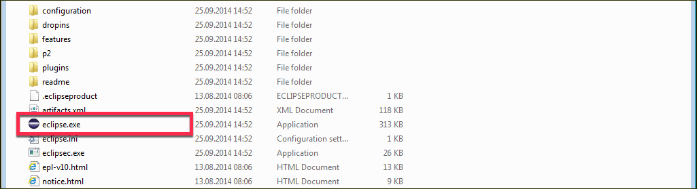

Or on Mac:

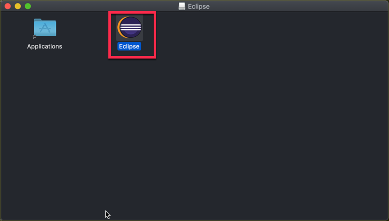

[DONE]
[ACCORDION-END]
[ACCORDION-BEGIN [Step : ](Choose workspace)]

Eclipse will first show you a **Workspace Launcher** dialog to choose your workspace.Confirm with **OK**.

>You can replace the suggested workspace path with a path of your choice, e.g. `c:\dev\eclipse_workspace` for Windows.

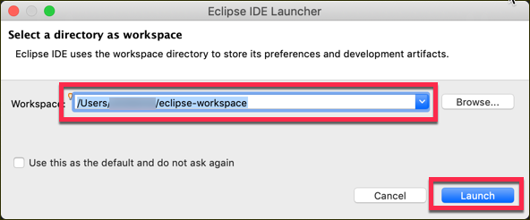

[DONE]
[ACCORDION-END]
[ACCORDION-BEGIN [Step : ](Install the SAPUI5 library)]

Now that you have installed Eclipse, you need to install the SAPUI5 Library. This is done following the standard approach of Eclipse to install plugins.

From the Eclipse menu, choose **Help > Install New Software...**.

[DONE]
[ACCORDION-END]
[ACCORDION-BEGIN [Step : ](Paste URL)]

Copy the URL `https://tools.hana.ondemand.com/<EclipseVersion>` and paste it in the **Work with** field and then press the **Enter** (or **Return**) key. You can find the most recent version of the tools [here](https://tools.hana.ondemand.com/#sapui5)

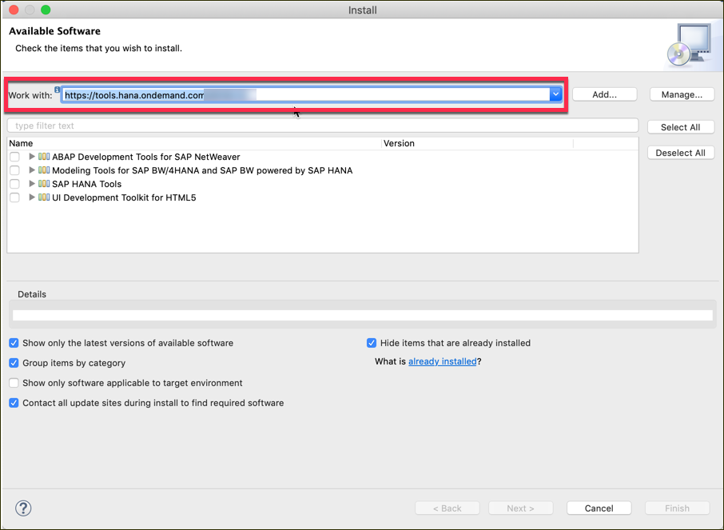

[DONE]
[ACCORDION-END]
[ACCORDION-BEGIN [Step : ](Select UI Development ToolKit For HTML5)]

Select **UI Development Toolkit for HTML5** and click **Next**.

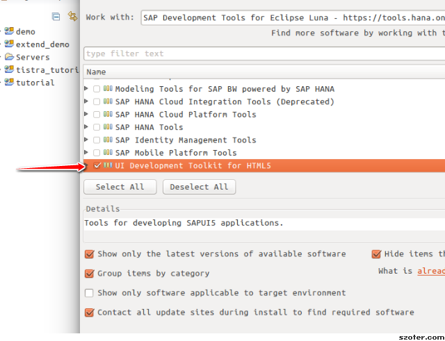

[DONE]
[ACCORDION-END]
[ACCORDION-BEGIN [Step : ](Accept license agreement and finish)]

On the **Install Details** page click **Next**.

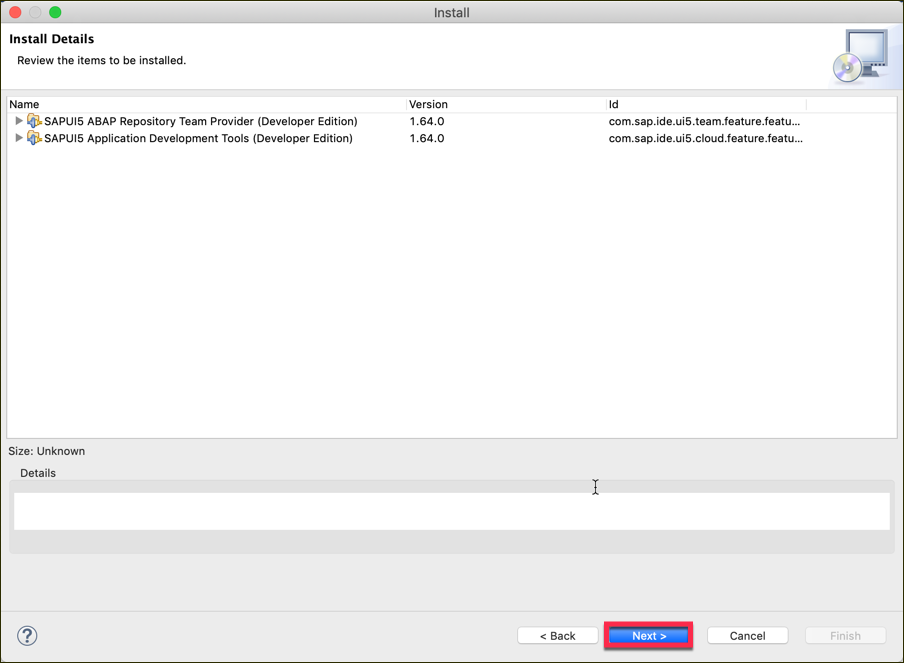

Read and accept the license agreement and choose **Finish**. The installation will now start.

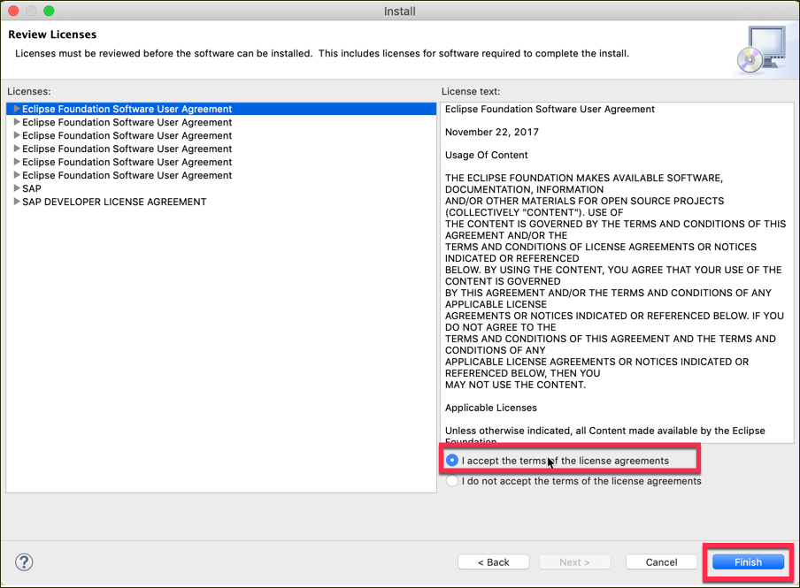

>During the installation, if a **Security Warning** dialog box will appear stating that you are installing software which contains unsigned content. Confirm with **OK** to continue the installation.

[DONE]
[ACCORDION-END]
[ACCORDION-BEGIN [Step : ](Restart Eclipse)]

At the end of the installation, you will be asked to restart Eclipse. Confirm the dialog with **Yes** to restart Eclipse immediately.

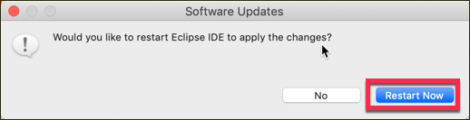

[DONE]
[ACCORDION-END]
[ACCORDION-BEGIN [Step : ](Verify installation)]

1. After Eclipse restarts, make sure to check if the installation was successful by going on **About Eclipse**.

    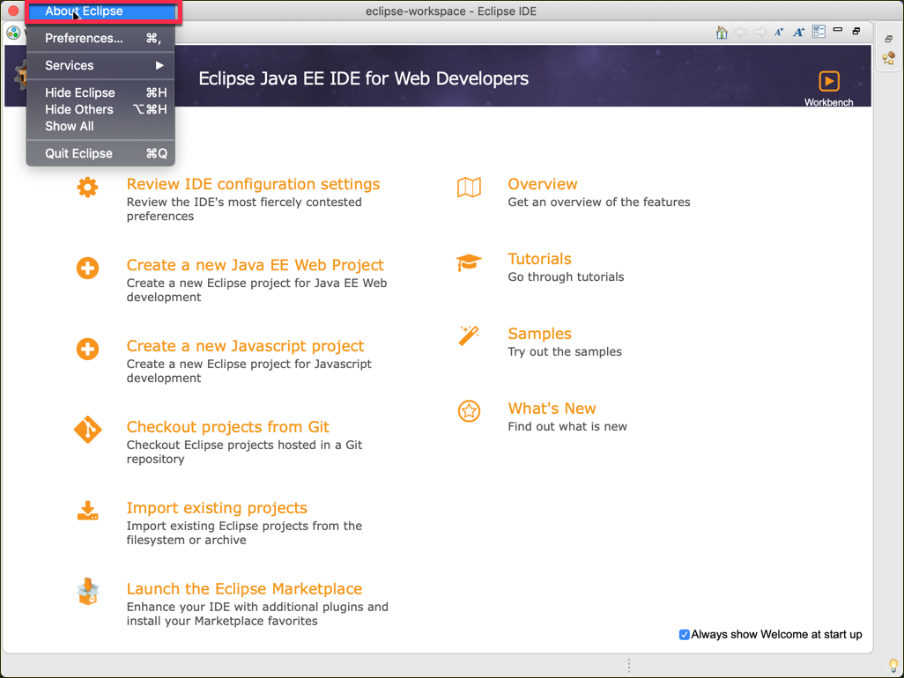

2. Click on **Installation Details**

    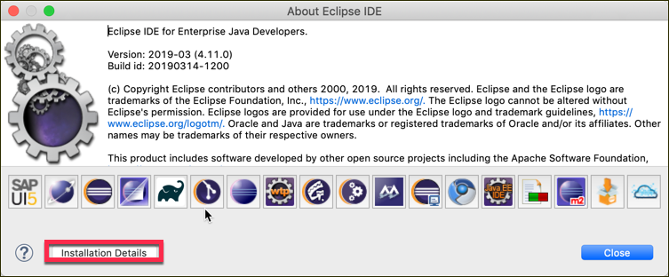

3. Check for **UI Development ToolKit for HTML5**.

    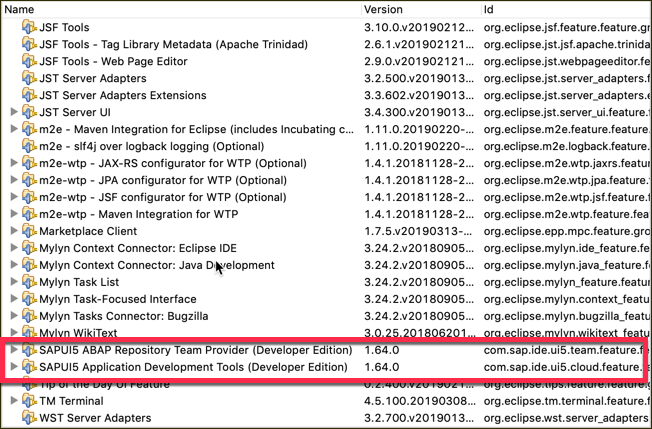

Congratulations: You have now installed the SAPUI5 Library and are ready to start with your project using SAPUI5.

[VALIDATE_1]
[ACCORDION-END]

### Related Information
- [Eclipse Downloads](http://www.eclipse.org/downloads)
- (Tools) [Installing the SDK](https://tools.hana.ondemand.com)
