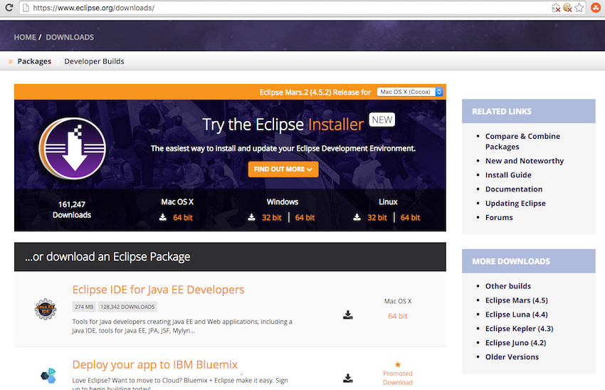
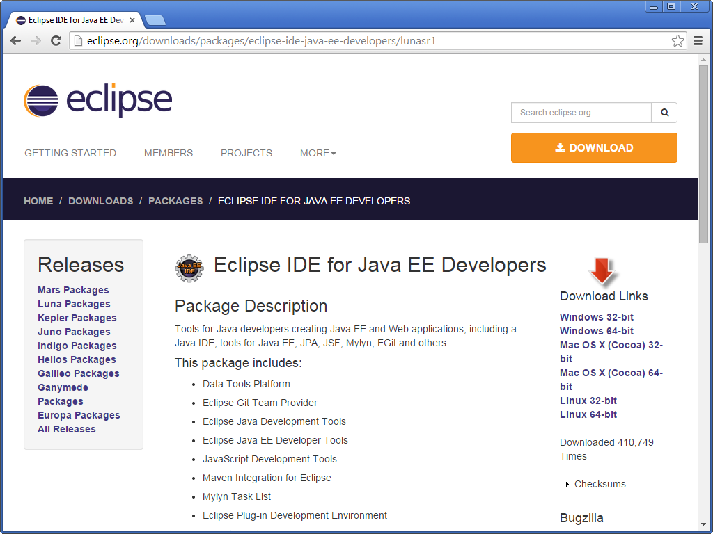
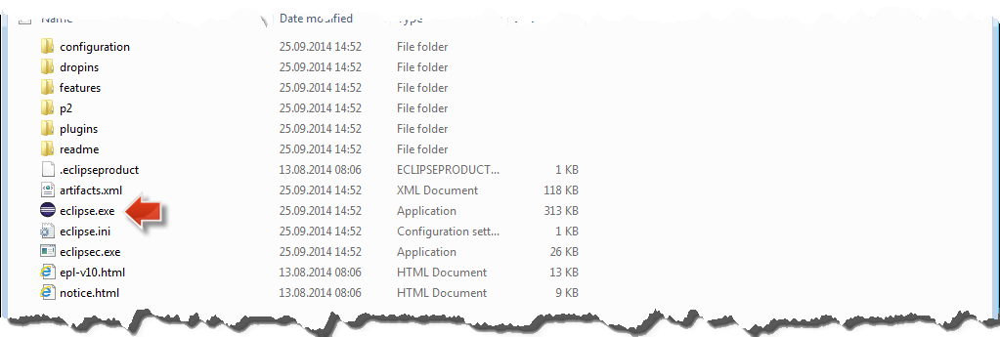
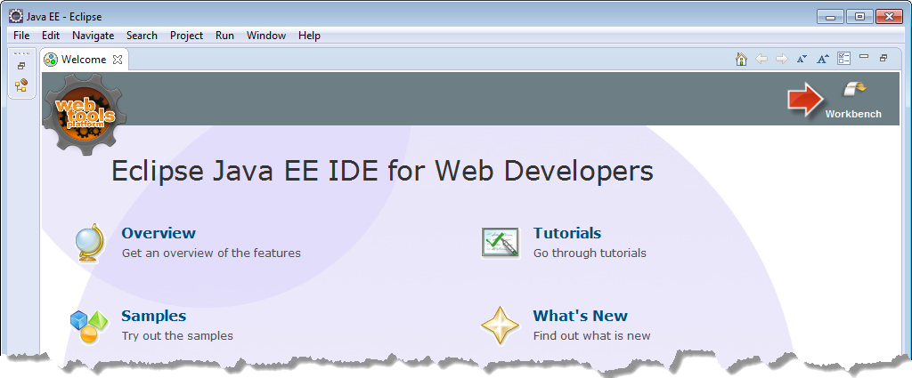
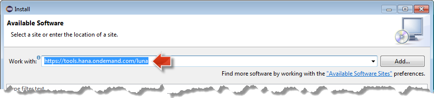

## Prerequisites
 - **Proficiency:** Beginner

## Next Steps
 - [SAPUI5 Extending a simple control](https://www.sap.com/developer/tutorials/sapui5-extending-simple-control.html)

## Details
### You will learn
In this tutorial you'll learn everything you need to know to setup your local development environment based on Eclipse. The main steps are:

 - Downloading Eclipse
 - Installing SAPUI5 Library.

### Time to Complete
**10 Min**.

---

1. To make use of the UI Development ToolKit for HTML5 you first need to have a supported version of Eclipse installed on your computer. The Eclipse Mars or Luna version is recommended.

    [Open the Download site for Eclipse](http://eclipse.org/downloads) and click on the **Eclipse IDE for Java EE Developers** link

    

2. Choose the operating system that you will use to run Eclipse and choose the download site:

    

    Choose the preferred download site and start the download.

3. Once the download has finished extract the archive to a local folder of your choice (e.g. `c:\dev\eclipse`).

4. Click on the **eclipse** executable file to start the Eclipse IDE.

    

5. Eclipse will first show you a **Workspace Launcher** dialog to choose your workspace. Replace the suggested workspace path with `c:\dev\eclipse_workspace`. Confirm with **OK**.

    

6. Close the Eclipse **Welcome Page**.

    

7. Now that you have installed Eclipse, you need to install the SAPUI5 Library. This is done following the standard approach of Eclipse to install plugins.

    From the Eclipse menu, choose **Help > Install New Software...**

    

8. Copy the URL `https://tools.hana.ondemand.com/luna` and paste it in the **Work with **field and then press the **Enter** (or **Return**) key.

    

9. Select **UI Development ToolKit For HTML5** and click **Next**.

    

10. On the **Install Details** page click **Next**. Read and accept the license agreement and choose **Finish**. The installation will now start. During the installation, if a **Security Warning** dialog box will appear stating that you are installing software which contains unsigned content. Confirm with **OK** to continue the installation.

    

11. At the end of the installation, you will be asked to restart Eclipse. Confirm the dialog with **Yes** to restart Eclipse immediately.

    

12. After Eclipse restarts, make sure to check if the installation was successful by going on **Help > Installation Details** and check for **UI Development ToolKit for HTML5**.

    

Congratulations: You have now installed the SAPUI5 Library and are ready to start with your project using SAPUI5.

### Related Information
 - [Eclipse Downloads](http://www.eclipse.org/downloads)
 - (Tools) [Installing the SDK](https://tools.hana.ondemand.com)

## Next Steps
 - [SAPUI5 Extending a simple control](https://www.sap.com/developer/tutorials/sapui5-extending-simple-control.html)
