## Prerequisites  
 - **Proficiency:** Intermediate
 - **Tutorials:** [Add paging to your API call](https://www.sap.com/developer/tutorials/sapui5-paging-api.html)

## Next Steps
 - [Call another method in the API](https://www.sap.com/developer/tutorials/sapui5-nested-api-calls.html)

## Details
### You will learn  
You will add navigation to your application in this tutorial. This will enable you to show specific details on a separate page about a specific message or event, instead of cluttering the main list view.

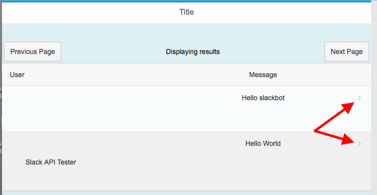


### Time to Complete
**15 Min**.

---


[ACCORDION-BEGIN [Step 1: ](Create a new view)]
You need to create a new view that you will be able to navigate to in your Slack application. To create a new view and controller, right-click on the `webapp` folder and select `New > SAPUI5 View`.

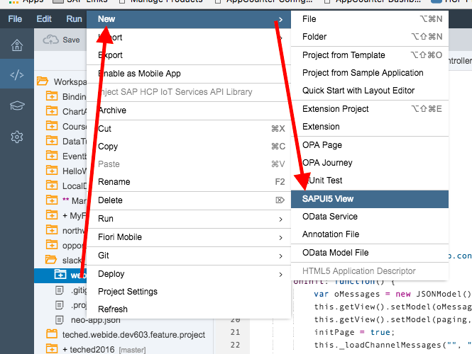

On the New SAPUI5 View page, leave the initial details and add a View Name. In this example, you can call it **Detail**. Click **Next**.

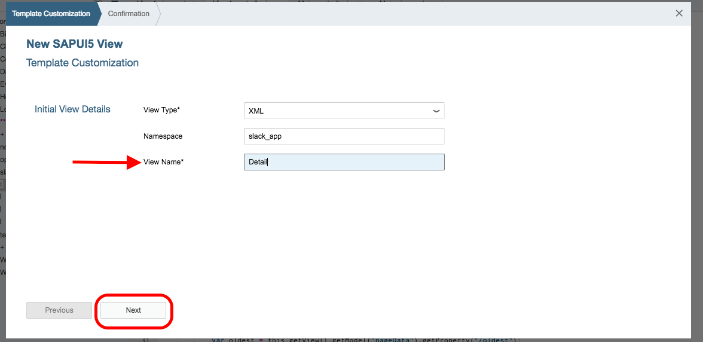

On the Confirmation page, click **Finish**.

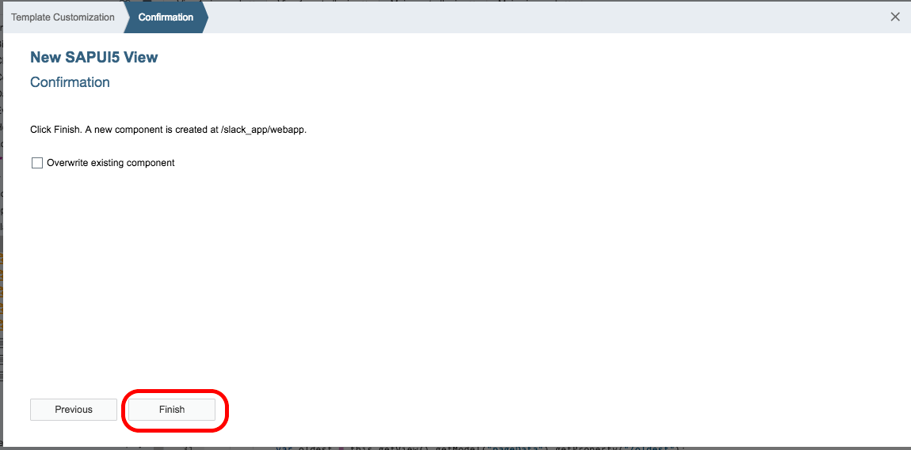


[DONE]
[ACCORDION-END]

[ACCORDION-BEGIN [Step 2: ](Add an Object Header to Detail)]
Open your new **Detail** view by opening the folders `webapp > view` and selecting the `Detail.view.xml` file.

You will add a basic Object Header to your detail view to display some more details about the selected message. Add the following code in-between the `<content>` tags in **Detail** view.

```xml
<ObjectHeader
  responsive="true"
  fullScreenOptimized="true"
  intro="Timestamp"
  title="Message">
  <attributes>
    <ObjectAttribute text="Author" />
    <ObjectAttribute text="Message Type" />
  </attributes>
</ObjectHeader>
```
Finally, remove the the `<App>` and the lowercase `<pages>` tags from the Detail view.

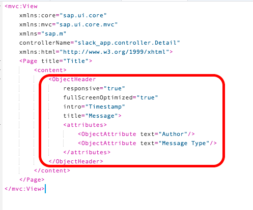

**SAVE** your changes.

[DONE]
[ACCORDION-END]

[ACCORDION-BEGIN [Step 3: ](Set up navigation properties)]
In the `webapp` folder, open the`manifest.json` file.

In the `sap.ui5` array, you need to define a new **routing** parameter, where you will define the configurations, routes, and targets for routing or navigation in the application.

```json
"routing": {
  "config": {
    "routerClass": "sap.m.routing.Router",
    "viewType": "XML",
    "viewPath": "slack_app.view",
    "controlId": "app",
    "controlAggregation": "pages"
  },
  "routes": [{
    "pattern": "",
    "name": "view1",
    "target": "view1"
  }, {
    "pattern": "detail/{messagePath}",
    "name": "detail",
    "target": "detail"
  }],
  "targets": {
    "view1": {
      "viewName": "View1"
    },
    "detail": {
      "viewName": "Detail"
    }
  }
},
```

This will define what the relationship between the `View1` view and the `Detail` view will be. Based on the pattern specified in the **routes** array, the application will use the URL to determine if it is looking at the `Detail` view or the `View1` view.

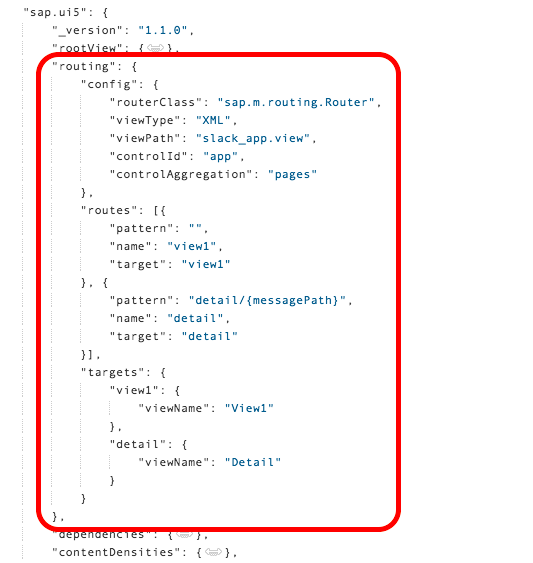

**SAVE** your changes.

[DONE]
[ACCORDION-END]

[ACCORDION-BEGIN [Step 4: ](Add an App ID)]

Open the `View1.view.xml` file in the `webapp > view` folder. The `controlId` set in the Manifest files means that you need to add an ID to the `<App>` tag in your main view, which is `View1`. In the `<App>` tag, add the `id="app"` attribute.

```xml
<App id="app">
```

**SAVE** your changes.


[DONE]
[ACCORDION-END]

[ACCORDION-BEGIN [Step 5: ](Initialize the router)]
In the `webapp` folder, open the`Component.js` file.

You need to initialize the router for the application. Add this line of code to the `init` function in the `Component.js` file.

```javascript
			this.getRouter().initialize();
```

**SAVE** your changes.

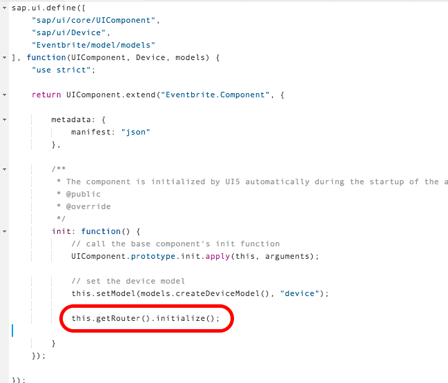

[DONE]
[ACCORDION-END]

[ACCORDION-BEGIN [Step 5: ](Add navigation to the main view)]
In the `webapp > view` folder, open the`View1.view.xml` file.

You need to enable navigation in the table. Replace the `<ColumnListItem>` in the `<Table>` with the below code. This sets the `type` attribute to **Navigation** and the `press` attribute to a function you will define in the controller to handle the navigation.

```xml
<ColumnListItem
  type="Navigation"
  press="onPress">
```

**SAVE** your changes.

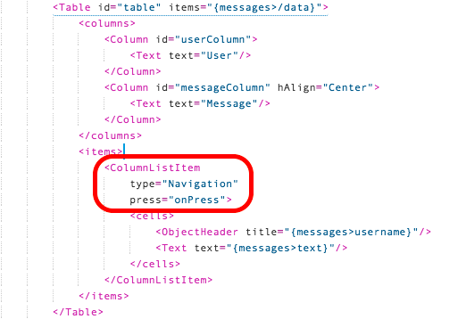

[DONE]
[ACCORDION-END]

[ACCORDION-BEGIN [Step 6: ](Add navigation to the main controller)]
In the `webapp > controller` folder, open the`View1.controller.js` file.

Add the new `onPress` function that will handle your navigation. This function has one parameter called `oEvent`. You want to get the source of the `oEvent` where you will be able to find data about the specific message clicked. You need to get the router initialized in the `Component.js` file by access the core of the application. And finally, you will use the `navTo` function and bind **message** data to the `messagePath` binding defined in the `manifest.json` file.

```javascript
onPress: function (oEvent) {
  var oItem = oEvent.getSource();
  var oRouter = sap.ui.core.UIComponent.getRouterFor(this);
  oRouter.navTo("detail", {
    messagePath: encodeURIComponent(oItem.getBindingContext("messages").getPath().substr(1))
  });
},
```

**SAVE** your changes.

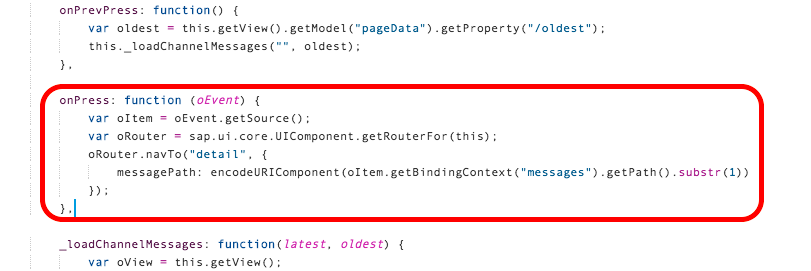

[DONE]
[ACCORDION-END]

[ACCORDION-BEGIN [Step 7: ](Add navigation to the detail controller)]
In the `webapp > controller` folder, open the`Detail.controller.js` file.

First, you need to add some new resources to the controller. This controller will need access to the browser history, so add the routing history resource. Also, you will need access to `JSONModel` in this controller. Add these resources to the **define** array.

```javascript
,
	"sap/ui/core/routing/History",
	"sap/ui/model/json/JSONModel"
```

To make the resources available in the controller, **add the following parameters to the controller function definition**.

```javascript
, History, JSONModel
```

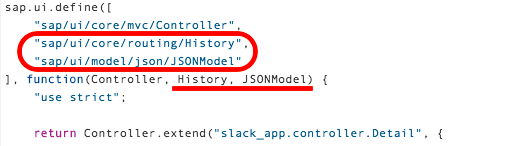

Delete all the commented code in the controller. You will define a new set of functions.

Create a new `onInit` (#1) function. This function needs to create a new `JSONModel` to hold the message details, and the model needs to be bound to the view. Additionally, you need to get the router for this view and use it to match the data passed in the `messagePath` argument.

```javascript
onInit: function () {
  var oModel = new JSONModel();
  this.getView().setModel(oModel, "message");

  var oRouter = sap.ui.core.UIComponent.getRouterFor(this);
  oRouter.getRoute("detail").attachMatched(this._onRouteMatched, this);
},
```

Add a `_onRouteMatched` (#2) function that is called from the `onInit` function. The `_onRouteMatched` function has a parameter of `oEvent`. This function will bind the data for the message based on the argument `messagePath` from the main view. It will bind it to the **message** model you created in the `onInit` function.

```javascript
_onRouteMatched: function (oEvent) {
  this.getView().bindElement({
    path: "/" + oEvent.getParameter("arguments").messagePath,
    model: "message"
  });
},
```

Finally, add in a `onNavBack` (#3) function that will allow you to navigate back to the main view (`View1`) from the Detail view. The back navigation uses the browser history to go back to the page you were previous on. If the browser history cannot be accessed, you will be navigated back to the `View1` view without any of the history of the previous page.

```javascript
onNavBack: function () {
  var oHistory = History.getInstance();
  var sPreviousHash = oHistory.getPreviousHash();

  if (sPreviousHash !== undefined) {
    window.history.go(-1);
  } else {
    var oRouter = sap.ui.core.UIComponent.getRouterFor(this);
    oRouter.navTo("view1", true);
  }
}
```

**SAVE** your changes.

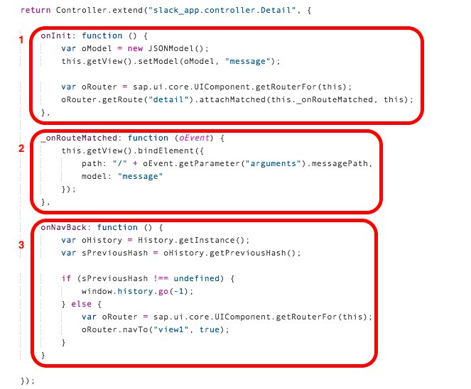

[DONE]
[ACCORDION-END]

[ACCORDION-BEGIN [Step 8: ](Add navigation to detail view)]
In the `webapp > view` folder, open the`Detail.view.xml` file.

You need to update the `<Page>` attributes to allow for backwards navigation. Rename the page to `title="Details"`. Add 2 new properties for adding the navigation button. Adding the `showNavButton` property and setting it to **true** allows for the back arrow to appear in the header. Adding the `navButtonPress` attributes defines the function to use in the controller to complete the navigation action. Your navigation function is defines as `onNavBack`.

```xml
<Page title="Details"
  showNavButton="true"
  navButtonPress="onNavBack">
```

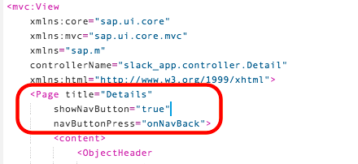


[DONE]
[ACCORDION-END]

[ACCORDION-BEGIN [Step 9: ](Run your application)]
Make sure all your changes are saved and **RUN** your application.


[DONE]
[ACCORDION-END]

## Next Steps
 - [Call another method in the API](https://www.sap.com/developer/tutorials/sapui5-nested-api-calls.html)
