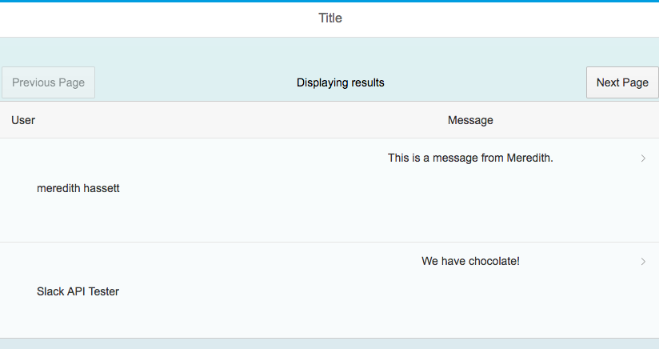
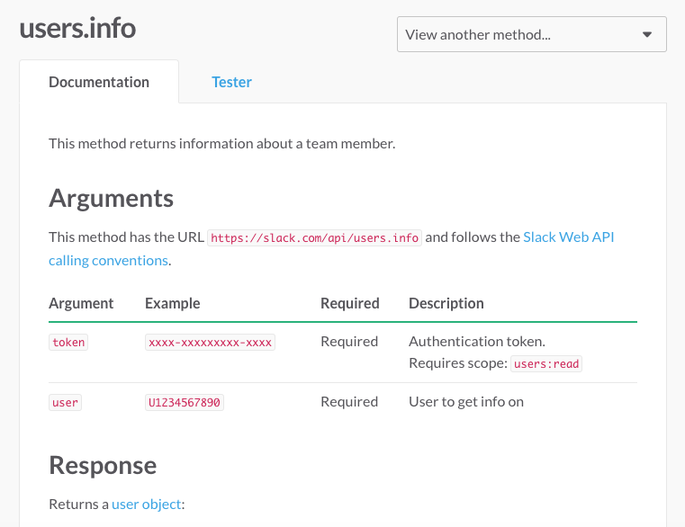
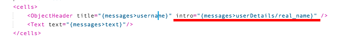

## Details
### You will learn  
In this tutorial, you will a new call to another Slack API method to retrieve more data about the user who is sending the message. You will display this new data on the main view of your application.



---

[ACCORDION-BEGIN [Step 1: ](Read about the Slack User method)]
The [Slack User method](https://api.slack.com/methods/users.info) will be used in this tutorial. Review the documentation and tester available on the website to get a better understanding of the inputs and expected outputs of this method.

When you call the user method for a given user, you will have more information about a user, such as their full name and profile picture. You will use this method to add user details to the main view so you have a better idea of the user who is posting the message.




[DONE]
[ACCORDION-END]

[ACCORDION-BEGIN [Step 2: ](Add a new call to your main controller)]
Open your **main** controller by opening the folders `webapp > controller` and selecting the `View1.controller.js ` file.

In the `done` function of the AJAX call, you will add a new loop to get additionally data for each result from the initial call. You should be sure to limit the page size to ensure that performance does not suffer by adding a new call to another API method.

Create a `for` loop near the end of the `done` function in the AJAX call. The loop should start at 0 and go for the length of the results message array.

```javascript
for(var i = 0; i < results.messages.length; i++) {

}
```

In the for `for` loop, you need to check to make sure the data returned is good (a user is found). Add an `if` statement in the `for` loop to check to see is the user return is not null. To get the `user` for each message, drill into the results variable and index the `message` out for the give `i` you are exploring in the `for` loop. Once you have a single message, get the `user` value.

```javascript
if(results.messages[i].user !== null){

}
```

If a user is found, you will want to call Slack to find out more information about this user. For this, you will need to do a new AJAX call to the User Profile method. Add an AJAX call **inside the `if` statement**. Define a blank `done` function as well with the parameter of `userResults`. You can use the same token from your first AJAX call. The User Profile method requires a **user** to complete the call. You will set the user parameter in the call to the `results.message[i].user` value. This returns the user value for a single message.

```javascript
$.ajax({
  type: 'GET',
  url: "/slack/users.info?user=" + results.messages[i].user + "&token=" + token,
  async: false
}).done(function(userResults) {

});
```

If the AJAX call is a success, the user profile of the provided user will be returned. You can use this profile to display some more detailed information about the user on the view. To make the data accessible in the view, you will need to bind it to the **message** model. In the `done` function, retrieve the **message** model and set it to a new variable. Once the model is retrieved, set a new property inside of the **message data** for the message that is currently being explored using the variable `i`. Once the user details have been added to the model, you can rebind the updated model to the view.

```javascript
var message = self.getView().getModel("messages").getProperty("/data");
message[i].userDetails = userResults.user;
self.getView().getModel("messages").setProperty("/data", message);
```

**SAVE** your changes. Your new code should look like the screenshot below.


[DONE]
[ACCORDION-END]

[ACCORDION-BEGIN [Step 3: ](Update the main view)]
Open your new **main** view by opening the folders `webapp > view` and selecting the `View1.view.xml` file.

Find the `ObjectHeader` in the `cells` definition of the table. Here, define a new attribute call `intro` which you will set to the new `userDetails` properties available in the **messages** model. Use the `real_name` property that is now available from the `userDetails` to display the users full name instead of their username.

```xml
intro="{messages>userDetails/real_name}"
```
Your `ObjectHeader` should resemble the screenshot below.



**SAVE** your changes.

[DONE]
[ACCORDION-END]

[ACCORDION-BEGIN [Step 4: ](Run your application)]
Make sure all your changes are saved and **RUN** your application. You should now see that the names of the user messages are now displayed instead of blanks. In Slack, "users" are a bot's name and "usernames" refer to actual users in the system. To translate the Slack username into information your end user would understand, you would need data from the User Profile method. Feel free to add more user details to your application.


**Copy and paste the URL** of the running application into the text box below.

[VALIDATE_4]
[ACCORDION-END]
