## Prerequisites  
 - **Proficiency:** Beginner
 - **Tutorials:** [Create a Destination for an External API](https://www.sap.com/developer/tutorials/sapui5-create-api-destination.html)

## Next Steps
 - [Add an External API call to your app](https://www.sap.com/developer/tutorials/sapui5-insert-rest-api.html)

## Details
### You will learn  
Create a developer account on the API's website. This will allow you to be able to get a developer key and track details about the API usage from your application.

### Time to Complete
**15 Min**.

---

[ACCORDION-BEGIN [Step 1: ](Go to Slack API Page)]
Go to [Slack API Page](https://api.slack.com/). Feel free to browser the API information and available methods. When you are ready to start setting up your app on Slack, click **Go to Slack**.

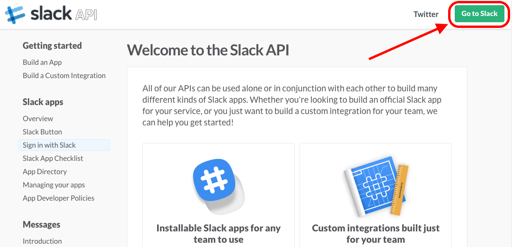

[DONE]
[ACCORDION-END]

[ACCORDION-BEGIN [Step 2: ](Login or Sign up for Slack)]
If you already have a team you can use as a development sandbox, log in to that team by **providing the team domain name** and clicking **Continue** to provide your credentials (Option #1 in the image below). Once you are logged in, continue on to Step 11 in this tutorial.

If you do not have a Slack account or a team that can be used as a sandbox environment, click **Create a new team** in the top toolbar (Option #2 in the image below) and follow along with the next step in this tutorial.

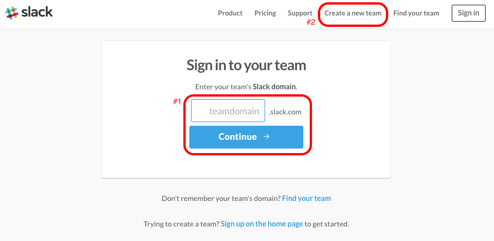

[DONE]
[ACCORDION-END]

[ACCORDION-BEGIN [Step 3: ](Create a new team in Slack)]
Enter your **email address** and click the **Next**. Make sure to indicate whether or not you would like to receive emails from Slack.

[DONE]
[ACCORDION-END]

[ACCORDION-BEGIN [Step 4: ](Confirm your email)]
The email address you provided in the previous step should receive an email from Slack with a **confirmation code**. Enter that code on this screen.

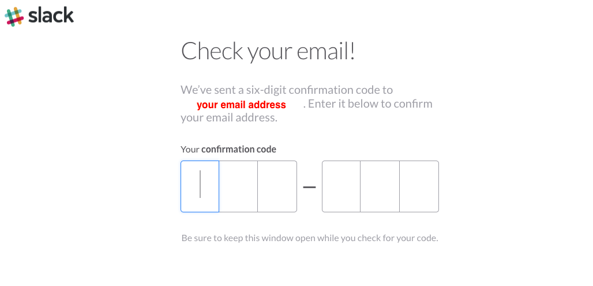

If the code is correct, you will be able to continue on to the next page.

[DONE]
[ACCORDION-END]

[ACCORDION-BEGIN [Step 5: ](Enter your user details)]
Enter your first and last name.

Slack will pre-populate a suggested username. Feel free to change it if you want. If you already have a Slack username and want to keep that name, enter that username now.

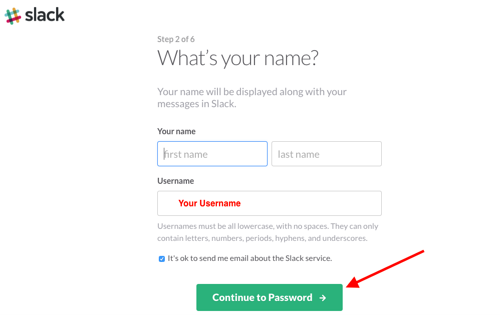

Once your user details are finalized, click **Continue to Password**.

[DONE]
[ACCORDION-END]

[ACCORDION-BEGIN [Step 6: ](Enter a password)]
Select a password for your user on this Slack team. You can use different passwords for each Slack team you create.

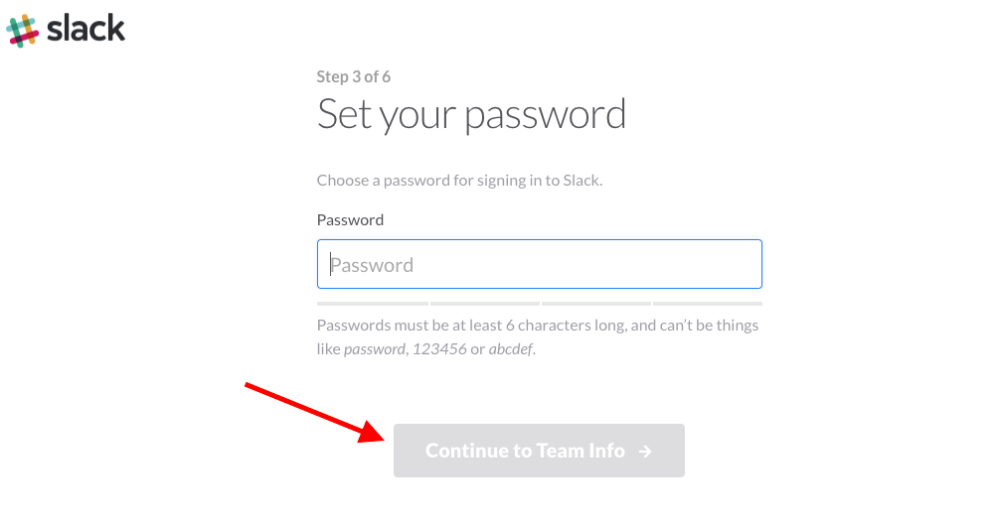

Click **Continue to Team Info** once you set your password.

[DONE]
[ACCORDION-END]

[ACCORDION-BEGIN [Step 7: ](Enter team details)]
Slack requests some information about the team you are creating. Enter your team information.

If this is purely a sandbox environment, you could enter the following details:

_What will your team use Slack for?_ : **Other**

_Could you elaborate?_ : **Sandbox**
> This question will not always appear depending on the team use selected. If it does appear, enter the relevant information Slack is requesting.

_How big is the group you'll use Slack with?_ : **1-9 people**

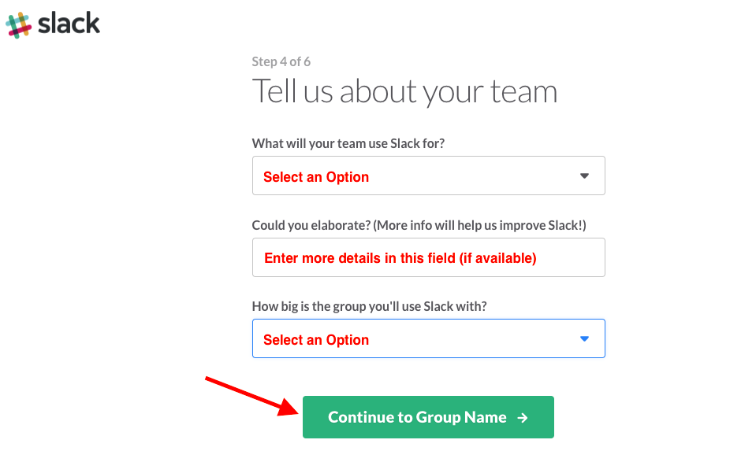

Click **Continue to Group Name**.

[DONE]
[ACCORDION-END]

[ACCORDION-BEGIN [Step 8: ](Select the group name)]
Enter the name of your group. For example, you could call it _My Sandbox_ or _Company Development Group_.

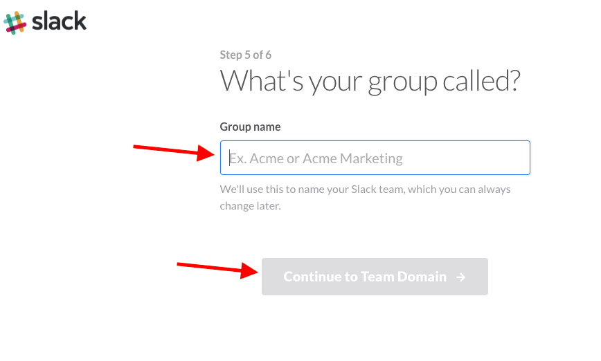

Click **Continue to Team Domain** once you set your group name.

[DONE]
[ACCORDION-END]

[ACCORDION-BEGIN [Step 9: ](Select a team domain name)]
Based on the Group Name you entered in the previous step, Slack will provided a suggested domain name and let you know if it is available. If it is not available, make sure to change the name to something that is available. If you do not like the name Slack provides, update it now.

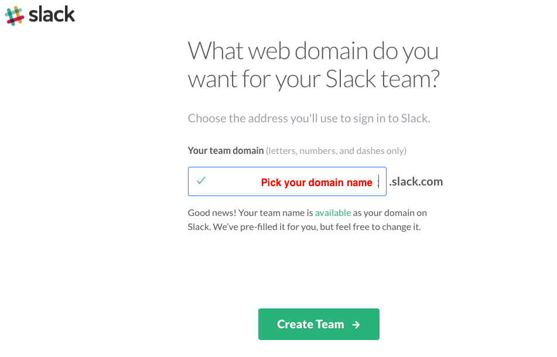

Click **Create Team** once you set your team domain name.

[DONE]
[ACCORDION-END]

[ACCORDION-BEGIN [Step 10: ](Create your team)]
On the Send Invitations team, click **Skip For Now**.

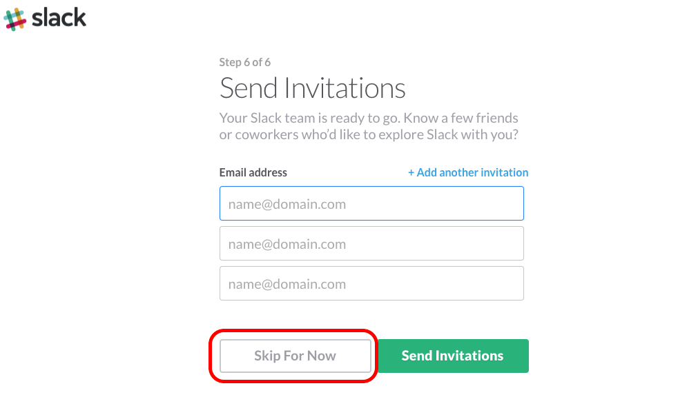

[DONE]
[ACCORDION-END]

[ACCORDION-BEGIN [Step 11: ](Explore your team)]
Once you successfully create or login to your team, the Slack homepage for that team will display. If you are not familiar with Slack, take some time to explore the available Channels and Direct Chat options that are available to learn more about messaging in Slack.

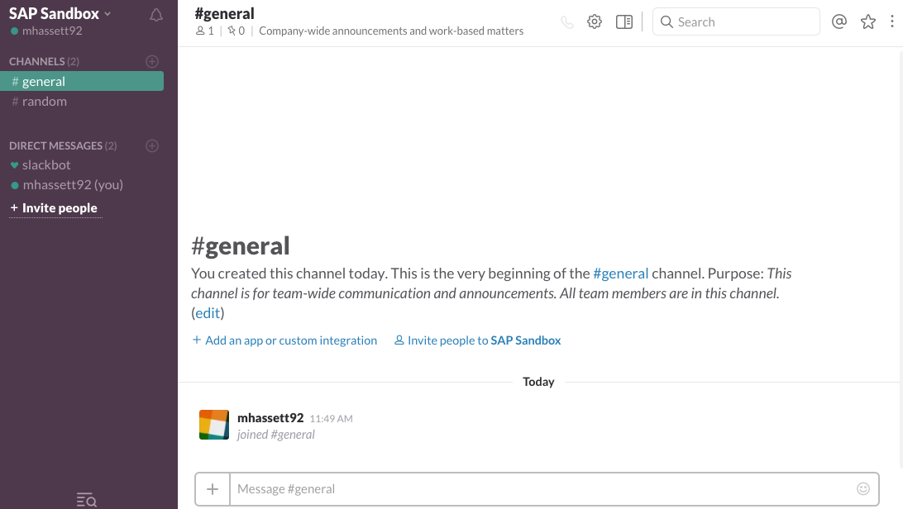

[DONE]
[ACCORDION-END]

[ACCORDION-BEGIN [Step 12: ](Generate a test token)]
In order to authenticate your user in your SAPUI5 app, Slack uses OAuth 2.0. In a later tutorial, the authorization handshake for OAuth in SAPUI5 will be covered. For this tutorial series, you will generate a test token to be used.

To generate a test token for your team, go to the [Slack Tokens for Testing and Development](https://api.slack.com/docs/oauth-test-tokens) page.

Select **Create token** for you user on your development team. This will generate a value for the _Token_ field.

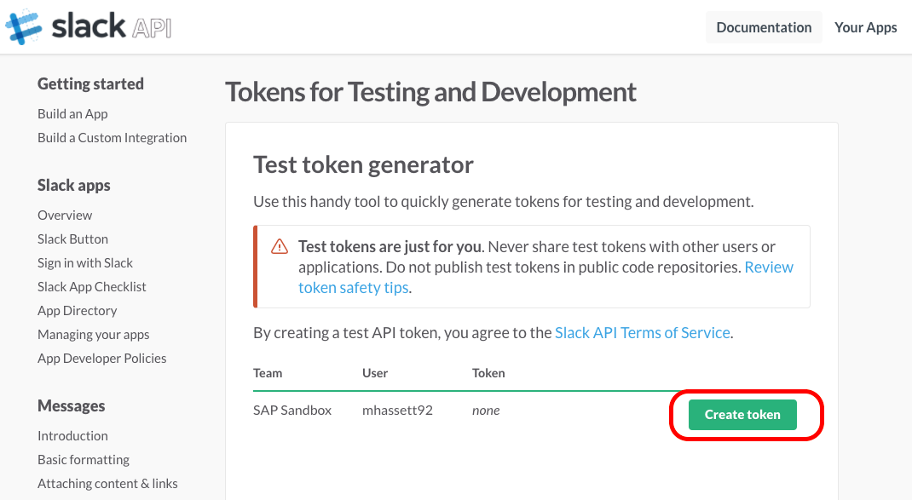

[VALIDATE_12]
[ACCORDION-END]

## Next Steps
 - [Add an External API call to your app](https://www.sap.com/developer/tutorials/sapui5-insert-rest-api.html)
