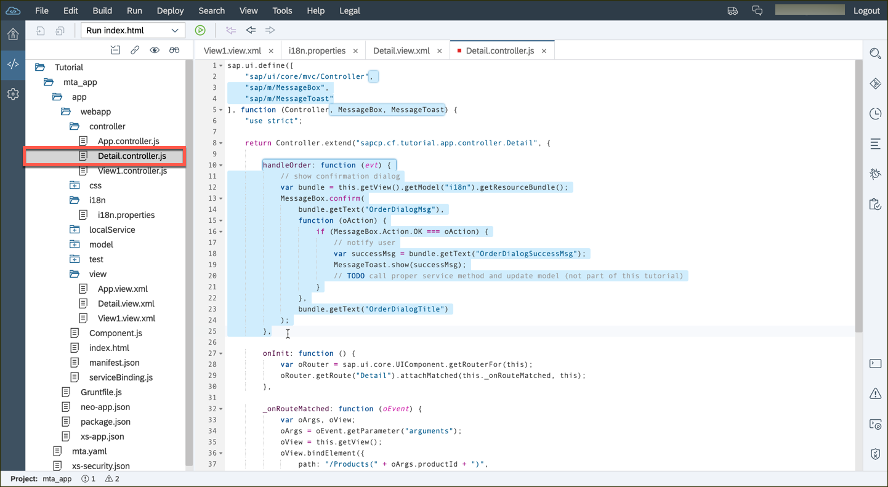

## Details
### You will learn  
You will add a footer bar (a Bar control within the footer aggregation of the Page) to our Detail view.  
In that bar, you will add a Button control to the right side of the footer bar in the Detail view, and in the corresponding controller we'll define the function to be called (`handleOrder`) when the Button's 'press' event is fired. Then you will simulate the order process by displaying a `MessageBox` pop-up control and then showing a `MessageToast`. For this, you will need to show some texts. Hence, you will add placeholders into the `i18n.properties` file we set up earlier.

---


[ACCORDION-BEGIN [Step : ](Add strings for the new footer)]
Open the `webapp/i18n/i18n.properties` file, and add the following four lines to the bottom:

```I18N
OrderButtonText=Order
OrderDialogTitle=Order Product
OrderDialogMsg=Do you want to order this product now?
OrderDialogSuccessMsg=The product has been ordered
```


[DONE]
[ACCORDION-END]
[ACCORDION-BEGIN [Step : ](Add a footer bar to the detail page)]
2.  Open the `webapp/view/Detail.view.xml` file, and add a footer to the detail page by adding the following code under `<ObjectHeader>`:

	```XML
	<footer>
		<Bar>
			<contentRight>
				<Button text="{i18n>OrderButtonText}" type="Accept" icon="sap-icon://accept" press="handleOrder"/>
			</contentRight>
		</Bar>
	</footer>
	```

    

[DONE]
[ACCORDION-END]
[ACCORDION-BEGIN [Step : ](Implement the event handler)]
1.  Finally, open the `webapp/controller/Detail.controller.js` file.  Register two new classes in the `define` area:

    ```JavaScript
	,
    "sap/m/MessageBox",
    "sap/m/MessageToast"
    ```


2.  Next, you will change the signature of the first `function`, to accept two new parameters:


    ```JavaScript
    function(Controller, MessageBox, MessageToast)
    ```


3.  Finally, add the `handleOrder` function to the Controller:

    ```JavaScript
		handleOrder: function (evt) {
			// show confirmation dialog
			var bundle = this.getView().getModel("i18n").getResourceBundle();
			MessageBox.confirm(
				bundle.getText("OrderDialogMsg"),
				function (oAction) {
					if (MessageBox.Action.OK === oAction) {
						// notify user
						var successMsg = bundle.getText("OrderDialogSuccessMsg");
						MessageToast.show(successMsg);
						// TODO call proper service method and update model (not part of this tutorial)
					}
				},
				bundle.getText("OrderDialogTitle")
			);
		}
    ```





[DONE]
[ACCORDION-END]
[ACCORDION-BEGIN [Step : ](Test the new order button)]

You are all set!  Run the application.  Choose an item from the list, and you will see an **Order** button in the detail screen.  


Click on the **Order** button and the following dialog box comes up:

After you click the **OK** button, you should see this message appear.

>You can now deploy your application to a production environment. If you want to do so, have a look at [this tutorial](cp-ui5-webide-new-app) here (Skip the steps until you build the application).

[VALIDATE_1]
[ACCORDION-END]

-------

### Additional Information
- [`Footer`](https://sapui5.hana.ondemand.com/explored.html#/sample/sap.m.sample.Page/preview)
- [`MessageBox`](https://sapui5.hana.ondemand.com/#/api/sap.m.MessageBox)
- [`MessageToast`](https://sapui5.hana.ondemand.com/#/api/sap.m.MessageToast)
