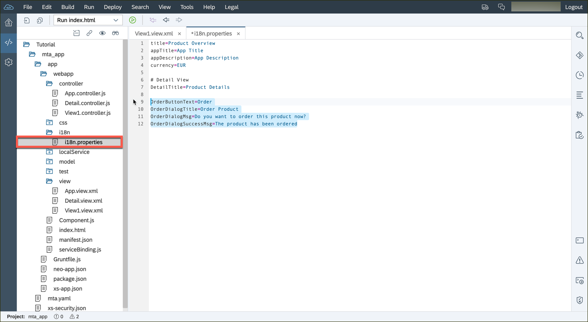
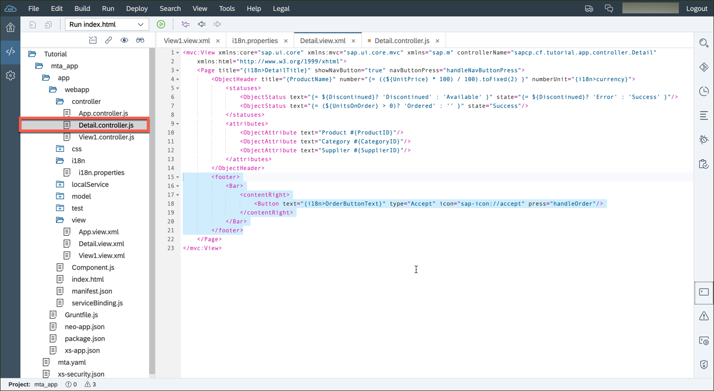
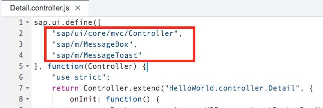
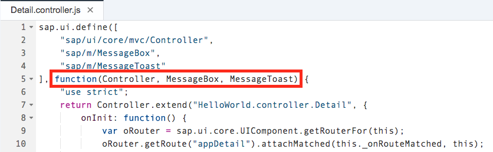
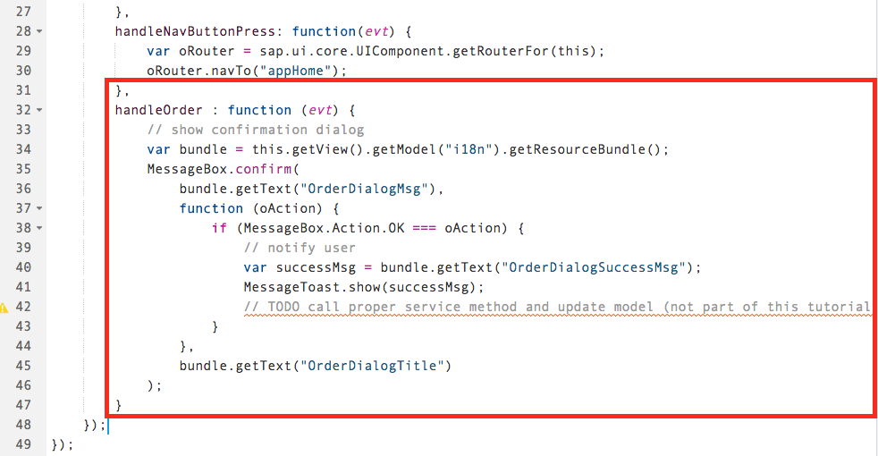
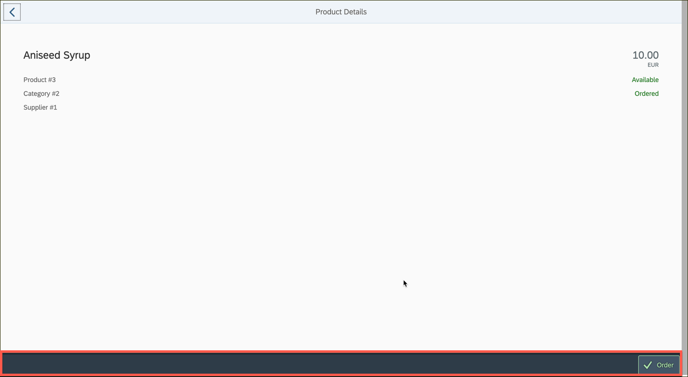
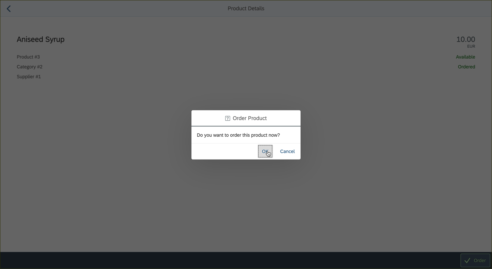
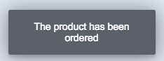

## Prerequisites  
- **Proficiency:** Beginner 
- **How-To** [Start this tutorial series](http://www.sap.com/developer/tutorials/sapui5-webide-open-webide.html)
- **Tutorials:** This tutorial is part of a series.  The previous tutorial is step 9: [SAPUI5 - Add a search field](http://www.sap.com/developer/tutorials/sapui5-webide-add-search-field.html)

## Next Steps
 - This is the end of this tutorial series.  Return to the [Tutorial Navigator](http://www.sap.com/developer/tutorial-navigator.html) or the [Tutorial Catalog](http://www.sap.com/developer/tutorials.html)

## Details
### You will learn  
You will add a footer bar (a Bar control within the footer aggregation of the Page) to our Detail view.  

In that bar, you will add a Button control to the right side of the footer bar in the Detail view, and in the corresponding controller we'll define the function to be called (`handleOrder`) when the Button's 'press' event is fired. Then you will simulate the order process by displaying a `MessageBox` pop-up control and then showing a `MessageToast`. For this, you will need to show some texts. Hence, you will add placeholders into the `i18n.properties` file we set up earlier. 

### Time to Complete
**10 Minutes**.

---
>  **Web IDE** If you don't have the Web IDE open, follow these steps: [Enable and open the HANA Cloud Platform Web IDE](http://www.sap.com/developer/tutorials/sapui5-webide-open-webide.html)


1.  Open the `webapp/i18n/i18n.properties` file, and add the following four lines to the bottom:

	```
OrderButtonText=Order
OrderDialogTitle=Order Product
OrderDialogMsg=Do you want to order this product now?
OrderDialogSuccessMsg=The product has been ordered
   ```
   
   
   
2.  Open the `webapp/view/Detail.view.xml` file, and add a footer to the detail page by adding the following code under `<ObjectHeader>`:

	```xml
    <footer>
	   <Bar>
			<contentRight>
				<Button text="{i18n>OrderButtonText}"
	  	               type="Accept"
		               icon="sap-icon://accept"
		               press="handleOrder" />
			</contentRight>
		</Bar>
	</footer>
	```

   
   
3.  Finally, open the `webapp/controller/Detail.controller.js` file.  Register two new classes in the `define` area:

	```
	,
	"sap/m/MessageBox",
	"sap/m/MessageToast"
	```

   
   
    Next, you will change the signature of the `function` call, to accept two new parameters:
    
    >**Note**: overwrite the existing function call with this code (or it will have a syntax error).
    
    ```javascript
    function(Controller, MessageBox, MessageToast) 
    ```
    
   
   
    Finally, add the `handleOrder` function to the Controller:
    
    ```javascript
    ,
	handleOrder : function (evt) {
		// show confirmation dialog
		var bundle = this.getView().getModel("i18n").getResourceBundle();
		MessageBox.confirm(
			bundle.getText("OrderDialogMsg"),
			function (oAction) {
				if (MessageBox.Action.OK === oAction) {
					// notify user
					var successMsg = bundle.getText("OrderDialogSuccessMsg");
					MessageToast.show(successMsg);
					// TODO call proper service method and update model (not part of this tutorial)
				}
			},
			bundle.getText("OrderDialogTitle")
		);
	}
	```
	
   
   
4.  You are all set!  Run the application.  Choose an item from the list, and you will see an **Order** button in the detail screen.  


   
   
   Click on the **Order** button and the following dialog box comes up:

   
   
   After you click the **OK** button, you should see this message appear.
   
   
   

-------
That is all for this series!  Return to the tutorial catalog for more tutorials on SAPUI5.
   

## Next Steps
 - This is the end of this tutorial series.  

## Additional Information
- [`Footer`](https://sapui5.hana.ondemand.com/explored.html#/sample/sap.m.sample.Page/preview)
- [`MessageBox`](https://sapui5.hana.ondemand.com/docs/api/symbols/sap.m.MessageBox.html)
- [`MessageToast`](https://sapui5.hana.ondemand.com/docs/api/symbols/sap.m.MessageToast.html)
