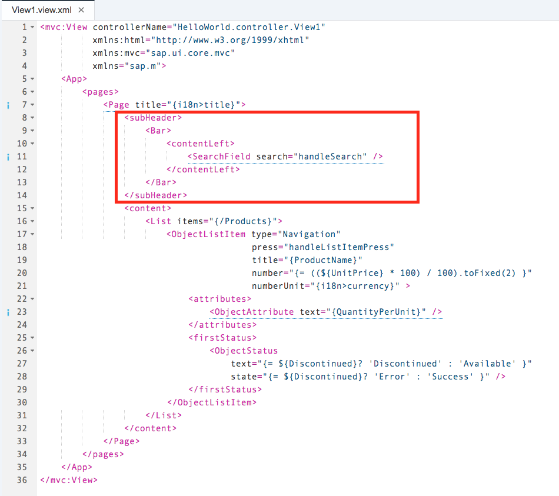
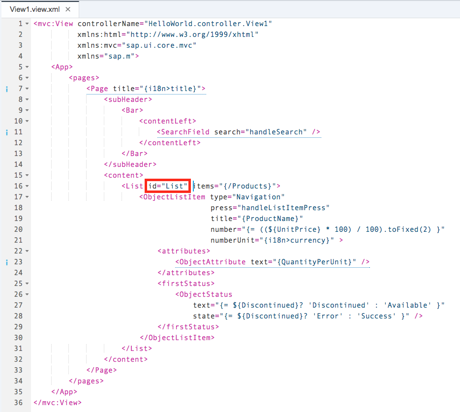
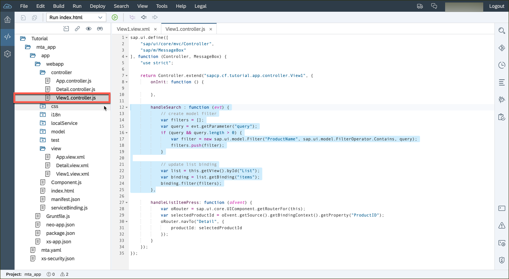
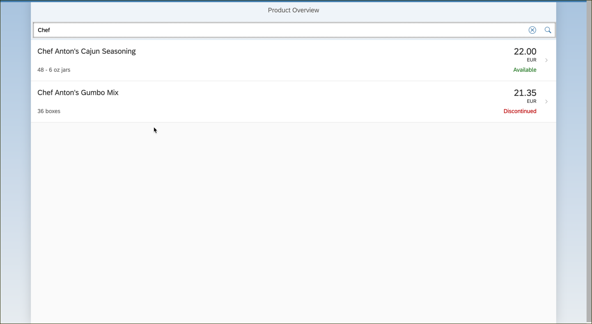

## Prerequisites  
 - **Proficiency:** Beginner 

 - **Web IDE** If you don't have the Web IDE open, follow these steps: [Enable and open the HANA Cloud Platform Web IDE](https://go.sap.com/developer/tutorials/sapui5-webide-open-webide.html)

 - **Tutorials:** This tutorial is part of a series.  The previous tutorial is part 6: [Upgrade the Detail view](https://go.sap.com/developer/tutorials/sapui5-webide-upgrade-detail-view.html)

## Next Steps
 - The next tutorial in the series is Part 10: [Add an Order Activity to the form](https://go.sap.com/developer/tutorials/sapui5-webide-add-order-activity.html)

## Details
### You will learn  
You will add a `<SearchField>` control to the initial page of the application. We’ll add it as a child within the pages `subHeader` aggregation which expects a `<Bar>` control.

To handle the search, we’ll specify a handler for the search field’s ‘search’ event. This handler `handleSearch` is defined in the view’s controller, and the search effect is achieved by adding a ‘contains string’ filter to the binding of the List control’s items aggregation.

### Time to Complete
**10 Minutes**.

---

1.  Open the `webapp/view/View1.view.xml` file, and add the following code to the `<Page>` element:

    ```xml
    <subHeader>
	 	<Bar>
	 		<contentLeft>
	 			<SearchField search="handleSearch" />
	 		</contentLeft>
	 	</Bar>
	 </subHeader>
	```
	
	
	 
   You will also need to add an ID field to the `<List>` element, directly below.  Add this to the `<List>` element:
   
   
   ```
   id="List"
   ```
   
	
   
2.  Open the `webapp/view/View1.controller.js` file, and update the Controller with the following new functionality:

    >**Note** Be careful with the exact placement of this code.  The code should go after a single closed braces `}`, on line 14.
    

	```javascript
   		,
		handleSearch : function (evt) {
			// create model filter
			var filters = [];
			var query = evt.getParameter("query");
			if (query && query.length > 0) {
				var filter = new sap.ui.model.Filter("ProductName", sap.ui.model.FilterOperator.Contains, query);
				filters.push(filter);
			}
			
			// update list binding
			var list = this.getView().byId("list");
			var binding = list.getBinding("items");
			binding.filter(filters);
		} 
	```
  
	
	 
3.  Run your application.  You should see the search box at the top of the list, right below the words `Product Overview`.
   
   > **NOTE**: If the search does not work, check the `View1.view.xml` file, and make sure the `<List>` element has an *id* parameter.
   
	


## Next Steps
 - The next tutorial in the series is Part 10: [Add an Order Activity to the form](https://go.sap.com/developer/tutorials/sapui5-webide-add-order-activity.html)

## Additional Information
- [`<SearchField>` element](https://sapui5.hana.ondemand.com/explored.html#/entity/sap.m.SearchField/samples)
- [Model filter](https://sapui5.hana.ondemand.com/docs/api/symbols/sap.ui.model.Filter.html)

