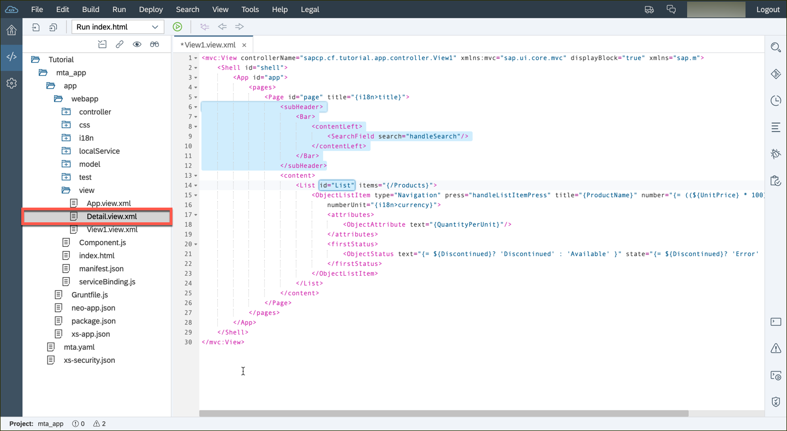

## Details
### You will learn  
You will add a `<SearchField>` control to the initial page of the application. We'll add it as a child within the pages `subHeader` aggregation which expects a `<Bar>` control.

To handle the search, we'll specify a handler for the search field's 'search' event. This handler `handleSearch` is defined in the view's controller, and the search effect is achieved by adding a 'contains string' filter to the binding of the List control's items aggregation.

---


[ACCORDION-BEGIN [Step : ](Add the search field)]
1.	Open the `mta_app/app/webapp/view/View1.view.xml` file, and add the following code to the `<Page>` element:

	```XML
	<subHeader>
		<Bar>
			<contentLeft>
				<SearchField search="handleSearch"/>
			</contentLeft>
		</Bar>
	</subHeader>
	```


2.	You will also need to add an ID field to the `<List>` element, directly below.  Add this to the `<List>` element:

	```XML
	id="List"
	```



[DONE]
[ACCORDION-END]
[ACCORDION-BEGIN [Step : ](Implement the search logic)]
Open the `mta_app/app/webapp/view/View1.controller.js` file, and update the Controller with the following new functionality:


```JavaScript
handleSearch : function (evt) {
	// create model filter
	var filters = [];
	var query = evt.getParameter("query");
	if (query && query.length > 0) {
		var filter = new sap.ui.model.Filter("ProductName", sap.ui.model.FilterOperator.Contains, query);
		filters.push(filter);
	}

	// update list binding
	var list = this.getView().byId("List");
	var binding = list.getBinding("items");
	binding.filter(filters);
},
```


[DONE]
[ACCORDION-END]
[ACCORDION-BEGIN [Step : ](Test the search)]
Re-run your application.  You should see the search box at the top of the list, right below the words `Product Overview`.

Try to search for a word.


[VALIDATE_1]
[ACCORDION-END]

----

### Additional Information
- [`<SearchField>` element](https://sapui5.hana.ondemand.com/#/api/sap.m.SearchField)
- [Model filter](https://sapui5.hana.ondemand.com/#/api/sap.ui.model.Filter)
