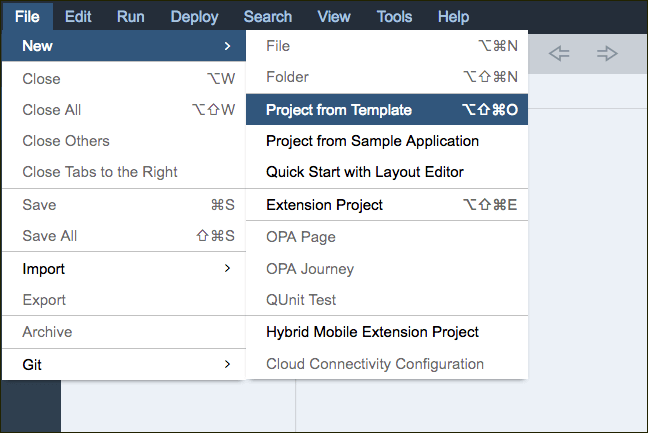
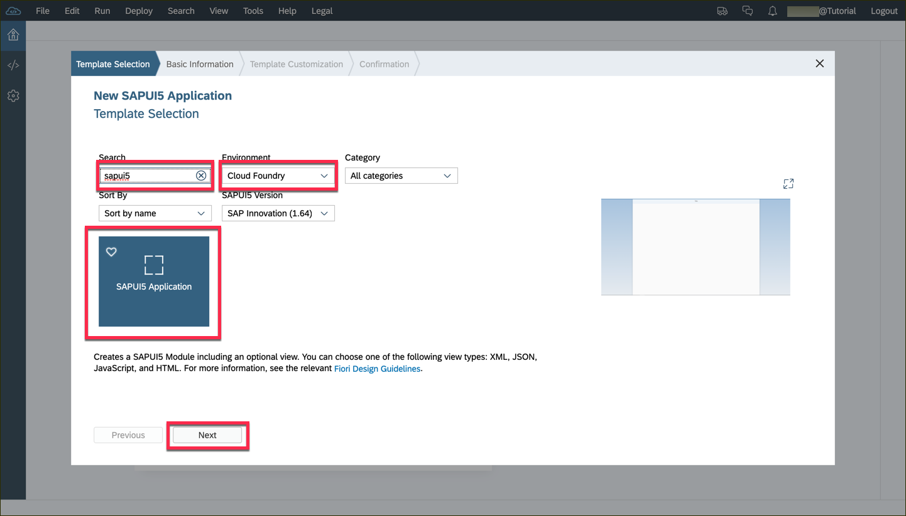
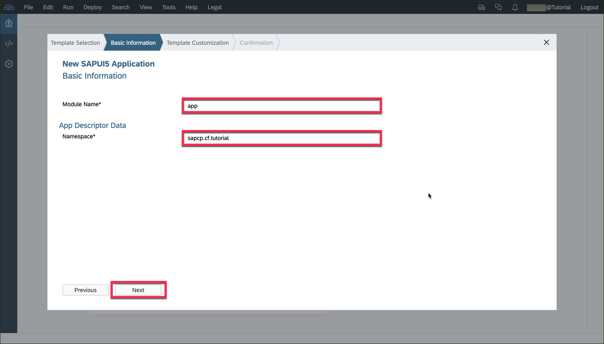
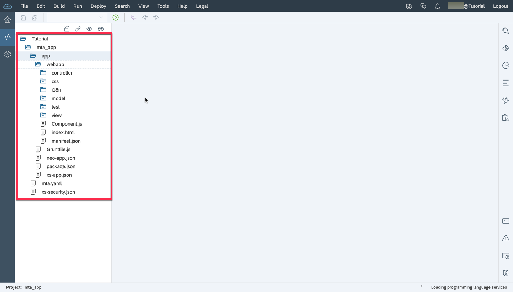

## Prerequisites  
 - **Proficiency:** Beginner 
 - **Tutorials:** If you don't have the Web IDE open, follow these steps: [Enable and open the HANA Cloud Platform Web IDE](https://go.sap.com/developer/tutorials/sapui5-webide-open-webide.html)

## Next Steps
 - This tutorial is part of a series.  The next tutorial is [Configure the Northwind Destination](https://go.sap.com/developer/tutorials/hcp-create-destination.html)

## Details
### You will learn  
How to create a new, empty, SAP Web IDE project.  

### Time to Complete
**2-3 Minutes**.

---

1.  Open the SAP Web IDE.  (If you have not opened the Web IDE, please check the previous tutorial for instructions.

2.  Select **File** --> **New** --> **Project From Template...**
    

3.  Select the box called **SAPUI5 Application**, then click **Next**.
    

4.  Fill in the form as follows:

    |                                           |                          |
    | -----------------------------------------:| ------------------------- |
    | Project Name                              | `HelloWorld`              |
    | Name Space                                | (leave this field blank)  |
    | Enable native mobile device functionality | (unselected)              |

    

5.  Click **Finish**

Your project should now look like this.  (Click a folder icon to expand the contents.)
  

## Additional Information
[Here is some information on the UI5 folder structure.](https://sapui5.hana.ondemand.com/#docs/guide/003f755d46d34dd1bbce9ffe08c8d46a.html)

## Next Steps
 - This tutorial is part of a series.  The next tutorial is [Configure the Northwind Destination](https://go.sap.com/developer/tutorials/hcp-create-destination.html)
