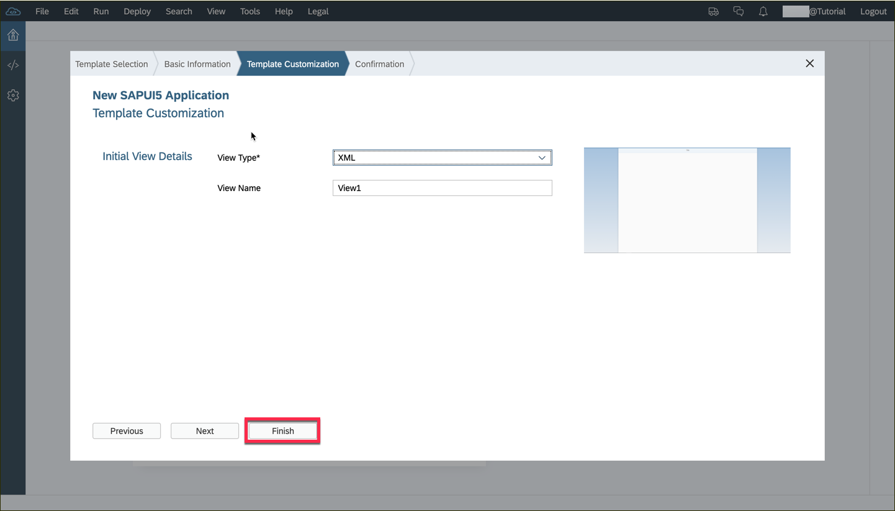
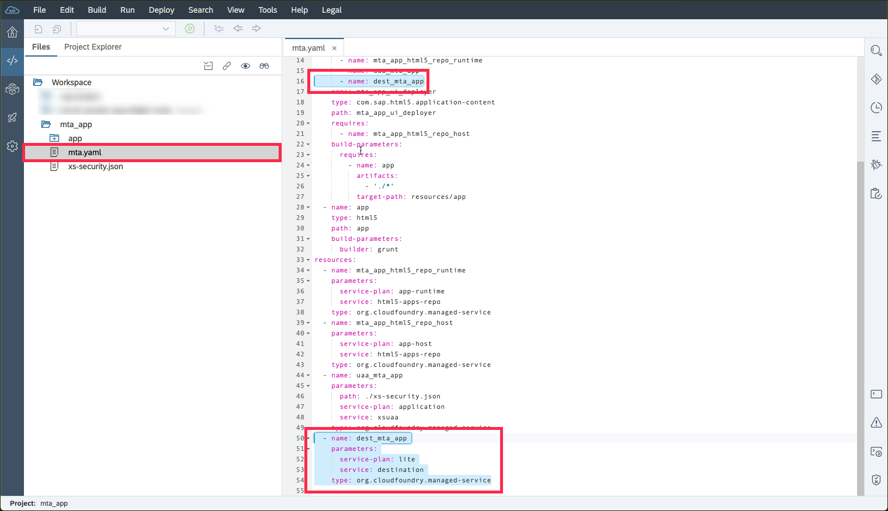

## Prerequisites  
- **Tutorials:**  [Open the SAP Web IDE](sapui5-webide-open-webide)

## Details
### You will learn  
  - How to create a new, empty, SAPUI5 Web IDE project  

---
[ACCORDION-BEGIN [Step : ](Open the project wizard)]

> Please double check that your subaccount lives in the eu10 region. If not, please follow [this tutorial](cp-ui5-webide-new-app) to create the project instead. Don't forget the use the module name and name space mentioned here.

Select **File** --> **New** --> **Project From Template**


[DONE]
[ACCORDION-END]

[ACCORDION-BEGIN [Step : ](Select a Cloud Foundry SAPUI5 project)]
Filter the tiles **`sapui5`** and make sure the environment is set to **Cloud Foundry**. Select the tile called **SAPUI5 Application**, then click **Next**.

Leave the **SAPUI5 Versions** select box on *SAPUI5 Innovation*.


[DONE]
[ACCORDION-END]

[ACCORDION-BEGIN [Step : ](Configure the UI module )]

Fill in the form as follows:

| -----------------------------------------:| ------------------------- |
| **Module Name**                           | **`app`**              |
| **Name Space**                            | **`sapcp.cf.tutorial`**   |


[DONE]
[ACCORDION-END]
[ACCORDION-BEGIN [Step : ](Create the project)]

Keep the default values and click **Finish**.



[DONE]
[ACCORDION-END]
[ACCORDION-BEGIN [Step : ](Check the service bindings)]
<!--  remove this step once the wizard is fixed -->
In a later tutorial, we want to make use of the destination service. Open the `mta_app/mta.yaml` file to see if the destination service is bound to the app router.



```
- name: dest_mta_app

...

- name: dest_mta_app
  parameters:
    service-plan: lite
    service: destination
  type: org.cloudfoundry.managed-service
```


[DONE]
[ACCORDION-END]
[ACCORDION-BEGIN [Step : ](Check your project file)]

Your project should now look like this.  Click a folder icon to expand the contents.


> [Here is some information on the UI5 folder structure.](https://sapui5.hana.ondemand.com/#docs/guide/003f755d46d34dd1bbce9ffe08c8d46a.html)

[VALIDATE_1]
[ACCORDION-END]

---
