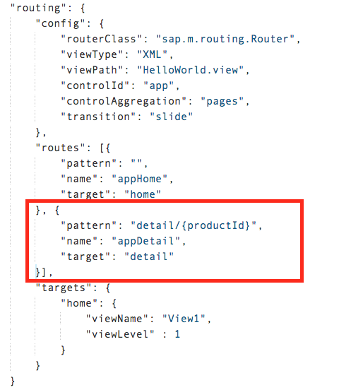
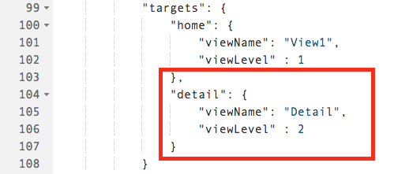
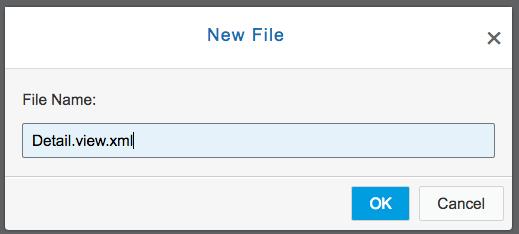
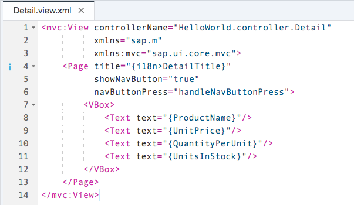
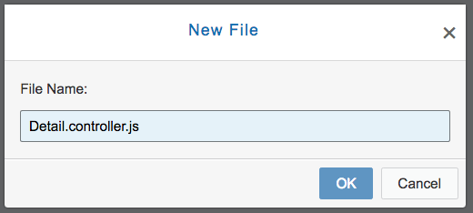
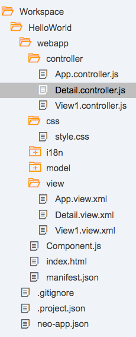
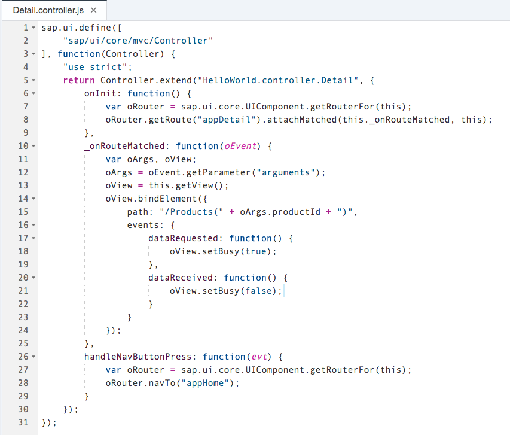
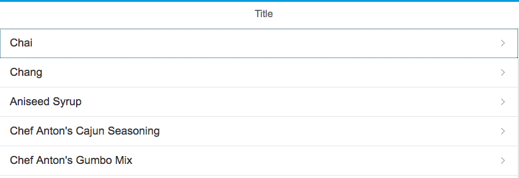
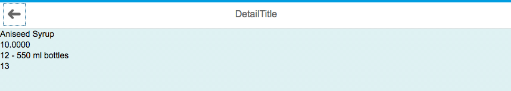

## Prerequisites  
 - **Proficiency:** Beginner 

 - **Web IDE** If you don't have the Web IDE open, follow these steps: [Enable and open the HANA Cloud Platform Web IDE](https://go.sap.com/developer/tutorials/sapui5-webide-open-webide.html)

 - **Tutorials:** This tutorial is part of a series.  The previous tutorial is part 5: [Enable Routing in your Application](https://go.sap.com/developer/tutorials/sapui5-webide-enable-routing.html)

## Next Steps
 - Part 7 is next: [Update Internationalization](https://go.sap.com/developer/tutorials/sapui5-webide-update-internationalization.html)

## Details
### You will learn  
In order to improve our web app, you can display a more detail information for each sales order/list item. In this tutorial, you will create a new view and controller for a detail screen. The detail screen will receive the ID of the list item and will access the data model in order to get the requested data.

You will also add a Detail view and controller as well as alter the `View1` view and controller.  

### Time to Complete
**10-15 Minutes**.

---

1.  Open the `webapp/view/View1.view.xml` file, and change the `<StandardListItem type="Active">` tag to read:

    ```xml
    type="Navigation"
    ```
    
    
    
2.  Open the `webapp/view/View1.controller.js` file, and modify the `handleListItemPress` event to the `Controller.extend` method:

    ```javascript
    handleListItemPress: function (evt) {
	 	var oRouter = sap.ui.core.UIComponent.getRouterFor(this);
	 	var selectedProductId = evt.getSource().getBindingContext().getProperty("ProductID");
    	oRouter.navTo("appDetail", {
    		productId: selectedProductId
    	});
    }
    ```
    
    
  
3.  Open the `webapp/manifest.json` file, and add the the following code to your `"routes"` section:

	 > **Be very careful when adding this code!**  The code must go inside the square brackets.  If you place it outside the brackets, you will get an error.  Look at the image for the exact placement.

    ```javascript
    , {
    "pattern": "detail/{productId}",
    	"name": "appDetail"
    	"target": "detail"
    }
    ```
    
    
    
    Next, add the following code to your `"targets"` section:
    
    ```javascript
    ,
    	"detail": {
    	"viewName": "Detail",
    	"viewLevel" : 2
    }
    ```
    
    
    
4.  Next, we are going to create a *New* file.  Right-click on the **View** folder, and select **New** --> **File** from the drop-down, and name the new file `Detail.view.xml`.
    
    

    Add the following code to your new file:
    
    ```xml
    <mvc:View controllerName="HelloWorld.controller.Detail"
              xmlns="sap.m"
              xmlns:mvc="sap.ui.core.mvc" >
    	<Page title="{i18n>DetailTitle}"
    	      showNavButton="true"
    	      navButtonPress="handleNavButtonPress" >
    		<VBox>
    			<Text text="{ProductName}" />
    			<Text text="{UnitPrice}" />
    			<Text text="{QuantityPerUnit}" />
    			<Text text="{UnitsInStock}" />
    		</VBox>
    	</Page>
    </mvc:View>
    ```
    
    

    > **Additional Information**
    
    > As you are focusing on the separation of MVC, the definition of views with XML has a key benefit: You can’t get confused and mix up business logic (usually inside the controller) with the view implementation because XML doesn’t allow you to define methods to be executed. It requires you to refer to a method, which should be defined in the controller. Another aspect is that XML appears to be easier to read and write, as it’s a markup language. The SAPUI5 community prefers this type of view definition and in fact, most of the code samples in the documentation are using XML.

    > Inside of the page declaration, you are making use of the `<VBox>` UI component. `<VBox>` is a vertical aligned `<Flexbox>` element. It’s essentially a way to arrange all the elements inside of the `<VBox>` in a vertical order. You can imagine it as rows in a table. Every UI element will be placed below the earlier ones. In our case, we will place four “Text” elements in a vertical order.
    
    > Another important aspect is the declaration of “showNavButton” and the related “navButtonPress” event. While the first one enables the visibility of a “back” button, the latter one defines the function to be executed when this button is pressed. In our case, we assign the function “handleNavButtonPress” as event handler. This function will be implemented in the detail controller.


5.  Create a NEW file called `webapp/controller/Detail.controller.js`.  
    
    

	 Your file list should now look like this:
    
    

    Add the following code to your new file:

    ```Javascript
    sap.ui.define([
    	"sap/ui/core/mvc/Controller"
    ], function(Controller) {
    	"use strict";
    	return Controller.extend("HelloWorld.controller.Detail", {
    		onInit: function () {
    			var oRouter = sap.ui.core.UIComponent.getRouterFor(this);
    			oRouter.getRoute("appDetail").attachMatched(this._onRouteMatched, this);
    		},
    		_onRouteMatched : function (oEvent) {
    			var oArgs, oView;
    			oArgs = oEvent.getParameter("arguments");
    			oView = this.getView();
    			oView.bindElement({
    				path : "/Products(" + oArgs.productId + ")",
    				events : {
    					dataRequested: function () {
    						oView.setBusy(true);
    					},
    					dataReceived: function () {
    						oView.setBusy(false);
    					}
    				}
    			});
    		},
    		handleNavButtonPress : function (evt) {
    			var oRouter = sap.ui.core.UIComponent.getRouterFor(this);
    			oRouter.navTo("appHome");
    		}
    	});
    });
    ```
    
    

    > You will implement one function to handle the back button press event. This method will use the “navTo” method of the router and initiate the navigation via the “appHome” route. The “onInit” method is more complex. The method expects a navigation parameter for the ProductId. It hooks into the “appDetail” route and executes the “_onRouteMatched” method to extract the ProductId and set the data binding for the Detail view.
    
6.  Run your application!  When you click on a row, the screen should slide sideways to show the detail view.  To return to the list, click the back arrow (in the upper left corner).
    
    
    
    

## Next Steps
 - Part 7 is next: [Update Internationalization](https://go.sap.com/developer/tutorials/sapui5-webide-update-internationalization.html)

## Additional Reading
- [Routing with mandatory parameters](http://help.sap.com/saphelp_nw75/helpdata/en/f9/6d2522a5ca4382a274ae3c6d002ca0/content.htm)
- [`<VBox>` element](https://sapui5.hana.ondemand.com/docs/api/symbols/sap.m.VBox.html)


