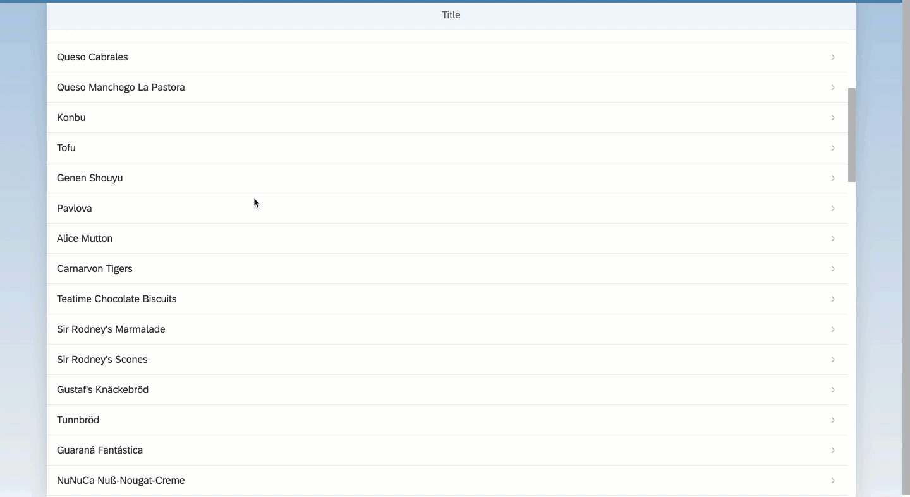

## Details
### You will learn  
In order to improve our web app, you can display a more detail information for each sales order/list item. In this tutorial, you will create a new view and controller for a detail screen. The detail screen will receive the ID of the list item and will access the data model in order to get the requested data.
You will also add a Detail view and controller as well as alter the `View1` view and controller.  


---


[ACCORDION-BEGIN [Step : ](Change the list item type)]
Open the `mta_app/app/webapp/view/View1.view.xml` file, and change the `<StandardListItem type="Active">` tag to read:

```XML
type="Navigation"
```


[DONE]
[ACCORDION-END]

[ACCORDION-BEGIN [Step : ](Modify the click handler)]
Open the `mta_app/app/webapp/controller/View1.controller.js` file, and modify the `handleListItemPress` function.

```JavaScript
handleListItemPress: function (oEvent) {
	var oRouter = sap.ui.core.UIComponent.getRouterFor(this);
	var selectedProductId = oEvent.getSource().getBindingContext().getProperty("ProductID");
	oRouter.navTo("Detail", {
		productId: selectedProductId
	});
}
```


[DONE]
[ACCORDION-END]

[ACCORDION-BEGIN [Step : ](Add a new detail view)]
1.  Next, we will add another new SAPUI5 view.  Right click on the **`webapp`** folder, then select **New > SAPUI5 View**.

    

2.  In the *View Name* field, type in **`Detail`**.  Click **Next**, then on the next screen click **Finish**.

    

3.  Open the new file `mta_app/app/webapp/view/Detail.view.xml`.  In the file, replace the `<App>` tag with the following content:

    ```XML
    	<Page title="{i18n>DetailTitle}"
    	      showNavButton="true"
    	      navButtonPress="handleNavButtonPress" >
    		<VBox>
    			<Text text="{ProductName}" />
    			<Text text="{UnitPrice}" />
    			<Text text="{QuantityPerUnit}" />
    			<Text text="{UnitsInStock}" />
    		</VBox>
    	</Page>
    ```

    

[DONE]
[ACCORDION-END]

[ACCORDION-BEGIN [Step : ](Implement the controller logic)]

Open the file `mta_app/app/webapp/controller/Detail.controller.js`, and replace the code with the following:  

```JavaScript
onInit: function () {
  var oRouter = sap.ui.core.UIComponent.getRouterFor(this);
  oRouter.getRoute("Detail").attachMatched(this._onRouteMatched, this);
},
_onRouteMatched : function (oEvent) {
  var oArgs, oView;
  oArgs = oEvent.getParameter("arguments");
  oView = this.getView();
  oView.bindElement({
    path : "/Products(" + oArgs.productId + ")",
    events : {
      dataRequested: function () {
        oView.setBusy(true);
      },
      dataReceived: function () {
        oView.setBusy(false);
      }
    }
  });
},
handleNavButtonPress : function (evt) {
  var oRouter = sap.ui.core.UIComponent.getRouterFor(this);
  oRouter.navTo("home");
}
```


[DONE]
[ACCORDION-END]

[ACCORDION-BEGIN [Step : ](Create a new route)]
1.  Open the `mta_app/app/webapp/manifest.json` file.

2.  Create a route named *Detail* and change the **Pattern** to **`detail/{productId}`**. Make sure it points to the *Target* **`Detail`**.

3.  Select the `detail` target, and change the **View Level** to **`2`**.


    

[DONE]
[ACCORDION-END]

[ACCORDION-BEGIN [Step : ](Test the new routing feature)]

Re-run your application!  When you click on a row, the screen should slide sideways to show the detail view.  To return to the list, click the back arrow (in the upper left corner).




[VALIDATE_1]
[ACCORDION-END]

----

> **Additional Information**

>As you are focusing on the separation of MVC, the definition of views with XML has a key benefit: You can't get confused and mix up business logic (usually inside the controller) with the view implementation because XML doesn't allow you to define methods to be executed. It requires you to refer to a method, which should be defined in the controller.
>&nbsp;
>Another aspect is that XML appears to be easier to read and write, as it's a markup language. The SAPUI5 community prefers this type of view definition and in fact, most of the code samples in the documentation are using XML.
>&nbsp;
>Inside of the page declaration, you are making use of the `<VBox>` UI component. `<VBox>` is a vertical aligned `<Flexbox>` element. It's essentially a way to arrange all the elements inside of the `<VBox>` in a vertical order. You can imagine it as rows in a table. Every UI element will be placed below the earlier ones. In our case, we will place four "Text" elements in a vertical order.
>&nbsp;
> Another important aspect is the declaration of `showNavButton` and the related `navButtonPress` event. While the first one enables the visibility of a "back" button, the latter one defines the function to be executed when this button is pressed. In our case, we assign the function `handleNavButtonPress` as event handler. This function will be implemented in the detail controller.
>&nbsp;
> You will implement one function to handle the back button press event. This method will use the `navTo` method of the router and initiate the navigation via the "home" route. The `onInit` method is more complex. The method expects a navigation parameter for the `ProductId`. It hooks into the `Detail` route and executes the `_onRouteMatched` method to extract the `ProductId` and set the data binding for the Detail view.


### Additional Reading
- [Routing with mandatory parameters](https://help.sap.com/saphelp_nw75/helpdata/en/f9/6d2522a5ca4382a274ae3c6d002ca0/content.htm)
- [`<VBox>`](https://sapui5.hana.ondemand.com/#/api/sap.m.VBox)
