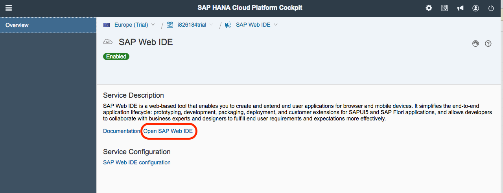

## Prerequisites  
- **Tutorials:** If you don't have an SAP Cloud Platform account, follow the tutorial to [set up a free developer account](https://developers.sap.com/tutorials/hcp-create-trial-account.html).

## Details
### You will learn  
  - How to enable and then navigate to the SAP Web IDE inside of SAP Cloud Platform

---

[ACCORDION-BEGIN [Step 1: ](Open your SAP Cloud Platform account)]

Open your SAP Cloud Platform account (if you have a free developer account, click [HERE](https://account.hanatrial.ondemand.com/) to open the console.)

>**Trouble logging in?** If you have trouble logging in to your SAP Cloud Platform Cockpit, and you are using a company account (one provided by your employer), it is possible that the Cloud access has been locked.  Create a new FREE trial account by clicking the link above, and use your personal email address to set up the new account.

[DONE]

[ACCORDION-END]

[ACCORDION-BEGIN [Step 2: ](go to Services menu)]

You should now be in the SAP Cloud Platform Cockpit, as shown below.  Click on the **Services** menu item on the left

[DONE]
[ACCORDION-END]

[ACCORDION-BEGIN [Step 3: ](Enable SAP Web IDE)]

Next, click on the **SAP Web IDE** box.  You may need to scroll down to find this box.

>**Enabled**: If the box does **NOT** say Enabled, click the **Not Enabled** button to enable this feature.  In the screen that appears, click the **Enable** button at the top of the page to confirm this feature is set up.

[DONE]
[ACCORDION-END]

[ACCORDION-BEGIN [Step 4: ](Open SAP Web IDE)]

In the SAP Web IDE screen, you will see a paragraph called *Service Description*.  At the bottom of the paragraph, there is a link called **Open SAP Web IDE**.  Click this link

[DONE]
[ACCORDION-END]

[ACCORDION-BEGIN [Step 5: ](Bookmark the page)]

A new tab (or window) will open, and the Web IDE will load.

>**Bookmark this page!**  If you create a bookmark to this page, it is easy to get back to the Web IDE later.

[DONE]
[ACCORDION-END]
