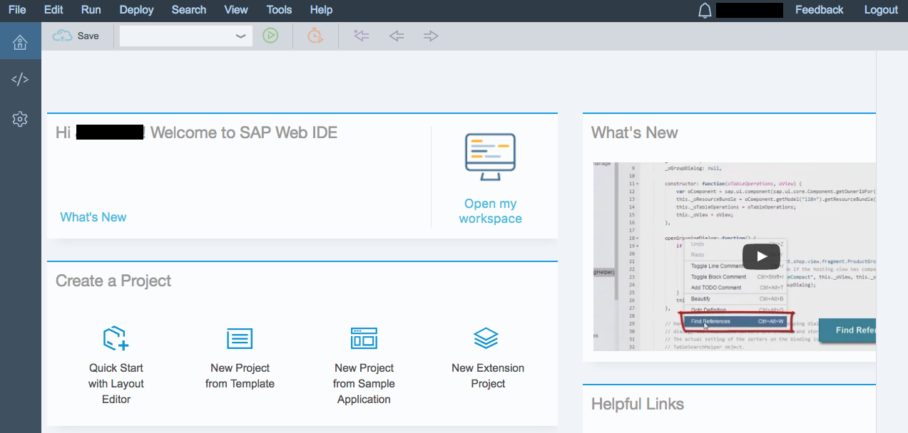
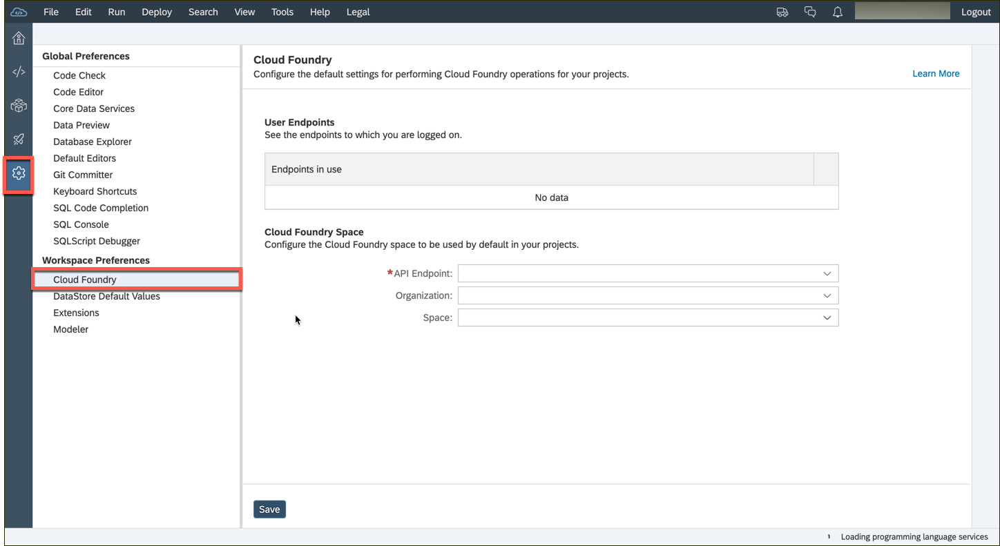
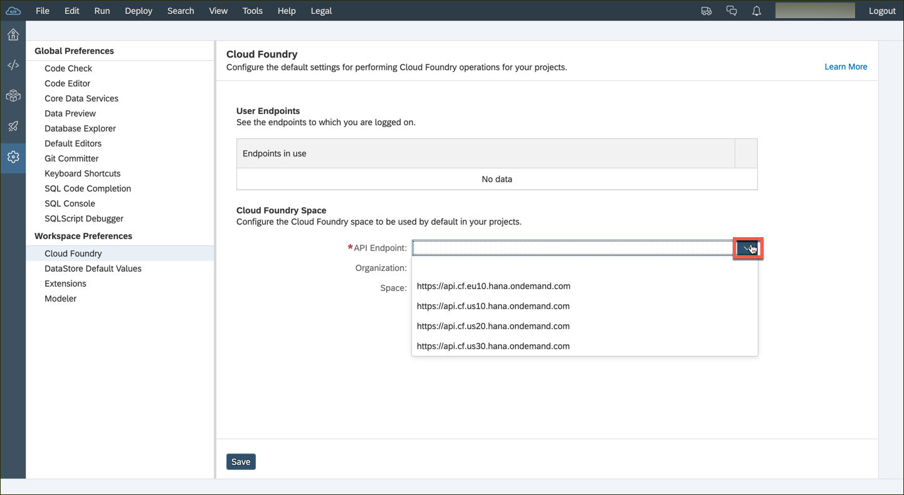
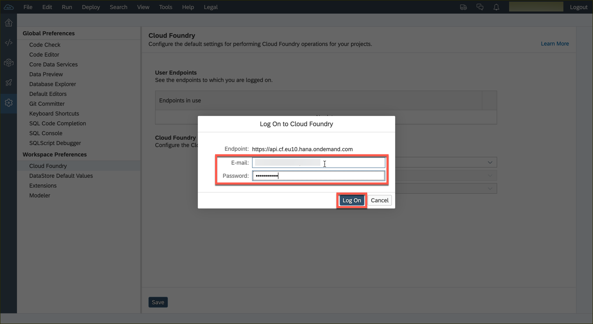
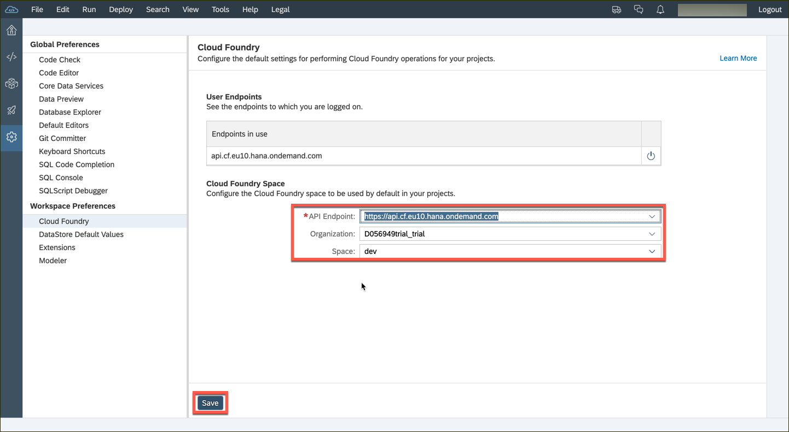

## Prerequisites  
- **Tutorial:** If you don't have an SAP Cloud Platform account, follow the tutorial to [set up a free developer account](hcp-create-trial-account).

## Details
### You will learn  
  - How to enable SAP Web IDE Full-Stack inside of SAP Cloud Platform
  - How to open SAP Web IDE Full-Stack

---

[ACCORDION-BEGIN [Step : ](Open SAP Web IDE Full-Stack)]

Open your SAP Cloud Platform account (if you have a free developer account, click [here](https://account.hanatrial.ondemand.com/) to open the home page).

 Click on **Launch SAP Web IDE** to see navigate further.

You might be asked to accept a disclaimer if you come here for the first time. **Check** the box and click **accept** to do so.

[DONE]
[ACCORDION-END]

[ACCORDION-BEGIN [Step : ](Bookmark the page)]

A new tab opens, and SAP Web IDE Full-Stack loads.

>**Bookmark this page!**  If you create a bookmark to this page, it is easy to get back to SAP Web IDE Full-Stack later.

[DONE]
[ACCORDION-END]

[ACCORDION-BEGIN [Step : ](Go to the Cloud Foundry settings)]

Click on the **gears icon** in the bar on the left-hand side to open the settings menu. Then, choose the **Cloud Foundry** settings.

[DONE]
[ACCORDION-END]

[ACCORDION-BEGIN [Step : ](Enter the Cloud Foundry endpoint you want to use)]

1. Select the API endpoint according to the data center in which your subaccount lives. Click on the dropdown control and the most common endpoints will be suggested to you. You can see find [a list](https://help.sap.com/viewer/65de2977205c403bbc107264b8eccf4b/Cloud/en-US/350356d1dc314d3199dca15bd2ab9b0e.html?platform=hootsuite) of all endpoints in the help portal.

    

2. You might be prompted for your Cloud Foundry credentials. Enter the credentials you used for the SAP Cloud Cockpit.

    

3. If there is a subaccount in the selected data center, the *Organization* and *Space* field will be populated by default. You can change these values via the dropdown control. Don't forget to **Save** this configuration.

    > If the fields are not being populated, you probably selected an incorrect endpoint or the entered credentials were invalid.

    

> You can also choose specific API endpoints per project in the project settings.

[VALIDATE_1]
[ACCORDION-END]
