## Prerequisites  
 - **Proficiency:** Beginner 

 - **Web IDE** If you don't have the Web IDE open, follow these steps: [Enable and open the HANA Cloud Platform Web IDE](https://go.sap.com/developer/tutorials/sapui5-webide-open-webide.html)

 - **Tutorials:** This tutorial is part of a series.  The previous tutorial is [Set up the Northwind Destination](https://go.sap.com/developer/tutorials/hcp-create-destination.html)

## Next Steps
 - This tutorial is part of a series.  The next tutorial is part 4: [Add a list to the current view](https://go.sap.com/developer/tutorials/sapui5-webide-add-list.html)

## Details
### You will learn  
Now that you have set up a Destination in the HANA Cloud Platform (HCP) cockpit, you will connect that destination to your local application.  

### Time to Complete
**15-20 Minutes**.

---
Now, we will connect the destination (created in the last tutorial) to the local application.  To do that, we need to edit the application configuration files.


1.  Open the `webapp/mainfest.json` file, by double clicking on the file.

    > To open a folder in the Web IDE, just click on the folder icon.  It will expand to show the contents.
    
    
    The section will include our main service (Northwind) and a path to the API endpoint.

    > If you open the file, and you get a code editor (and not the form editor shown below), click the **Descriptor Editor** link at the bottom of the page.  This will change to the Code Editor.
    
    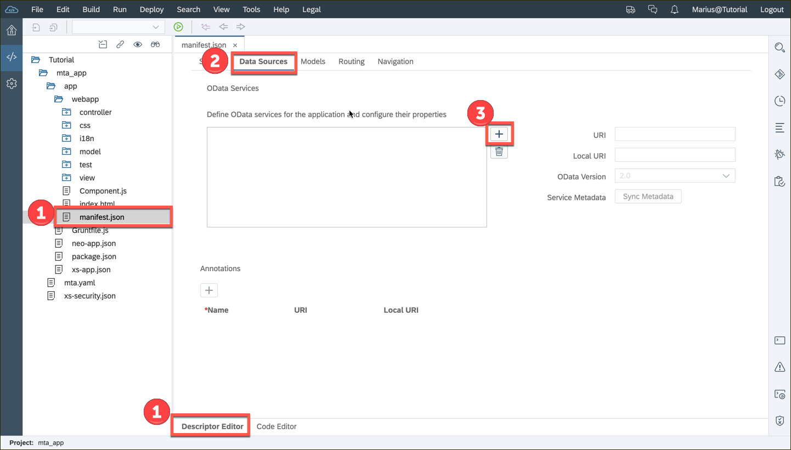
    
2. Click the **Data Sources** tab at the top of the screen.

    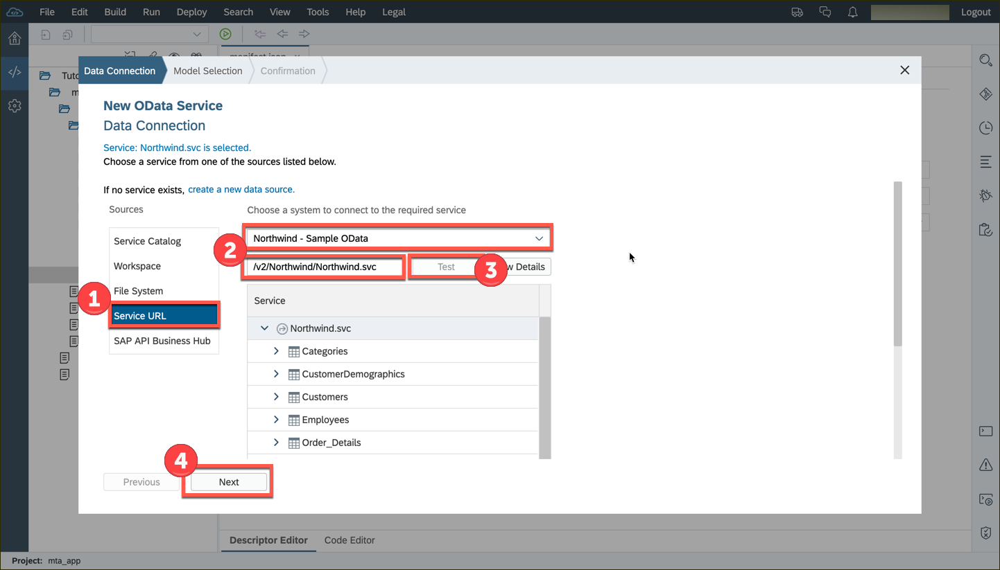

3. Click the **+** icon next to the *Define OData services for the application and...* box.

    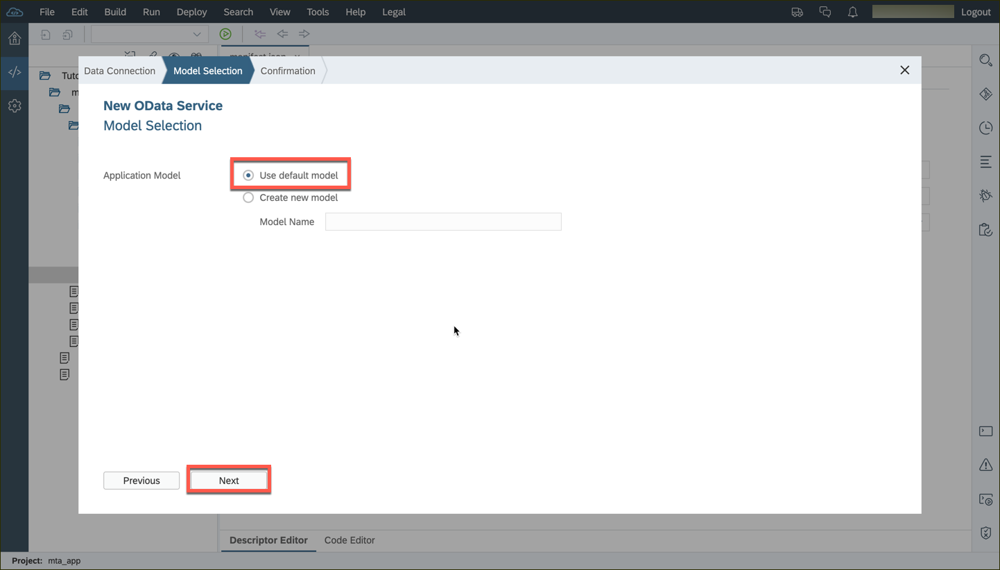

4. Enter the following in to the *Add Data Source* dialog box:

    |      |                                                      |
    | ----:| ---------------------------------------------------- |
    | Name | `mainService`                                        |
    | URI  | `/destinations/Northwind/V3/Northwind/Northwind.svc` |

    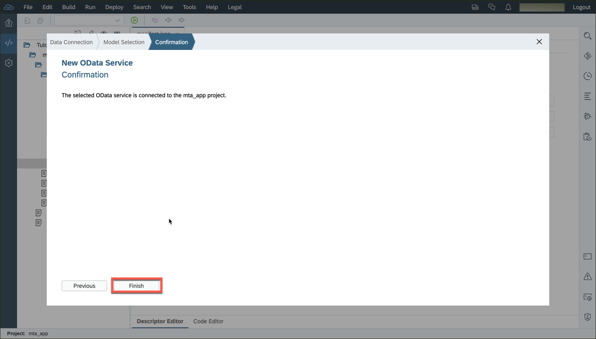
    
    Then click **OK**

    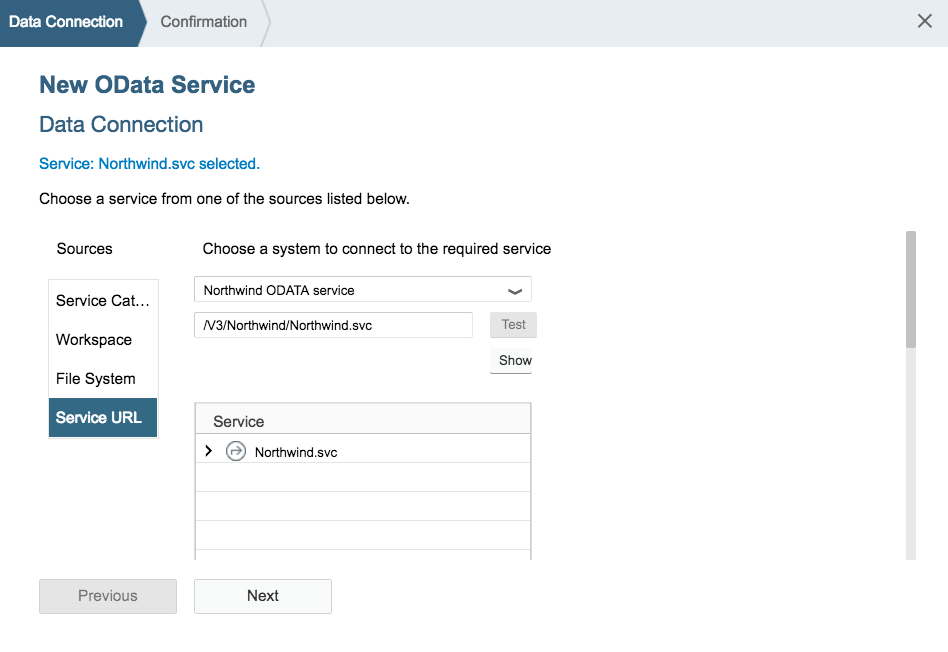

5.  Next, we will define the model in the UI5 application.
    > *Why are we doing this?*  You can create a model in the JavaScript code, or UI5 can set one up for you.  This will set one up automatically.  If you want to create the model in JavaScript, there is more information in [the model help documentation](https://sapui5.netweaver.ondemand.com/docs/guide/5278bfd38f3940b192df0e39f2fb33b3.html).

    Click the **Code Editor** button at the bottom of the screen.

    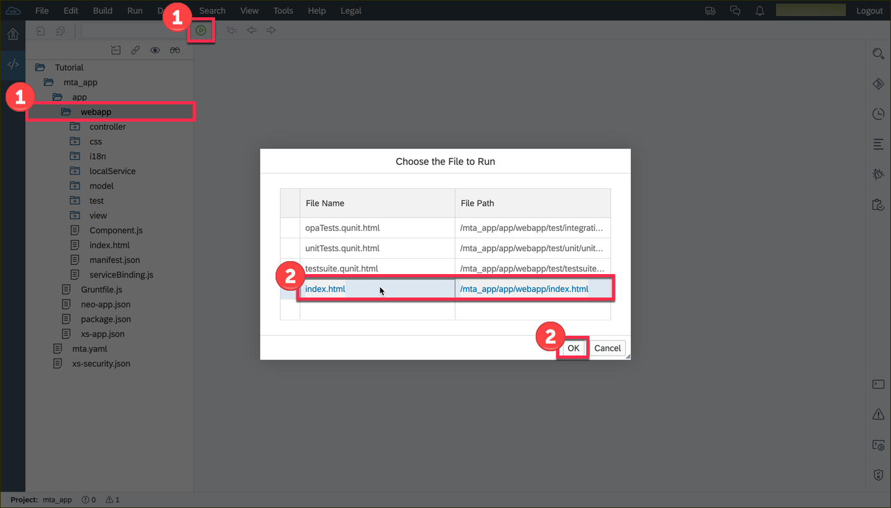
    
6.  Scroll down until you find the section labeled *sap.ui5*.  Then add the following code in the *models* section.  See the image for the exact placement.  

    ```JavaScript
    ,
    "" : {
        "dataSource": "mainService"
    }
    ```
    

    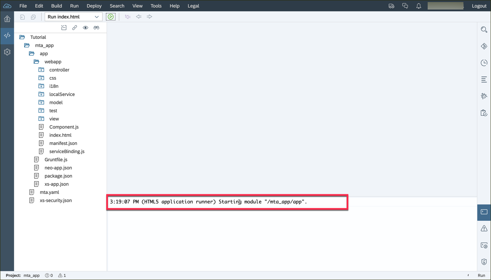
    
7.  Click *Save* at the top of the screen.
    > If your file name has a * next to it, the file has not been saved.  This can cause problems when you run your application.  Make sure all your files are saved before you run!
    
    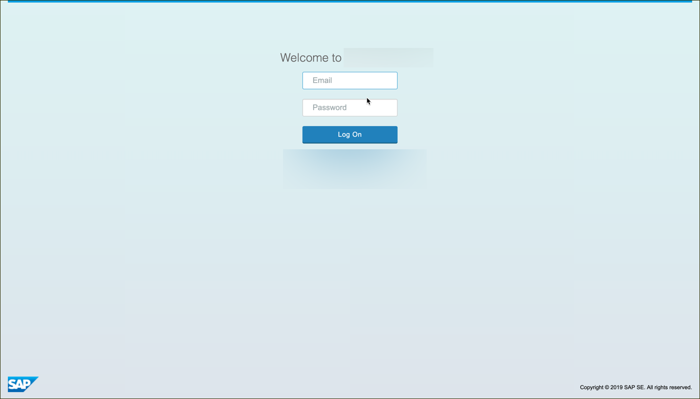
    
8.  Next, we will edit the `neo-app.json` file.  Double click the file to open it.

    
    
9.  Add the following code, in the *routes* area, under the last section.  When you are done, you should have 3 routes.

    ```JavaScript
    ,
	{
		"path": "/destinations/Northwind",
		"target": {
			"type": "destination",
			"name": "Northwind"
		},
		"description": "Northwind Destination"
	}
	```
	
    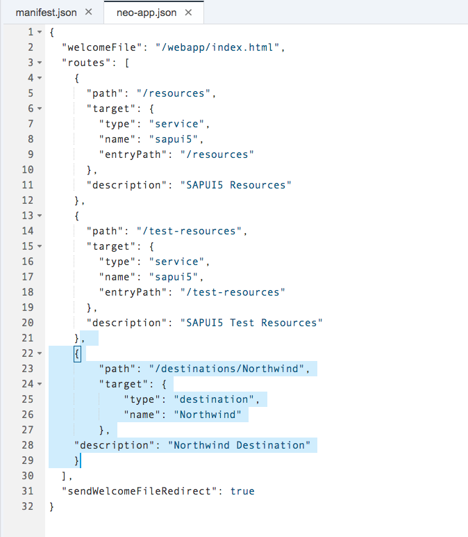
    
10.  Save the neo-app.json file

----
Next, we will test the application.  

1.  Test your application by clicking on **RUN**     

    You should see a screen that looks like this:
    
    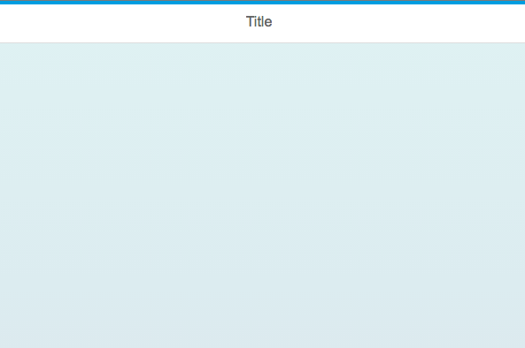
    
2.  Next, we want to check the data.  The web page will receive the data, but nothing will appear on the screen.  (We will set up the screen display in the next few tutorials).  

	To check the data, we will use the browser tools and view the data coming from the server.
	> *Why are we using Google Chrome?*  Google chrome has built in development tools that make it easy to debug and work with web pages.  If you are not using Google Chrome, [download it now](https://www.google.com/chrome/browser/desktop/).
	
	Right click on the web page, and choose **Inspect**

    
    
3.  The inspector will appear.  Click on the **Network** tab to view the network traffic for the application.

    
    
4.  To view all the network traffic, reload the page.  

    The network traffic will appear as the page is loading...
    >*What about the red text?* Several files will appear in red.  This is normal, as we have not set up that part of the application. 
    
5.  Scroll down until you find the *$metadata* item.  

    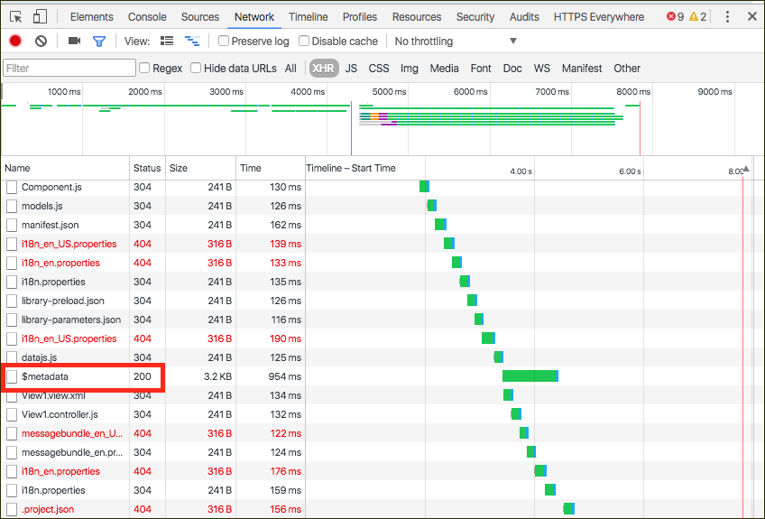
    
6.  Click on *$metadata*, then click the **Preview** tab.

    This will show you the data coming from the server to the browser.  If you see this, the data is working.  You are ready to move on to the next step of the tutorial.

    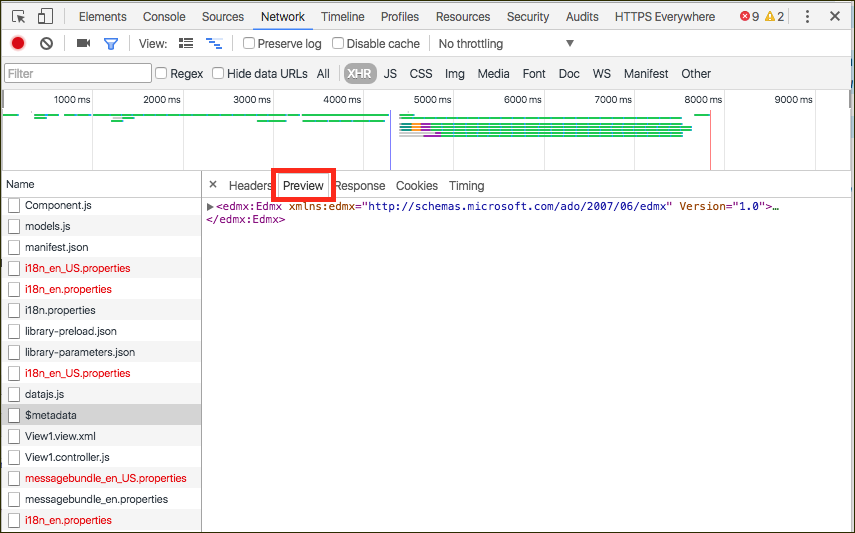
    

## Troubleshooting
 - **Missing a file?**  If the list of files doesn't match the picture, you may have used the wrong template when you created the project.  Delete the project, and start the [Create a new project](#) tutorial again.

 - **$metadata file not listed?**  This means one of the files in your project is bad.  Check the files, and make sure no red X marks appear in the left hand column.  These indicate a problem with the file syntax.  Check the pictures carefully.  

    Don't forget to save your files!  If a file name has a * next to it, the file isn't saved.  


## Next Steps
 - This tutorial is part of a series.  The next tutorial is part 4: [Add a list to the current view](https://go.sap.com/developer/tutorials/sapui5-webide-add-list.html)
